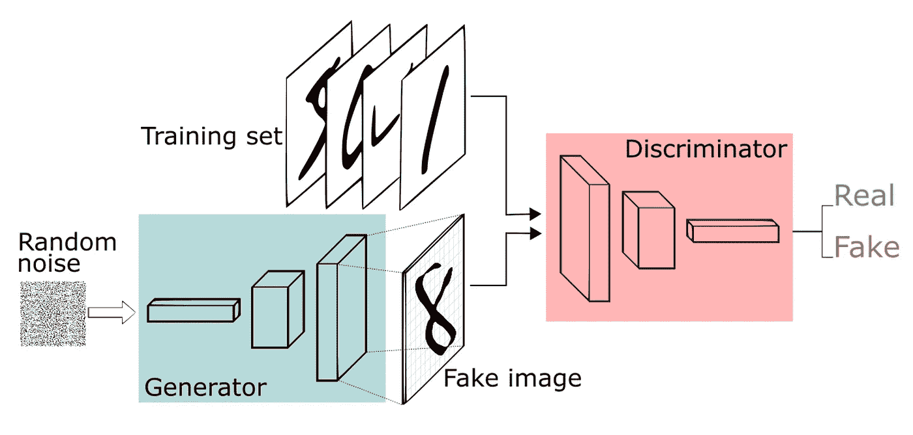
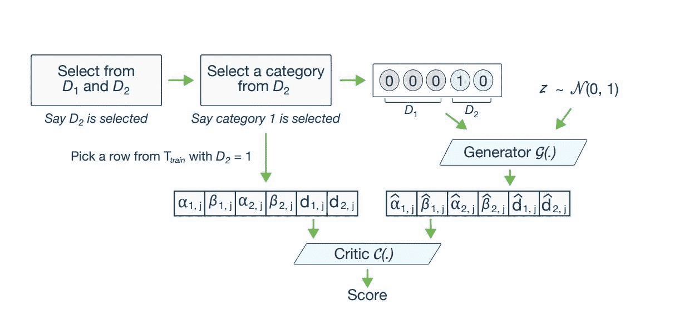
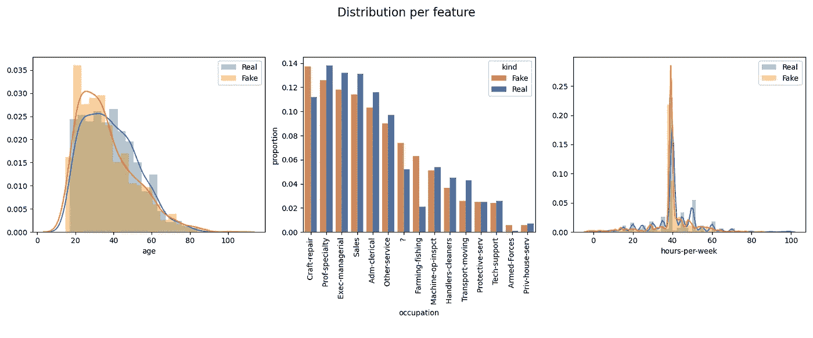
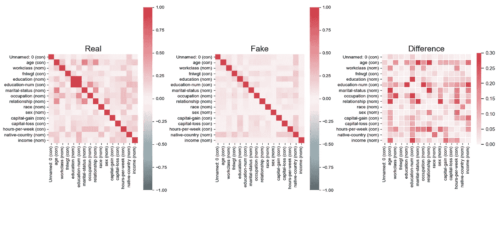
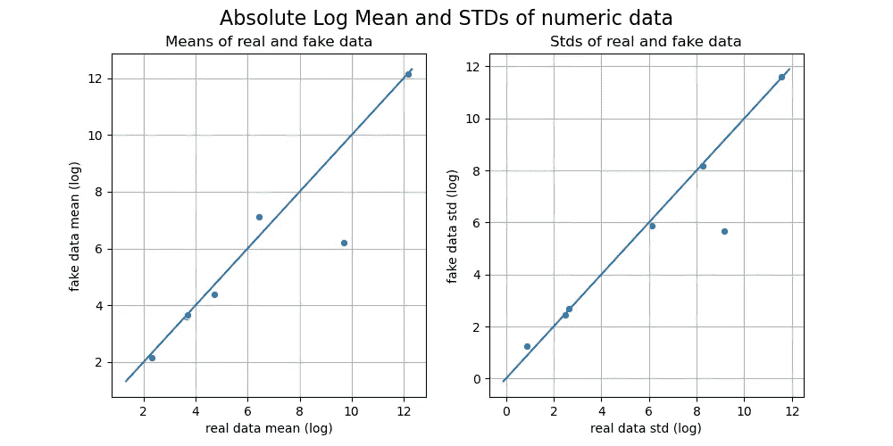

# 生成综合表格数据

> 原文：<https://towardsdatascience.com/generating-synthetic-tabular-data-503fe823f377?source=collection_archive---------11----------------------->

## 学习使用条件生成对抗网络(GAN)生成合成表格数据。

海登·邓塞尔在 [Unsplash](https://unsplash.com?utm_source=medium&utm_medium=referral) 上拍摄的照片

# 介绍

在[之前的文章](/synthetic-data-applications-in-data-privacy-and-machine-learning-1078bb5dc1a7)中，我们介绍了合成数据的概念及其在数据隐私和机器学习中的应用。在本文中，我们将向您展示如何使用生成式对抗网络(GAN)生成合成表格数据。

表格数据是最常见和最重要的数据形式之一。大量的数据，如临床试验记录、财务数据、人口普查结果，都以表格的形式呈现。在不泄露敏感属性和个人身份信息(PII)的情况下使用合成数据集的能力对于遵守隐私法规至关重要，并且便于数据分析、共享和实验。

想知道为什么生成模型是创建合成数据的理想方法吗？嗯，在生成模型中，神经网络(NN)用于逼近高维潜在空间中输入数据的潜在概率分布。在学习了概率分布之后，该模型可以通过从该分布中随机抽样来生成合成记录。因此，生成的记录不包含原始数据本身，但保留了真实数据集的原始基础概率分布。

# 什么是甘？

[生成对抗网络](https://www.freecodecamp.org/news/an-intuitive-introduction-to-generative-adversarial-networks-gans-7a2264a81394/)

GAN 由两种型号组成:

*   一个学习制造假数据的生成器。
*   学习区分生成器的假数据和真实数据的鉴别器。

这两种模式在零和游戏中相互竞争，推动整个系统走向优化。在训练开始时，生成器不太擅长生成假数据，而鉴别器能够很容易地捕捉到假数据。但是随着训练的进行，生成器逐渐学会更好地生成假数据，欺骗鉴别器，直到鉴别器无法辨别输入是真是假。查看 I.Goodfellow et。艾尔看到了甘背后的数学概念。

# 表格 GAN:

开发一个能够可靠地为表格数据集工作的通用 GAN 并不是一项简单的任务。

挑战包括:

*   混合数据类型:数字、分类、时间、文本
*   不同的分布:多峰、长尾、非高斯
*   不平衡数据集

为了产生高度真实的表格数据，我们将使用条件生成敌对网络——ctgan⁴.该模型由麻省理工学院的徐等人开发，是一个开源的 CTGAN 使用基于 GAN 的方法对表格数据分布进行建模，并对分布中的行进行采样。在 CTGAN 中，利用特定于模式的规范化技术来处理包含非高斯和多峰分布的列，同时使用条件生成器和采样训练方法来应对类不平衡 problems⁴.

⁴

> 条件生成器根据其中一个离散列生成合成行。通过采样训练，根据每个类别的对数频率对 *cond* 和训练数据进行采样，因此 CTGAN 可以均匀地探测所有可能的离散 values⁴.

现在，让我们看看如何利用 CTGAN 从真实数据集生成合成数据集！我们使用 Income⁶人口普查数据集作为示例，该数据集是包中的内置数据集。(记得要`pip install ctgan`)。

这将加载真实的数据集:

正如我们所看到的，该表包含了关于在职成年人的信息，包括他们的年龄、性别、教育程度、每周工作时间、收入等。这是一个包含分类变量、连续变量和离散变量的多元数据集。现在让我们使用`CTGANSynthesizer`来创建这个表格数据的合成副本。

这将返回一个与真实数据相同的合成数据表。

现在，让我们检查一下合成数据与真实数据有多相似。为此，我们将使用 *table_evaluator* ⁷来可视化虚假数据和真实数据之间的差异。(一定要先去`pip install table-evaluator`

每个特征的分布:3 个特征(年龄、职业、每周工作小时数)

真实数据和合成数据之间的相关矩阵

真实数据和合成数据绝对对数平均值和标准差

查看每个特征图的分布、相关矩阵、绝对对数平均值和标准差图，我们可以看到合成记录很好地代表了真实记录。例如，我们还可以运行`table_evaluator.evaluate(target_col='income')`来获得每个特性的 F1 分数和 Jaccard 相似性分数。

# 结论:

在合成数据系列的第二部分中，我们将研究如何使用 CTGAN 生成合成表格数据集。合成数据开启了大规模数据共享、实验和分析的机会，而不会泄露敏感信息。这是一个非常方便的工具！

加入我的 [**项目 Alesia**](https://projectalesia.com/) 了解更多关于机器学习、MLOps、数据隐私、数字福利等更多内容！

<https://projectalesia.com/>  

# 参考:

1.  古德费勒、伊恩·j .让·普吉-阿巴迪、迈赫迪·米尔扎、徐炳、戴维·沃德-法利、谢尔吉尔·奥泽尔、亚伦·库维尔和约舒阿·本吉奥。“生成性对抗网络。”arXiv 预印本 arXiv:1406.2661 (2014)。
2.  [https://www . freecodecamp . org/news/an-intuitive-introduction-to-generative-adversarial-networks-gans-7a 2264 a 81394/](https://www.freecodecamp.org/news/an-intuitive-introduction-to-generative-adversarial-networks-gans-7a2264a81394/)
3.  徐，李，斯科拉利杜，米，因方特，a .，& Veeramachaneni，K. (2019)。使用条件 gan 对表格数据建模。arXiv 预印本 arXiv:1907.00503。
4.  徐，李，斯科拉利杜，米，因方特，a .，& Veeramachaneni，K. (2019)。使用条件 gan 对表格数据建模。arXiv 预印本 arXiv:1907.00503。
5.  [https://github.com/sdv-dev/CTGAN](https://github.com/sdv-dev/CTGAN)
6.  [https://archive.ics.uci.edu/ml/datasets/adult](https://archive.ics.uci.edu/ml/datasets/adult)
7.  [https://pypi.org/project/table-evaluator/](https://pypi.org/project/table-evaluator/)
8.  由 Prateek Sanyal 提供的编辑评论