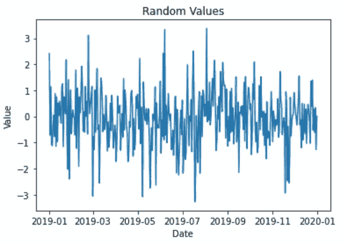
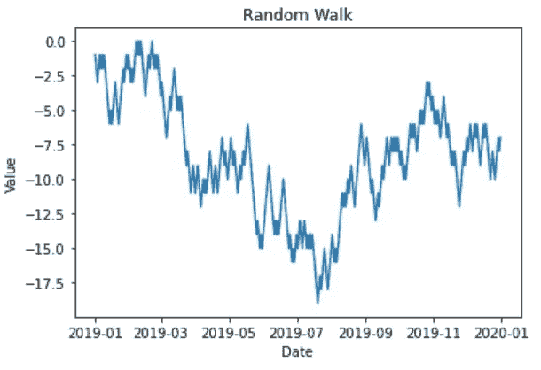
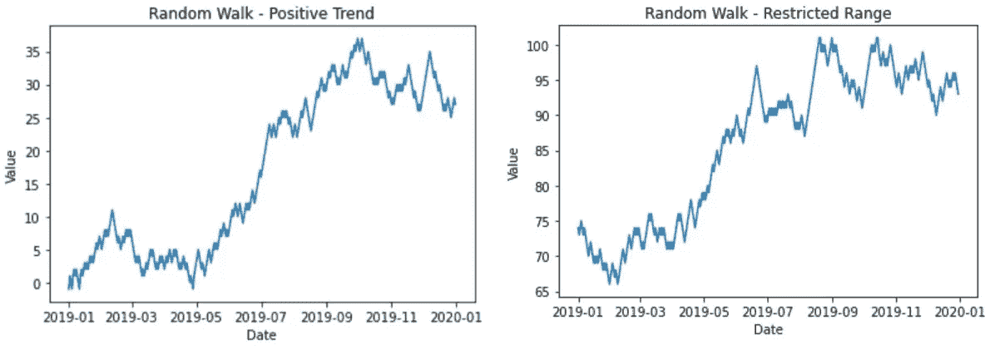
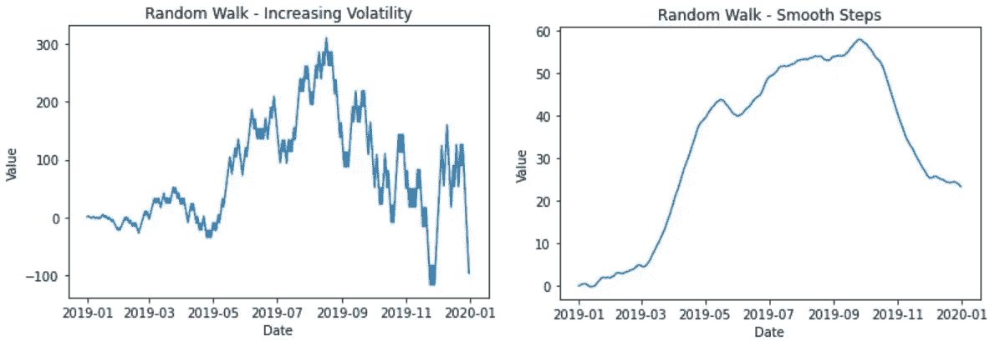

# 用随机游走生成合成时间序列数据

> 原文：<https://towardsdatascience.com/generating-synthetic-time-series-data-with-random-walks-8701bb9a56a8?source=collection_archive---------24----------------------->

## 快速创建定制的合成数据来测试您的预测模型


在 [Unsplash](https://unsplash.com?utm_source=medium&utm_medium=referral) 上由 [Podu Stricat](https://unsplash.com/@podustricat?utm_source=medium&utm_medium=referral) 拍摄的照片

R 随机游走是随机过程(random)。它们由数学空间中的许多步骤组成。最常见的随机游走从值 0 开始，然后每一步以相等的概率加上或减去 1。

随机行走可用于为不同的机器学习应用生成合成数据。例如，当没有信息可用或没有实时数据可用时，具有随机游走的合成数据可以近似实际数据。

*本帖利用一维随机游走为时序算法生成数据。*

# 生成数据

创建和测试时间序列模型时，以随机数据作为基线来测试模型是有益的。随机游走可以模拟股票、产能利用率甚至粒子运动的趋势。

通过调整每一步的概率，行为被添加到随机行走中。此外，这些走步被修改为具有不同的步长，以产生更大或更小的波动。

Pandas 中的“日期范围”功能可以快速生成时间序列数据。以下是 2019 年每天用一个随机值生成数据框的示例。

```
import pandas as pd
import numpy as np
import matplotlib.pyplot as plt
import randomDATE_START = '2019-01-01'
DATE_END = '2019-12-31'dates = pd.date_range(DATE_START, DATE_END)
df = pd.DataFrame({
    'date': dates,
    'value': np.random.normal(0,1,dates.size)
})
df.set_index('date', inplace=True)
plt.plot(df['value'])
plt.ylabel('Value')
plt.xlabel('Date')
plt.title('Random Values')
plt.show()
```



一段时间内的随机值(作者提供照片)

# 随机漫步

虽然这里的数据可用于时间序列模型，但看不到任何模式。由于实际数据包含与先前点的紧急模式关系，合成数据需要改进。随机行走是生成一些逼真行为的可行解决方案。在 pandas 中创建随机行走需要遍历数据帧的每一行。行走中的每一步都依赖于前一步。

下面是生成随机漫步的代码。第一个“previous_value”作为遍历的起点。接下来，步长设置为 1。最后，“阈值”将积极或消极行走的概率设定为 50%。

此外，随机游走受最小值和最大值的限制。对于许多数据集，如股票价值，这些值是严格正值。

随机游走的图是用“matplotlib”生成的

```
def random_walk(
    df, start_value=0, threshold=0.5, 
    step_size=1, min_value=-np.inf, max_value=np.inf
):
    previous_value = start_value
    for index, row in df.iterrows():
        if previous_value < min_value:
            previous_value = min_value
        if previous_value > max_value:
            previous_value = max_value
        probability = random.random()
        if probability >= threshold:
            df.loc[index, 'value'] = previous_value + step_size
        else:
            df.loc[index, 'value'] = previous_value - step_size
        previous_value = df.loc[index, 'value']
    return df
```



步长为 1 的随机漫步(作者提供图片)

# 修改随机漫步

这些随机游走被调整以显示期望的行为。例如，对随机游走的最小值和最大值添加限制可以模拟容量利用率。

随机游走的行为通过改变其他初始条件而被进一步改变，例如，强加一个整体的正趋势。通过调整概率阈值来实现正向趋势。通过增加正向步进的概率，正向趋势被强加于随机行走。对于这个代码，它是通过降低阈值来实现积极的一步。

以这种方式建立随机游走可以更接近股票趋势。如果总体趋势是积极的或消极的，可以将细节纳入综合数据。



具有积极趋势和价值限制的随机游走(作者提供图片)

有几个选项可以进一步调整随机游走。例如，在每一步中包含高斯噪声或将步长增加到较大的值会导致不同的行走跨越较大的空间。但是，还有一些其他的调整会导致非常不同的行为。

*   随着时间的推移增加波动性是通过在每步之后少量增加步长来实现的。因此，随着时间的推移，步长会慢慢变大。
*   也可以通过修改步长来实现行走的平滑，但是也可以在正步长之后增加步长，在负步长之后减小一个小值。



波动性越来越大、步伐越来越平稳的随机漫步(作者供图)

# 结论

随机漫步是一个有趣的随机过程。在很少的起始条件下，产生了许多不同的模式。因此，随机漫步可以用作合成的时间序列数据，并针对您的特定问题实例进行调整。

这篇文章展示了随机漫步的一些可能的调优选项。

如果你有兴趣阅读关于新颖的数据科学工具和理解机器学习算法的文章，可以考虑在 Medium 上关注我。

*如果你对我的写作感兴趣，想直接支持我，请通过以下链接订阅。这个链接确保我会收到你的会员费的一部分。*

[](https://zjwarnes.medium.com/membership) [## 通过我的推荐链接加入 Medium-Zachary Warnes

### 阅读扎卡里·沃恩斯(以及媒体上成千上万的其他作家)的每一个故事。您的会员费直接支持…

zjwarnes.medium.com](https://zjwarnes.medium.com/membership)