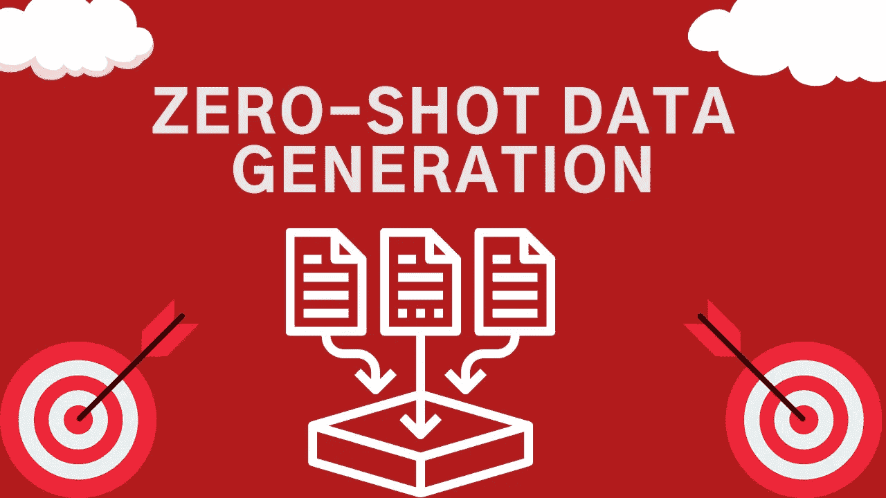
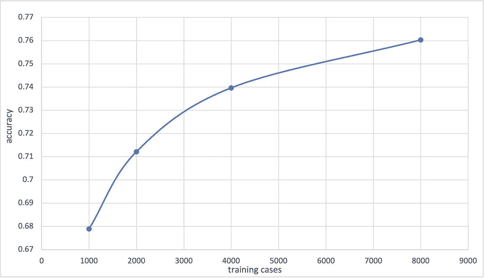

# 用零触发变压器模型生成文本分类训练数据

> 原文：<https://towardsdatascience.com/generating-text-classification-training-data-with-zero-shot-transformer-models-e16d390eea3e?source=collection_archive---------28----------------------->

## [实践教程](https://towardsdatascience.com/tagged/hands-on-tutorials)

## *所以你的文本分类 NLP 项目没有任何带标签的数据？只需使用零炮变压器模型生成数据*

作者图片

零镜头文本分类确实是一项变革性的技术。这些模型可以将文本分类到任意类别，而无需任何微调[1]。与传统的监督文本分类学习方法相比，这种技术提供了两个主要的好处。首先，它们使得在标记数据不存在时执行文本分类成为可能，因为不需要微调。接下来，单个模型可以用来分类成千上万个不同的标签。

然而，零镜头文本分类模型通常很大。例如，[最流行的](https://huggingface.co/facebook/bart-large-mnli)零镜头文本分类模型之一就是基于 BART-large transformer 架构，该架构拥有超过 400 M 个参数。本文将讨论如何使用零镜头文本分类模型来生成训练数据，然后使用生成的训练数据来训练仍然表现良好的较小模型。因此，这将允许 NLP 实践者训练更小的模型，通过降低硬件要求和能耗，这些模型可以更容易地在生产中实现。

# 相关作品

自我标记是数据科学中一项被广泛研究的技术。基本概念是使用带标签的数据集来帮助标记未标记的数据集，以便您有更多的训练案例[2]。已经有工作在使用 BERT 的微调版本来确定使用强化学习的训练案例的标签[3]。我相信本文中讨论的方法与其他方法不同，因为它涉及零标记训练案例，并且其主要目的是使用大模型来帮助产生小模型。

# 处理

让我们讨论一下这个系统的整体流程。首先，需要未标记的数据。在这些实验中，我使用了一个名为斯坦福情感树库 V2 (SST2)的数据集，它可以通过 Hugging Face 的数据集分发网络获得。该数据集包含电影评论的文本以及两个潜在标签中的一个，以指示该评论是“正面”还是“负面”但是，我们不需要为了这个培训过程而使用标签。

零射击模型需要两个输入:标签列表和文本。在这种情况下，我们将提供“正面”和“负面”标签以及电影评论文本。然后，对于每种情况，模型将输出两个标签的分数。因为我们知道评论只能属于两个潜在标签中的一个，所以我们选择得分最高的标签。

在这一点上，我们有一个数据集，其中包含由零触发分类器产生的标签。值得注意的是，并非所有的标签都是正确的，因为零镜头文本分类模型不具有 100%的准确性。但是，我们仍然可以使用这个数据集来训练监督学习模型。因此，我们将使用名为 [TextBlob](https://textblob.readthedocs.io/en/dev/) 的包来训练一个简单的朴素贝叶斯分类器。

最后，可以使用已经标记为评估数据的原始数据集来评估该模型。在没有带标签的评估数据的情况下，我想你可以遵循一个类似的过程，使用零镜头文本分类模型来产生评估标签。然而，这种方法不会给你一个确定的模型精度。

作者图片

# 实验

## 零射击模型

首先，让我们讨论零镜头文本分类模型的准确性。在拥抱脸的模型分发网络上下载量最高的两个零镜头文本分类模型被用于实验:“[typeform/distilbert-base-uncased-mnli](https://huggingface.co/typeform/distilbert-base-uncased-mnli)和“ [facebook/bart-large-mnli](https://huggingface.co/facebook/bart-large-mnli) ”在包含 872 个案例的 SST2 数据集的整个“验证”集上对它们进行了评估。正如预期的那样，BART 模型表现更好，精度为 0.8819，而 DistilBERT 模型的精度为 0.7592。

# 用零射击训练监督模型

由于简单性和大小，使用 [TextBlob](https://textblob.readthedocs.io/en/dev/) 来训练朴素贝叶斯分类器。这种模型使用“传统的”NLP 分类技术，比深度学习方法(如 Transformers)需要的资源少得多。

下面是显示结果的图表。提醒一下，产生训练集的模型达到了 0.8819 的精度，更小的零炮模型达到了 0.7592 的精度。朴素贝叶斯分类器随着训练案例数量的增加而不断改进，最终精度为 0.7603。

# 全监督模型

零炮数据生成方法不可避免地导致一些病例被错误标记。因此，我假设与数据完全正确标记的情况相比，这会对性能产生负面影响。为了测量负面影响，我进行了如上所述的相同实验，除了我在生成的标签上使用了实际的标签。令我惊讶的是，这款机型的表现只是稍微好一点。下表给出了清晰的对比。

# 未来的工作

**更强大的监督模型:**

在本文中，我们介绍了如何使用生成的训练数据来训练朴素贝叶斯。然而，其他文本分类模型可能会执行得更好，同时仍然比初始零镜头模型小得多。我用 1000 个生成的训练案例进行了一个实验，用[快乐变形金刚](https://happytransformer.com/)训练[distilt-Bert-base-uncased](https://huggingface.co/distilbert-base-uncased)。该模型使用默认设置获得了 0.7856 的精度。然而，随着我增加训练示例的数量，模型并没有实质性的改进，这可能是过度拟合的迹象。在未来，我计划进行额外的实验，以找到更好的超参数配置。

**阈值设定:**

应用阈值可以潜在地提高性能，并允许更容易地收集数据。可以添加一个条件语句来拒绝确定性较低的情况。因此，这可能会提高性能，因为更少的错误标记的案例将用于微调。此外，这可用于解析大量数据，其中大部分数据与目标标签无关。

**迭代次数:**

标记数据可以在迭代中完成，其中在每次迭代之后，使用监督模型来标记未被零炮模型发现的情况。所以，假设零拍模型的起始准确率是 90%。然后标注 1000 个训练案例，训练监督模型，它的准确率可能是 80%的准确率。这两个模型可以组合起来标记另外的 1000 个训练案例，并且该过程可以随着监督模型的准确性的增加而继续。最终，可能不再需要零剂量模型来标记病例，这将大大提高效率。

# 观点

我设想未来对人工标注数据的需求会大大减少。随着时间的推移，有理由假设零镜头文本分类模型的规模和质量都将提高。虽然我只是触及了应用这种技术的表面，但我已经展示了这种技术可以产生具有良好性能的模型，它只需要初始零炮模型的计算需求的一小部分。

# 参考资料:

[1]尹等，基准零镜头文本分类:数据集、评估和蕴涵方法(2019)，EMNLP-IJCNLP 2019

[2]特里盖罗等，半监督学习的自我标记技术:分类学、软件和实证研究(2015)， *Knowl Inf Syst* **42**

[3]叶等，基于强化自训练的零镜头文本分类(2020)，2020.acl-main

# 密码

 [## venni fy-Inc/零炮数据生成

### 在 GitHub 上创建一个帐户，为 Vennify-Inc/zero-shot 数据生成开发做出贡献。

github.com](https://github.com/Vennify-Inc/zero-shot-data-generation) 

*如果你有自然语言处理研究的经验，并且相信这个实验的原创性不足以导致发表论文，请联系我。*

*原载于 2021 年 6 月 23 日*[*https://www . vennify . ai*](https://www.vennify.ai/generating-training-data-zero-shot/)*。*