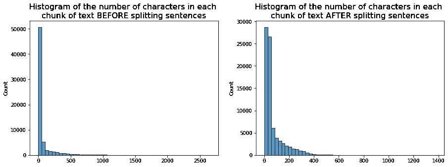
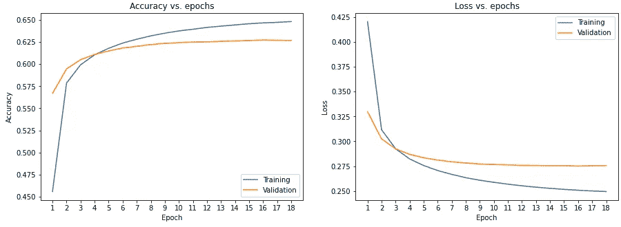

# 模拟 F. Pessoa 的递归神经网络

> 原文：<https://towardsdatascience.com/generating-text-with-recurrent-neural-networks-based-on-the-work-of-f-pessoa-1e804d88692d?source=collection_archive---------24----------------------->

## 使用 Tensorflow 和 Keras 的深度学习应用

# 1.介绍

离散令牌序列可以在许多应用中找到，即文本中的单词、音乐作品中的音符、图像中的像素、强化学习代理中的动作等[【1】](https://arxiv.org/pdf/1801.00632.pdf)。这些序列通常在连续或邻近的记号之间表现出很强的相关性。句子中的单词或单词中的字符的相关性表达了潜在的语义和语言特征。序列 *x_n* 中的下一个令牌可以建模为:


其中 *x_i* 表示序列中的第 I 个*令牌。在自然语言处理(NLP)中，这些被定义为语言模型。通常，每个令牌代表一个单独的单词或字母。生成的输出是一个概率分布，我们可以从中采样以生成序列中的下一个令牌。这些模型也被称为循环的，因为我们可以循环地应用这个生成过程来创建全新的令牌序列。*

经常用于处理离散记号序列问题的一种特定类型的生成模型是递归神经网络(RNN)。在更简单的神经网络中，固定维度的特征表示被不同的非线性函数变换几次。在 RNN 中，这些变换也会在时间上重复，这意味着在每个时间步长，都会处理新的输入，并生成新的输出。它们可以有效地捕获输入序列的语义丰富的表示[【2】](https://icml.cc/Conferences/2011/papers/524_icmlpaper.pdf)。RNN 在不同的环境中展示了这种能力，例如生成结构化文本、原始图像(基于每像素)，甚至在在线服务上模拟用户行为。

我们的任务是生成类似训练语料库的原始文本。这是一项无人监督的任务，因为我们无法访问任何标记或目标变量。我们首先创建一个单词嵌入，将每个字符映射到一个参数化维度的向量。对于每一个字符，该模型查找其嵌入情况，并将结果输入一个长短期记忆(LSTM)层堆栈，这是一种特殊类型的 RNN。这些被开发来扩展 RNNs 的传统能力，以模拟长期依赖性和对抗消失梯度问题。我们网络的输出是一个密集层，其单元数量等于词汇量。我们没有为这一层定义激活函数；它只是为词汇表中的每个字符输出一个 logit。我们使用这些值在以后从分类分布中取样。

在本文中，我们使用了费尔南多·佩索阿的作品，他是 20 世纪最重要的文学人物之一，也是葡萄牙语中最伟大的诗人之一。这个数据集现在可以在 Kaggle 上公开获得，包括 4300 多首诗歌、散文和其他作品。

在 [Kaggle](https://www.kaggle.com/luisroque/recurrent-neural-network-impersonating-f-pessoa) 和 [GitHub](https://github.com/luisroque/deep-learning-articles) 上也有该代码。


图 1:佩索阿的肖像，1914 年— [来源](https://commons.wikimedia.org/w/index.php?curid=56775462)

本文属于使用 TensorFlow 进行深度学习的系列文章:

*   [应用于辛普森图像数据集的迁移学习和数据增强](/transfer-learning-and-data-augmentation-applied-to-the-simpsons-image-dataset-e292716fbd43)
*   [基于 F. Pessoa 的工作用递归神经网络生成文本](/generating-text-with-recurrent-neural-networks-based-on-the-work-of-f-pessoa-1e804d88692d)
*   [使用 Seq2Seq 架构和注意力的神经机器翻译(ENG to POR)](/neural-machine-translation-using-a-seq2seq-architecture-and-attention-eng-to-por-fe3cc4191175)
*   [残差网络从无到有应用于计算机视觉](/residual-networks-in-computer-vision-ee118d3be68f)

# 2.数据预处理

该数据集包括作者用自己的名字写的几篇文章，但也使用不同的异名和假名。每个人都有自己的写作风格，单独学习会很有趣。然而，为了有效地训练深度神经网络(DNN)，我们需要一个大的数据集，这就是建立单一模型的原因。

F.佩索阿年轻时曾在南非生活过一段时间，在那里他接触到了英语。这就是为什么他的部分作品是用英语写的。为了避免引入噪声，我们从训练数据集中移除了大部分英语文本。

```
import pandas as pd
import numpy as np
from tensorflow.keras.preprocessing.text import Tokenizer
import tensorflow as tf
import ast
import os
import json
import matplotlib.pyplot as plt
from nltk import tokenize
import seaborn as snsf_pessoa = pd.read_csv(os.getcwd() + '/f_pessoa_v2.csv')

texts = f_pessoa.copy()

# Removing all pseudonyms that wrote in English.

texts = texts[~texts['author'].isin(['Alexander Search', 'David Merrick', 'Charles Robert Anon', 'I. I. Crosse'])]

texts['text'] = texts['text'].apply(lambda t: ast.literal_eval(t))
texts = texts.reset_index().drop('index', axis=1)
texts = texts['text'].tolist()
texts = np.concatenate(texts)

texts = np.asarray(texts)
texts_p = " ".join(texts)

# we will be truncating large texts soon, so this code only tries to reduce the 
# sequence size by splitting the texts that seem to be significantly larger than 
# the rest. Otherwise, we try to use the structure provided in the data itself

_, ax = plt.subplots(1, 2, figsize=(15, 5))

mylen = np.vectorize(len)

sns.histplot(mylen(texts), bins=50, ax=ax[0])
ax[0].set_title('Histogram of the number of characters in each \nchunk of text BEFORE splitting sentences', fontsize=16)

large_texts = texts[mylen(texts)>350]
large_texts_p = " ".join(large_texts)
large_texts = tokenize.sent_tokenize(large_texts_p)

texts = np.concatenate((texts[~(mylen(texts)>350)], large_texts))

ax[1].set_title('Histogram of the number of characters in each \nchunk of text AFTER splitting sentences', fontsize=16)
sns.histplot(mylen(texts), bins=50, ax=ax[1]);

print(f'Length of texts dataset: {len(texts_p)} characters')Length of texts dataset: 5811145 characters
```



图 2:分句前(左边)和分句后(右边)每块文本*的字符数直方图。*

清理文本后，我们最终得到了超过 580 万个字符。请注意，为了避免在规范化序列的文本长度时丢失数据，我们按句子分割了最大的序列。序列长度分布的差异可以在上面的直方图中看到。我们可以预览一些片段。

```
print(texts[97:106])['O burburinho da água' 'O burburinho da água' 'No regato que se espalha'
 'É como a ilusão que é mágoa' 'Quando a verdade a baralha.'
 '— A única vantagem de estudar é gozar o quanto os outros não disseram.'
 '— A arte é um isolamento. Todo o artista deve buscar isolar os outros, levar-lhes às almas o desejo de estarem sós. O triunfo supremo de um artista é quando a ler suas obras o leitor prefere tê-las e não as ler. Não é porque isto aconteça aos consagrados; é porque é o maior tributo (...)'
 '— Ser lúcido é estar indisposto consigo próprio. O legítimo estado de espírito com respeito a olhar para dentro de si próprio é o estado (...) de quem olha nervos e indecisões.'
 'A única atitude intelectual digna de uma criatura superior é a de uma calma e fria compaixão por tudo quanto não é ele próprio. Não que essa atitude tenha o mínimo cunho de justa e verdadeira; mas é tão invejável que é preciso tê-la.']
```

更重要的是，我们可以评估独特字符的数量，这是我们的词汇量。

```
vocab = sorted(set(texts_p))
print(f'{len(vocab)} unique characters in texts')156 unique characters in texts
```

在训练之前，我们需要将字符串转换成一些数字表示。我们从记住一些重要的方面开始对文本进行标记。我们考虑了无限数量的令牌，并在角色级别创建了它们。我们没有过滤任何字符，并保持原来的大写。然后，我们使用标记器将文本映射到编码序列。

```
def create_character_tokenizer(list_of_strings):
    tokenizer = Tokenizer(filters=None,
                         char_level=True, 
                          split=None,
                         lower=False)
    tokenizer.fit_on_texts(list_of_strings)
    return tokenizer

tokenizer = create_character_tokenizer(texts)

tokenizer_config = tokenizer.get_config()

word_counts = json.loads(tokenizer_config['word_counts'])
index_word = json.loads(tokenizer_config['index_word'])
word_index = json.loads(tokenizer_config['word_index'])

def strings_to_sequences(tokenizer, list_of_strings):
    sentence_seq = tokenizer.texts_to_sequences(list_of_strings)
    return sentence_seq

seq_texts = strings_to_sequences(tokenizer, texts)
```

我们可以看到这种编码的一个例子。

```
print('Original sequence: \n' + texts[0] + '\n')
print('Encoded sequence: ')
print(seq_texts[0])Original sequence: 
Diana através dos ramos

Encoded sequence: 
[46, 6, 3, 8, 3, 1, 3, 9, 7, 3, 19, 26, 5, 1, 10, 4, 5, 1, 7, 3, 11, 4, 5]
```

我们还需要标准化序列的长度，为此我们定义了 300 个字符的长度。小于 300 的序列用零填充，而大于 300 的序列被截断。

```
mylen = np.vectorize(len)

print(max(mylen(texts)))
print(np.round(np.mean(mylen(texts))))1377
71.0def make_padded_dataset(sequences):
    padded_sequence = tf.keras.preprocessing.sequence.pad_sequences(sequences,
                                                 maxlen=300,
                                                 padding='pre',
                                                 truncating='pre',
                                                 value=0)
    return padded_sequence

padded_sequences = make_padded_dataset(seq_texts)
```

RNN 通过接收字符序列并预测序列中的下一个字符来工作。在训练时，模型接收一个输入序列和一个移位一的目标序列。

例如，表达式`Diana através dos ramos`是我们数据集上第一首诗的第一节。这首诗来自 Ricardo Reis，他是 F. Pessoa 的许多别称之一。给定输入，`Diana através dos ramo`正确的预测是`iana através dos ramos`。请注意，预测与输入的长度相同。

我们采取的另一个决定是将我们的 RNN 构建为有状态的，这意味着它的内部状态跨批维护。为了提高效率，我们需要确保每个批处理元素都跟随前一个批处理的相应元素。

```
def create_inputs_and_targets(array_of_sequences, batch_size=32):
    input_seq = array_of_sequences[:,:-1]
    target_seq = array_of_sequences[:,1:]

    # Prepare the batches and ensure that is ready to be fed to a stateful RNN

    num_examples = input_seq.shape[0]

    num_processed_examples = num_examples - (num_examples % batch_size)

    input_seq = input_seq[:num_processed_examples]
    target_seq = target_seq[:num_processed_examples]

    steps = int(num_processed_examples / 32) 

    inx = np.empty((0,), dtype=np.int32)
    for i in range(steps):
        inx = np.concatenate((inx, i + np.arange(0, num_processed_examples, steps)))

    input_seq_stateful = input_seq[inx]
    target_seq_stateful = target_seq[inx]

    # Split data between training and validation sets

    num_train_examples = int(batch_size * ((0.8 * num_processed_examples) // batch_size))

    input_train = input_seq_stateful[:num_train_examples]
    target_train = target_seq_stateful[:num_train_examples]

    input_valid = input_seq_stateful[num_train_examples:]
    target_valid = target_seq_stateful[num_train_examples:]

    # Create datasets objects for training and validation data

    dataset_train = tf.data.Dataset.from_tensor_slices((input_train, target_train))
    dataset_train = dataset_train.batch(batch_size, drop_remainder=True)

    dataset_valid = tf.data.Dataset.from_tensor_slices((input_valid, target_valid))
    dataset_valid = dataset_valid.batch(batch_size, drop_remainder=True)

    return (dataset_train, dataset_valid)

train_data, valid_data = create_inputs_and_targets(padded_sequences)
```

# 3.递归神经网络

我们首先定义了一个嵌入层，将我们的字符索引转换成固定大小的密集向量。值得注意的是，填充值在这一层被屏蔽，这意味着它们被简单地忽略。接下来，我们堆叠了两个单向有状态 LSTM 层，每个层有 512 个单元。这些层具有学习长期依赖性的潜力；然而，训练它们在计算上是昂贵的。在它们之间，我们引入了一个辍学层。最后，最后一层为词汇表中的每个字符输出一个 logit。这些是根据模型的每个字符的对数似然性。请注意，我们总共有大约 4M 个参数需要训练。

```
def get_model(vocab_size, batch_size):
    model = tf.keras.Sequential([
        tf.keras.layers.Embedding(input_dim=vocab_size, output_dim = 256, mask_zero=True, batch_input_shape=(batch_size, None)),
        tf.keras.layers.LSTM(units=512, return_sequences=True,stateful=True),
        tf.keras.layers.Dropout(0.2),
        tf.keras.layers.LSTM(units=512, return_sequences=True,stateful=True),
        tf.keras.layers.Dense(units=vocab_size)
    ])
    return modelbatch_size=32
model = get_model(len(tokenizer.word_index) + 1, batch_size)
model.summary()Model: "sequential"
_________________________________________________________________
Layer (type)                 Output Shape              Param #   
=================================================================
embedding (Embedding)        (32, None, 256)           40192     
_________________________________________________________________
lstm (LSTM)                  (32, None, 512)           1574912   
_________________________________________________________________
dropout (Dropout)            (32, None, 512)           0         
_________________________________________________________________
lstm_1 (LSTM)                (32, None, 512)           2099200   
_________________________________________________________________
dense (Dense)                (32, None, 157)           80541     
=================================================================
Total params: 3,794,845
Trainable params: 3,794,845
Non-trainable params: 0
_________________________________________________________________checkpoint_callback=tf.keras.callbacks.ModelCheckpoint(filepath='./models/ckpt',
                                                       save_weights_only=True,
                                                       save_best_only=True)
model.compile(optimizer='adam', loss=tf.keras.losses.SparseCategoricalCrossentropy(from_logits=True),
              metrics=['sparse_categorical_accuracy'])
history = model.fit(train_data, 
                    epochs=30, 
                    validation_data=valid_data,
                    callbacks=[checkpoint_callback, 
tf.keras.callbacks.EarlyStopping(patience=2)])Epoch 1/30
2023/2023 [==============================] - 1041s 512ms/step - loss: 0.5216 - sparse_categorical_accuracy: 0.3516 - val_loss: 0.3298 - val_sparse_categorical_accuracy: 0.5669
[...]
Epoch 18/30
2023/2023 [==============================] - 1031s 510ms/step - loss: 0.2495 - sparse_categorical_accuracy: 0.6478 - val_loss: 0.2756 - val_sparse_categorical_accuracy: 0.6268def model_history(history):
    history_dict = dict()
    for k, v in history.history.items():
        history_dict[k] = [float(val) for val in history.history[k]]
    return history_dict

history_dict = model_history(history)
```

# 4.结果

即使使用 GPU，训练也非常慢(尽管与 CPU 相比，训练时间减少了 15 倍)，回想一下，我们只堆叠了两个单元数量有限的 LSTM 层。从下图中，我们可以看到训练和验证数据集的准确性快速增加，然后在几个时期内稳定攀升。我们的回调最终被执行(当超过 2 个时期验证准确性没有增加时)以停止训练过程。没有过度合身的迹象。

```
def plot_history(history_dict):

    plt.figure(figsize=(15,5))
    plt.subplot(121)
    plt.plot(history_dict['sparse_categorical_accuracy'])
    plt.plot(history_dict['val_sparse_categorical_accuracy'])
    plt.title('Accuracy vs. epochs')
    plt.ylabel('Accuracy')
    plt.xlabel('Epoch')
    plt.xticks(np.arange(len(history_dict['sparse_categorical_accuracy'])))
    ax = plt.gca()
    ax.set_xticklabels(1 + np.arange(len(history_dict['sparse_categorical_accuracy'])))
    plt.legend(['Training', 'Validation'], loc='lower right')

    plt.subplot(122)
    plt.plot(history_dict['loss'])
    plt.plot(history_dict['val_loss'])
    plt.title('Loss vs. epochs')
    plt.ylabel('Loss')
    plt.xlabel('Epoch')
    plt.xticks(np.arange(len(history_dict['sparse_categorical_accuracy'])))
    ax = plt.gca()
    ax.set_xticklabels(1 + np.arange(len(history_dict['sparse_categorical_accuracy'])))
    plt.legend(['Training', 'Validation'], loc='upper right')
    plt.show() 

plot_history(history_dict)
```



图 3:RNN 模型几个时期的精确度和损耗演变。

```
model = get_model(len(tokenizer.word_index) + 1, batch_size=1)
model.load_weights(tf.train.latest_checkpoint('./models/')).expect_partial()

def get_logits(model, token_sequence, initial_state1=None, initial_state2=None, initial_state3=None):
    token_sequence = np.asarray(token_sequence)
    if initial_state1 is not None:
        # set states for all recurrent layers
        model.layers[1].states = initial_state1
        model.layers[3].states = initial_state2
        model.layers[5].states = initial_state3
    else:
        model.layers[1].reset_states()
        model.layers[3].reset_states()
        model.layers[5].reset_states()
    logit = model.predict(token_sequence)
    logit = logit[:,-1,:]

    return logit

def sample_token(logits):
    pred = tf.random.categorical(logits, num_samples=1).numpy()[0]
    return pred[0]
```

为了从我们的模型生成文本，我们需要指定一个种子字符串来启动网络。接下来，我们标记初始字符串并重置网络状态。然后，该字符串被转换为批量大小为 1 的张量，以提供给我们的模型。我们使用上一时间步的预测来构建分类分布，然后从中进行采样。使用我们的网络的相同状态和先前采样的令牌，我们可以重复预测步骤，直到我们获得具有指定大小的最终序列。

由此产生的原文分析起来还是挺有意思的。请记住，我们的 RNN 不得不从很小的数据集开始学习葡萄牙语。除了用葡萄牙语书写的实例之外，没有向模型提供诸如句法或语义的明确信息。对于这项任务来说，数据集也相当小。然而，还是有一些有趣的经验值得注意。比如在标点符号方面，引号的使用是正确的，表现出对要求开、闭的理解。在诸如"*desassessego no poderia！…falências no meu Cora o…*或“*As can es…um sono de ouvir…Fico tanto！…"* 我们几乎可以理解费尔南多·佩索阿的一些无房可住的情况。另一方面，我们看到意义或意图不是 RNN 可以捕捉到的，我们也可以识别一些拼写错误。

```
init_string = 'Desassossego'
num_generation_steps = 500token_sequence = tokenizer.texts_to_sequences([init_string])
initial_state_1, initial_state_2, initial_state_3 = None, None, None
input_sequence = token_sequence

for _ in range(num_generation_steps):
    logits = get_logits(model, 
                        input_sequence, 
                        initial_state1=initial_state_1,
                        initial_state2=initial_state_2,
                        initial_state3=initial_state_3)
    sampled_token = sample_token(logits)
    token_sequence[0].append(sampled_token)
    input_sequence = [[sampled_token]]
    initial_state_1 = model.layers[1].states
    initial_state_2 = model.layers[3].states
    initial_state_2 = model.layers[5].states

print(tokenizer.sequences_to_texts(token_sequence)[0][::2])**Desassossego não poderia!... Falências no meu coração... Esse reer sobre os braços dos meus caminhos e ignorantes possamos «exensação simbólica» e em Natureza, e a noite nova da ausência de cada? Não pense de bem entendida uma orientada prosa). V. como fui... As canções... é um sono de ouvir... Ficção tanto!... Vejo outro olhar pela Tristeza da cadeira, rainha para a Carta, a noite. Depois no paganismo que se sente no espaço real e de criar uma pedra de tradição sociológica para implicar o de Aristoclator S**
```

# 5.结论

对于这项任务，数据的预处理是具有挑战性的。我们需要确保我们的输入序列以合适的方式编码，以便 RNN 有效地捕获可用的语义表示。训练 rnn 在计算上是昂贵的，所以我们决定保持结构尽可能简单。

我们能够生成葡萄牙语文本，除了诗人的作品之外，无需向模型提供任何关于该语言的结构信息。该模型学习了语言的一些基本结构，同时保留了我们可以认为类似于训练语料库的细微差别。

这种方法可以通过增加模型的深度和每层中单元的数量来扩展。还可以调整批次大小等超参数来提高准确性。我们测试了以写作形式区分的可能性，一个 DNN 用散文文本训练，另一个用诗歌文本训练。结果并不令人满意，因为 DNNs 无法生成具有连贯结构的文本。我们把它作为未来的工作。

保持联系: [LinkedIn](https://www.linkedin.com/in/luisbrasroque/)

# 6.参考

[【1】](https://arxiv.org/pdf/1801.00632.pdf)——【德·布姆等人，2018】德·布姆，c .、德·梅斯特，t .、Dhoedt，B. (2018)。实践中的字符级递归神经网络:训练和采样方案的比较。神经计算与应用，31(8):4001–4017。

[【2】](https://icml.cc/Conferences/2011/papers/524_icmlpaper.pdf)——【苏茨基弗等人，2011 年】苏茨基弗本人、马滕斯律师和辛顿律师(2011 年)。用递归神经网络生成文本。ICML 11，第 1017-1024 页，麦迪逊，威斯康星州，美国。全媒体。

[【3】](https://www.kaggle.com/luisroque/the-complete-literary-works-of-fernando-pessoa)—[https://www . ka ggle . com/Luis Roque/the-complete-literal-works-of-Fernando-pes SOA](https://www.kaggle.com/luisroque/the-complete-literary-works-of-fernando-pessoa)