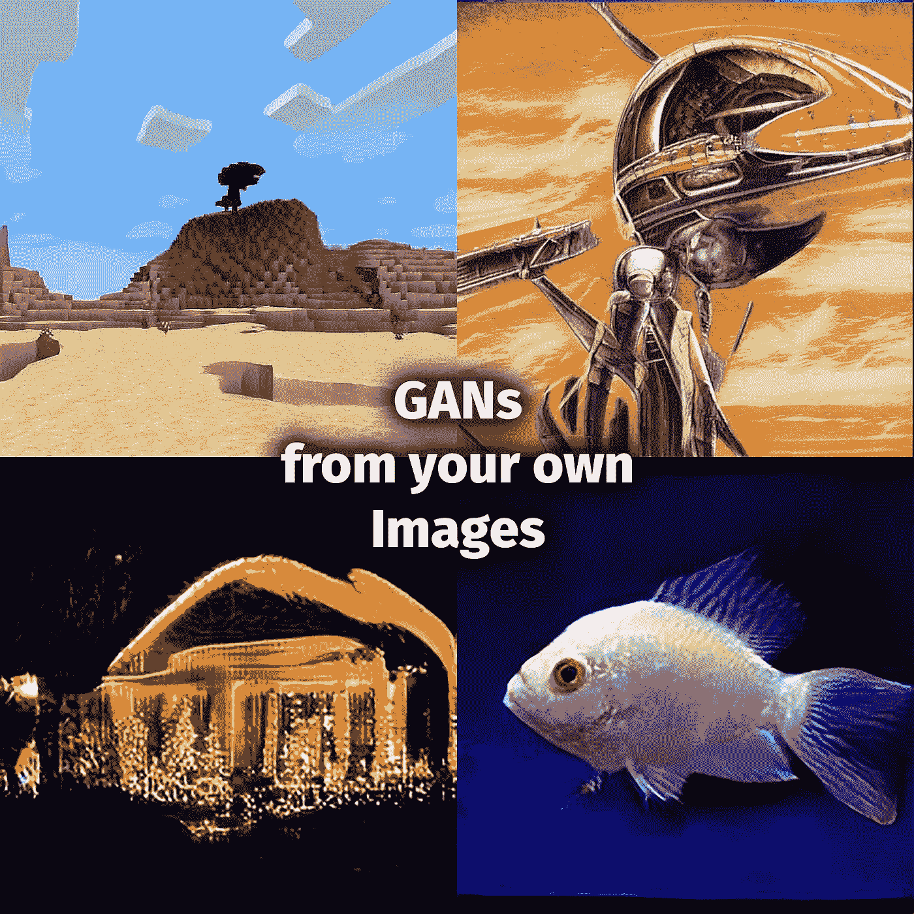
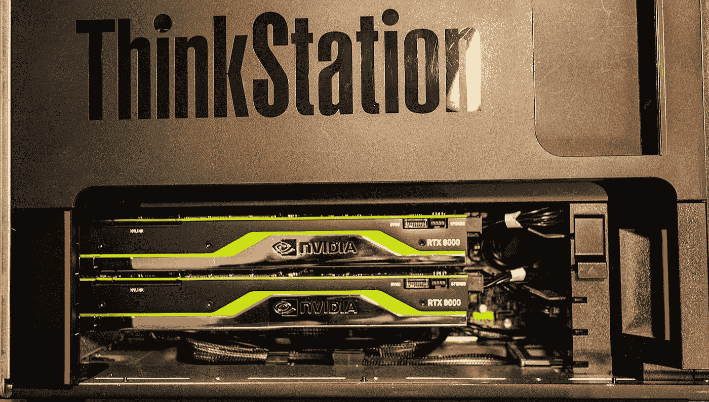
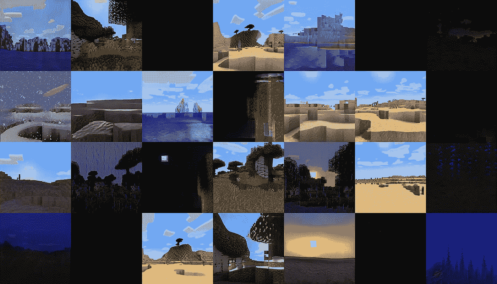

# 在 Ampere 架构上使用 NVIDIA StyleGAN2-ADA for PyTorch 生成您自己的图像

> 原文：<https://towardsdatascience.com/generating-your-own-images-with-nvidia-stylegan2-ada-for-pytorch-on-ampere-a80fab52d6b5?source=collection_archive---------2----------------------->



来自:《我的世界》，70 年代的科幻艺术，假日照片和鱼

StyleGAN2 ADA 允许您训练神经网络，以基于一组训练图像生成高分辨率图像。这方面最经典的例子就是 StyleGAN2 经常用来生成的化妆脸。直到 2021 年 2 月的最新版本，你必须安装旧的 1.x 版本的 TensorFlow，并使用 CUDA 10。这一要求使得很难在 NVIDIA 最新的基于安培的 GPU 上利用 StyleGAN2 ADA。在这篇文章中，我将向你展示如何在 Windows 中使用这个新版本的 StyleGAN，不需要 Docker 或者 Linux 的 Windows 子系统(WSL2 )!

我已经训练过 GANs 产生各种不同的图像类型，你可以从上面我的 GANs 中看到一些例子。我在 GitHub 上提供预先训练的模型来制作这些图像:

*   [甘](https://github.com/jeffheaton/pretrained-gan-minecraft)
*   [70 年代科幻艺术甘](https://github.com/jeffheaton/pretrained-gan-70s-scifi)
*   [鱼干](https://github.com/jeffheaton/pretrained-gan-fish)
*   [圣诞甘](https://github.com/jeffheaton/pretrained-merry-gan-mas)

你可以利用上述网络，只使用谷歌在线 Colab，为自己生成这些图像。

# 硬件先决条件

gan 是计算密集型的，这是无法回避的。英伟达的研究人员在 DGX 系统上扔了 8 个 V100s 来训练人脸。StyleGAN 还可以跨多个 GPU 进行线性扩展，因此，StyleGAN 可以在一台机器上使用任何硬件。我在这里展示的图像是在一台双 Quadro RTX 8000 上训练的。



ThinkStation P920 中的双 Quadro RTX 8000

对于本文，我假设我们将使用最新的 CUDA 11 和 PyTorch 1.7.1。NVIDIA 建议 GPU 上 12GB RAM；但是，如果您使用较低的分辨率，例如 256x256，也可以使用更低的分辨率。分辨率较高的 gan 一般以 1024x1024 训练。单个强劲的 GPU，比如一个[英伟达 RTX A6000](https://www.nvidia.com/en-us/design-visualization/rtx-a6000/) 也做得很好。

我们将在 WSL2 或 Docker 之外安装 StyleGAN2。这提供了最高的性能。相信我，有了 GANs，你想要你机器能提供的每一点计算！

首先，确保您的显卡安装了最新的 NVIDIA 驱动程序:

*   [英伟达 GPU 驱动](https://www.nvidia.com/Download/index.aspx)

第二，安装最新版本的 CUDA 11。如果 CUDA 12 已经发布，而我还没有更新这篇文章，那么就要谨慎行事。查看 [StyleGAN2 ADA PyTorch](https://github.com/NVlabs/stylegan2-ada-pytorch) 说明，了解版本的最新更新。

*   [CUDA 工具包下载](https://developer.nvidia.com/cuda-downloads)

还需要安装 Visual C++，这样 StyleGAN 就可以编译定制的 CUDA 内核。可以在以下 URL 找到 Visual Studio Community edition。确保你安装的是 C++，在微软的安装程序中默认是不启用的。

*   【https://visualstudio.microsoft.com/vs/ 

安装 Visual Studio 后，您必须向系统路径和环境变量中添加几项。您可以通过运行以下批处理程序来实现这一点:

*   c:\ Program Files(x86)\ Microsoft Visual Studio \<version>\ Community \ VC \ Auxiliary \ Build \ VC vars 64 . bat</version>

我建议打开一个 power shell 窗口，进入该目录并运行命令“vcvars64”

# PyTorch 装置

要安装 PyTorch，您需要在系统上安装 Python。我建议要么安装 Miniconda，要么安装 Anaconda。Miniconda 很小，你必须安装需要的软件包。Anaconda 很大，但是包含了你所需要的大部分东西。

*   [https://docs.anaconda.com/anaconda/install/](https://docs.anaconda.com/anaconda/install/)
*   [https://docs.conda.io/en/latest/miniconda.html](https://docs.conda.io/en/latest/miniconda.html)

如果您甚至在争论安装哪个，或者您从未听说过 Anaconda 和 Miniconda 之间的区别，那么几乎可以肯定，Anaconda 是您的正确答案。

StyleGAN 团队推荐 PyTorch 1.7.1 用于 StyleGAN。根据 PyTorch 引入的“突破性变化”的数量，以后的版本可能会起作用。PyTorch 的安装过程令人惊叹，请浏览以下 URL 并选择您的选项:

*   [https://pytorch.org/](https://pytorch.org/)

我选择:

*   稳定
*   Windows 操作系统
*   点
*   计算机编程语言
*   CUDA 11

这导致了以下命令:

```
pip install torch===1.7.1+cu110 torchvision===0.8.2+cu110 torchaudio===0.7.2 -f https://download.pytorch.org/whl/torch_stable.html
```

# NVIDIA StyleGAN2 ADA PyTorch 安装

实际的 NVIDIA StyleGAN2 ADA 包通过 GitHub 在以下存储库分发:

*   [https://github.com/NVlabs/stylegan2-ada-pytorch](https://github.com/NVlabs/stylegan2-ada-pytorch)

您可以选择下载一个 ZIP 文件，该文件应该被解压缩到一个目录中。还可以用命令行 git 命令获得 StyleGAN。

```
git clone [https://github.com/NVlabs/stylegan2-ada-pytorch.git](https://github.com/NVlabs/stylegan2-ada-pytorch.git)
```

在撰写本文时，StyleGAN 还没有提供 requirements.txt 文件来指定所需的包。当您运行 Python 脚本时，您会看到关于缺少包的错误，只需 pip 安装它们。为了让你开始，这些是我找到的:

```
pip install click
pip install tqdm
pip install requests
pip installimageio
pip installpsutil
pip installscipy
```

# 训练 GAN

为了训练 GAN，您必须将所有图像转换为具有相同大小和维度的 PNG，并且具有非常具体的目录结构。这可以通过 StyleGAN 提供的 dataset_tool 脚本来完成。在这里，我转换所有的 JPEG 图像，我获得了训练甘生成鱼的图像。

```
python dataset_tool.py --source c:\jth\fish_img --dest c:\jth\fish_train
```

接下来，您将实际训练 GAN。这是通过以下命令完成的:

```
python train.py --data c:\jth\fish_train --outdir c:\jth\results
```

训练可能需要很长时间，在训练过程中，您会看到在训练过程中创建的图像，这些图像显示了当前的效果。下图显示了我的《我的世界》GAN 在 2,800 kimg 时的情况，这意味着它在这一点上已经对超过 2800 张图像(包括真实图像和增强图像)进行了训练。



图像设置检查点为《我的世界》甘在 2800 公斤

# 生成图像

随着培训的进行，pickle 快照将由您的生成器和鉴别器组成，以与生成的每个映像集检查点相对应。例如，network-snapshot-002800.pkl 生成了上面的映像检查点。要从该网络生成图像，请使用以下命令。

```
python generate.py --outdir=out --trunc=1 --seeds=85,265,297,849 \
    --network=network-snapshot-002800.pkl
```

种子指定要生成的单个图像，每个种子是一个单独的图像。

# YouTube 视频

如果你想看这些步骤的执行，我也有同样材料的 YouTube 视频。

# 结论

如果你有培训的硬件，NVIDIA StyleGAN2 ADA 是一个生成你自己的图像的好方法。新的 PyTorch 版本使其易于在 Windows 环境下运行。按照本文中的步骤，您可以快速建立一个环境来训练您自己的 GANs。