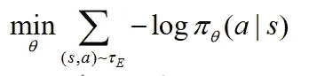
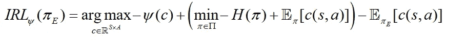

# 生成性对抗性模仿学习:优势与局限

> 原文：<https://towardsdatascience.com/generative-adversarial-imitation-learning-advantages-limits-7c87fc67e42d?source=collection_archive---------8----------------------->

## 与强化学习和非穷举用例列表的区别

Alex Perri 在 [Unsplash](https://unsplash.com/?utm_source=unsplash&utm_medium=referral&utm_content=creditCopyText) 上的照片

越来越多的人工智能项目依赖于学习观察和行动之间的映射。出于战略和技术原因，从演示中学习将在开发几个用例(机器人、视频游戏、自动驾驶汽车)中发挥至关重要的作用。

在我最近的项目中，我有机会对生成性对抗性模仿学习(GAIL)有了深入的了解。作为团队的一员，我的目标是利用 GAIL 帮助机器人预测和理解人类的安全行为。

**在这篇文章中，我将解释生成性对抗性模仿学习，介绍它的优势，并解释这种方法的局限性。**

# 学习人类决策策略的重要性

正如几位计算机科学研究人员所解释的那样，“为了做决定，人类创造了特定的规则/习惯。例如，我们中的一些人根据首选的路线或交通方式来决定。出于这个原因，机器准确地模仿人类在各种场景中的行为是非常重要的，例如，玩视频游戏等。

> **通过模仿学习有助于用最少的任务专家知识来教授复杂的任务。**

通过模仿学习的能力可以为许多需要实时感知和反应的潜在人工智能应用打开大门，如机器人、自动驾驶汽车、人机交互和视频游戏。

然而，需要专门的算法来有效地学习模型。事实上，通过模仿来学习也带来了一系列挑战。不幸的是，对于复杂的任务，这往往是具有挑战性的描述，强化学习(RL)方法有局限性。

> **模仿教学**的概念并不新鲜。由于计算技术的进步和智能应用需求的增长，这个想法最近受到了关注。

一些“最近”的算法，如生成对抗模仿学习，证明了使用深度神经网络(DNNs)从人类的行为数据中学习人类决策策略的成功。

然而，“这种基于 DNN 的模型在本质上是“**黑盒**”模型，很难解释这些模型从人类那里学到了什么知识”( [2](https://users.wpi.edu/~yli15/Includes/20_KDD_xGAIL-Xin_PDFA.pdf) )以及它们如何做出这样的决定，这在模仿学习文献中没有涉及。

> **模仿学习**技术“旨在在给定的任务中模仿人类行为”( [3](https://dl.acm.org/doi/10.1145/3054912) )。

通用模仿学习方法( [4](https://arxiv.org/pdf/1606.03476.pdf) )可以减少教授任务以提供演示的问题，而不需要显式编程或设计特定于任务的奖励函数。

正如各种研究论文中提到的那样，生成对抗模仿学习展示了“在有限数量的用例中取得了巨大的成功，尤其是在与神经网络参数化相结合时”( [5](https://arxiv.org/abs/2003.03709) )。与强化学习不同，GAIL 从专家(人)的演示中学习策略和奖励函数。

# **生成性对抗性模仿学习**

简单来说，GAIL 是一种逆向强化学习(IRL)算法。顾名思义，它是基于**生成对抗网络(GANs)的。** GAIL 可以定义为**一种无模型的模仿学习算法。**与其他无模型方法相比，该算法在模拟复杂行为方面表现出了令人印象深刻的性能增益，尤其是在**大型高维环境中。**

> **逆向强化学习** (IRL)是**通过观察代理的行为来学习**其目标、价值观或报酬的领域。

在 GAN ( [6](https://arxiv.org/abs/1406.2661) )中，我们有两个网络:发生器和鉴别器。生成器的作用是通过学习输入数据集的分布来生成新的数据点。鉴别器的部分是对给定的数据点是由生成器生成的(学习分布)还是真实的数据分布进行分类。

由于 IRL 和 GAN 概念的结合，GAIL 可以从少量专家轨迹中学习。事实上，GAIL 的目标是训练具有与给定专家相似行为的生成器。同时，鉴别器可以作为强化学习的奖励函数，用来判断行为是否像专家。

GAIL 代表了**学习顺序决策策略**的一种有前途的方法。与强化学习(RL)不同，GAIL 使用专家(例如，人类)的演示数据，并学习未知环境的政策和奖励函数。

> 作为一种无模型的模仿学习方法，生成性对抗模仿学习(GAIL)能够很好地概括未知情况，并处理复杂问题。

正如在一个实验( [6](https://uscresl.github.io/humanoid-gail/) )中提到的，“将 GANs 应用于模仿学习的一个基本属性是，生成器永远不会接触到真实世界的训练示例，只会接触到鉴别器。这种情况允许 GAIL 最小化将专家演示翻译到目标代理领域的问题”。

在 GAIL 的案例中，鉴别者学会了从专家的演示中辨别生成的表演。同时，发生器试图模仿专家来愚弄鉴别器，使其认为它的表现是专家的演示。

**盖尔和逆强化学习** 由于不同的原因，盖尔并不完全是 IRL。因为 GAIL 是直接从数据中学习策略，而不是奖励函数。尽管有这个因素，GAIL 比行为克隆表现得更好，有时甚至比专家更好，因为它在进行强化学习，并且它不会被限制总是接近专家。

RL 方法需要明确定义的奖励函数，它告诉代理他们做得有多好。**不幸的是，在大多数现实世界的情况下，奖励函数通常很难定义**。

引入 IRL 来帮助 RL 学习专家的策略，并从给定的专家轨迹中获取奖励函数来解释专家的行为。然而，对于大多数经典的 IRL 方法，需要提供大量的专家轨迹，但在很多情况下，这些轨迹并不容易得到。

## **其他一些模仿学习方法的局限性**

**行为克隆
(从状态到动作的映射)。此外，小错误会随着时间的推移而加剧(级联错误)。此外，行为克隆通常具有较差的泛化能力，精确地复制动作，即使它们与最终任务无关，并且可能无法理解专家的动作是有目的的并且有最终目标。**

**逆向强化学习** 这种方法学习一种成本函数，该函数将整个轨迹优先于其他轨迹。主要问题是“许多现有的 IRL 方法需要解决一系列计算量大的强化学习问题，因为它们具有双层优化的性质。因此，它们通常无法扩展到大型和高维度环境”( [7](https://arxiv.org/pdf/2001.02792v2.pdf) )。最后但同样重要的是，IRL 的运营成本很高。

# 用例

尽管深度强化学习已成功应用于各种任务，但为复杂任务手动设计合适的奖励函数仍具有挑战性且成本高昂。

大多数涉及 GAIL 的项目目前都应用于简单的环境中( [8](https://ieee-cog.org/2020/papers/paper_265.pdf) )，在这些环境中，具有手工制作功能的全连接神经网络已经工作得很好了。

具体地说，代理从专家演示和自我探索中学习“接近最优”行为而无需显式奖励函数设计的想法已经应用于几个机器人操作( [9](https://www.researchgate.net/publication/339976382_Generative_Adversarial_Imitation_Learning_with_Deep_P-Network_for_Robotic_Cloth_Manipulationn) )或运动任务( [10](http://www.arxiv-vanity.com/papers/1710.02543/) )。

再者，GAIL 也被用于电子游戏行业，尤其是在相对复杂的没有手工制作特色的游戏中模仿特定玩家( [11](https://ieee-cog.org/2020/papers/paper_265.pdf) )。

# 盖尔的问题

尽管结果很有希望，盖尔背后的理论仍然鲜为人知。根据我的经验，GAIL 很难从多模态演示中学习到好的策略。事实上，它似乎假设所有的演示都来自单个专家，无法提取演示。

对抗性模仿学习在许多环境中都取得了成功。然而，“对抗方法被证明是不稳定的，并且在低数据量的情况下，可能需要很长时间才能收敛”( [12](https://deepai.org/publication/loss-annealed-gail-for-sample-efficient-and-stable-imitation-learning) )。

一些作者( [13](https://arxiv.org/pdf/1710.11248.pdf) )介绍了逆向 RL 技术 **AIRL** ，认为“**盖尔**未能推广到不同环境的动力学”。根据他们的实验，AIRL 对环境动态的变化更有抵抗力。

# 要了解更多信息，我推荐以下链接:

*   [从不同来源模仿学习人形](https://uscresl.github.io/humanoid-gail/)
*   [生成性对抗性模仿学习](https://arxiv.org/pdf/1606.03476.pdf)
*   [生成性对抗性模仿学习的呈现](http://efrosgans.eecs.berkeley.edu/CVPR18_slides/GAIL_by_Ermon.pdf)
*   [TextGAIL:用于文本生成的生成性对抗模仿学习](https://www.researchgate.net/publication/341040552_TextGAIL_Generative_Adversarial_Imitation_Learning_for_Text_Generation)
*   [生成性对抗性模仿学习的最新进展](http://www.lamda.nju.edu.cn/wenzj/websites/Imitation/websites_files/20201027/Generative%20Adversarial%20Imitation%20Learning.pdf)
*   [关于生成性对抗性模仿学习的计算和推广](https://arxiv.org/pdf/2001.02792.pdf)
*   [通过生成性对抗性模仿学习来模仿复杂环境中的智能体](https://ieee-cog.org/2020/papers/paper_265.pdf)
*   [通过原始深度输入和生成性对抗性模仿学习进行社交兼容导航](http://www.arxiv-vanity.com/papers/1710.02543/)
*   [xGAIL:可解释的生成对抗模仿学习，用于可解释的人类决策分析](https://users.wpi.edu/~yli15/Includes/20_KDD_xGAIL-Xin_PDFA.pdf)
*   [模仿学习:学习方法综述](https://dl.acm.org/doi/10.1145/3054912)
*   [损耗退火盖尔对样本高效稳定的模仿学习](https://deepai.org/publication/loss-annealed-gail-for-sample-efficient-and-stable-imitation-learning)
*   [生成性对抗性模仿学习(盖尔)](https://hollygrimm.com/rl_gail)