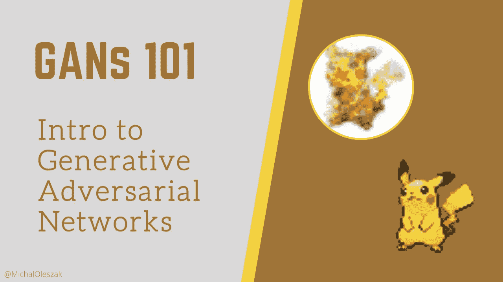
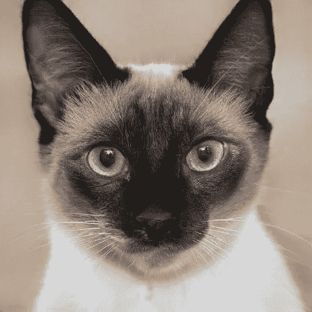
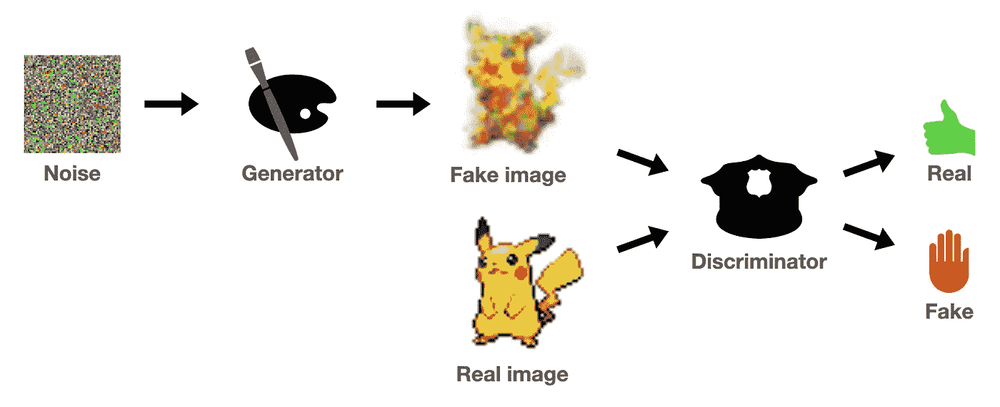
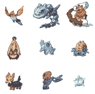
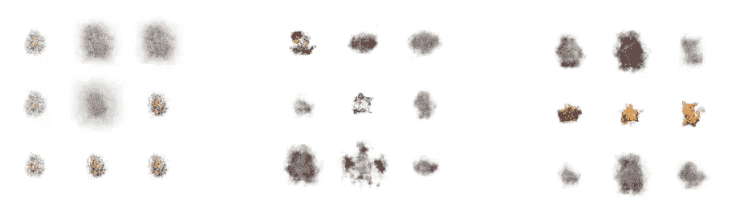

# 生成性对抗网络 101

> 原文：<https://towardsdatascience.com/generative-adversarial-networks-101-c4b135a440d5?source=collection_archive---------32----------------------->

## 如何构建一个简单的 GAN

自 2014 年首次提出以来，生成性对抗网络(简称 GANs)就成为了机器学习社区的头条新闻。基于一个巧妙简单的想法，GANs 很快成为产生人造图像的最先进的方法，这些图像现在与真实图像无法区分。他们不仅在生成人工智能艺术或人脸老化等有趣的任务中找到了应用，还在更实际的应用中找到了应用，如数据匿名化、提高照片分辨率等。在这篇文章中，我将解释 GAN 是如何工作的，我们将构建一个非常简单的 GAN 来生成新的口袋妖怪物种。我们开始吧！

## 关于甘斯

GANs 首先由 Goodfellow 等人提出，并被迅速开发以发现大量令人着迷的用例，例如生成人脸的逼真图片、图像到图像的翻译(想想在图片中的一匹马身上画条纹以使它成为斑马)，或者衣服翻译(如果你想知道你穿同样的毛衣，但却是红色的高领毛衣会是什么样子)。他们甚至允许我们在图片上做算术:取一个戴眼镜的男人减去一个不戴眼镜的男人加上一个不戴眼镜的女人的图像，你会得到一个戴眼镜的女人的图像，从这个图像中你可以生成多个不同的戴眼镜的女人的图像。请查看[这篇伟大的博文](https://machinelearningmastery.com/impressive-applications-of-generative-adversarial-networks/)，获取更多 GAN 应用示例图片。看看这只猫。

一只不存在的猫，由 https://thiscatdoesnotexist.com/的[生成。](https://thiscatdoesnotexist.com/)

这只猫既不喵喵叫也不咕噜咕噜叫。它不吃也不喝。因为它不存在。就像无数其他不存在的被甘斯创造出来的猫一样。你可以自己生成一些，只需导航到[thiscatdoesnotexist.com](https://thiscatdoesnotexist.com/)。每次刷新页面，都会生成一个新的 cat。对于[人](https://thispersondoesnotexist.com/)或[住宿](https://thisrentaldoesnotexist.com/)也有类似的页面(虽然有些房间看起来还是有些毛骨悚然！).

## 甘斯直觉

GANs 基于一个有趣的简单想法:让两个神经网络相互竞争，希望竞争能推动它们走向精通。

> GANs 背后的想法:让我们让两个神经网络相互竞争，希望竞争能推动它们走向精通。

总体目标是生成与训练数据中的内容无法区分的内容，例如图像。人们可以将这一思想应用于任何类型的数据，但是在本文中我们将重点关注图像。为了实现这一目标，我们需要两个独立的模型:

*   一个*发生器***，以随机噪声为输入，并以此为基础生成图像；**
*   **A d *是鉴别器*，它将图像作为输入(真实的或由生成器生成的)，其工作是将它们分类为真实或虚假。**

**生成器的目标是生成逼真的图像来欺骗鉴别器，而鉴别器的目标是从真实图像中分辨出假货。将这两个模型拟人化是很有帮助的，把生成器想象成一个艺术品伪造者，把鉴别器想象成一个警察调查员，去抓捕伪造者。这两个网络的这些相互冲突的目标应该确保每一个在训练期间逐渐变得更好。最终，生成器将有望生成逼真的图像。**

****

**GAN 的示意图。图片由作者提供。**

****

## **发电机👨‍🎨**

**发生器最简单的形式可以是一个微小的神经网络，它接受输入的噪声向量，将它传递几层，并以图像的形式输出一个张量。当处理图像时，我们通常会使用卷积层，但训练卷积 gan 本身也会带来挑战，因此为了这个介绍性示例的目的，让我们使用一个简单的前馈网络，基本上是一个多层感知器。**

**我们将使用[口袋妖怪精灵数据集](https://github.com/PokeAPI/sprites)来生成我们自己的口袋妖怪物种。以下是一些示例图像。使用[这个笔记本](https://github.com/MichalOleszak/gans/blob/main/notebooks/pokemon_data_prep.ipynb)，你可以自己生成更多的样本。**

****

**口袋妖怪精灵数据集的样本。**

**让我们的生成器接受 64 个随机数的输入向量，输出一个形状为 4*96*96 的向量(口袋妖怪 pics 是 96*96 像素，4 个颜色通道)。生成器的输出层将是一个 sigmoid 激活，以便它生成 0 到 1 之间的数字来匹配原始图像中的像素值。PyTorch 实现可能看起来像这样。随着单元数量的增加，您可以随意尝试添加更多的 linear-batchnorm-relu 块。**

****

## **鉴别器👮‍♀️**

**鉴别器将是另一个小型神经网络，其任务是获取大小为 4*96*96 的输入向量，该输入向量包含真实图像或虚假的发生器输出，并分类为两者之一。我们可以这样实现它。**

**同样，随意堆叠更多的层，例如从`nn.Linear(4*96*96, 2048)`开始，每次继续将层大小分成两层。**

****

## **培养**

**棘手的部分来了:如何训练这两个网络，使它们都能很好地学习自己的任务？关键是一前一后地训练它们，只用一个损失函数。损失函数的选择取决于鉴别器，因此我们可以使用二进制交叉熵损失，这是二进制图像分类的典型选择(在未来的帖子中，我将讨论使用更好的损失函数的更高级的 GANs)。让我们首先初始化两个模型，损失和优化器。**

**这个`PokemonDataset`物体是我创作的，你可以在 GitHub 上找到它[。现在，训练循环。我们对时期和批次进行迭代，对于每批训练数据，我们将梯度归零，计算鉴别器的损失，并更新模型的权重。接下来，我们对发电机做同样的事情。](https://github.com/MichalOleszak/gans/blob/main/gans/datasets.py)**

**剩下的问题是如何计算每个模型的损失。在上面的代码片段中，这是由定制的`get_disc_loss()`和`get_gen_loss()`函数处理的。让我们看看他们怎么做。**

## **鉴频器损耗**

**第一，鉴频器的损耗。我们可以按照以下步骤计算它:**

*   **产生一些随机噪声，并将其馈送到发生器。这会产生一批假图像。**
*   **使用鉴别器将这些假图像分类为假的或真的。然后，用它对一批真实图像进行分类。这就产生了两组分类:赝品和真品。**
*   **使用零(“假”)作为基本事实标签，将“假损失”计算为假图像鉴别器输出的二进制交叉熵损失。接下来，计算“真实损失”,作为鉴别器输出真实图像的二进制交叉熵损失，使用 1(“真实”)作为基本事实标签。**
*   **将总损失计算为假损失和真损失的平均值。**

**这由下面的函数来处理。**

## **发电机损耗**

**现在，让我们对发电机的损耗进行编码。这个会简单得多。我们只需要生成噪声，将其馈送到生成器以获得假图像，使用鉴别器对它们进行分类，并使用 1(“真实”)作为地面真相标签来计算这些分类的二进制交叉熵。我听到你问为什么是一个。回想一下，生成器的目标是欺骗鉴别器。当它产生假图像时，它希望它们被归类为真实的——每当不是这样时，生成器就会遭受损失。换句话说，如果鉴别器将每个发电机的输出分类为实数，那么发电机的损耗将为零。这个想法在下面的函数中实现。**

**现在我们有了所有的构建模块，我们可以运行训练循环。你可以在[这个笔记本](https://github.com/MichalOleszak/gans/blob/main/notebooks/dense_gan.ipynb)里自己运行(代码是根据 Coursera 的[生成对抗网络(GANs)专门化](https://www.coursera.org/specializations/generative-adversarial-networks-gans)由 Sharon Zhou 等人编写的)。在训练过程中，我们可能会时不时地给生成器输入一些噪声，看看它输出了什么。下面的图片显示了 GAN 生成的口袋妖怪在训练开始时，在几百个纪元后，以及在训练的很晚时候。**

****

**GAN 在训练开始时(左)、训练后期(中)和后期(右)生成的口袋妖怪。**

**跟你预想的不太一样？我们来看看为什么！**

****

## **为什么这么模糊**

**生成器很快了解到，它应该专注于图像的中心区域，并保持背景白色。在训练的早期，它一直在图像中间产生噪点。随着训练的进行，一些熟悉的形状变得清晰可见。甚至后来，一些假的口袋妖怪出现了，它们类似于训练数据中的那些，尽管是以一种模糊的方式(你可以认出每个人最喜欢的皮卡丘，在中间一行和最右边一列！).如果你已经期待一个更现实的输出，不要放弃希望。让我们看看模型的哪些部分需要改进。**

**有几个，但其中两个最引人注目。首先，我们使用了一个简单的前馈网络来处理图像，这是相当次优的。切换到卷积神经网络应该会有很大帮助。第二，我们用于 gan 的二元交叉熵损失证明不是最佳选择；我会在另一篇文章中解释为什么会这样，以及什么样的损失函数会更好。**

**先说前者。查看下一篇文章，在这篇文章中，我们将 GAN 向前推进了一步，在生成器和鉴别器中添加了卷积，以构建所谓的深度卷积 GAN 或 DCGAN！**

** [## 生成性对抗网络 102: DCGAN 和模式崩溃

### 卷积简单的 GAN 以提高生成图像的质量。

michaloleszak.medium.com](https://michaloleszak.medium.com/generative-adversarial-networks-102-dcgan-mode-collapse-ef119aa31a6f) 

## 感谢

这个简单 GAN 的训练循环代码以及损失计算函数的灵感来自于 Coursera 的由 Sharon Zhou 等人提出的[生成对抗网络(GANs)专门化](https://www.coursera.org/specializations/generative-adversarial-networks-gans)。

感谢阅读！

如果你喜欢这篇文章，为什么不在我的新文章上 [**订阅电子邮件更新**](https://michaloleszak.medium.com/subscribe) ？通过 [**成为媒介会员**](https://michaloleszak.medium.com/membership) ，你可以支持我的写作，并无限制地访问其他作者和我自己的所有故事。

需要咨询？你可以问我任何事情，也可以在这里 预定我 1:1 [**。**](http://hiretheauthor.com/michal)

你也可以试试我的其他文章。不能选择？从这些中选择一个:

 [## 你可能错过的激活功能

### 你应该“嗖嗖”一下这些新发明，还是继续使用老掉牙的东西？

towardsdatascience.com](/activation-functions-you-might-have-missed-79d72fc080a5)  [## 蒙特卡洛辍学

### 用一个小技巧免费改善你的神经网络，获得模型不确定性估计作为奖励。

towardsdatascience.com](/monte-carlo-dropout-7fd52f8b6571)  [## 统计死了，统计万岁！

### 认识一下重采样，这是一种通用的现代统计方法

towardsdatascience.com](/statistics-is-dead-long-live-statistics-df6c71262187)**