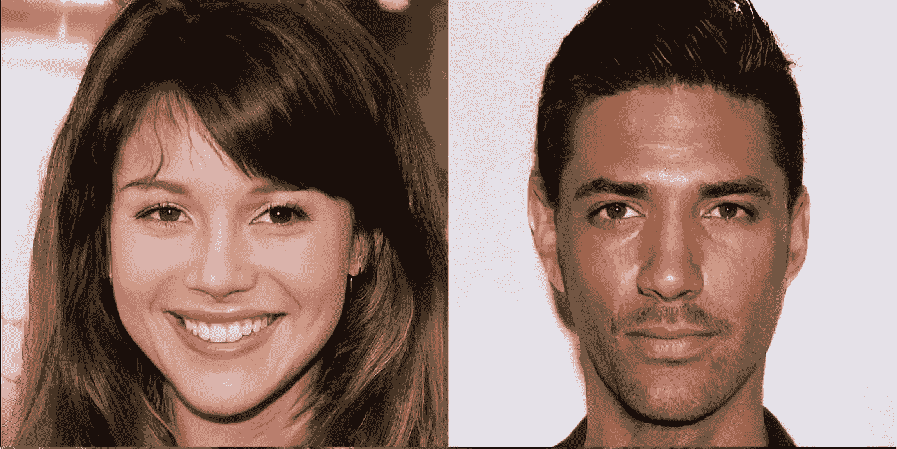
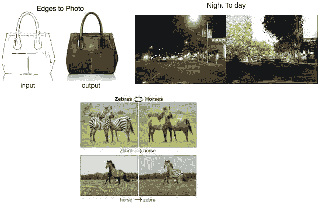
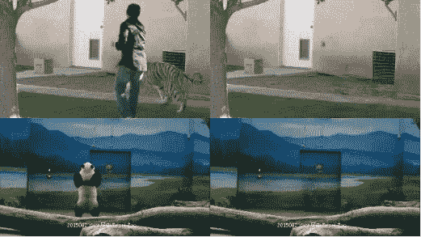
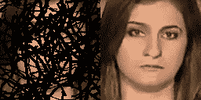
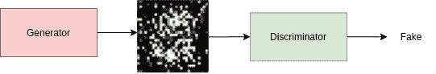
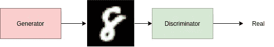
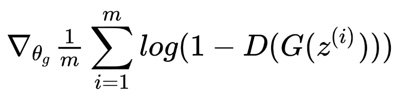
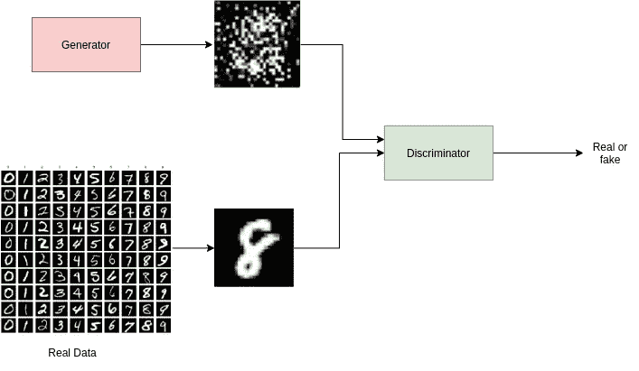
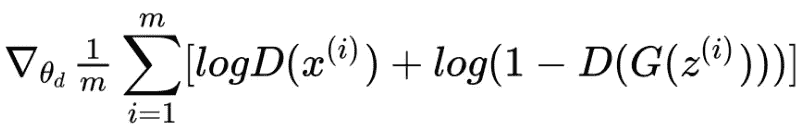

# 生成性对抗网络(GANs)——从直觉到实现

> 原文：<https://towardsdatascience.com/generative-adversarial-networks-gans-from-intuition-to-implementation-436dc5bd237f?source=collection_archive---------38----------------------->

图片由[纸](https://arxiv.org/pdf/1710.10196.pdf)

# 生成对抗网络

形式上，GANs 被定义为**两个神经网络在一场游戏中相互竞争(在博弈论的意义上，经常但不总是以零和游戏的形式)。给定一个训练集，这种技术学习生成具有与训练集相同的统计数据的新数据。**这个定义似乎非常数学化，如果你对实现算法更感兴趣的话，这可能不是很有用。在这篇博客中，我将为你提供算法如何工作以及你如何实现算法的直觉。

与普通的神经网络相比，GANs 可以生成质量更好的新数据。我们可以把它描述为**两个网络相互竞争，这种竞争导致更好的结果，因为双方都在试图击败对方。**

它的应用非常有趣，它使我们能够解决许多现实世界的问题。让我们先看看它的一些应用

*   生成与真实人脸惊人相似的人脸。
*   图像到图像的转换——给定边缘的图像，网络可以生成物体的彩色图片，或者给定夜间条件下的图片，它可以将其转换为白天条件，这在自动驾驶中有巨大的用途。

图片由[纸](https://arxiv.org/pdf/1611.07004.pdf)制成

*   修复——给定一个失真的图像，它可以生成完整的图像，这在视频后处理、受损视频恢复和视频编辑中有很大的应用。

物体去除，图像由[纸](https://github.com/amjltc295/Free-Form-Video-Inpainting)

GIF by [LGTSM](https://github.com/amjltc295/Free-Form-Video-Inpainting)

现在让我们更深入地了解 GANs。根据形式定义，我们知道在这个算法中有两个网络。其中一个称为**发生器**，另一个称为**鉴别器**。

生成器网络生成具有某种统计属性的数据。我们希望统计特性与我们想要得到的输出类型相同。例如，在从夜晚到白天的图像到图像的翻译中，它应该能够正确地生成白天的图像。而在生成新的人脸时，它应该能够给出类似于真实世界人脸等的输出。

*下面的代码是生成器的架构。它接受一个固定大小的随机输入(random_size ),然后生成一个扁平的图像(大小为 height*width 的 1D 数组),为了从输出中可视化图像，我们必须将输出向量整形为适当的(height，width)。在这里，我为生成器架构使用了完全连接的层。*

发电机架构

鉴别器充当发生器的**评论**(稍后解释)。它的主要工作是，给定一个特征点/图像，它试图将该特征点/图像分类到所需的类别中。例如，给定一幅图像，鉴别器将试图把给定的图像分类为真实的或伪造的(这里生成器的输出可能是伪造的)。在领域自适应的情况下，它试图将给定的特征分类为源或目标领域特征。

*下面，代码是鉴别器的架构。它是将一幅展平的图像(shape - > height*width)作为输入，然后将输入分类为真假。这里我使用了完全连接的层。*

鉴别器架构

既然我们已经看到了单个模型的角色，那么让我们看看它们是如何互相帮助的。

## 仅培训生成器

让我们假设我们有一个经过训练的鉴别器，即它可以正确地将图像分类为真的和假的(通常情况下不是这样)，并且我们只训练我们的生成器。然后我们用这个评论作为反馈，用生成器生成接近真实的图像。考虑发电机的培训过程如下:

*   **最初**，由于神经网络权重的随机初始化，会产生一些随机输出(用 **G(z)** 表示)。当这个通过鉴别器时，它肯定会被鉴别器分类为假的。

当我们开始训练时(图片由作者提供)

*   **最后**，当我们已经训练了生成器模型时，我们希望输出非常类似于训练数据集，即我们的鉴别器应该将生成器的输出(G(z))分类为实数。

训练结束时(图片由作者提供)

为了训练发生器，我们通过将 **G(z)** 的标签作为真实数据，使用来自鉴别器的输出来计算损耗，即我们强制发生器产生鉴别器可以分类为真实的输出。这样鉴别器就帮助了发生器。为了更好地说明，请看下面的损失公式:

发电机损失(图片由作者提供)

**理想情况下，**对于真实图像，鉴别器的输出为 0，而对于伪图像，其输出为 1。为了最小化上述损失，输出 **D(G(z))** 应该接近 0，即我们正在训练发生器，以便其输出被鉴别器分类为实数。

下面的代码显示了生成器的训练方案。发生器 G(z)的输出被馈送到鉴别器，然后通过将输入到鉴别器的标记作为真实图像来计算损耗。然后，该损耗用于更新发电机的参数。

训练生成器

## 仅训练鉴别器

现在让我们假设我们有一个生成假图像的生成器，即输出质量很差，我们只训练我们的鉴别器。训练鉴别器与训练普通分类器是一样的。当我们的输入是假图像时，它分类为假，当输入是真实的(即来自训练数据)时，它分类为真实。

训练鉴别器(图片由作者提供)

鉴别器丢失(由[纸](https://arxiv.org/pdf/1406.2661.pdf)成像)

上面的损耗公式强制鉴别器将真实输出分类为 1，将伪造/生成的输出分类为 0。

*下面是鉴别器的训练方案，我们首先将真实图像(来自训练数据)馈送给鉴别器，并通过将这些图像的标签视为真实来计算损失。然后，我们将假图像(生成器的输出 G(z))馈送到鉴别器，并通过将 G(z)的标签视为假来计算损失。*

训练鉴别器

现在我们已经讨论了如何分别训练生成器和鉴别器。然而，在现实世界中，我们必须同时训练他们两个。

## 完整的训练

考虑一下，两个网络最初都有随机权重。首先，我们通过将生成器的输出分类为假来训练鉴别器，将训练数据分类为真，并且只更新鉴别器的参数。然后，我们训练生成器，其中使用鉴别器，我们尝试将生成器的输出( **G(z)** )分类为实数，并仅更新生成器的参数。现在，如果我们的训练是稳定的，并且一切按预期进行，那么当鉴别器的输出对于训练数据和来自生成器的输出相同时，即鉴别器不能区分两者时，我们可以停止训练。

训练甘

这样，我们就完成了对 GANs 的介绍。我希望这个博客能让你对 GANs 的工作有一个好的直觉。完整的实现可以在下面的 GitHub 仓库中找到。

<https://github.com/harsh-99/PyTorch-Tutorials/blob/master/GANS.ipynb>  

*成为* [*介质会员*](https://medium.com/@AnveeNaik/membership) *解锁并阅读介质上的许多其他故事。关注我们的* [*媒体*](https://medium.com/@AnveeNaik) *阅读更多此类博文*。