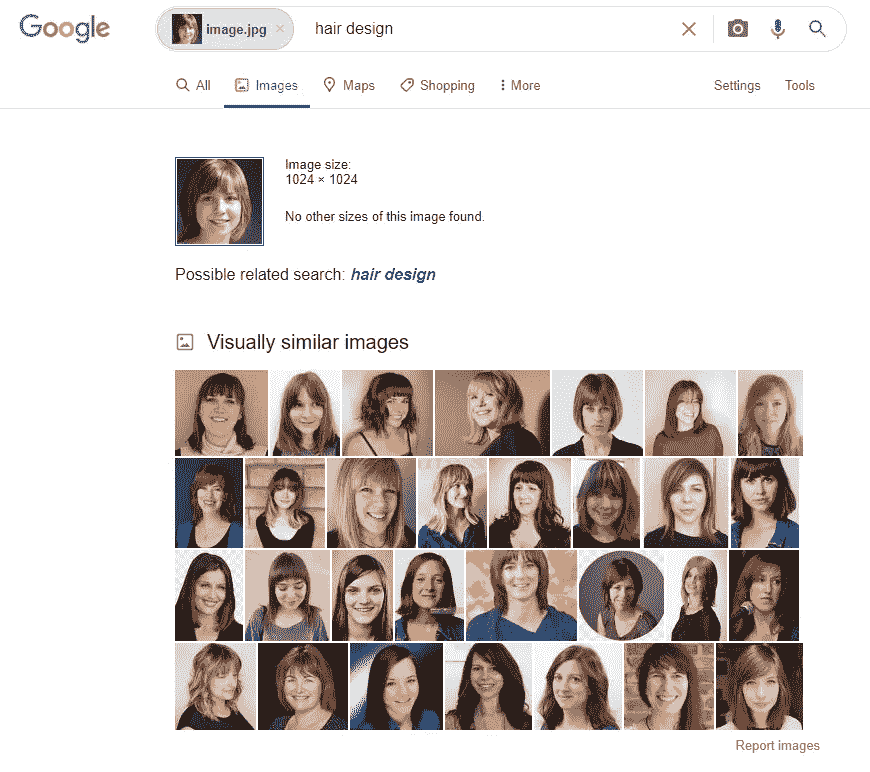
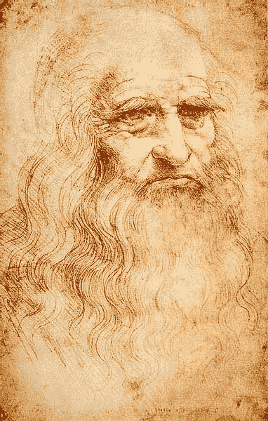

# 生成人工智能:作为虚构与现实之间桥梁的视觉搜索

> 原文：<https://towardsdatascience.com/generative-ai-visual-search-as-a-bridge-between-fiction-and-reality-46d2d78ee15?source=collection_archive---------40----------------------->

## 在三个用例中。

Same.energy 界面，作者截图

## 什么是真理？

F 首先，请告诉我，什么是**虚构**，什么是**现实**——在**生成对抗网络**的背景下？

我们已经看到了很多东西，[在它的人工智能驱动的创造](/this-item-does-not-exist-2defbac76b39?sk=f444e16f44856396cf97e5939d055211)之前是不存在的。可以肯定的是， [*中 GAN 生成的图像这个人不存在*](https://thispersondoesnotexist.com/) 或者 [*这个艺术品不存在*](https://thisartworkdoesnotexist.com/) 在物质世界中没有直接的参照物——它们是知识和 AI 模型训练的产物。但是当它们被传送到我们的世界，它们可能会有自己的故事，特定的意义，特定的用途，离开潜在的空间，变得比小说更真实。

的确，你可以用它们制作电影。你也可以制造欺诈和假货。错用不怪 AI，怪我们人类。你不能通过破坏技术来修复社会。

然而，在数字时代，重要的是要区分生成性和非生成性项目，防止假货，并利用艺术力量，直到现在不存在的可能性。

这里有三个用例可以启发你或者提高你的意识。

## 案例 1: StyleGAN2 投影

StyleGAN2 的研究人员有一个内置的“后门”，或者可以将 GAN 生成的图像追溯到潜在空间: [StyleGAN2 投影](/stylegan2-projection-a-reliable-method-for-image-forensics-700922579236?sk=52f792fa0bd8913c7abf184b5b1f9513)。

如果您尝试将图像识别为生成图像，这可能非常有用。我不得不说，用 style gan 2[Colab Notebooks](/12-colab-notebooks-that-matter-e14ce1e3bdd0?sk=3cae22488e4bff5f01a1e71fb01975c8)和[art breader](/artbreeder-draw-me-an-electric-sheep-841babe80b67?sk=2fff2b9e102ce632d725e58bfa4c67dd)(其中使用了 StyleGAN2-model，在 FFHQ-faces 上训练过)玩久了，你可以学习直觉来检测可能是生殖性的肖像。

但是使用投影你也可以做到。

以下是检测生成性图像并利用潜在空间发现它的最佳示例:

当然，原始图像在这里已经够怪异了。将它与另一幅肖像进行比较:

如你所见，找到的肖像是不一样的。为什么？因为我用其他工具修改了它，比如 ArtBreeder(混合各种图像，包括我的照片)。这是这张图片的“系谱树”:

Artbreeder，作者截图

这是 StyleGAN2-Projection 的第一个也可能是一个重大缺陷。要检测 1:1 的图像，应满足以下条件:

*   StyleGAN2 应该生成没有任何修改的图像
*   您必须知道哪个数据集用于您正在应用投影的 StyleGAN2。

StyleGAN2 投影是一个很大的可能性，但可以用几种方式欺骗；所以才不靠谱。然而，它可以作为第一个工具使用——在特定情况下，它可能是有益的。

你可能会想起“亨特·拜登阴谋”的故事，主角是马丁·阿斯彭，他声称有证据证明这是一场捏造的破坏政治形象的亲特朗普运动。然而，马丁·阿斯彭并不存在；他的脸是由 StyleGAN2 生成的，这是 StyleGAN2 的投影:

正如你所看到的，这些面孔并不完全相同——这个故事背后的政治幕后操纵者可能使用了 StyleGAN2，但做了一些修改。

但即使这种方法不是 100%有效，也应该强调的是，人工智能研究人员将许多努力投入到防止人工智能解决方案被滥用的可能性中(即使是事后的，如假检测)。

**旁注:**毕竟，你可以出于艺术需要使用 StyleGAN2 投影，在不这样的地方寻找人脸。它与 [Pareidolia 方法](/pareidolia-of-ai-dba7cf44bfde?sk=f22677820ca169764e2c076fea98ee6e)一起工作，可能会产生一些迷人/或可怕的结果:

## 案例 2:使用反向图像搜索的假货检测

另一种检测假图像的方法是**反向图像搜索**。这里有一个使用俄罗斯搜索引擎 **Yandex** 回溯假货的绝佳用例:

在这种情况下，从“[此人不存在](https://thispersondoesnotexist.com/)”页面获取的人脸用于搜索相同的图像。于是一个伪造的公司网页被发现了，上面有几张 GAN 生成的脸:

老实说，有两点:

1.  这可能不一定是欺诈或伪造的，只是另一个即将开业的公司分支机构的模型,或者仍然没有同事的照片。例如，前面提到的在别尔哥罗德[办公室的公司职员看起来很普通](https://belgorod.dezmarafet.ru/)，不像甘。可能这只是另一个——我们，人类，西方——对俄国制造的*假货的偏见。即使不存在这样的情况，我们也会发现它们的另一种情况</pareidolia-of-ai-dba7cf44bfde?sk=f22677820ca169764e2c076fea98ee6e>****或**选择性知觉**。不是所有的俄罗斯都是假的；不是所有的假货都是俄罗斯的。顺便说一句。将 GAN 的图像用于实体模型是一个非常明显的想法:你不需要购买股票图像，并且你的实体模型员工的脸不会在完全不同的产品上重复出现，如[股票女孩“Ariane”](https://vulcanpost.com/6176/overexposed-model-ariane-makes-you-go-she-is-everywhere/)。比较[这个出租不存在](https://thisrentaldoesnotexist.com/)，一个使用 StyleGAN2 faces 作为用户账号的生成页面(更像是一个实验)。*****
2.  ****如果这可能是一个骗局，这不仅仅是 Yandex 的特色，也不仅仅是俄罗斯的问题。唯一的问题是:Yandex 确实比谷歌(Google)更擅长寻找 GAN 的面孔。****

****谷歌搜索可能是查找全球虚假公司的一个好办法，但它也有缺陷:****

********

****作者截图****

****[**谷歌图片搜索**](https://www.google.de/imghp?hl=en&tab=wi&authuser=0&ogbl) 寻找的是*相似的*图片，而不是*相同的*图片。我想用[**TinEye**](https://tineye.com/)**来代替。这个工具通常非常适合检测用户在社交网络上联系你是否是假的。将它与其他*相同的*网页图像进行匹配可能会证明这个用户图片是一个股票图像，而使用这个用户图片的人可能是一个骗子。甚至还有 TinEye 插件。******

************************

******使用 [TinEye 插件](https://tineye.com/) = >查找使用图片的页面，截图由作者提供******

******TinEye 的问题是:没有一个完整的关于这个不存在的人的开放知识库来进行双重检查(这意味着整个潜在空间都是开放访问的，这可能是不可行的)。******

******相反，Yandex 可以找到另一个 GAN 生成的人脸，如果你只上传其中一个。而且 **Yandex** 的这个*相似度*比**谷歌图片搜索**的*相似度*要好用得多。******

********

****并非所有类似的图像都是 GAN 生成的，但其中许多是。作者截图。****

****大概，Yandex 寻找的是 GAN 人脸上典型的特定图案？Yandex 的缺点是，它仍然主要在俄罗斯网络空间进行搜索，这可能会导致对“*假面网络景观*”的偏见。****

****我希望 TinEye 或 Yandex 类似的服务也可以使用 GAN2 或其他 GAN 生成的图像，甚至可以作为 Chrome 插件，在全球范围内寻找这种假照片。可能使用 StyleGAN2 投影，这可能需要一些时间:使用 [StyleGAN2 Colab 笔记本](https://colab.research.google.com/drive/1ShgW6wohEFQtqs_znMna3dzrcVoABKIH)，生成投影大约需要 10-15 分钟。****

## ****案例三:一样。能量——反向图像搜索的艺术运用****

****但这不仅仅是关于政治、欺诈和假货。人工智能作为一种创造性的机器，为艺术家、作家和电影制作人打开了新的视野。在真实数据的训练下，人工智能提供了关于我们世界的“幻觉”或“梦想”。而 AI 梦的视觉表现形式变成了我们的世界。****

****最近，一个引人入胜的视觉搜索引擎亮相: [**相同。能源**](https://same.energy/) 由多媒体艺术家和游戏设计师[雅各布·雅各布森](https://jacobjackson.com/)创作。顾名思义，这个引擎寻找具有“相同能量”的图像，在风格和视觉上与你输入搜索的图像相似。该引擎使用机器学习工作，并由类似于 OpenAI 的 [CLIP](https://openai.com/blog/clip/) 的视觉分类模型提供燃料(该模型在承认 [DALL-E](/dall-e-by-openai-creating-images-from-text-e9f37a8fe016?sk=8d54f081ad0d5f4394ffa09ed7b62349) 的情况下发布)。****

****如果你在这里输入一个任意的图像，系统会以特定的特征、模式和物体来识别它，并寻找语义上的相似性。****

****例如，如果我们输入达芬奇的自画像，我们会得到一组其他图像，描述类似“一个留着胡子的老人作为一幅画或一幅素描”。****

****************

****达芬奇自拍(公共领域)//作者截图****

****我摆弄着比根的图像(由 [Colab Notebook](https://colab.research.google.com/github/tensorflow/hub/blob/master/examples/colab/biggan_generation_with_tf_hub.ipynb) 和[art breader](https://artbreeder.com/)生成)想知道是怎么回事****

****a)机器学习可以从混合种子中检测生成图像吗****

****b)这个视觉搜索引擎能从现实世界中找到相似的图像吗？当然，其中许多将是想象力的产物，但仍然是人类的产物。****

****上传了一些图片，我发现了灵感和头脑风暴的奇妙可能性。****

****就拿这个来说吧。在这里你可以看到种子和它们的强度用于生成这个黑白艺术图像:****

********

****图片网址:【artbreeder.com/i?k=8b4dfc7e99d0cb87d1c7 ，作者截图****

****这是同样的图片。能源可以找到:****

********

****作者截图****

****或者另一个:****

********

****图片页面:[https://www.artbreeder.com/i?k=6ca1f4031e1fc1565e1e](https://www.artbreeder.com/i?k=6ca1f4031e1fc1565e1e)，作者截图****

****同样的能量，有着令人难忘的画面。****

********

****作者截图****

****另一种半抽象的观点:****

********

****图片页面:[https://www.artbreeder.com/i?k=35f9d8d2bba080ecf586](https://www.artbreeder.com/i?k=35f9d8d2bba080ecf586)，作者截图****

****结果令人震惊:****

********

****作者截图****

****因此，人工智能生成的图像和视觉搜索的结果的结合可以带来新的见解、发现和视觉探索我们世界的方式。当然，它也可以使用通常的图像作为输入。但在我使用甘的新抽象概念后，我看到了未知队列的力量，引发了意想不到的视觉联想。****

## ****生成性图像带有错觉的危险，并带来新的艺术视角。这取决于我们人类，以仁慈、明智和创造性的方式使用它。****