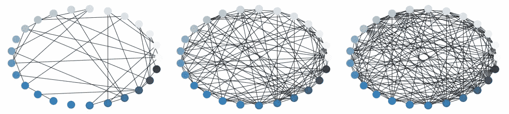
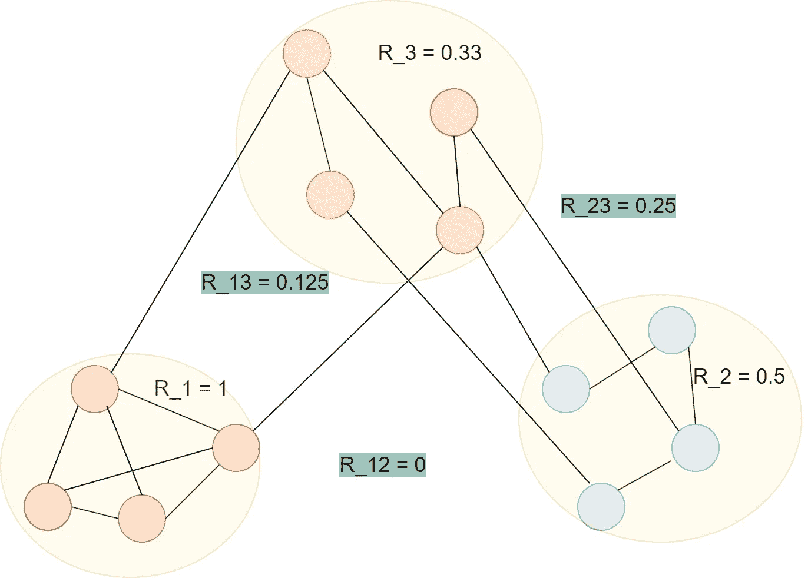
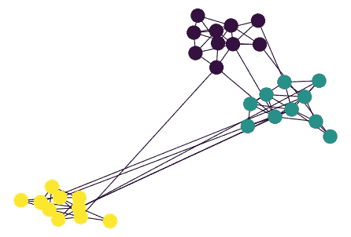
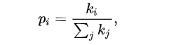
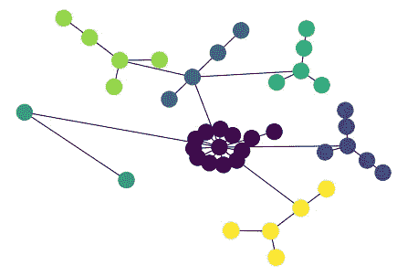

# 基于 NetworkX 的生成图模型

> 原文：<https://towardsdatascience.com/generative-graph-models-with-networkx-727b154ceda4?source=collection_archive---------24----------------------->

## 标准生成图方法的综合指南及其在 NetworkX 中的实现

奥马尔·弗洛雷斯在 [Unsplash](https://unsplash.com?utm_source=medium&utm_medium=referral) 上拍摄的照片

# 相关文章

*   [图形表示学习入门](/introduction-to-graph-representation-learning-a51c963d8d11)
*   [消息传递神经网络简介](/introduction-to-message-passing-neural-networks-e670dc103a87)
*   [图的特征提取](/feature-extraction-for-graphs-625f4c5fb8cd)
*   [图上的机器学习任务](/machine-learning-tasks-on-graphs-7bc8f175119a)
*   [走向可解释图神经网络](/towards-explainable-graph-neural-networks-45f5e3912dd0)
*   [图形神经网络的 10 大学习资源](/top-10-learning-resources-for-graph-neural-networks-f24d4eb2cc2b)

你听说过诸如 [GANs](https://en.wikipedia.org/wiki/Generative_adversarial_network) 或 [VAEs](https://en.wikipedia.org/wiki/Autoencoder#Variational_autoencoder_(VAE)) 这样的生成方法吗？这些聪明的架构允许我们对复杂的分布进行建模，并生成令人信服的数据样本，这些样本几乎无法与真实数据区分开来。

生成方法在图形数据中也有应用。在本文中，我们将研究 3 种流行的方法，这些方法用于生成具有不同属性(如节点度或节点社区)的图。我们还将看看它在 NetworkX 包中各自的实现。我们开始吧！

*注意:你可以在这里* *运行这篇文章的 Colab 笔记本* [*。*](https://github.com/KacperKubara/ml-cookbook/blob/master/graph_generation/graph_generation_networkx.ipynb)

# erdős–rényi 模型

ER 模型是最流行和最简单的图形生成方法之一。该模型的主要思想是为两个节点之间的边设置统一的概率阈值。总的来说，该型号有两种变型[和](https://en.wikipedia.org/wiki/Erd%C5%91s%E2%80%93R%C3%A9nyi_model#Definition)，但主要的一种可以定义如下:

ER 模型定义[1]。 **A** 是邻接矩阵，u，V 是图中的节点 *V* 。可以解释为两个任意且不同的节点*之间的边的概率 ***r*** 。*

上面的等式意味着:为出现在两个任意且不同的节点之间的边设置一个概率。 *r* 越高，连通图越密。

从 NetworkX 包中用`nx.erdos_renyi_graph`函数生成 *ER* 图相当容易:

下面，我绘制了 3 个随机生成的图，概率分别为 0.1、0.3 和 0.5。

使用 NetworkX 软件包用 ER 模型生成的图形。 **r** 分别设置为 0.1、0.3、0.5。作者创建的图像。

虽然 ER 生成的图简单且计算快速，但是我们不能用这种方法来建模更复杂的图结构。使用 ER，不可能用图来建模主题、程度分布或社区。现在，我们将朝着能够在一定程度上模拟这些属性的更复杂的模型前进。

# 随机块模型

SBM 模型进一步发展了 ER 生成的概念。它为在某个社区(即节点集群)内的节点和来自不同社区的节点之间的节点定义了唯一的概率。

如果这还不太清楚，让我们看一个简单的例子，看看它是如何产生的。

对于 SBM，我们对每个集群内的节点和属于不同集群的节点有单独的概率。在此图中，绿色数字是出现在两个不同分类之间的边缘概率。每个集群内的数字是同一社区内节点的边概率。作者创建的图像。

我们看到概率是为每个社区和一对不同的社区定义的。*值得注意的是，如果所有的概率都相等，SBM 就会退化为一个简单的 ER 模型。*

我们可以将模型定义如下[1]:

1.  图 *V* 中的每个节点 *u* 属于某个社区 Ci，其中 i∈(0，…，γ)，γ为社区总数
2.  对于每个节点 *u ∈ Ci* 和 *v* ∈ Cj，存在一个边的概率，使得:

属于社区 **i** 和**j**的两个节点之间的边的概率这里， **A** 是邻接矩阵，**C(**γ**x**γ**)**是具有所有社区对的概率的概率矩阵。

其中 **A** 是邻接矩阵， **C** (大小为γ x γ) 是所有社区对的概率矩阵。

我们也可以使用 NetworkX 来创建 SBM 生成的图形。我们需要的只是一个`nx.stochastic_block_model`函数和一些其他实用程序来很好地绘制它。

在上述脚本的最后，您可以看到我为 3 个不同的集群设置了社区大小，以及一个 community_probs 矩阵，该矩阵设置了这些集群的概率(对角线值是每个集群内的边缘概率)。用提供的 [Colab 笔记本](https://github.com/KacperKubara/ml-cookbook/blob/master/graph_generation/graph_generation_networkx.ipynb)随意试验这些值。对于代码中可以找到的默认值，我得到了下图:

使用 NetworkX 生成的图形。作者创建的图像。

这种模型有许多变体。一些例子可能包括用于二部图或具有节点特征的图的 SBM 方法[1]。

# 巴拉巴希-艾伯特模型

真正的网络可以随着时间的推移而增长。这些网络的一些例子可以包括 Twitter 追随者的增加或论文引用的增长。这些网络的一个重要属性是，一些高度连接的节点将吸引更多的连接，甚至增长得更快。例如，某些 Twitter 账户拥有 10 万以上的关注者，增长速度比普通账户快得多，或者某些研究论文被引用 1000 次以上，但它们仍然比不太受欢迎的文献被广泛引用。

网络成长和优先依附这两个属性是巴拉巴希-艾伯特模型(BA)的基础。该模型试图在遵循优先连接增长的同时，迭代地向现有网络添加节点。这种迭代方法将这种技术与 erdős–rényi 和随机块模型区分开来，后者一次生成图形。

这种 BA 算法工作如下。最初，我们有 *m_0* 个节点，这些节点至少有一个到其他节点的链接[3]。然后，我们迭代地添加一定数量的新节点，这些新节点与其他节点有 *m* 个链接。这里， *m* 需要小于 *m_0。*新节点与图中节点 *i* 连接的概率定义为 *pi:*

新节点和节点 **i** 之间的连接概率。 **ki** 定义了节点 **i** 的度。

其中 *ki* 定义了节点 *i* 的度。

节点度的分布遵循一个[幂律](https://en.wikipedia.org/wiki/Power_law)分布:

这正是我们想要的，因为这意味着吸引许多连接的节点有非零(但仍然相当小)的概率。因此，我们应该期待在我们的网络中有少量高度连接的节点。

我们可以使用 Networkx 生成 BA 模型的图形。负责 BA 模型的函数称为`nx.generators.random_graphs.barabasi_albert_graph`。请注意，我隐藏了一些绘图函数的实现，以避免文章混乱。完整的代码可以在这里找到[。](https://github.com/KacperKubara/ml-cookbook/blob/master/graph_generation/graph_generation_networkx.ipynb)

使用上面的脚本，我们可以生成 BA 图。如果我们将它与之前的随机块模型进行比较，我们可以看到现在我们的节点具有不同数量的连接。我们还可以观察到，一个节点比任何其他节点有更多的连接。

使用 NetworkX 生成的 BA 图。作者创建的图像。

# 总结

在本文中，我们已经看到了 3 种标准的生成图方法:erdős–rényi、随机块和 Barabási-Albert 模型。ER 模型使用最简单的方法来生成节点之间具有统一连接概率的图。SBM 方法进一步发展了这一思想，允许对每个社区内的节点连接以及不同社区对之间的连接分别建模。最后，BA 模型能够使用幂律分布和添加新节点的迭代方法在节点之间生成不同数量的连接。

图形生成模型还有一个有趣的领域，它使用深度学习来生成图形。这个会出现在下一篇文章里！

# 关于我

我是阿姆斯特丹大学的人工智能硕士学生。在我的业余时间，你可以发现我摆弄数据或者调试我的深度学习模型(我发誓这很有效！).我也喜欢徒步旅行:)

如果你想了解我的最新文章和其他有用的内容，以下是我的其他社交媒体资料:

*   [领英](https://www.linkedin.com/in/kacperkubara/)
*   [GitHub](https://github.com/KacperKubara)

# 参考

[1] [林子幸·汉密尔顿《图形表示学》一书](https://www.cs.mcgill.ca/~wlh/grl_book/)

[2] [社区检测和随机块模型:最近的发展](https://www.jmlr.org/papers/volume18/16-480/16-480.pdf)

[3] [网络科学书，第五章](http://networksciencebook.com/chapter/5)