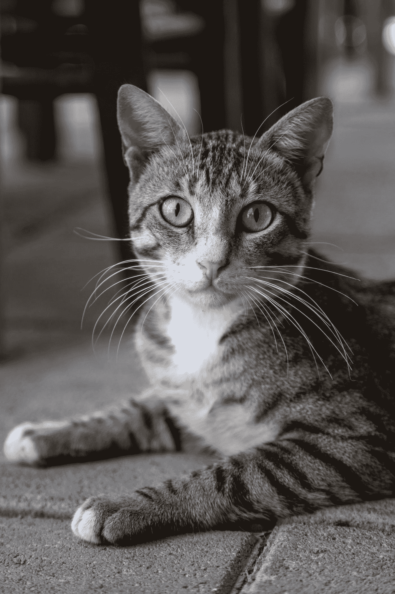

# 生成网络:从 AE 到 VAE 到 GAN 到 CycleGAN

> 原文：<https://towardsdatascience.com/generative-networks-from-ae-to-vae-to-gan-to-cyclegan-b21ba99ab8d6?source=collection_archive---------3----------------------->

## [入门](https://towardsdatascience.com/tagged/getting-started)

## 生成网络进化指南

由[安德斯·吉尔登](https://unsplash.com/@andersjilden?utm_source=medium&utm_medium=referral)在 [Unsplash](https://unsplash.com?utm_source=medium&utm_medium=referral) 上拍摄的照片。

# 介绍

简而言之，生成网络背后的核心思想是捕捉数据的底层分布。这种分布不能直接观察到，但必须从训练数据中近似推断出来。多年来，出现了许多旨在生成类似于输入样本的数据的技术。

这篇文章打算给你一个进化的概述，从自动编码器开始，描述它的后代，变化的自动编码器，然后看一下 GAN，最后以作为 GAN 设置的扩展的 CycleGAN 结束。

# 自动编码器

早期的深度生成方法使用自动编码器[1]。这些网络旨在压缩低维潜在空间 *z* 中的底层分布，例如，通过连续减小层尺寸。这些低维表示充当瓶颈，并迫使网络学习紧凑的表示。

自动编码器的示意图；作者在[2]之后创作的。左边是原始的领域空间，真实的样本是从那里抽取的；右边是重建的输入。中间视觉上较小的块代表瓶颈层，用于强制数据压缩。

网络的第一部分是编码器部分，它将特征映射(编码)到上述低维潜在空间。这种编码自动发生，因此称为**自动**编码器。从这个编码表示中，解码器部分试图重建原始数据。这是一种无监督的技术，因为真实样本 *x* 和生成样本*x’*可以直接比较，不需要标签信息。

潜在空间 z 的大小影响输出质量；更大的空间产生更精确的重构样本*x’*。然而，解码器没有真正的生成能力(例如，它只能 **re** 构造样本，而不是发明它们)。

## 技术现状

用重构损失训练网络[2]

自动编码器的构造损失，根据其相似性将原始样本和重构样本配对。

其在输入样本 *x* 和重构样本*x’*之间的距离为零时最小。在这种情况下，网络实现了完美的重构。

想象一只猫的图片:你把它喂给模型，得到的猫越像你的输入，这个模型就越好。毕竟，你想认出你的宠物，不是吗？

一只猫。马蒂纽·拉马丹在 [Unsplash](https://unsplash.com?utm_source=medium&utm_medium=referral) 上拍摄的照片

# 可变自动编码器

这些生成能力可以通过调整潜在空间 *z* ，变化自动编码器(VAE)背后的思想【2，3，4，5；更多资源:链接 [1](https://www.jeremyjordan.me/variational-autoencoders/) ，链接 [2](https://jaan.io/what-is-variational-autoencoder-vae-tutorial/) 。

变型自动编码器的示意图，由作者在[2]之后创建。与标准自动编码器设置的关键区别在于对潜在空间的修改，潜在空间被分成均值向量μ和标准差向量σ，这是大多数概率分布的参数。

与自动编码器类似，它由编码器部分和解码器部分组成。编码器学习输入数据的平均值μ和标准偏差σ，它为瓶颈层中的每个维度建模概率分布。在编码过程中，从潜在空间中抽取样本。采样层之后的输出是均值向量μ和偏差向量σ [2]之和。随机性(换句话说，创造力)是通过用随机常数η移动μ和缩放σ引入的，随机常数η来自正态分布。这种(重新)参数化技巧将网络和概率部分分开，使反向传播照常进行[2]。

请这样想:

你想(再次)处理猫的图像。不是简单地让网络压缩图片，而是让它学习输入样本的特征。这可能是毛发的厚度、尾巴的长度、毛发的颜色、耳朵的大小等等。这就是为什么我们将μ和σ作为向量:对于每个特征(毛发、耳朵、尾巴等)。)，我们对概率分布建模，了解属性的值(例如尾部长度)有多可能。生成一个样本，然后混合这些属性，生成一个新的猫图像——也许是一个未知的种族？

另一只猫。由 [Milada Vigerova](https://unsplash.com/@milada_vigerova?utm_source=medium&utm_medium=referral) 在 [Unsplash](https://unsplash.com?utm_source=medium&utm_medium=referral) 上拍摄的照片

为了防止网络记住其输入样本，正则化项被添加到损失函数 *L* 中，即 Kullback-Leibler 散度。这种差异允许在两个概率分布之间进行比较；在 VAE 的设定中，它被用来“在潜在空间的中心周围平均分配编码(这将是我们的猫的属性)”[2]，从而防止记忆。这里，潜在空间被理解为概率分布，并与先验分布相比较，假设分布产生真实样本 *x* 。这通常是一个单位高斯分布，均值为 0，方差为 1。

先验分布捕获了我们对数据可能如何分布的假设。通常，您希望这尽可能不包含信息，因此使用标准高斯。对于猫的设置，我们的分布可能会说尾巴不长于 20 厘米，或者猫的耳朵通常在 5 到 10 厘米高之间。

## 技术现状

基本的 VAE 架构利用了两个损耗。第一个是重建损失，如自动编码器设置中的损失，第二个是正则化项，即前面提到的 Kullback-Leibler 散度。这种差异来自概率理论，用于导出概率分布的参数(如平均值或方差)。这符合必须学习这些参数的 VAE 设置。当且仅当两个概率分布相等时(换句话说，当两个随机变量 Y₁和 Y₂相等时)，这里使用的散度函数为 0，否则更大。

将 KL 散度加到损失上，使得潜在空间更接近所选择的先验。对于基本的 VAE，这个先验实际上局限于高斯分布。给定网络的潜在分布和这个先验，我们有[2，3]:

其中φ，θ是编码器和解码器的参数(权重)， *R* 是已知的重建损失， *KL* 是 Kullback-Leibler 散度。当重构样本与输入样本没有区别时，以及当学习的潜在概率分布等于固定的先验时，这种损失最小。

# 生成对抗网络

在给定数据集之后对人工样本进行建模可以直接通过将真实数据与生成的数据进行比较来完成，或者间接通过利用下游任务来完成，下游任务反过来使网络能够生成真实样本。对于直接方法，可以使用最大平均差异，这超出了本文的范围；例如，参见[7]了解更多信息。

生成对抗网络(GANs) [8]背后的技术依赖于间接比较。在这个框架中，两个网络被联合训练:生成器被训练从噪声中生成人工样本，看起来尽可能真实；鉴别器试图将它们与真实样本区分开来。

噪声输入是真实数据分布的先验，类似于 VAE 设置中的高斯先验。生成器学习一个函数，该函数将这个简单分布(白噪声)转换为代表所需数据的复杂分布。这个转换函数是一个复杂的函数(意思是“不简单”)，神经网络已经证明它学习得非常好；网络权重是函数的参数。鉴别器是生成器的对手，深度神经网络将其输入映射到单个标量，输出输入是真实样本的概率。

GAN 框架的示意图，由作者在[2]之后创建。左边是学习从噪声到目标域的变换的生成器部分，右边是鉴别器部分，将这样生成的假样本与真实数据样本区分开。

这个过程可以看作是两个玩家的 min-max 博弈。这个博弈中的均衡状态是生成器生成不可区分的假样本，鉴别器始终返回 0.5，*即*，猜测。在[8]中的算法 1 中描述了训练过程:首先，为 *k* 步更新鉴别器，然后更新发生器的权重。最后一次更新是通过提升梯度进行的；因为目的是欺骗鉴别器(*，即*，增加误差)，所以必须采用梯度的上升。反向传播更新变换函数的权重，该权重随着时间的推移接近期望的分布。

为了使鉴别器不仅了解真实和虚假样本之间的区别，而且了解真实数据的分布，它在训练期间看到虚假样本和真实样本对。这反过来使生成器能够创建更逼真的样本。

对于猫的设定，我们可以收集我们的宠物的各种图像，这些是真实的样本。从噪声开始，生成器在鉴频器结果的指导下，连续生成更好的样本。这些猫的照片一开始可能看起来很模糊，但随着时间的推移，它们变得越来越真实。鉴别者通过看到真实的猫和生成的猫来判断我们生成图像的质量(即真实性)。

一只真正的猫，不是人工生成的！照片由[桑吉亚](https://unsplash.com/@sangia?utm_source=medium&utm_medium=referral)在 [Unsplash](https://unsplash.com?utm_source=medium&utm_medium=referral) 上拍摄

## 技术现状

其思想是生成一个概率分布，该概率分布模拟来自目标域的底层分布。为了实现这一点，定义了网络输入上的先验*p _ z*[8]，其中 *z* 是来自该空间的样本。生成网络 *G* 作为转化函数，将简单的先验分布转化为复杂的分布。与鉴别器一起，两者都遵循

在这个两人游戏中，生成器试图最小化它产生的错误(因此 *min* )，鉴别器被训练以最大化它的分类精度(因此 *max* )。

# CycleGAN

使用 CycleGAN 对 GAN 框架进行了扩展[9]。这种方法最初出现是为了解决图像到图像的转换问题，其中输入图像来自一个域(*例如*，白天)，而期望的输出来自另一个域(*例如*，夜晚)。以前的方法需要成对图像{mountain_day，mountain_night}的详尽且昂贵的数据集，这对于更复杂的域改变是禁止的。其次，生成过程容易出现模式崩溃，所有输入样本都被映射到一个单一的输出样本[10]；这拖延了训练。

CycleGAN 方法在 set 级别上解决了这个任务；它从域 *X* 和域 *Y* 获取不成对的数据集，不需要白噪声输入。CycleGAN 网络旨在双向学习这两个领域之间的潜在关系。域转移*X*∑*X*→*Y*∑*Y*由生成器 *G* 完成，而转移 *y* → *x* 由 *F* 完成:

CycleGAN 框架的示意图；作者在[2]之后创作的。左边的鉴别器 D_x 学习区分域 X 的真实样本和 f 产生的虚假样本，右边的鉴别器 D_y 学习区分域 Y 的真实数据和 g 产生的虚假样本。

现在，对于我们奔跑的猫的例子，我们可以将我们的宠物“转化”成一只老虎。因此，我们收集猫和老虎的图像。一个生成器将我们的猫转换成老虎，另一个生成器负责向后的方向，从老虎创建一只猫。

为什么我们甚至需要这种倒退的方向？

为了防止模式崩溃:如果我们不能保证生成的输出是基于我们的输入图像，理论上我们可以总是返回相同的猫到老虎映射的图像。显然，这不会是完全错误的，但这并不是我们真正想要的。

这种转移的成功由*周期一致性损失*来保证(我认为这是非常聪明的事情):给定一个输入 *x* ，生成器 *G* 生成*y’*。第二发电机 *F* 变换*y’*→*x’*。理想情况下，在映射到 *Y* 域并返回——完成一个循环——*x’*与 *x* 相同。

循环一致性的实用性也可以在其他领域看到:将一个英语句子翻译成法语，然后再翻译回英语，应该会产生相同的原始句子[9]。

生成的数据(我们的 cat 图像)的“质量”由鉴别器 *D_y* 观察，该鉴别器区分真 *y* 样本和假 *y* 样本。第二次映射的质量由 *D_x* 观察，它区分真实样本 *x* 和生成的样本。总损耗包括两个发生器-鉴别器[8]对的损耗和循环一致性损耗。最后一个损耗通过将每个输入强制为一个互斥输出来防止上述模式崩溃。

对于我们的猫-老虎设置，我们有一个专家来区分猫和假猫，还有一个专家来区分老虎和假老虎。鉴别器与生成器(如果这是一个词的话)一起工作:猫与假猫鉴别器越好，老虎→猫生成器越好；另一个方向也类似。这就是为什么甘的设定可以被看作是一个双人游戏。

## 技术现状

扩展 GAN 设置，一个 CycleGAN 可以被视为学习两个复杂的变换函数:从分布 *A* 到 *B* ，以及从 *B* 到 *A* 。

# 摘要

深度神经网络的生成能力已经发展了几年，早期的方法使用自动编码器框架。在此基础上，变分自动编码器通过从潜在空间中随机采样来增加更强的生成能力。当[8]提出生成对抗网时，实现了一个里程碑，使得模型能够学习从噪声到目标域的转换。CycleGAN 框架通过使用两个生成器和两个鉴别器来保留样本中包含的原始信息，从而扩展了这种方法。

回顾一下，要点是

*   自动编码器压缩并重建它们的输入
*   可变自动编码器增加了更多的生成技术
*   GANs(最初)使用白噪声作为输入来生成数据
*   CycleGANs 扩展了 GAN 概念，使训练更加稳定

这个帖子到此为止。如有任何更正、评论或意见，请留言。感谢阅读！

## 文献学

如果您想了解更多信息，请参考以下资源:

[1] G. Hinton 和 R. Salakhutdinov，[用神经网络减少数据的维数](https://science.sciencemag.org/content/sci/313/5786/504.full.pdf?casa_token=-WzhRmRfnroAAAAA:9YAoD3RHV321aajJ4RipJc3OIaul-a5epNc382msaQZBKWa262zQ0aHNXnBOYaqg_TOSx0ukdnU) (2006)，科学

[2] A. Amini 和 A. Soleimany，[深度学习介绍:深度生成模型](http://introtodeeplearning.com/2020/slides/6S191_MIT_DeepLearning_L4.pdf) (2020)，麻省理工学院演讲

[3] D. Kingma 和 M. Welling，[随机梯度 VB 和变分自动编码器](https://arxiv.org/abs/1312.6114v7) (2014)，第二届学习表征国际会议，ICLR

[4] D. Rezende *等*，[深度生成模型中的随机反向传播和近似推理](https://arxiv.org/abs/1401.4082) (2014)，第 31 届机器学习国际会议论文集(ICML)

[5] X .陈*等*。，[变分有损自动编码器](https://arxiv.org/abs/1611.02731) (2017)，arXiv

[6] A. Valenti *等人*，[通过对抗性自动编码器学习风格感知的符号音乐表示](https://arxiv.org/abs/2001.05494) (2020)，第 24 届欧洲人工智能会议(ECAI2020)

[7] A. Gretton *等*，[双样本问题的核方法](https://proceedings.neurips.cc/paper/2006/file/e9fb2eda3d9c55a0d89c98d6c54b5b3e-Paper.pdf) (2007)，神经信息处理系统进展

[8] I. Goodfellow *等*，[生成对抗网络](https://papers.nips.cc/paper/2014/file/5ca3e9b122f61f8f06494c97b1afccf3-Paper.pdf) (2014)，神经信息处理系统进展

[9]朱*等*，[利用循环一致对抗网络的不成对图像到图像翻译](https://arxiv.org/abs/1703.10593v3) (2017)，IEEE 计算机视觉国际会议论文集

[10] Ian Goodfellow，NIPS 2016 教程:[生成对抗网络](https://arxiv.org/abs/1701.00160) (2016)，arXiv