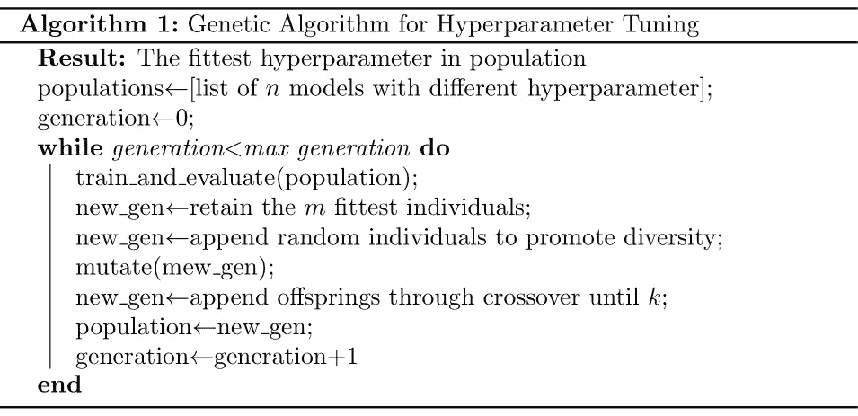
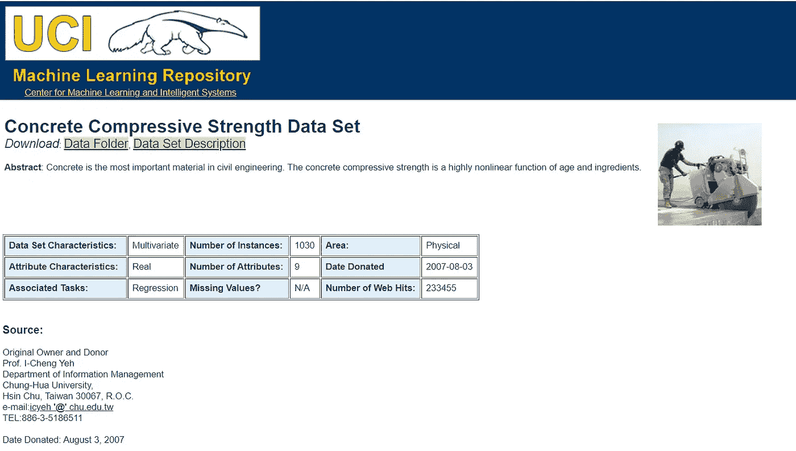
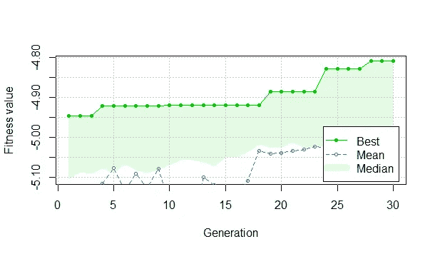
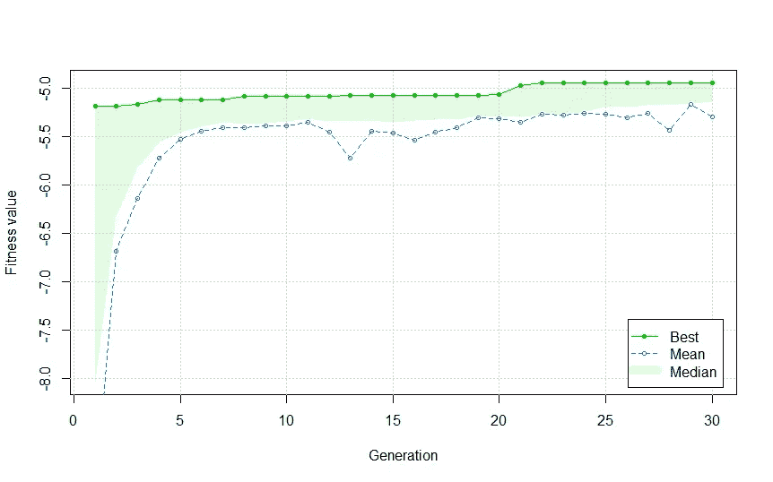

# R:超参数整定中的遗传算法

> 原文：<https://towardsdatascience.com/genetic-algorithm-in-r-hyperparameter-tuning-5fc6439d2962?source=collection_archive---------6----------------------->


由[马库斯·斯皮斯克](https://unsplash.com/@markusspiske?utm_source=medium&utm_medium=referral)在 [Unsplash](https://unsplash.com?utm_source=medium&utm_medium=referral) 上拍摄的照片

## 在 R 中使用遗传算法调整模型的超参数

**动机**

监督学习成为机器学习(ML)领域的主要任务之一，其中监督学习本身的目标是在给定数据中的特征/自变量的情况下预测目标/因变量。近年来研究的最大似然法的研究课题之一是**超参数调整**。

我们可以用于超参数调整的一种流行技术是使用网格搜索(GS)算法。尽管 GS 是 ML 中超参数调整的一种流行算法，但当涉及大型数据集和/或多个超参数时，它非常耗时且计算量大。为此，开发了几种替代技术，其中之一是使用遗传算法。在这篇文章中，我将告诉你如何在 r 中使用遗传算法来调整你的超参数。

**那么，什么是超参数调谐呢？**

ML 模型中超参数的调整会极大地影响其预测性能，因此为模型设置合适的超参数非常重要。传统上，ML 模型中的超参数调整通常通过试错过程来执行。根据 ML 模型中存在的超参数的数量，这个过程可能会非常耗时，尤其是当我们处理大量数据时。

超参数调整问题通常被视为优化问题，其中我们想要优化的目标函数是模型本身的预测性能。超参数调优[3]中经常遇到的挑战如下。

1.  一个数据集中的超参数设置可能会导致高预测性能，但在另一个数据集中可能不会。
2.  超参数有时是相互依赖的，例如随机森林中的`ntree`(树的数量)和`mtry`(随机选择的变量的数量)。
3.  耗时的超参数调整过程。

**超参数整定的遗传算法**

遗传算法的思想是通过选择最佳或最合适的解以及罕见和随机的突变发生来获得目标函数的最优解。对于那些想了解算法如何工作的人，我在这里写了一篇解释算法概念的文章[。](/genetic-algorithm-in-r-the-knapsack-problem-3edc5b07d4a7)

在这种情况下，由于我们想要调整 ML 模型上的超参数，因此该算法中使用的“群体”是具有不同超参数值的模型列表。用于超参数调整的遗传算法的伪代码如下所示。



遗传算法超参数整定伪代码(图片由作者提供)

**案例分析**

在本文中，我使用 UCI 机器学习库中的混凝土抗压强度数据集实现了超参数调整的遗传算法。该数据集的目标是预测混凝土抗压强度值，因此存在回归问题。



混凝土抗压强度数据集(图片取自 [UCI 机器学习库](https://archive.ics.uci.edu/ml/datasets/Concrete+Compressive+Strength))

变量信息如下。

1.  水泥(成分 1) —定量—m3 混合物中的千克数—输入变量
2.  高炉矿渣(成分 2) —定量—m3 混合物中的千克数—输入变量
3.  飞灰(成分 3) —定量—m3 混合物中的千克数—输入变量
4.  水(成分 4) —定量—m3 混合物中的千克数—输入变量
5.  超塑化剂(成分 5) —定量—m3 混合物中的千克数—输入变量
6.  粗骨料(成分 6) —定量—m3 混合物中的千克数—输入变量
7.  细骨料(成分 7) —定量—m3 混合物中的千克数—输入变量
8.  年龄—定量—天数(1~365) —输入变量
9.  混凝土抗压强度—定量— MPa —输出变量

对于这种情况，我使用随机森林(对于离散值超参数情况)和梯度推进(对于实值超参数情况)模型。

**数据预处理**

首先，我们导入我们需要的数据和库。

```
library(car)
library(MASS)
library(tseries)
library(lmtest)
library(tidyverse)
library(GA)
library(mice)
library(caret)
library(caTools)
library(rsample)
library(gbm)
library(glmnet)
library(tictoc)
library(randomForest)#Data Importing
data=read.csv("data_input/Concrete_Data.csv",sep=';')
summary(data)
str(data)
```

我们按如下方式检查数据汇总。

```
> str(data)
'data.frame': 1030 obs. of  9 variables:
 $ Cement                       : num  540 540 332 332 199 ...
 $ Blast.Furnace.Slag           : num  0 0 142 142 132 ...
 $ Fly.Ash                      : num  0 0 0 0 0 0 0 0 0 0 ...
 $ Water                        : num  162 162 228 228 192 228 228 228 228 228 ...
 $ Superplasticizer             : num  2.5 2.5 0 0 0 0 0 0 0 0 ...
 $ Coarse.Aggregate             : num  1040 1055 932 932 978 ...
 $ Fine.Aggregate               : num  676 676 594 594 826 ...
 $ Age                          : int  28 28 270 365 360 90 365 28 28 28 ...
 $ Concrete.compressive.strength: num  80 61.9 40.3 41 44.3 ...
```

然后，我们使用来自`mice`库的`md.pattern`检查数据集中是否存在缺失值，如下所示。

```
> md.pattern(data)
 /\     /\
{  `---'  }
{  O   O  }
==>  V <==  No need for mice. This data set is completely observed.
 \  \|/  /
  `-----'Cement Blast.Furnace.Slag Fly.Ash Water Superplasticizer Coarse.Aggregate Fine.Aggregate Age
1030      1                  1       1     1                1                1              1   1
          0                  0       0     0                0                0              0   0
     Concrete.compressive.strength  
1030                             1 0
                                 0 0
```


缺失的价值分析(图片由作者提供)

我们可以看到没有丢失的值，所以我们可以进入下一步了。然后，我们将数据分成 70:30 比例的训练和测试数据，如下所示。

```
#Data Splitting
split=initial_split(data,prop=0.7)
data.train=training(split)
data.test=testing(split)
```

**实施(离散值超参数)**

对于离散值超参数的情况，我们使用随机森林模型，我们想要调整的超参数是`ntree`和`mtry`。由于`ntree`和`mtry`是离散值超参数，我们在优化过程中使用二进制编码。在这里，我将`ntree`的范围设置为 1 到 512，将`mtry`的范围设置为 1 到 8(您可以设置一个更大的范围，但请记住随机森林非常耗时，所以只要您有耐心等待，就继续吧)。为了检查我们需要多少位，我们可以通过将每个超参数的最大值相乘并将其与超参数的数量相加来计算，如下所示。

```
> log2(512*8)+2
[1] 14
```

根据上面的计算，我们需要 14 位。如果`ntree`和`mtry`的转换值为 0，我们将其改为 1(因为最小值范围为 1)。然后，如果`ntree`的转换值大于 512，我们就把它改成 512(因为最大值范围是 512)。同样，如果`mtry`的转换值大于 8，我们将其更改为 8(因为最大值范围是 8)。接下来，我们创建想要实现的目标函数。**记住，遗传算法的目的是最大化目标值，我们希望 RMSE 值尽可能小，因此我们将 RMSE 值设置为负值**。

```
fit_rf=function(x)
{
  ntree=binary2decimal(x[1:10]) #ntree from 1 to 2^9
  mtry=binary2decimal(x[11:14]) # mtry from 1 to 2^3
  if(ntree==0)
  {
    ntree=1
  }
  if(mtry==0)
  {
    mtry=1
  }
  if(ntree>512)
  {
    ntree=512
  }
  if(mtry>8)
  {
    mtry=8
  }
  model=randomForest(Concrete.compressive.strength~.,data=data.train,mtry=mtry,
            ntree=ntree)
  predictions=predict(model,data.test)
  rmse=sqrt(mean((data.test$Concrete.compressive.strength-predictions)^2))
  return(-rmse) #since GA maximize the objective function and we want to minimize RMSE
}
```

现在，让我们通过编写这几行代码来看看如何将其实现为`ga`函数。

```
tic()
GA3=ga(type='binary',fitness=fit_rf,nBits=14,
       maxiter=30,popSize=50,seed=1234,keepBest=TRUE)
summary(GA3)
plot(GA3)
toc()
```



随机森林超参数调谐结果的遗传算法(图片由作者提供)

```
> tic()
> GA3=ga(type='binary',fitness=fit_rf,nBits=14,
+        maxiter=30,popSize=50,seed=1234,keepBest=TRUE)
GA | iter = 1 | Mean = -5.277882 | Best = -4.946697
GA | iter = 2 | Mean = -5.152451 | Best = -4.946697
GA | iter = 3 | Mean = -5.182143 | Best = -4.946697
GA | iter = 4 | Mean = -5.115866 | Best = -4.921109
GA | iter = 5 | Mean = -5.075498 | Best = -4.921109
GA | iter = 6 | Mean = -5.132925 | Best = -4.921109
GA | iter = 7 | Mean = -5.089994 | Best = -4.921109
GA | iter = 8 | Mean = -5.126774 | Best = -4.921109
GA | iter = 9 | Mean = -5.078846 | Best = -4.921109
GA | iter = 10 | Mean = -5.163979 | Best = -4.919853
GA | iter = 11 | Mean = -5.205034 | Best = -4.919853
GA | iter = 12 | Mean = -5.207537 | Best = -4.919853
GA | iter = 13 | Mean = -5.098879 | Best = -4.919853
GA | iter = 14 | Mean = -5.118728 | Best = -4.919853
GA | iter = 15 | Mean = -5.202860 | Best = -4.919853
GA | iter = 16 | Mean = -5.145285 | Best = -4.919853
GA | iter = 17 | Mean = -5.107588 | Best = -4.919853
GA | iter = 18 | Mean = -5.032939 | Best = -4.919853
GA | iter = 19 | Mean = -5.041192 | Best = -4.885373
GA | iter = 20 | Mean = -5.039374 | Best = -4.885373
GA | iter = 21 | Mean = -5.034047 | Best = -4.885373
GA | iter = 22 | Mean = -5.030971 | Best = -4.885373
GA | iter = 23 | Mean = -5.023164 | Best = -4.885373
GA | iter = 24 | Mean = -5.026200 | Best = -4.829599
GA | iter = 25 | Mean = -5.077859 | Best = -4.829599
GA | iter = 26 | Mean = -5.080206 | Best = -4.829599
GA | iter = 27 | Mean = -5.033013 | Best = -4.829599
GA | iter = 28 | Mean = -5.071353 | Best = -4.809166
GA | iter = 29 | Mean = -5.057733 | Best = -4.809166
GA | iter = 30 | Mean = -5.048505 | Best = -4.809166
> summary(GA3)
-- Genetic Algorithm -------------------GA settings: 
Type                  =  binary 
Population size       =  50 
Number of generations =  30 
Elitism               =  2 
Crossover probability =  0.8 
Mutation probability  =  0.1GA results: 
Iterations             = 30 
Fitness function value = -4.809166 
Solution = 
     x1 x2 x3 x4 x5 x6 x7 x8 x9 x10  ...  x13 x14
[1,]  0  0  0  1  0  1  0  1  0   0         0   1
> plot(GA3)
> toc()
1101.77 sec elapsed
```

我们可以看到最合适的`ntree`和`mtry`值如下。

```
> ga_rf_fit=as.data.frame(GA3@bestSol)
> ga_ntree=apply(ga_rf_fit[, 1:10],1,binary2decimal)
> ga_mtry=apply(ga_rf_fit[, 11:14],1,binary2decimal)
> ga_ntree
[1] 76
> ga_mtry
[1] 4
```

从上面的结果来看，每一代中最好的个体产生的 RMSE 在每一代中是递减的，其中最终一代中的最适结果为 76 个`ntree`和 4 个`mtry`，RMSE 值为 4.809166。

**实现(实值超参数)**

对于实值超参数的情况，我们使用梯度增强模型，我们想要调整的超参数是`n.trees`、`shrinkage`和`interaction.depth`。请注意，`n.trees`和`interaction.depth`是离散值超参数，因此技巧是将底值函数应用于模型函数中的`n.trees`和`interaction.depth`值，如下所示。

```
fit_gbm=function(ntree,shrinkage,interaction)
{
  model=gbm(Concrete.compressive.strength~.,data=data.train,distribution="gaussian",
            n.trees=floor(ntree),shrinkage=shrinkage,interaction.depth=floor(interaction))
  predictions=predict(model,data.test)
  rmse=sqrt(mean((data.test$Concrete.compressive.strength-predictions)^2))
  return(rmse)
}
```

然后，我们将目标函数实现到`ga`函数中，如下所示。

```
tic()
GA2=ga(type='real-valued',fitness=function(x) -fit_gbm(x[1],x[2],x[3]),
      lower=c(1,1e-4,1),upper=c(512,1e-1,3),maxiter=30,popSize=50,seed=1234,keepBest=TRUE)
summary(GA2)
plot(GA2)
toc()
```



遗传算法梯度增强超参数调谐结果(图片由作者提供)

```
> summary(GA2)
-- Genetic Algorithm -------------------GA settings: 
Type                  =  real-valued 
Population size       =  50 
Number of generations =  30 
Elitism               =  2 
Crossover probability =  0.8 
Mutation probability  =  0.1 
Search domain = 
       x1    x2 x3
lower   1 1e-04  1
upper 512 1e-01  3GA results: 
Iterations             = 30 
Fitness function value = -4.939432 
Solution = 
           x1         x2       x3
[1,] 470.8652 0.08298563 2.346486
> plot(GA2)
> toc()
72.26 sec elapsed
```

从上面的结果来看，每一代中最好的个体产生的 RMSE 在每一代中是递减的，其中最终一代中的最适结果为 470 `n.trees`，0.08298563 `shrinkage`，2 `interaction.depth`，RMSE 值为 4.939432。

**结论**

这就是了，你可以在 r 中实现超参数调整的遗传算法，你可以尝试不同的数据集，或者尝试在分类问题上实现它。此外，您可以尝试不同的预测性能指标来查看不同的结果。永远记住，ML 是一个广阔的领域，所以永远要尝试实验！

像往常一样，如果您有任何问题，请随时在我的联系人下面提问或讨论！在我的下一篇文章中再见！


说到超参数调谐…(从 [Imgflip](https://imgflip.com/memegenerator/136553931/This-Is-Brilliant-But-I-Like-This) 生成的图像)

**作者联系方式**

LinkedIn: [拉登·奥勒留和希卡·维亚迪努格罗霍](https://www.linkedin.com/in/raden-aurelius-andhika-viadinugroho-b84b19163/)

中:[https://medium.com/@radenaurelius](https://medium.com/@radenaurelius)

**参考文献**

[1]叶一成，[利用人工神经网络对高性能混凝土强度进行建模](https://www.sciencedirect.com/science/article/pii/S0008884698001653?casa_token=nFDSJdengYoAAAAA:R4u5J3Gaz53o0bgUxPw5l7xvteeOoyy8bZ5HV0BJ_zlxkJKNc57mya_bfd8udOditD-_yJ4zUlZU) (1998)，水泥与混凝土研究。

[https://rpubs.com/Argaadya/550805](https://rpubs.com/Argaadya/550805)

[3] Rafael G. Mantovani，Tomáhorváth，Ricardo Cerri，Joaquin Vanschoren，andéc . p . l . f . de Carvalho，[决策树归纳算法的超参数调整](https://ieeexplore.ieee.org/document/7839559/authors#authors) (2016)，2016 年第五届巴西智能系统会议。

[4][https://archive . ics . UCI . edu/ml/datasets/Concrete+抗压+强度](https://archive.ics.uci.edu/ml/datasets/Concrete+Compressive+Strength)

[5] Nikolaos Gorgolis，Ioannis Hatzilygeroudis，Zoltan·伊斯特尼斯，Lazlo — Grad Gyenne，[通过遗传算法优化 LSTM 网络模型的超参数](https://ieeexplore.ieee.org/abstract/document/8900675?casa_token=OMB3wgJ5fZAAAAAA:uS5b9WbudJLZMV_wFS0ElZfadj6RBcCvE17UzLXTjdh9A7Q-RPjsdqb1T_z1bRNi2_IO7jEIUqUjNl8) (2019)，2019 年第十届信息、智能、系统与应用国际会议(IISA)。

[6] Luca Scrucca，[GA:R](https://www.jstatsoft.org/article/view/v053i04)(2013)中的遗传算法包，统计软件杂志。

[7][https://www . rdocumentation . org/packages/GA/versions/3.2/topics/GA](https://www.rdocumentation.org/packages/GA/versions/3.2/topics/ga)