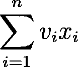
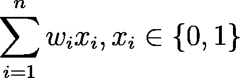
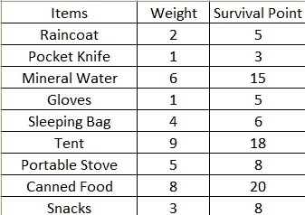
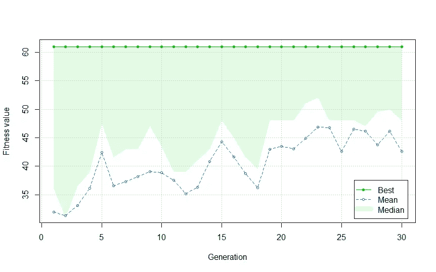
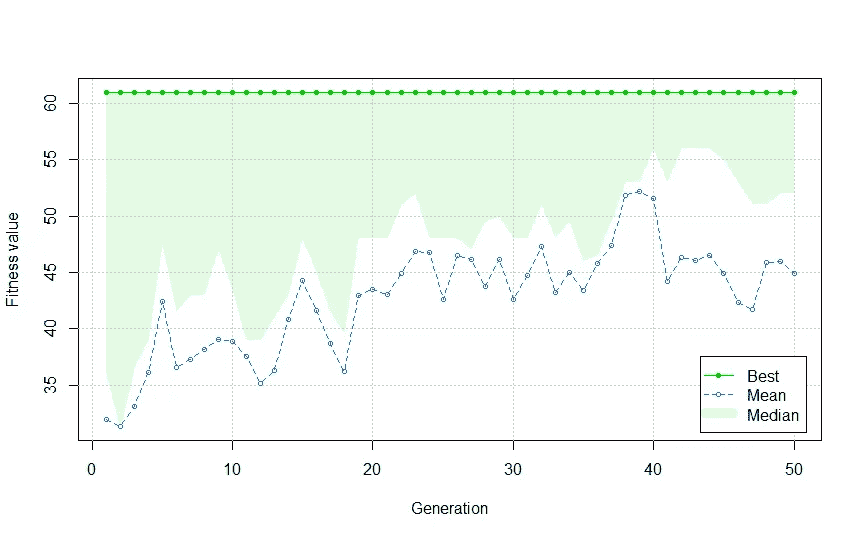
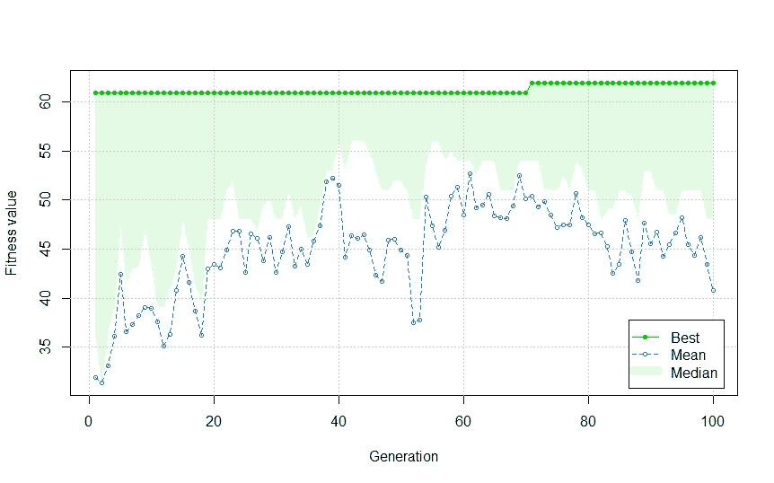

# R 中的遗传算法:背包问题

> 原文：<https://towardsdatascience.com/genetic-algorithm-in-r-the-knapsack-problem-3edc5b07d4a7?source=collection_archive---------5----------------------->


塞巴斯蒂安·戈德堡在 [Unsplash](https://unsplash.com?utm_source=medium&utm_medium=referral) 上的照片

## 用遗传算法求解 R 中的背包问题

**动机**

背包问题是最优化，特别是组合最优化中的著名问题之一。这个问题的动机来自于一个人需要最大化他的背包容量——因此得名——尽可能多的物品。有许多方法可以解决这个问题，但是在本文中，我将给出一个例子，使用 r。

**背包问题**

在本文中，我们将尝试解决的背包问题是**0–1 背包问题**。给定一组从 1 到 n 编号的 n 个项目，每个项目的权重为 w_i，值为 v_i。假设每个项目的副本限制为 1，即该项目要么包含在背包中，要么不包含在背包中。这里我们希望最大化目标函数(即背包中物品的价值)



其中目标函数服从约束函数



**遗传算法概念**

遗传算法是一种基于自然选择进化思想的优化算法。查尔斯·达尔文提出，自然选择进化是通过两个原则:自然选择和突变，来决定有多少种生物会适应环境而生存。基于这一概念，遗传算法的目标是**通过选择最佳或最合适的解决方案以及罕见的随机突变事件**来获得目标函数的最优解。算法本身可以解释如下。


遗传算法流程图(图片由作者提供)

1.  初始化我们将优化的数据和/或函数。
2.  初始化种群大小、最大迭代次数(代数)、交叉概率、变异概率和精英数(不会发生变异的最佳或最适个体)。
3.  从群体中选择两个个体，然后以概率 p 在两个个体之间进行交叉。
4.  然后，在两个概率为 p 的个体之间进行变异(通常变异的概率很低)。
5.  重复步骤 3 和 4，直到一代中的所有个体都被训练。这些所有的个体将被用于训练下一代，直到代数达到极限。

为了让您更好地理解遗传算法，让我们跳到案例研究，在这里我们将使用遗传算法来解决 r 中的背包问题。

**案例分析:用遗传算法解决背包问题**

假设你想和你的朋友去徒步旅行，你有徒步旅行可以使用的物品，每件物品的重量(以公斤为单位)和生存点分别如下。



可用的图片，分别显示每件物品的重量和生存点数(图片由作者提供)

再假设你有一个背包，可以装下**最大容量 25 公斤**的物品，其中**每个物品**只能带一份。目标是:**你想最大化背包的容量，同时最大化你的生存点数**。从问题陈述中，我们可以定义**物品的重量为约束函数**，而**背包中物品累积的生存点数为目标函数**。

对于本文中的实现，这里我们使用 Luca Scrucca [2]创建的 R 中的`GA`库。首先，我们需要输入我们通过编写这些代码行所使用的数据和参数。

```
#0-1 Knapsack's Problemlibrary(GA)item=c('raincoat','pocket knife','mineral water','gloves','sleeping bag','tent','portable stove','canned food','snacks')
weight=c(2,1,6,1,4,9,5,8,3)
survival=c(5,3,15,5,6,18,8,20,8)
data=data.frame(item,weight,survival)
max_weight=25
```

为了让你更好地理解这个问题中的遗传算法，假设我们最初在你的背包中只带了一把小刀、矿泉水和零食。我们可以把它写成“染色体”，既然我们要解决的问题是一个 0–1 背包问题，那么从下面这几行代码来看，1 表示我们带来了物品，而 0 表示我们留下了物品。

```
#1 means that we bring the item, while 0 means that we left the item
chromosomes=c(0,1,1,0,0,0,0,0,1)
data[chromosomes==1,]
```

我们可以看到如下结果。

```
> data[chromosomes==1,]
           item weight survival
2  pocket knife      1        3
3 mineral water      6       15
9        snacks      3        8
```

然后，我们通过编写下面的代码行来创建我们想要用约束函数优化的目标函数。我们将在`GA`库中的`ga`函数中使用的`fitness`函数。

```
#create the function that we want to optimize
fitness=function(x)
{
  current_survpoint=x%*%data$survival
  current_weight=x%*%data$weight
  if(current_weight>max_weight)
  {
    return(0)
  }
  else
  {
    return(current_survpoint)
  }
}
```

现在有趣的部分来了:使用遗传算法的优化过程。假设我们想要为优化过程创建最多 30 代和 50 个个体。为了再现性，我们写下`seed`参数并保留最佳解。

```
GA=ga(type='binary',fitness=fitness,nBits=nrow(data),maxiter=30,popSize=50,seed=1234,keepBest=TRUE)
summary(GA)
plot(GA)
```

通过运行上面的代码行，我们可以获得如下结果。

```
> GA=ga(type='binary',fitness=fitness,nBits=nrow(data),maxiter=30,popSize=50,seed=1234,keepBest=TRUE)
GA | iter = 1 | Mean = 31.92 | Best = 61.00
GA | iter = 2 | Mean = 31.32 | Best = 61.00
GA | iter = 3 | Mean = 33.08 | Best = 61.00
GA | iter = 4 | Mean = 36.14 | Best = 61.00
GA | iter = 5 | Mean = 42.42 | Best = 61.00
GA | iter = 6 | Mean = 36.56 | Best = 61.00
GA | iter = 7 | Mean = 37.32 | Best = 61.00
GA | iter = 8 | Mean = 38.18 | Best = 61.00
GA | iter = 9 | Mean = 39.02 | Best = 61.00
GA | iter = 10 | Mean = 38.92 | Best = 61.00
GA | iter = 11 | Mean = 37.54 | Best = 61.00
GA | iter = 12 | Mean = 35.14 | Best = 61.00
GA | iter = 13 | Mean = 36.28 | Best = 61.00
GA | iter = 14 | Mean = 40.82 | Best = 61.00
GA | iter = 15 | Mean = 44.26 | Best = 61.00
GA | iter = 16 | Mean = 41.62 | Best = 61.00
GA | iter = 17 | Mean = 38.66 | Best = 61.00
GA | iter = 18 | Mean = 36.24 | Best = 61.00
GA | iter = 19 | Mean = 43 | Best = 61
GA | iter = 20 | Mean = 43.48 | Best = 61.00
GA | iter = 21 | Mean = 43.08 | Best = 61.00
GA | iter = 22 | Mean = 44.88 | Best = 61.00
GA | iter = 23 | Mean = 46.84 | Best = 61.00
GA | iter = 24 | Mean = 46.8 | Best = 61.0
GA | iter = 25 | Mean = 42.62 | Best = 61.00
GA | iter = 26 | Mean = 46.52 | Best = 61.00
GA | iter = 27 | Mean = 46.14 | Best = 61.00
GA | iter = 28 | Mean = 43.8 | Best = 61.0
GA | iter = 29 | Mean = 46.16 | Best = 61.00
GA | iter = 30 | Mean = 42.6 | Best = 61.0> summary(GA)
-- Genetic Algorithm ------------------- 

GA settings: 
Type                  =  binary 
Population size       =  50 
Number of generations =  30 
Elitism               =  2 
Crossover probability =  0.8 
Mutation probability  =  0.1GA results: 
Iterations             = 30 
Fitness function value = 61 
Solution = 
     x1 x2 x3 x4 x5 x6 x7 x8 x9
[1,]  1  0  1  1  0  0  1  1  1> GA@summary
     max  mean q3 median q1 min
[1,]  61 31.92 48   36.0 16   0
[2,]  61 31.32 47   31.0 24   0
[3,]  61 33.08 51   36.5 13   0
[4,]  61 36.14 52   39.0 31   0
[5,]  61 42.42 56   47.5 38   0
[6,]  61 36.56 52   41.5 26   0
[7,]  61 37.32 54   43.0 29   0
[8,]  61 38.18 54   43.0 29   0
[9,]  61 39.02 55   47.0 33   0
[10,]  61 38.92 52   43.5 33   0
[11,]  61 37.54 48   39.0 33   0
[12,]  61 35.14 47   39.0 29   0
[13,]  61 36.28 47   41.0 23   0
[14,]  61 40.82 51   43.0 34   0
[15,]  61 44.26 51   48.0 38  20
[16,]  61 41.62 52   45.0 34   0
[17,]  61 38.66 53   41.5 28   0
[18,]  61 36.24 51   39.5 28   0
[19,]  61 43.00 56   48.0 37   0
[20,]  61 43.48 56   48.0 39   0
[21,]  61 43.08 56   48.0 40   0
[22,]  61 44.88 56   51.0 41   0
[23,]  61 46.84 56   52.0 41   0
[24,]  61 46.80 56   48.0 41   0
[25,]  61 42.62 56   48.0 33   0
[26,]  61 46.52 56   48.0 42   0
[27,]  61 46.14 54   47.0 43   0
[28,]  61 43.80 56   49.5 40   0
[29,]  61 46.16 54   50.0 43   0
[30,]  61 42.60 56   48.0 36   0
```



遗传算法优化结果— GA(图片由作者提供)

从上面的结果中，我们可以看到，每一代人的表现都在提高。我们可以从适应值(即本例中的生存点)均值和中值看出，它在每一代中都有增加的趋势。让我们试着再训练它一次，但是要用更多代。

```
GA2=ga(type='binary',fitness=fitness,nBits=nrow(data),maxiter=50,popSize=50,seed=1234,keepBest=TRUE)
GA3=ga(type='binary',fitness=fitness,nBits=nrow(data),maxiter=100,popSize=50,seed=1234,keepBest=TRUE)
plot(GA2)
plot(GA3)
```



遗传算法优化结果— GA2(图片由作者提供)



遗传算法优化结果— GA3(图片由作者提供)

从`GA2`和`GA3`中，我们可以看到，根据该代适应值的平均值和中值，每个个体的优化结果在 40 岁左右和 60 岁左右的代处于最佳状态。我们还可以看到，从第 72 代开始，最佳适应值增加到 62。

由于我们保留了每个优化过程的最佳结果，因此我们希望根据遗传算法优化的最佳结果来找出我们可以为徒步旅行带来的物品。我们可以看到来自`GA3`的总结如下。

```
> summary(GA3)
-- Genetic Algorithm ------------------- 

GA settings: 
Type                  =  binary 
Population size       =  50 
Number of generations =  100 
Elitism               =  2 
Crossover probability =  0.8 
Mutation probability  =  0.1GA results: 
Iterations             = 100 
Fitness function value = 62 
Solution = 
     x1 x2 x3 x4 x5 x6 x7 x8 x9
[1,]  1  1  1  1  1  0  0  1  1
```

从上面的结果，我们可以得出结论，我们可以包括在背包的物品是雨衣，小刀，矿泉水，手套，睡袋，罐头食品和零食。我们可以计算背包的重量，以确保背包没有超载。

```
> chromosomes_final=c(1,1,1,1,1,0,0,1,1)
> cat(chromosomes_final%*%data$weight)
25
```

太好了！我们可以看到物品的重量和背包容量是一样的！

**结论**

这就对了。您可以通过在 r 中实现遗传算法，以最大的生存点和容量与朋友一起徒步旅行(当然最好在疫情结束后进行)。事实上，您可以在许多现实世界的应用中使用遗传算法来解决背包问题，例如选择最佳表现的投资组合、生产调度等等。

像往常一样，如果您有任何问题或讨论，请随时通过[我的 LinkedIn](https://www.linkedin.com/in/raden-aurelius-andhika-viadinugroho-b84b19163/) 联系我。保持安全，保持健康！

**参考文献**

[1] G. B. Matthews，[关于数的划分](http://plms.oxfordjournals.org/content/s1-28/1/486.full.pdf) (1897)，伦敦数学学会会刊。

[2] Luca Scrucca，[GA:R](https://www.jstatsoft.org/article/view/v053i04)(2013)中的遗传算法包，统计软件杂志。

[3][https://www . rdocumentation . org/packages/GA/versions/3.2/topics/GA](https://www.rdocumentation.org/packages/GA/versions/3.2/topics/ga)

[4]哈维·m·萨尔金和科内利斯·A·德·克鲁弗，[背包问题:调查](https://onlinelibrary.wiley.com/doi/abs/10.1002/nav.3800220110) (1975)，《海军研究后勤季刊》。

[5] Krzysztof Dudziński 和 stanisaw Walukiewicz，[背包问题的精确方法及其推广](https://www.sciencedirect.com/science/article/abs/pii/0377221787901652) (1987 年)，《欧洲运筹学杂志》。

[6] Sami Khuri，Thomas bck 和 rg Heitkö tter，[《零/一多重背包问题和遗传算法》](https://dl.acm.org/doi/abs/10.1145/326619.326694) (1994)，SAC ' 94:1994 年 ACM 应用计算研讨会会议录。

[7]https://rpubs.com/Argaadya/550805