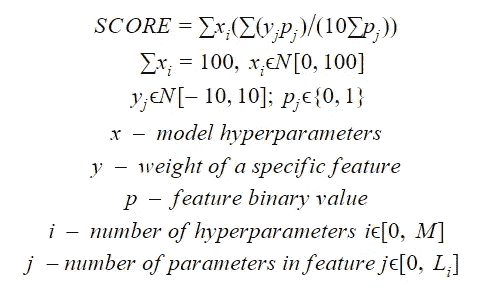
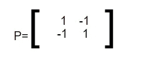
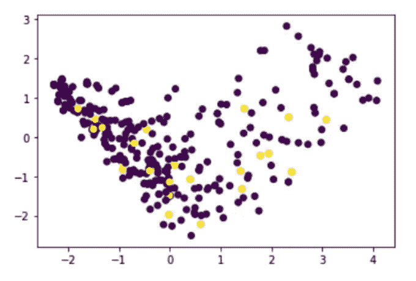
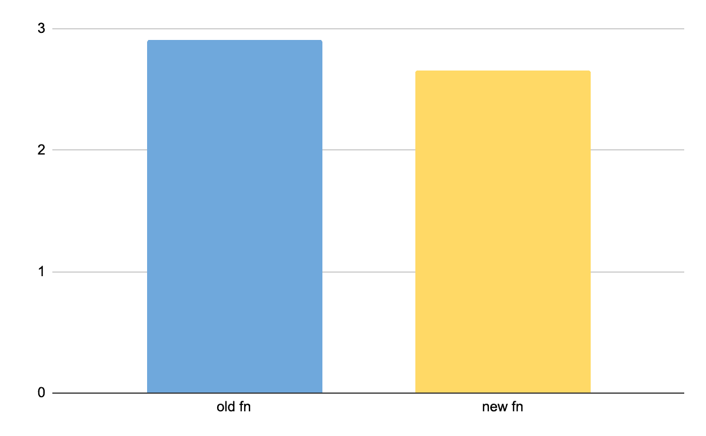
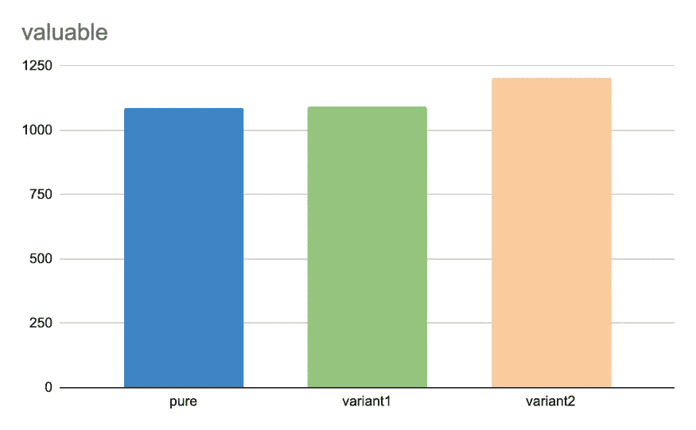
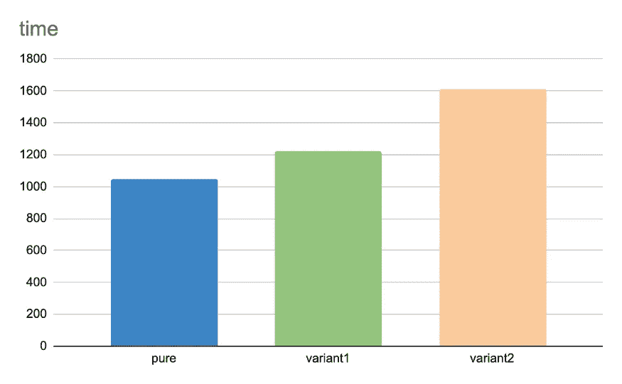

# 遗传算法的发展

> 原文：<https://towardsdatascience.com/genetic-algorithm-part-1-development-44dda2800372?source=collection_archive---------18----------------------->

## 为 B2B 市场的 ICP 评分创建人工智能算法

M 任何人都听说过最终消费者对人工智能领域的巨大怀疑:“*我们已经在市场上待了 50 年，所以我们更知道该做什么”*。

你在谈论你的人工智能，但它是如何工作的？你能给我们销售部写个算法吗？我们如何解释这些结果？

从这些欲望中，一个流行的任务出现了:**[**ICP-segmentation for B2B**](https://altumanalytics.com/blog/automated-icp-scoring-benefits)**。ICP —理想的客户档案，销售中的目标细分市场。在输入端有一个公司的参数:国家、金额、收入；在输出端，我们预测一些其他参数:****

*   ****潜在客户的转化****
*   ****客户能给你什么收入****
*   ****这个人是他公司里做决定的人吗，等等。****

****接下来，我们计算分数，从而计算进入一个或另一个组的概率。****

# ****模型****

****任务看起来很清楚:我们获取输入参数，将它们转换成所需的形式，代入模型，并训练模型。然而，如前所述，我们的解决方案的最终用户不仅希望看到结果，还希望了解为什么某个最终方案比一组具有良好直觉的专业员工更好地解决了他们的问题。因此，除了有效之外，我们的决定必须是可解释的。****

****为了在问题的效率和可解释性之间找到一个折中的办法，我们得出了下面的数学模型:****

********

*****作者图片*****

****或者更简单地，对参数的影响有约束的截断二次模型。最后分数从-100 到 100，一切都诠释的相当好。你可以尝试建立一个基于直觉的模型(我们与美国合作，这意味着我们将最重视它)，或者你可以找到一个基于实际转换数据或利润的模型。****

****这就是蛮力问题的来源，它应该使用遗传算法来解决，因为普通线性规划(经过简化)的方法会在数据量上遇到困难。每个集合(x，y)将被简称为基因。****

****在每个阶段，我们使用数据集中每一行的公式计算得分，并使用几个损失函数中的一个计算该基因预测结果的好坏。****

****已经研究了几种损失函数:****

****1-矩阵:有一个惩罚矩阵，其中我们计算每行的惩罚或奖励，例如，如果我们试图将样本分成两组，那么在第一类或第二类错误的情况下，我们给出惩罚-1，而在落入正确组的情况下，我们给出奖励 1****

********

*****作者图片*****

****2-按平均值:计算每组的平均目标参数，并尝试找出各组之间的最大距离。****

****尽管使用第一个损失函数的结果更容易解释，但得到的组太不均匀。结果，当组的数量多于两个时，有效性被分组。结果，由于分组数据的随机性，这些组太不均匀了，所以让我们选择第二个选项。PCA 后的样本分布(混沌参考):****

********

*****作者图片*****

# ****算法优化方法****

****遗传算法是对原始样本的一系列转换，在每一个阶段，它都会丢弃最差的结果。最初算法对于大问题自然是多线程的，增长不是线性的。例如，与没有多线程的算法相比，在 16 个内核上运行可以提高近 10 倍。优化采样的损失函数也是值得考虑的。但也有不太明显的方式。****

# ****减少多线程计算中 Map-reduce 的数量****

****我想讨论的第一件事是减少并行化过程中的 map-reduce 数量。遗传算法分为几个阶段，即:繁殖、变异、计算下一代。所有这些都可以合并到一个任务中，并在参数中包含一个触发器。也就是说，不是:****

```
**CURRENT_POPULATION = mutation.Mutation(CURRENT_POPULATION,triggers)
CURRENT_POPULATION = reproduction.Reproduction_multythread(CURRENT_POPULATION)**
```

****可以合并成一个功能:****

```
**CURRENT_POPULATION = mut_rep_iteration.Itr(CURRENT_POPULATION,triggers)**
```

****比较一次迭代速度的结果:****

********

*****作者图片*****

****组合功能(新的 fn)比以前的(旧的 fn)几乎好 10%。该算法本身可以计算几乎一整天，这意味着计算可以少花 2-3 个小时。****

# ****初始近似值的选择****

****首先，让我们回忆一下我们正在研究的数学模型:****

********

****作者图片****

****显然，如果我们在遗传算法中取的不是随机值，而是，例如，一些有效的基因，那么该算法将需要较少的迭代。****

****让我们应用几个有争议的近似值。****

****1 —仅近似选项 *yⱼ* :****

*   ****做一个随机集 *x* ，代入公式，得到每行通常的线性方程****
*   ****将每个 *yⱼ* 作为方程组计算****
*   ****为了符合条件，将 y 的极端值再次代入公式，再次用较少的变量求解通常的 SLAE 系统，并重复几次****
*   ****每轮 *yⱼ*****
*   ****我们获得了每个参数 *yⱼ* 的一些初始近似值****

****这个假设是有意义的，因为许多参数 *y* 经常在不同的方案中重复。如果某个参数是好的(强烈影响结果)，那么它在任何方案中都将有一个最大值或最小值。****

****2 —一般近似变量(梯度下降):****

*   ****做选项 1****
*   ****我们解决逆问题:代入参数 *y* 计算 *x*****
*   ****重复 N 次****

****这里，除了局部参数之外，我们还想看看哪个组对最终结果的影响最大。该算法的速度较低。因此，对于每个变体，进行了五次试验。****

****当前参数集:****

****一代幸存者:50，000****

****儿童人数:25，000 人****

****变种人数量:12500 人****

****现在让我们看看结果:****

********

****作者图片****

****变体 1 与干净启动相同，这意味着近似没有导致积极的结果，但是第二个(变体 2)看起来很有希望，但是让我们看看执行时间图。****

********

****作者图片****

****由于花费在初始近似上的时间，执行所花费的时间显著增加。这有点不公平。所以，让我们尝试将通常的算法与变体 2 进行比较，给常规算法更多的资源，并通过在每次迭代时扩展样本来近似时间。****

********

****作者图片****

********

****作者图片****

****尽管资源远远优于选项 2 (fp2)，但实现持续更好的结果是不可能的。理论上，这可以通过搜索超参数和过滤下一代来防止优势来纠正。这个方向的研究还在继续，所以选择第二种形式的初始近似。****

****这个问题的初始近似稳定了答案，优化了资源。初始近似选择为梯度下降的几次迭代:****

```
**gen = ret_random_gen(0) #Full random gen
for i in range(0,iters):
     gen = CalculateByGenMG(gen) # calculate only X
     gen = CalculateByGenML(gen) # calculate only Y**
```

# ****确认****

****最后，我想提供生产中模型验证的图形数据。****

********

****这是训练(左图)和验证(右图)时的分布。(*图片作者)*****

****训练是基于支票大小的数据。每条线索从低到高分为一组，如您所见，级别越高，高检查的概率越高。传入的数据结构略有变化，但组的区分保持稳定。****

# ****结论****

****遗传算法是一个资源密集型过程，优化这一过程可能成为其创建的主要任务。该算法易于使用，有助于在蛮力问题中找到最优解，并证明了其有效性。****