# 遗传算法机器人:进化高度，使用 Python，C++和 Arduino。

> 原文：<https://towardsdatascience.com/genetic-algorithm-robot-evolving-altitude-using-python-c-and-an-arduino-1acf4cf98d63?source=collection_archive---------28----------------------->

## 用遗传算法代替预定的数学模型设计飞行控制系统。

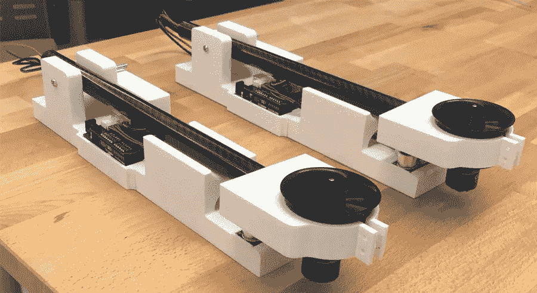

用于测试进化高度机器人的三个机器人中的两个。作者图片

# 摘要:

这项研究的目的是设计一个飞行控制系统，没有预先确定的数学模型，而是使用遗传算法来保持最佳高度。本研究是通过定量的实证研究方法完成的。在进行研究的过程中，我们发现对新手用户来说，编写遗传算法程序是很麻烦的。因此，我们创建并发布了一个名为 [EasyGA](https://github.com/danielwilczak101/EasyGA) 的开源 Python 包。

在一次试验中使用 15 条染色体的初始群体，每条染色体 10 个基因，共 100 代。装置的节流值具有 1 秒的相关基因值。每个机器人至少进行 30 次试验，以显示研究中的统计显著性。当试验完成后，机器学习就实现了。结果表明，在不使用预先确定的数学模型的情况下，实时优化单自由度(DOF)设备是可能的。

# 工作原理:

为了运行该实验成功所需的遗传算法，需要 Arduino Uno、Python、电子鸭式风扇(EDF)、电子速度控制器(ESC)、超声波测距模块(USRM)和笔记本电脑。

**Ardunio Uno:** 是一款开源的微控制器板。这种微控制器板带有数字和模拟引脚。这些针有不同的用途。一些引脚用于向其他设备发送 3.3V 和 5V 电源，其他引脚用作输入和输出引脚，向其他设备发送脉宽调制(PWM)信号。

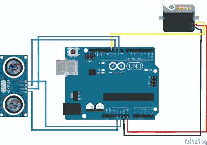

进化高度机器人布线图。作者图片

在本实验中，数字引脚 9、10 和 11 将用于发送 PWM 信号和接收来自超声波测距模块的传感信息。数字引脚 9 (TRIG)用于信号输出，引脚 10 (ECHO)用于信号输入，引脚 11 用于向 ESC 发送 PWM 信号。

**Arduino C++:** 写在 Arduino 上的代码以节流值的形式接收来自 python 脚本的指示。Arduino 然后执行这些指令，同时从 USRM 读取高度，并使用串行通信将它们传输回 python。

Python: Python 被用作处理遗传算法的主要语言，同时也向 Arduino 发送指示。

**SQL 数据库:**Sqlite3 数据库用于存储来自机器人和遗传算法的所有运行和配置数据。它还用于查找趋势和查询数据。

**一个 DOF 装置:**该装置由一个 EDF 风扇、USRM、一个碳纤维管、各种配线和三个 3D 打印部件组成:中间连接器和平台。该设备的平台被设计为在功能上与 EDF 运行所需的所有部件和零件一起工作。法国电力要求将 120 毫米 x 20mm 毫米的碳纤维管直接连接到风扇。

进化中的高空机器人所有主要部件的标签图像。作者图片

中间连接器被设计得比平台更宽。连接器比平台宽，因此超声波测距模块有足够大的空间来精确测量模块到设备的距离。

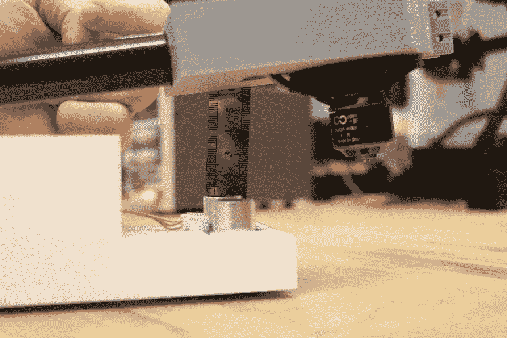

显示从超声波测距模块(USRM)到中间连接器的距离为 6 厘米。作者图片

高频超声波信号从模块发送到中间连接器，并作为声纳返回到模块，使其能够计算距离。

## 机器人健身功能:

适应度函数决定了染色体在特定任务中的表现。为了测试这项研究中的适应度函数，染色体被编码为 throttle 值，解析为一个字符串，并串行发送到 Arduino Uno。Arduino Uno 运行编码的染色体，并将适应性数据发送回 Python 脚本。Python 脚本随后对数据进行评估。这项研究的适应度函数是看机器人的 EDF 能在 USRM 上方 6 厘米的位置保持多好。在体能评估期间，总分是根据它与 6 厘米的总距离计算的。目标是使整体适应度为 0。

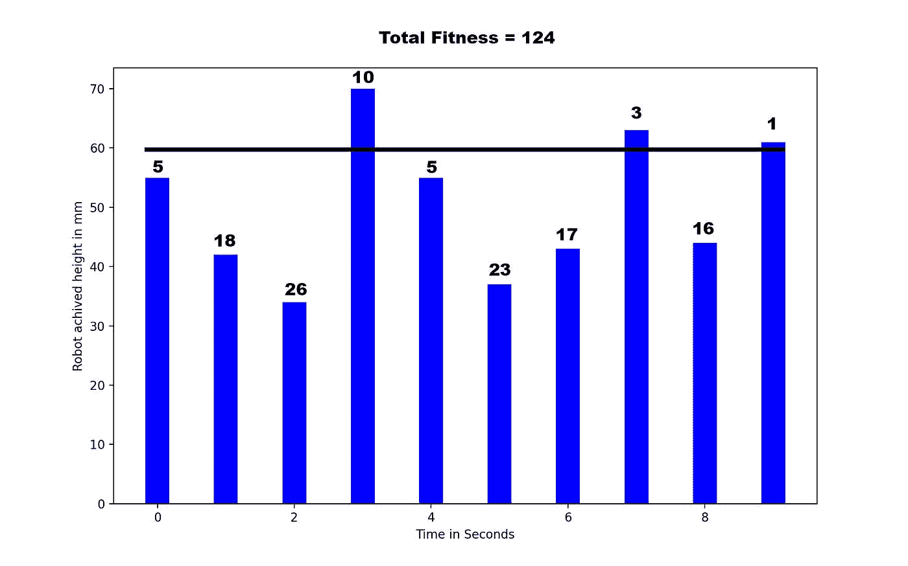

机器人适应度函数的图形表示。线代表期望的适合度。作者图片

在这里，您可以找到适应度函数的图形表示和用于评估染色体的代码。

**代码视图:**

用于评估机器人运行适应性的代码。

## 遗传算法设置:

该研究具有 6 个⁰可能的染色体组合或配置的搜索空间。使用遗传算法允许在搜索空间中快速搜索相对较好的解决方案。该解决方案可能是众多最佳解决方案中的一个，也可能是一个在对研究加以限制的情况下被认为适用的解决方案。

在研究过程中，人们发现，对遗传算法应该如何构造的任何清晰的解释或任何好的工具也有助于存储、跟踪和理解完成这样一项研究所需的信息。这个团队由 5 个人组成，花了一年时间为 Arduino 和 EasyGA python 包本身创建串行通信结构。

对于机器人，团队决定使用 EasyGA 的默认配置设置，因为它处理所有的超级参数。这是一个目标，以尽量减少机器人的错误，最终成为一行代码。python 代码可以在下面找到，更详细的列表可以在[进化高度机器人 Github](https://github.com/danielwilczak101/Evolving-altitude-robot) 上找到。

测试进化机器人时的 EasyGA 配置设置。

完整的代码通常是不共享的，但是我们认为在使用 EasyGA python 包时有必要展示简单性。

**完整 Python 代码:**

# 结果:

对于这项研究，目标是证明只需要一个遗传算法来优化一个单自由度机器人。不仅证明了这是可能的，该团队还希望确保可以通过使用多个机器人来完成这项工作。研究中使用了三个机器人，数据显示它们都能够学习。

每台机器人都经过了至少 30 次试验，每次试验都证明它们之间的机械差异仍然来自遗传算法的机器学习的相同结果。

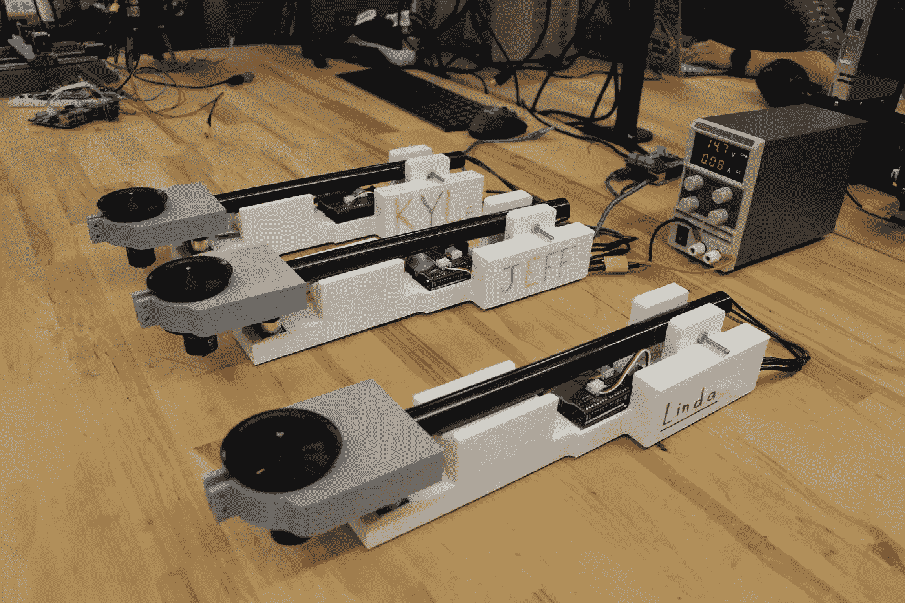

用于寻找机器学习结果的三个机器人。从左到右——凯尔、杰夫和琳达。作者图片

这些机器人都被造得一模一样，但通过潜在的机械差异，它们都有一点点不同。在值的变化中看到的差异将成为每个机器人的接近最优的解决方案。

试验:**种群规模** = 15，**染色体长度** = 10，**世代** = 100

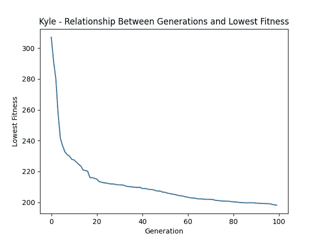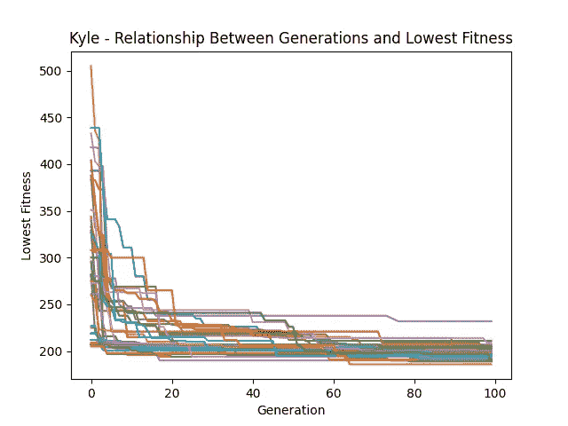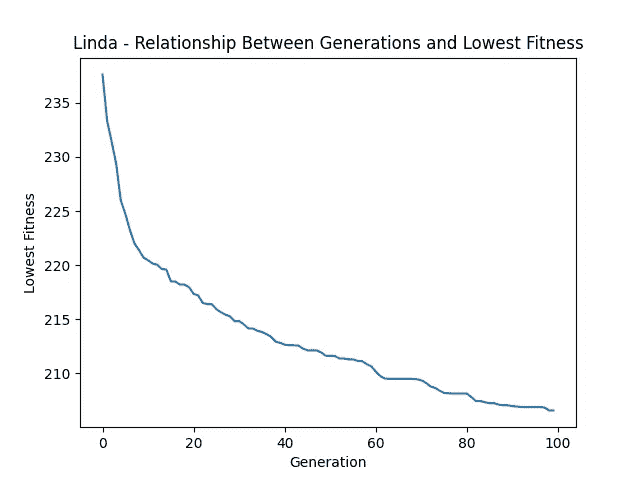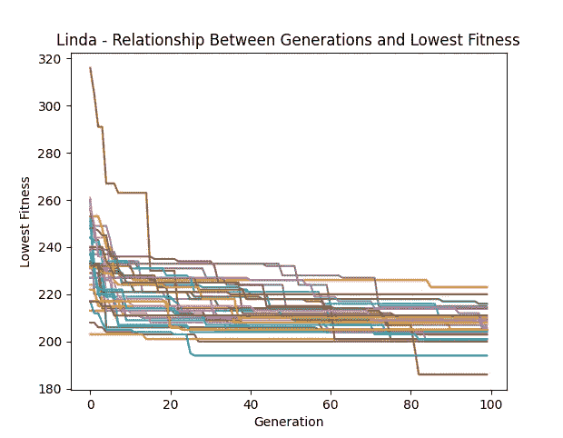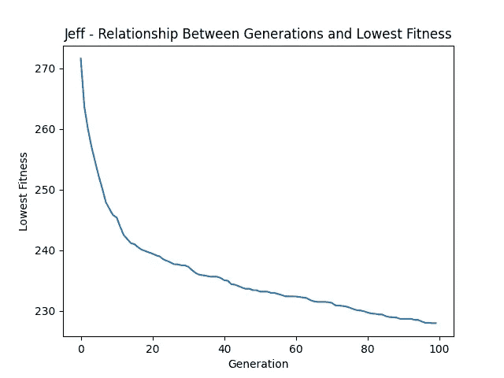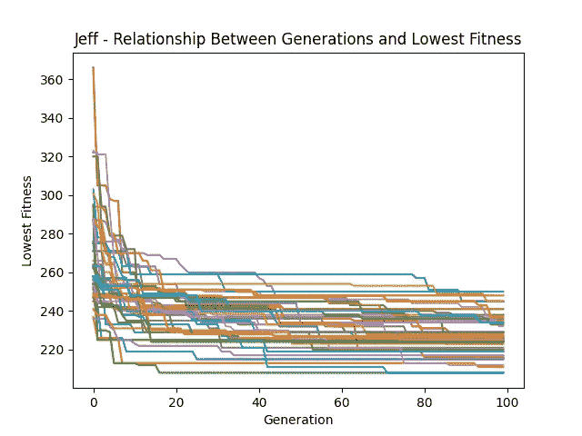

**左:**所有试验最低染色体的平均值。**右:**所有试验中最低的染色体。作者提供的图片

# 讨论:

回想起来，测试所有可能的染色体组合是非常耗时的。一种更好的方法可能是结合模拟试验，然后进行实际测试和优化。这种双向方法既有在模拟中运行初始代的好处，在模拟中使用计算能力处理试验，随后是现实生活中的试验和培训，以进一步优化系统。

# 贡献:

我想感谢所有帮助过这个项目的人。以下个人都对研究产生了影响。

*   Dylan Ballback 凭借他惊人的机械工程设计技能。
*   雷切尔·塞科德审阅并帮助撰写了所有内容。
*   Jack Nguyen 与我和其他 4 名学生共同创建了 EasyGA。
*   Mohammad Alali 编写 C++代码和 starter GA 代码。
*   雅各布·罗密欧(Jacob Romeo)帮着查阅文献和操作机器人。
*   Matthew Verleger 博士是该研究项目的导师。
*   **Embry Riddle 本科生研究** Ignite 计划赞助该研究。

更多的人间接地帮助了这个项目，但是我仍然想对他们说谢谢。

感谢您的阅读，

丹尼尔·威尔扎克