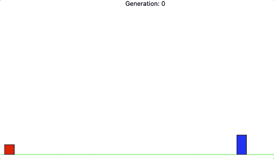
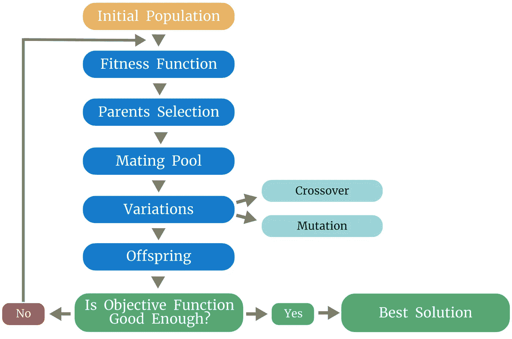
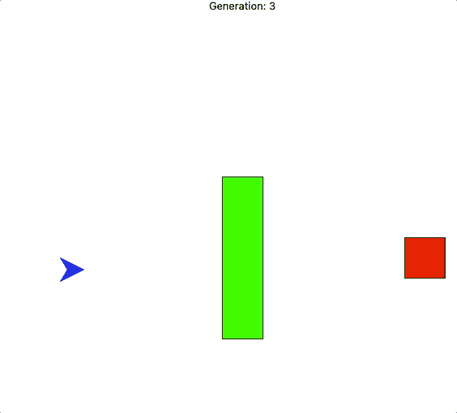

# 自然语言处理的遗传算法

> 原文：<https://towardsdatascience.com/genetic-algorithms-for-natural-language-processing-b055aa7c14e9?source=collection_archive---------17----------------------->

## 为什么遗传算法对预处理自然语言处理数据有效

图 1:遗传算法训练一个红色正方形来避开蓝色矩形。图片作者。

> "数据准备约占数据科学家工作的 80% . "——福布斯

NLP 建模项目也不例外——通常最耗时的步骤是整理数据，然后从清理后的数据中开发特征。有许多工具可以促进这一过程，但仍然很费力。

为了帮助特征工程步骤，中佛罗里达大学的研究人员发表了一篇 2021 年的论文，该论文利用遗传算法来删除不重要的标记化文本。遗传算法(GA)是受进化启发的优化，在复杂数据上表现良好，因此它们自然也适用于 NLP 数据。它们也很容易并行化并且易于实现。

让我们从技术概述开始，然后深入了解到底发生了什么…

# 技术 TLDR

1.  **将你的数据符号化，建立一个词汇表。**引用的论文使用 python 包 *mosestokenizer* 将句子拆分成克，克是单独的符号或单词。
2.  **给每克分配随机权重(0 到 1 之间)。每一克代表我们人口中的一个个体。**
3.  **调整模型的超参数并运行。调整 GA 更像是一门艺术，而不是科学，所以只需摆弄那些有意义的数字。**
4.  **使用 ROUGE-N 模型确定精确度。**引用的论文使用了 ROUGE-N 的 F1 评分，这是精度和召回率的平均值，但您可以使用其他目标函数。
5.  **标记新数据并开始开发您的 NLP 模型。**既然您的 GA 已经训练好了，您可以标记一个看不见的训练集并开发您的 NLP 模型。

# 酷，但是这实际上是如何工作的呢？

让我们慢一点，围绕遗传算法发展一些直觉。

## 什么是遗传算法？

首先，我们来讨论 GA 是如何工作的。

图 2:遗传算法生成的流程图。图片作者。

在图 2 中，我们可以看到遗传算法的流程——它并不像看起来那么复杂。我们将我们的人口(黄框)初始化为克的加权向量，其中每个克的值是一个单词或符号。权重被随机初始化为 0 到 1 之间的值。

接下来，我们将初始人口输入算法。深蓝色的值对应于我们算法中的单个世代。浅蓝色的*交叉*和*突变*是变异的类型。让我们依次看一看每一个:

1.  **适应度函数:**首先，我们定义了我们的适应度函数，它计算了一个个体繁衍后代的概率。在我们的例子中，我们将使用 ROUGE-N 的 F1 值。更高的分数意味着一个个体更有可能繁衍后代。
2.  **父母选择:**接下来，我们定义谁能和谁不能繁殖。论文中的例子使用了一种叫做*锦标赛选择*的东西，我们随机抽取个人样本并选出一个获胜者。胜利者可以繁殖后代。
3.  交配池:在这一步，我们将获胜的父母聚集成随机的一对。
4.  **变化:**接下来**，**我们以预定义的方式随机改变我们的数据，希望创建一个更适合的群体。第一种方法叫做*交叉*，涉及到两个父母交换他们的权重的某个百分比，并返回这两个新的权重向量作为孩子。通常，这个百分比是由随机选择的交叉指数决定的；交换超过该索引的所有值。第二种叫做*突变*，涉及随机改变每个父代的低概率权重。
5.  **后代:**从这里，我们可以聚合父母和后代。如果有一个人数上限，我们会去掉最不合适的人，直到我们在这个上限之下。

一代完成后，我们评估我们人口的适应性。如果满足我们的停止标准，我们将返回重量总体，并对它们进行平均，以获得每克重量的单个值。如果我们的停止标准没有得到满足，我们的人口被认为是不适合的，我们喂养的个体到另一代。

抛开伦理不谈，遗传算法很酷，对吧？

如果你仍然不相信，这里有一个 GA，它试图通过反复试验来猜测一个句子的内容…

图 3:试图猜测句子价值的遗传算法。图片作者。

如果我们使用暴力方法，我们将需要尝试 *n^k* 组合，其中 *n* 是我们字符串中的字符总数，而 *k* 是我们字母表中的字母总数。该示例将采用 27⁵以上的可能组合(小写/大写字符和一个空格)。

遗传算法在 51 代人口规模为 30 的情况下猜测了我们的字符串，这意味着它测试了不到 1530 个组合，以得出正确的结果。并且，它还尝试了符号。

## 但是，它们为什么有效呢？

遗传算法在复杂数据上表现良好。传统的基于梯度的优化，使用模型的导数来确定搜索的方向，要求我们的模型首先有导数。因此，如果模型是不可微的，我们很遗憾不能使用基于梯度的优化。此外，如果梯度非常“颠簸”，基本的梯度优化，如随机梯度下降，可能不会找到全局最优。

另一方面，遗传算法不需要可微分的模型。它们的随机性也有助于它们避免陷入局部最优，这非常适合“颠簸”和复杂的梯度，如克重。它们也很容易并行化，只要稍加调整，开箱即用就能很好地工作。

遗传算法的主要缺点是它们不能保证最优解，无论是局部的还是全局的。对于需要优化的情况，这可能是一个交易破坏者。

## 直观的例子

在我们的最后一节中，让我们来看看一种训练“船只”避开障碍物并找到红色方块的遗传算法。

图 4:训练船只避开障碍物并找到红色方块的遗传算法的可视化。图片作者。

如果我们看一下上面的图 4，我们会很快注意到，从第 3 代到第 5 代，船只在避开绿色矩形方面有所改进。这是因为如果他们的“基因”使他们更有可能死亡，他们不会繁殖。

然而，在这种配置中，船只没有视线概念；他们只是随机向一个方向移动，并记住过去的工作方式。因为特征空间太差，这种配置又用了 8 代船才*意外*降落红场。如果我们给他们一个全新的地图，这将需要另一个完整的训练周期。

为了提高船只快速优化和归纳新问题的能力，我们需要更好的特征空间和更多的学习环境。

同样，对于 NLP，无论遗传算法执行得多好，简单的符号化通常都不能创建足够健壮的模型。更复杂的特征，如克数、前/后克数等。是开发有效模型所必需的。

**遗传算法提供了一种有效且高效的方法来开发标记化文法的词汇表。不会了。不多不少。**

# 实施说明

*   遗传算法没有最佳超参数的规则。通常的做法是，在使用机器允许的最大群体规模和世代数时，尝试几种参数组合。
*   如果令牌的大小写没有被用作特性，请将令牌转换为小写。这可以大大减少词汇量。
*   个人感兴趣的一个领域是使用 GA(和其他优化算法)来处理我们建模的特征工程部分。有什么想法吗？

*感谢阅读！我将再写 45 篇文章，将“学术”研究引入 DS 行业。查看我关于将遗传算法应用于 NLP 数据的链接/想法的评论。*