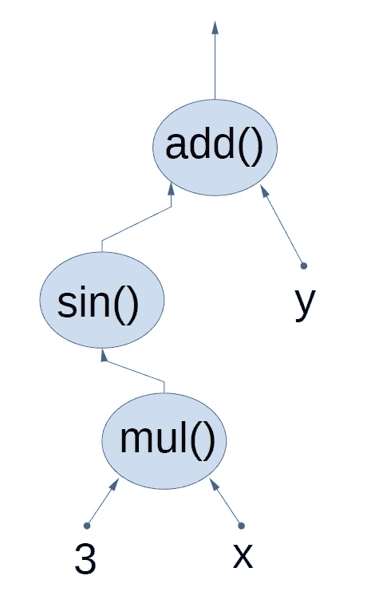

# 图像分类的遗传程序设计

> 原文：<https://towardsdatascience.com/genetic-programming-for-image-classification-a505950c5467?source=collection_archive---------16----------------------->

## 人工选择作为学习计算机视觉任务的驱动力

查尔斯·达尔文的雕塑。图片来自 [Unsplash](https://unsplash.com/) 的胡尔基·奥莰·塔巴克

这里有一大群松鼠住在我的后院。进化给了它们完美的体型和灵活性来征服树木和土地。直到几年前，这个松鼠社会生活得很愉快，没有与他们的人类邻居互动。

在某个时候，我妻子安装了一个喂鸟器，这样我们就可以近距离观察鸟儿了。这些诱人的种子给松鼠带来了意想不到的机会。虽然他们进化的环境不包括任何种子分配器，但他们发明了新的行为来达到他们的目标。如果你碰巧在你的后院安装了喂鸟器，你肯定知道:无论观鸟者如何让松鼠远离种子，聪明的啮齿动物得到它们想要的东西只是时间问题。

一只聪明的松鼠。图片由 Nathalie Famery 提供。

它们不仅完美地适应了自然环境，而且当机会出现时，它们还能发明新的行为。我们无法制造出接近这种智能水平的机器。然而，进化创造了它。智力是可行的(因为它存在)但我们无法复制的东西之一。

我们无法复制松鼠所展示的智慧，但我们可以模仿物种进化中的机制。这是一个叫做进化算法的机器学习技术家族背后的想法。这些技术受自然选择的启发，模拟了给定问题的候选解决方案群体的进化。**对给定任务表现最佳的候选解决方案(即个体)被选为下一代的父代。**

在进化算法中，每个个体都是一个基因型(决定完成任务的指令的一组信息)的容器。当从双亲中创造一个新个体时，部分基因型从双亲中被复制。虽然我们不知道个体基因型的哪一部分有助于它的成功，但它的每个孩子都会随机地继承大约一半的遗传信息。与同代的其他个体相比，孩子的成功将决定遗传的基因是否保留在基因库中。

# 遗传表演程序

进化算法类别之间的主要区别在于它们代表个体的方式。在 [*遗传编程*](https://en.wikipedia.org/wiki/Genetic_programming) 中，进化算法的一个实例，个体被表示为一个叫做*计算图*的树形结构。计算图实现了函数的组合，其中节点表示原始函数，边表示值。这些值从原始函数中输出，并进一步传递给其他原始函数。终端可以是常量，也可以是输入变量。

表示函数 f(x，y) = sin(3x) + y 的计算图形。图片由作者提供。

用于从双亲创建孩子的两个主要操作符是*交叉*和*变异*。交叉是一种操作，通过这种操作，我们在一个亲本的图中随机选择一个切割点，并拼接从另一个亲本取得的分支。

交叉示例:用父级 2 的框架分支替换父级 1 的框架分支，以生成子级。箭头颜色代表数据类型。替换分支的输出数据类型必须与原始分支输出数据类型相匹配(本例中为绿色箭头)。图片由作者提供。

突变是用随机生长的分支替换个体(通常是新产生的孩子)中随机选择的切割点的过程。随机生长的分支可以是简单的终端节点，也可以是任意复杂的树。唯一的要求是生长分支的输出数据类型与剪切分支的数据类型相匹配。

突变实例:左手侧个体中的框架分支被右手侧个体中随机生长的分支替换。图片由作者提供。

在开创性的著作《 [*遗传编程:通过自然选择的方式进行计算机编程*](http://www.genetic-programming.org/gpbook1toc.html)》(1992)中，John Koza 建议所有的节点都应该是可互换的，即不需要数据类型匹配。根据我的经验，在对个体的评估会导致大量计算成本的领域，比如计算机视觉，实现*强类型*遗传编程会更有效。通过强制节点之间的类型匹配，我们确保一个个体将代表一个可以被评估的函数。否则，我们可能会遇到这样的风险，例如，一个节点向另一个节点提供一个整数，而另一个节点需要一个图像作为输入。这种情况不是有效的函数，因此到目前为止所做的所有计算都将被浪费。

## 人口的进化

一旦我们知道如何在我们选择的任务域中生成有效的计算图，并且我们知道如何从父代生成后代，我们就可以应用下面的遗传编程高级算法:

遗传规划的高级算法。图片由作者提供。

# 图像分类

在[这个库](https://github.com/sebastiengilbert73/tutorial_visiongp_classification)中，你会找到一个简单的图像分类任务的代码，这个任务是用遗传编程实现的。任务是将图像分类为“圆盘”和“正方形”。

我们将图像分为“圆盘”和“正方形”两类。图片由作者提供。

除了实现遗传编程算法(基于给定标准的选择和新一代的创建)的[核心的代码之外，我们还需要实现](https://github.com/sebastiengilbert73/tutorial_visiongp_classification/tree/main/genprog)[特定领域的代码](https://github.com/sebastiengilbert73/tutorial_visiongp_classification/tree/main/vision_genprog)，它将告诉解释器原函数做什么。在我们的例子中，任务的领域是图像处理；[原语函数将是 OpenCV 函数](https://github.com/sebastiengilbert73/tutorial_visiongp_classification/blob/main/vision_genprog/tasks/image_processing.py)的子集。

必须规定定义个人在任务中表现如何的标准。在我们的例子中，成本(我们希望最小化的正数)将是训练集中错误分类的观察值的比例。增加了一个惩罚项，与个体拥有的节点数成比例。这是为了在同等精度的情况下，小计算图优于大计算图。

群体中每个个体的成本评估。作者代码。

一旦所有的超参数都设置好了，我们就开始种群进化。每一代，冠军个体都会被保存。停止标准可以是当一代的冠军在验证数据集上达到期望的准确度时。

图像分类器群体的成本和验证准确性(通过每一代冠军进行评估)的典型演变。图片由作者提供。

与基于梯度下降的机器学习方法相反，在梯度下降的情况下，成本函数稳定地降低(尤其是在第一个时期)，遗传编程群体的成本函数往往随着连续的平稳期而降低。值得注意的是，遗传编程并不假设目标函数是可微的。由于这个原因，没有指示用于局部改善的梯度下降方向的信号。相反，遗传规划依赖于在成本函数中表现为离散步骤的定性变化(即函数架构的变化)。当一个个体从它的父母那里接受了一个新的分支组合或者产生了一个有利的突变时，这些质的变化就发生了。

# 结论

遗传编程是一个领域不可知的机器学习框架，它不假设一个可微分的目标函数。我用遗传编程实现了一个简单的图像分类器作为概念证明。正如你所猜测的，一个内置图像处理功能的深度学习库可以用更少的努力来执行同样的任务，但乐趣在哪里呢？

我希望像遗传编程这样的进化算法能在计算机视觉和其他领域找到越来越多的应用，特别是在原函数不易微分的地方。

随意试验代码。如果你心中有一个可以使用基因编程的应用(或者如果你有办法让松鼠远离喂鸟者)，我会很高兴听到它。

[1]在文献中，我们经常遇到的不是*成本*，而是*适合度*值，这通常是一个我们希望最大化的正数。

[2]由于个体由计算图形表示，如果原函数是可微的，则可以应用反向传播。因此，梯度下降可以优化个体的常数，但对于遗传编程框架来说不是必需的。这就是为什么在我的抽象类[解释器](https://github.com/sebastiengilbert73/tutorial_visiongp_classification/blob/main/genprog/core.py)中，实现方法 *FunctionDefinition()* 是强制的，而实现 *FunctionDerivative()* 是可选的。