# 你如何把基因组变成一幅画

> 原文：<https://towardsdatascience.com/genome-painting-c7e2398b4579?source=collection_archive---------31----------------------->

## 使用 Python 可视化基因组数据

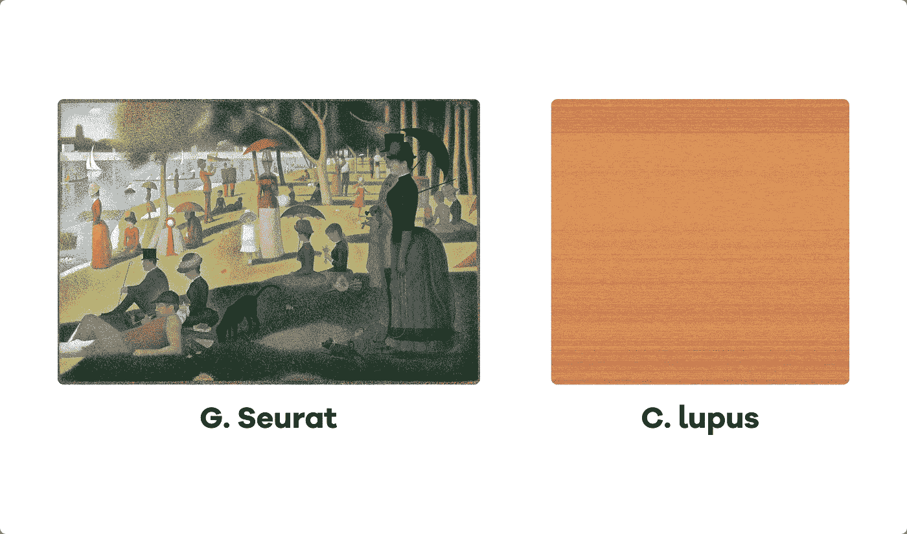

> “你的基因组看起来就像文森特·梵高画的二维码……”

…对我来说还不是一句搭讪的话，但直到结束才算结束。

乔治·修拉的《T4 岛上的一个星期天下午》是有史以来最著名的点彩画——成千上万个点构成了一件艺术品

[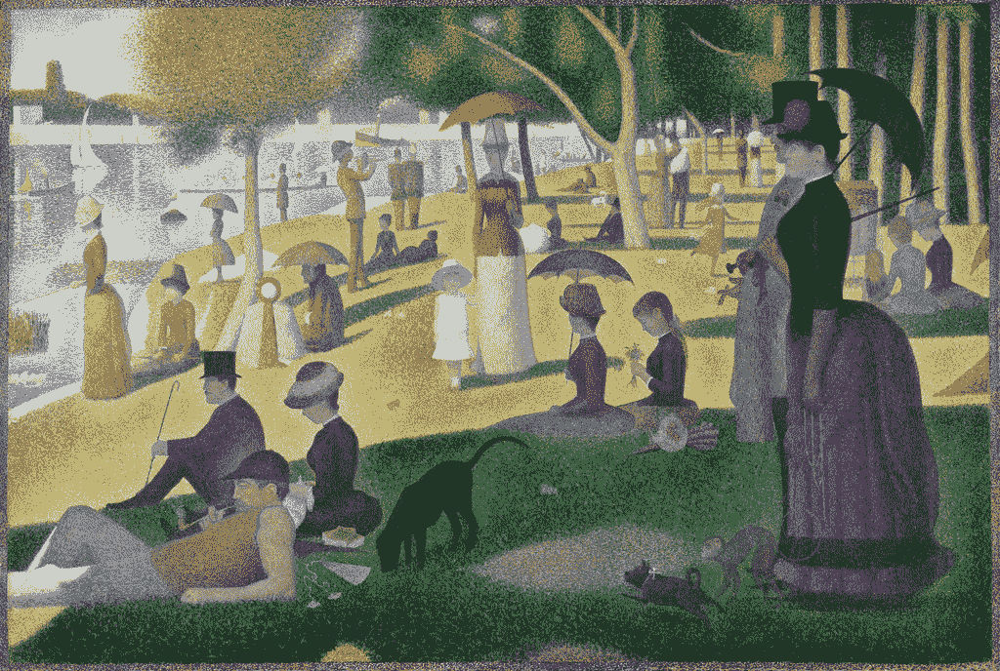](https://commons.wikimedia.org/w/index.php?curid=11500834)

*乔治·修拉——芝加哥艺术学院，公共领域|有史以来最著名的点彩画。*

当我开始可视化基因组数据时，我得出了这个结论:

## 基因组。加拿大是。艺术也是。

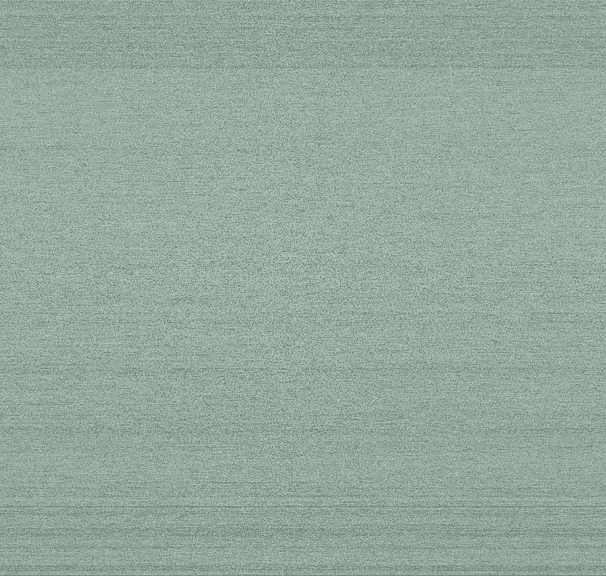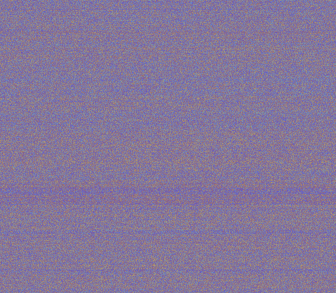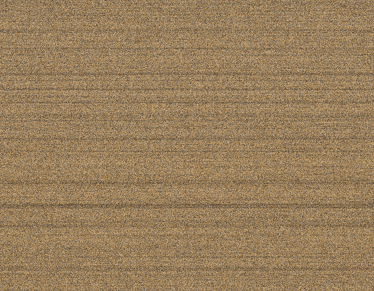

从左至右:家族性红斑狼疮、中华红斑狼疮、早熟红斑狼疮的 38 号染色体

看，这些不是点彩画的杰作。更像是你服用迷幻药然后盯着电视看时看到的效果。

但是我在做这件事的时候得到了很多乐趣，如果你正在学习遗传学、Python 或者 cs，你可能也会。

从左上像素开始，逐行继续，每个彩色像素代表生物体基因组序列中 4 个核苷酸中的 1 个。

为什么提到点彩？电视和显示器上的数字图像基本上是点彩“画”，用像素代替点，用 RGB 值代替油彩。

我将讲述我是如何使用初级 Python 和免费的基因数据来制作这些图像的。

# 弄清楚

这是我想要建造的:

**输入:**一个包含生物体基因组序列的. txt 文件。

**输出:**一个. png 图像(尽可能接近正方形)，其中每个彩色像素代表一个核苷酸。

搜索 NCBI 的基因组数据库可以相当容易地找到基因组序列:例如 [S. praecaptivus](https://www.ncbi.nlm.nih.gov/nuccore/NZ_CP006569.1?report=fasta) 、 [H. cinaed](https://www.ncbi.nlm.nih.gov/nuccore/NZ_AP018676.1?report=fasta) i。

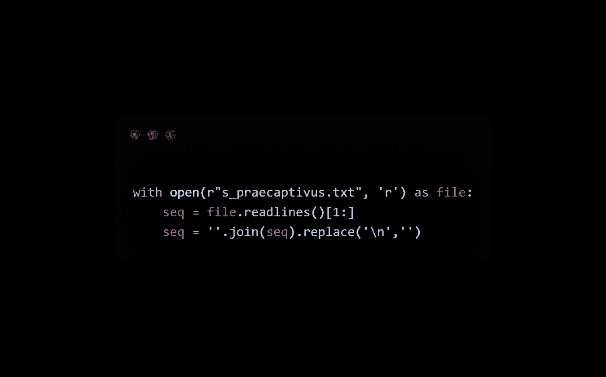

作者使用 [ray.so](http://ray.so)

由于第一行不包含核苷酸，我们跳过它。然后将列表连接成一个字符串。

产量呢？[堆栈溢出](https://stackoverflow.com/questions/2659312/how-do-i-convert-a-numpy-array-to-and-display-an-image)研究告诉我，我可以用`numpy`创建一个空数组，用 RGB 值填充，然后**将数组导出为图像**使用`PIL`的`Image`。

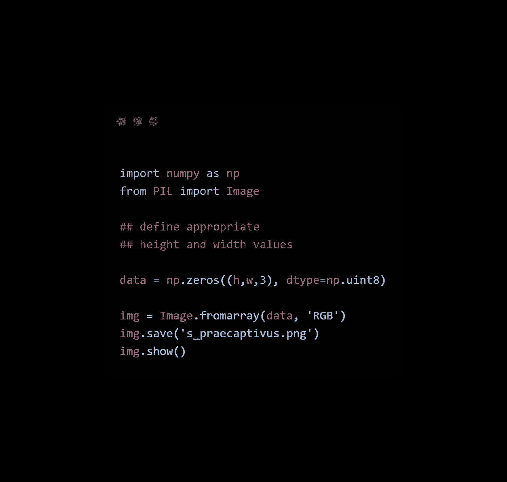

作者使用 [ray.so](http://ray.so)

这就是我的代码三明治的顶部和底部。现在我需要一些方法来:

1.  为任何给定的序列获取适当的尺寸。(`def **dimensions**`)
2.  为阵列中的每个“像素”分配正确的 RGB 值。(`def **generate**`)

# 规模

我希望图像尽可能接近正方形，所以高度`h`和宽度`w`需要在数值上接近。

每个像素匹配一个核苷酸。因此，对于任何给定的长度序列`seq_length`，期望尺寸`h`和`w`将是它们之间差异最小的因子对(即最接近的一对)。

我们称这个函数为`dimensions`。

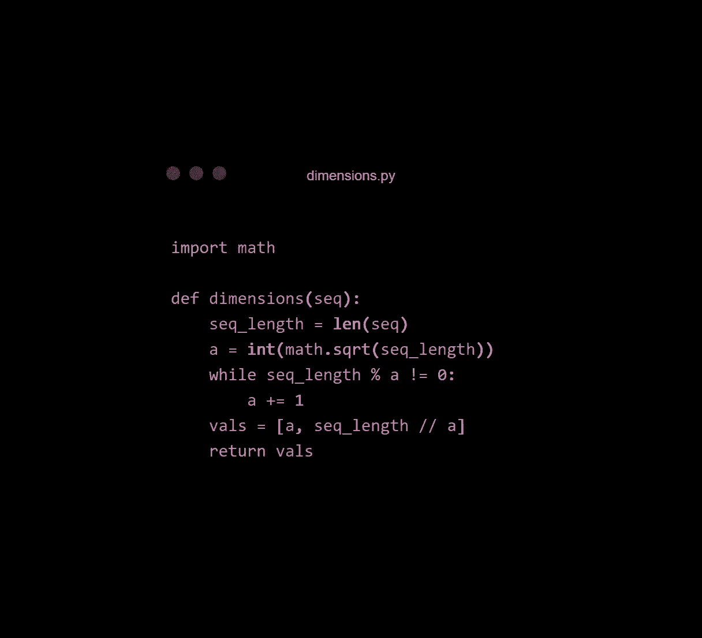

作者使用[雷.索](http://ray.so)

首先，一个字符串的长度`seq` = `seq_length`。然后，我们取其平方根的整数形式，`a`。

*   如果`seq_length`除以`a`的余数为 0:则`seq_length`为平方数，尺寸为`a`和`a`。
*   如果不是:我们给`a`加 1，然后再用`seq_length`除以`a`，直到余数为 0。

这将找到最接近平方根的因子对**。在所有可能的因子对中，**这两个永远是最接近的。****

```
>>> dimensions("AAAAAAAAAAAA")
[3, 4]
>>> dimensions("AAAAAAAAAAAAAAAA")
[4, 4]
>>> dimensions("AAAAAAAAAAAAAAAAAA")
[6, 3]
```

当我们的序列长度是一个质数**:**时，我们会遇到一个问题

```
>>> dimensions(“AAAAAAAAAAAAAAAAA”)
[17, 1]
```

一个 1×17 的图像很难看到，对我的祖先来说是可耻的。我必须做得更好:

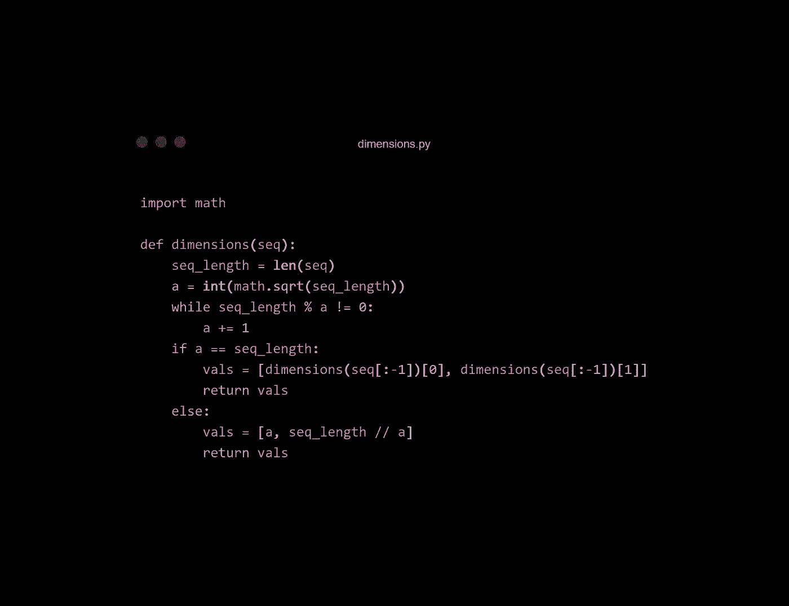

作者使用 [ray.so](http://ray.so)

如果我们到达`a`等于`seq_length`的点，我们再次递归调用`seq`上的`dimensions`，这一次是通过移除最后一个基数。这确保了一个非质数。

基因组通常有超过一百万个碱基长——去掉一个没问题:

```
>>> dimensions("AAAAAAAAAAAA")
[3, 4]
>>> dimensions("AAAAAAAAAAAAAAAAAA")
[6, 3]
>>> dimensions("AAAAAAAAAAAAAAAAA") # length = 17, remove final base
[4, 4]
```

就像一部独立恐怖电影高潮前迷人的二十多岁的年轻人，我以为我是安全的。但是上帝，我错了。

在一只拉布拉多寻回犬的第 38 条染色体上测试这段代码，给了我这个怪物:


就是比背景稍微亮一点的乐队。|我的电脑截图，因为我实际上无法上传这张图片。

你能看见它吗？当然不是。实际图像大约是 250，000×95 像素。

没有错，但是任何非质数的最接近的因子对仍然可能相距很远。这严重扭曲了高宽比，所以我对函数做了一些修改:

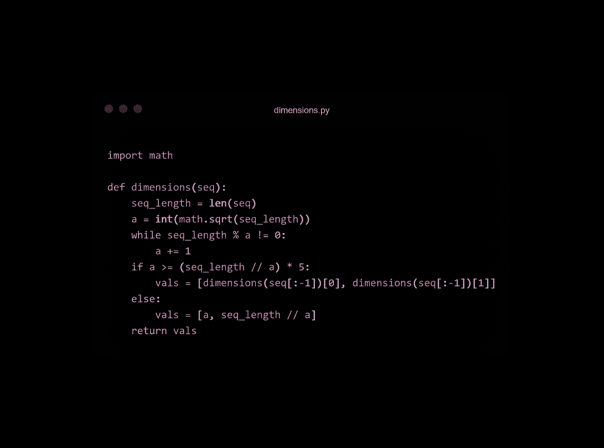

作者使用 [ray.so](http://ray.so)

现在，如果`a`大于或等于 5 ×另一个因子(即纵横比超过 1:5)，我们在`seq[:-1]`上再次递归调用`dimensions`函数。这可能导致从末端去掉 1+个核苷酸——在寻回犬染色体中，我们丢失了 3 个。

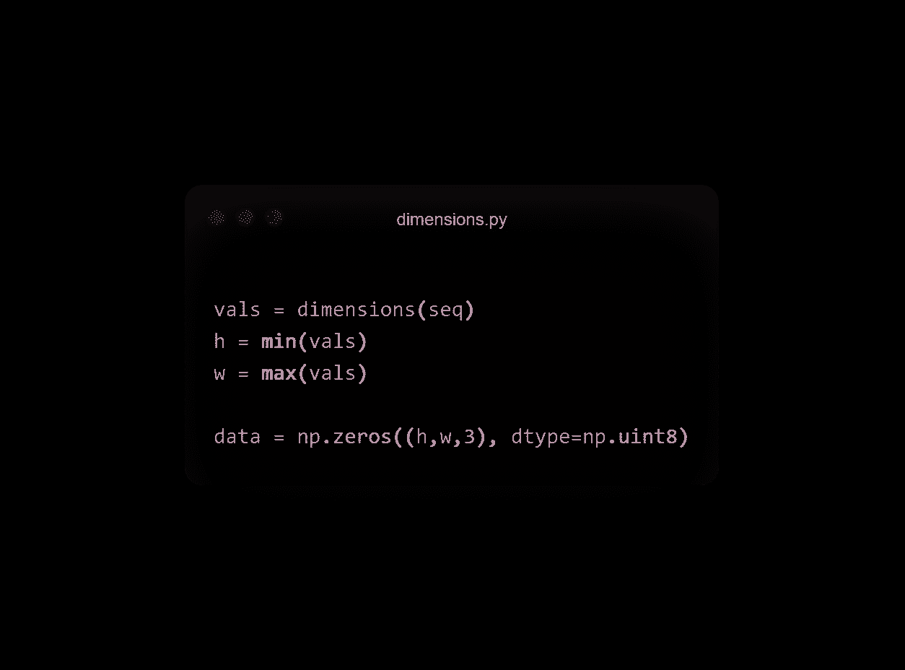

虽然 vals[0]几乎总是大于 vals[1]，但在极少数情况下并非如此。取列表的最小值和最大值确保宽度总是大于高度。|作者使用 [ray.so](http://ray.so)

剩下要做的就是分配`h`和`w`值，并将它们插入到我们的数组命令中。

现在让我们用 RGB 值填充数组:

# 产生

我们首先创建一个字典，为每个碱基分配一个 RGB 值:

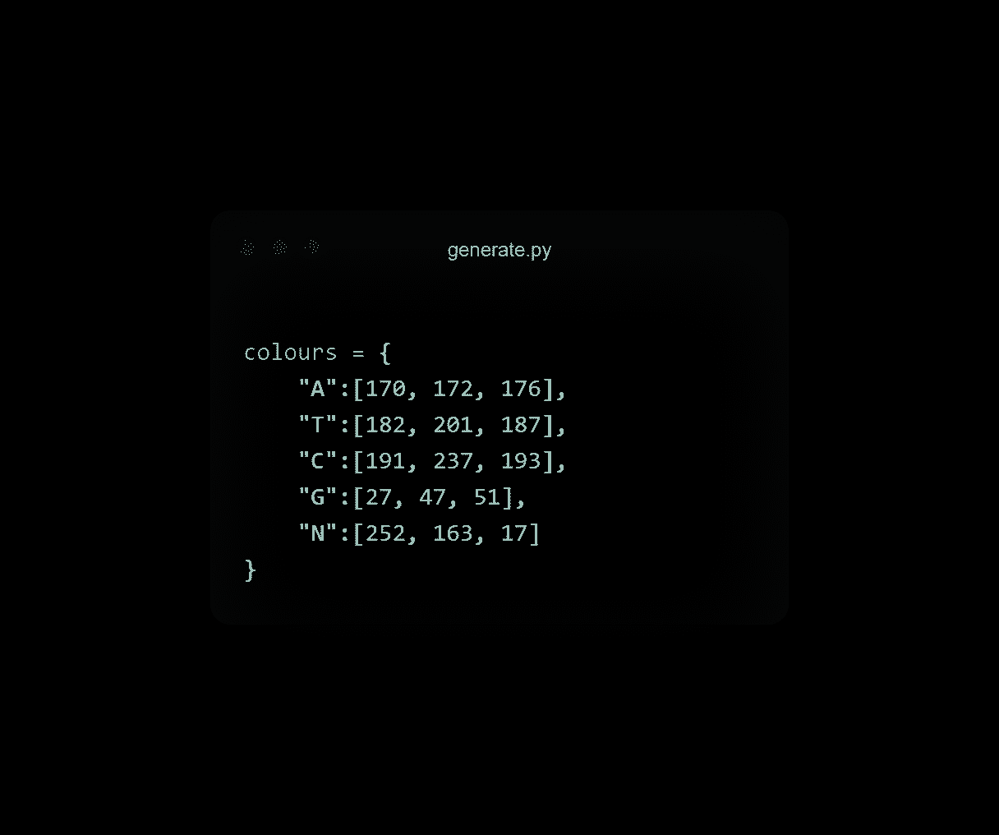

我通常使用[coolors.co](http://coolors.co)来查找调色板。|作者使用 [ray.so](http://ray.so)

FASTA 文件(Y，R，K)中还有其他字母[可能](https://zhanglab.ccmb.med.umich.edu/FASTA/)，但这是我目前遇到的唯一一个。(N 表示任何核酸)。

因为我想一行一行地进行，所以我将嵌套一个循环，该循环遍历数组中的**每一行中的**每一个像素(也就是每一列)**:**

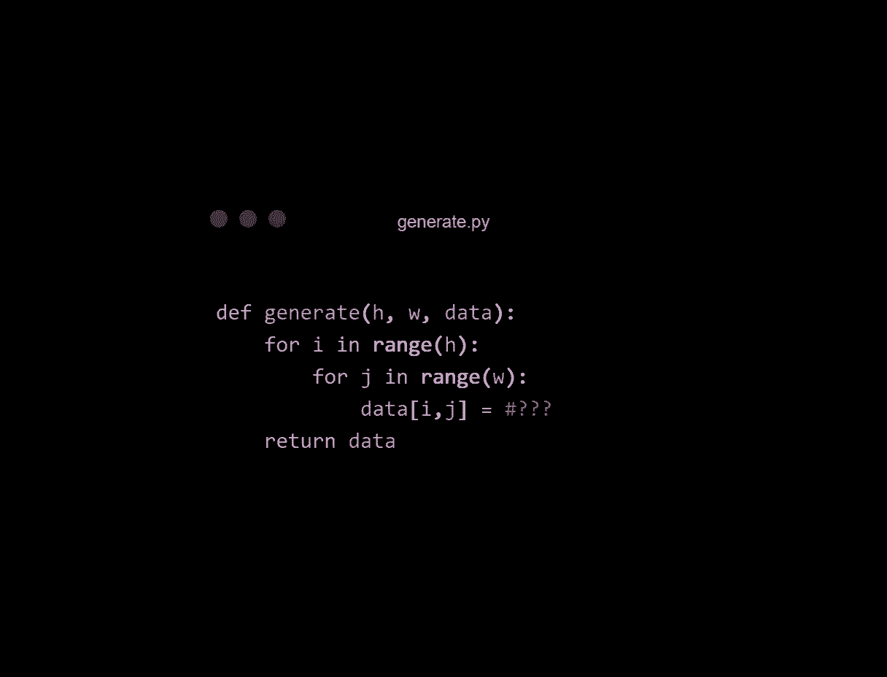

作者使用 [ray.so](http://ray.so)

`data[i,j]`索引数组中每个可能的元素，从左上角的`data[0,0]`开始，一直到右下角的`data[h-1,w-1]`，一行一行。

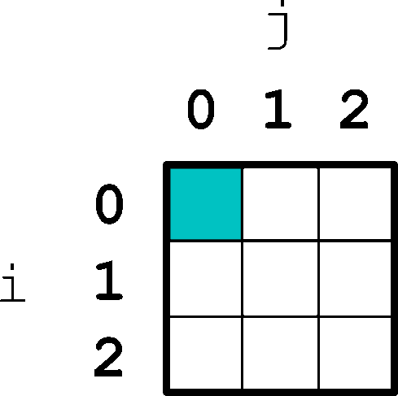

按作者

`data`元素的坐标`i`和`j`与`seq`字符串中的对应字符的关系如下:

```
data[i,j] == seq[j+i*w] #row index * width + column indexh = 10
w = 10## data[0,0] -> seq[0+0*10] = seq[0]
## data[0,9] -> seq[9+0*10] = seq[9]
## data[1,0] -> seq[0+1*10] = seq[10]
## data[9,9] -> seq[9+9*10] = seq[99]
```

因此，我们最终的`generate`函数如下所示:


作者使用[雷.索](http://ray.so)

请注意，我们没有将`data[i,j]`设置为来自`seq`的相应字符，而是设置为来自`colours`的该字符的 RGB 值。

当我们把这些放在一起，我们得到这个:

代码本身可能会被清理，但那是以后的事了。|作者[作者](https://github.com/MurtoHilali/gene-art)

将此应用于不同的基因组，我得到了一些有趣的结果:

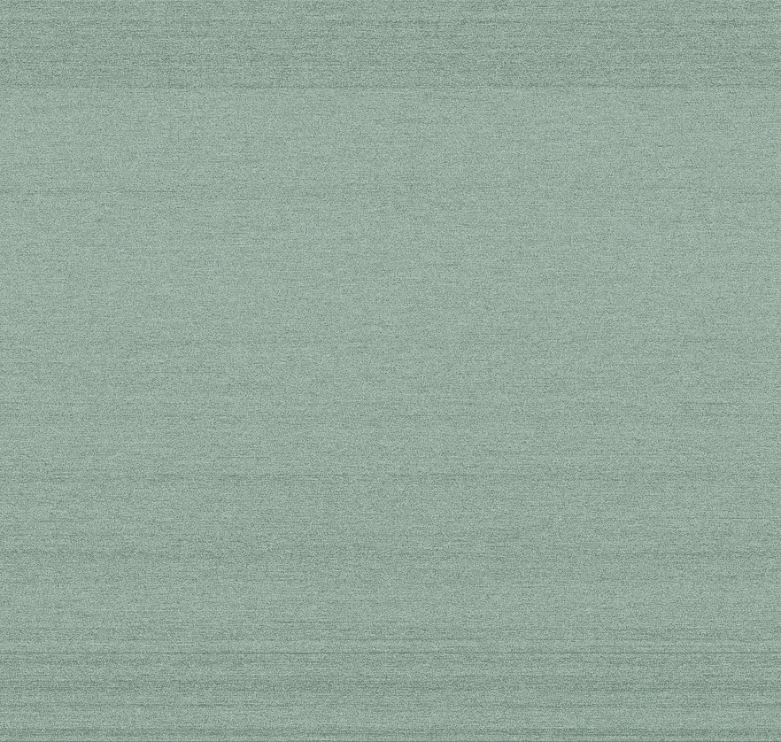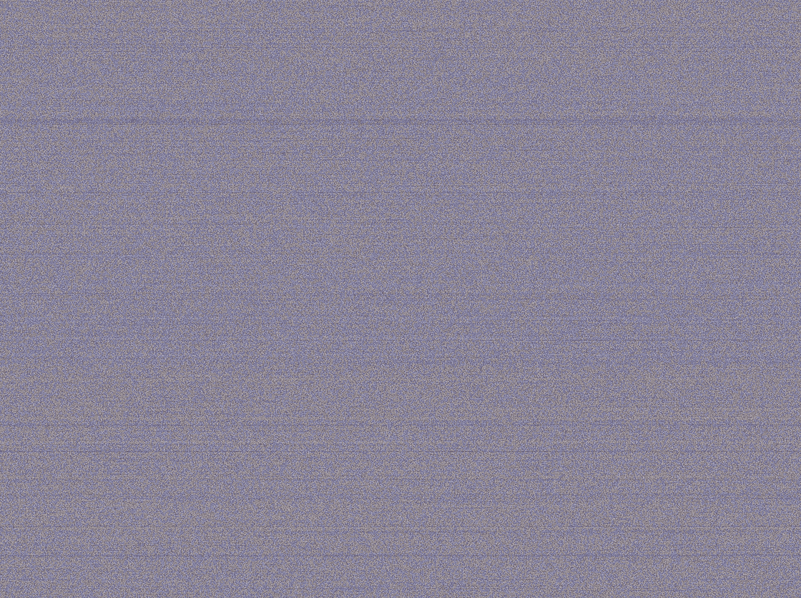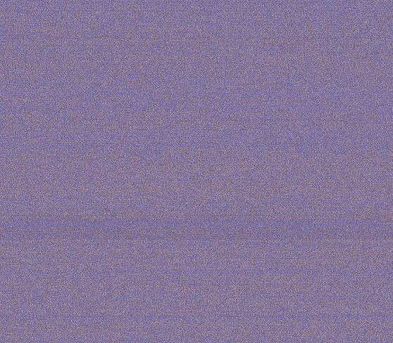

从左上顺时针方向:家犬狼疮，染色体 38；大肠杆菌；s .邦戈里；白花蛇舌草；H. cinaedi。|作者

摆弄颜色也很有趣:

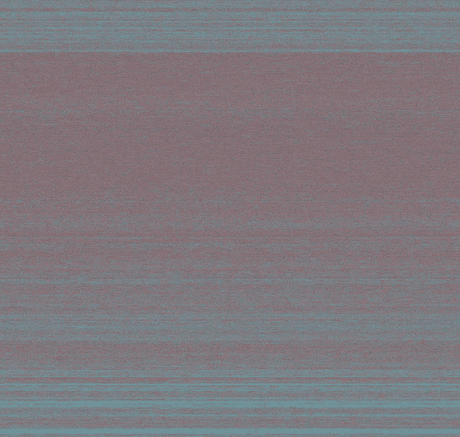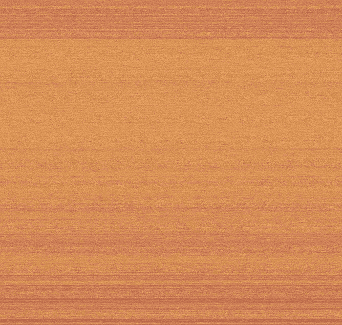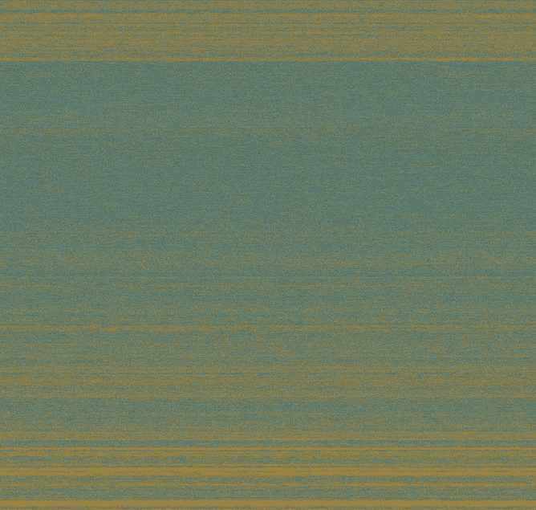

# 这将被用来做什么？

我有几个想法:

1.  **一个只接受邀请的社交网络**,在这里你可以用你第七条染色体的图像代替短代码来添加好友。
2.  Tinder，除了你唯一能添加的图片是你的基因组可视化。这样，你知道你的对手喜欢你的内在。
3.  一种加密货币，在这种货币中，你不需要从哈希函数中解密，而是必须手动将基因组 vis 翻译回字母，一个像素一个像素。
4.  **一个 NFT。(实际上我现在正在努力。)**
5.  **一种视觉辅助工具**，用于解释服用迷幻药后的电视画面。

# 我的外卖

*   我认为这是一种看待基因组数据的有趣方式。诚然，不是超级有用。但是它们看起来很酷吗？100%.(可能更像是 75%)。
*   这只是当我们把生物学和代码结合起来时，我们能做什么的一瞥。

你觉得我下一步应该做什么？我可能会对同源基因或整个进化史这样做。让我知道！