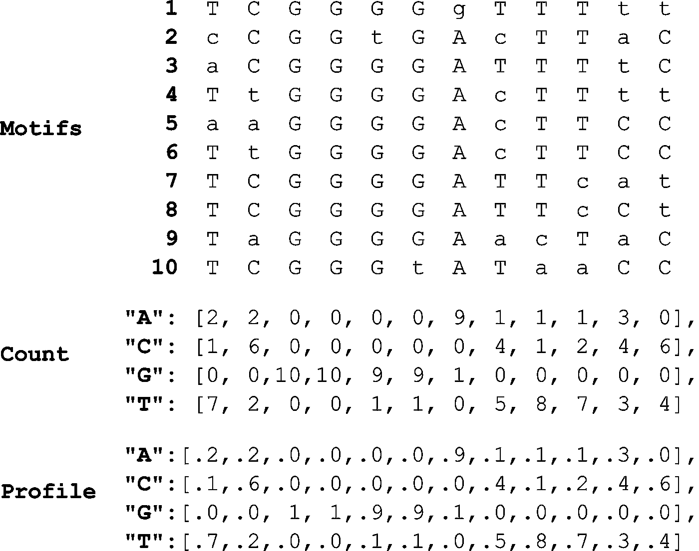

# 如何在基因组干草堆中找到 DNA 针

> 原文：<https://towardsdatascience.com/genomic-haystacks-947e6a46f9ae?source=collection_archive---------24----------------------->

## 使用 Python 寻找基因组中的调控基序


穆尔托·希拉利

如果我请你帮我大海捞针，你只会出于礼节而答应。

如果我告诉你实际上干草堆里有 10 根针，而且它们看起来都略有不同，愤怒会像打掉我的牙齿一样吞噬你。

[吉菲](http://gph.is/2wbEcZR)

这是生物学家在寻找**调控基序**时面临的任务。这些是基因组中的**短 DNA 片段**，结合**转录因子**。TF 是提高或降低其他基因转录水平(*表达*)的蛋白质。

像针一样，调控基序通常彼此相似，但不完全相同。生物信息学家面临的问题是**在他们拥有的所有遗传数据中找到彼此最相似的一组基序**。

一旦我们做到了，我们就能理解重要功能背后的机制，如光合作用或**结核休眠。**

我已经学会了如何使用 Python 来做这件事，你可以在 Codeacademy 上学习。你也可以这样做。

## 在本文中，我们将:

*   为 DNA 基序矩阵生成**计数**和**图谱**矩阵。
*   创建一个**一致性**基序，以**对我们数据中所有基序之间的保守程度进行评分**。
*   根据我们的**轮廓矩阵**确定任何可能的模体出现的**概率**。
*   将这些函数编译成一个**贪婪搜索算法**来扫描 MTB 基因上游区域的基序。

> 这篇文章假设你有遗传学和 Python 的基础知识。

# 倒过来看

假设我们已经有了一个 motfis 矩阵，我们想要测量每个 motfis 之间的相似性——保守水平。(每列中最保守的核苷酸大写。)


(这些是来自黑腹果蝇的 NF-kB 结合位点基序，来自生物信息学算法)。|作者图片

我们的工作:

*   计算每列中**最高度保守的核苷酸**。(`Count()`)
*   **生成“共有”基序**，其中每个碱基是来自`Motifs`中每列的最保守的核苷酸。(`Consensus())`
*   **对`Motifs`中每个模体与共有模体之间的相似度**进行评分。(`Score()`)

# 计数(图案)

创建一个字典`count`，其中关键字是核苷酸(`'A', 'C', 'T', ‘G’`)，值是列表。每个列表元素是关键字的核苷酸在`Motifs`的索引(列)中出现的次数:


' a '在列中出现两次，' C '出现一次，' T '出现七次。|作者


所有代码片段均由作者使用 [ray.so](http://ray.so)

我们初始化一个空字典`count`并用核苷酸键填充它。每一个值都是一个`0`的列表，只要是`Motifs`中的第一个母题。

然后我们迭代`Motifs`中的每一个元素；当我们在`Motifs[i][j]`遇到一个核苷酸`symbol`时，我们在第`j`个索引处增加那个`symbol`键的值。

## 一个惊喜的工具，将帮助我们以后

将计数字典转换为具有`Profile(Motifs)`功能的频率字典；


将`count`中的每个列表元素除以`Motifs`中的主题数。我们得到这样的结果:



按作者

这个以后会派上用场的。

# 共识(主题)

现在，我们可以调用`Count()`作为子程序。在`count`字典的每个索引处取最高计数的核苷酸并附加到空字符串`consensus`:


按作者

在外部循环中，我们遍历来自`count`的列表值中的每个元素。在内部循环中，我们遍历每个核苷酸键。这让我们可以比较第`j`个索引处的每个键值。我们更新`m`总是最高值，让`frequentSymbol` =对应的核苷酸`symbol`。

```
Consensus(Motifs)
>>'**TCGGGGATTTCC'**
```

# 分数(主题)

为了对基序中基序之间的保守程度进行评分，我们可以使用索引`motif[j]`遍历每个元素。


外部循环的范围是行，内部循环的范围是列。

如果`motif[j]`处的核苷酸符号与`consensus[j]`不匹配，我们增加`score`。分数越高=保守性越低。

# 让我们变得贪婪

我们有一种方法来衡量图案之间的保守性。现在，我们需要生成许多*潜在*矩阵`Motifs`，并找到最小化`score`的那个。

我们可以用**贪婪搜索算法**来做到这一点；这意味着我们的算法将在迭代的每一步选择最佳选项。更多[此处](https://brilliant.org/wiki/greedy-algorithm/)。

贪婪算法有三个组成部分:

1.  **数据:**它必须迭代一组**数据。**
2.  **规则:**它遵循**规则**在迭代的每一步做什么。
3.  **结果:**每一步都将该规则的**结果**加到答案中。

## 让我们定义 GreedyMotifSearch(Dna，k，t)其中:

*   `Dna`是一个 DNA 字符串矩阵，我们正在扫描其中的图案。
*   `k`是图案的长度。
*   `t`是`Dna`中 DNA 串的数量。

我们算法的组成部分:

1.  **数据:**遍历`**Dna**`第一个字符串中所有可能的 k-mers。(外环)。
2.  **规则:从`Dna`中的每隔一个字符串中为那些 k-mers 找到最佳匹配**。(内循环)。
3.  **结果:将结果**追加到列表`Motifs`中。

我们可以从创建一个暂定列表`BestMotifs`开始，其中每个基序都是`Dna`中每个 DNA 串的第一个 k-mer。如果我们以后创建一个有更好分数的矩阵，我们将更新这个列表。


让我们从`Dna[0]`中取出第一个 k-mer(再次)将其附加到一个新列表`Motifs`。我们将对第一个 DNA 链中每一个可能的 k-mer 都这样做——这是我们的外环。


我们将基于从`Dna[0]`中提取的第一个 k-mer 来构建`Motifs`的其余部分。(这是第二步，规则)。

使用我们之前制作的`Profile`函数**的轮廓，我们想要在下一个 DNA 串**、`Dna[1]`中找到最相似的 k-mer。


怎么会？好吧，我们还没有这样做的函数，所以让我们写一个。

## 公关(文本，个人资料)

让我们看看我们的简介矩阵。每个元素是**该核苷酸出现在基序中该位置的概率。**


如果分布矩阵随机产生基序，共有序列将出现得最频繁。

**我们还可以确定任何其他字符串基序出现的概率。**简单地乘以每个碱基出现在各自位置的几率:


每个红色碱基都是对共有字符串(顶部)的偏离。注意当我们远离共识字符串时，每个字符串的概率是如何下降的。

**更高的概率=根据`Profile`更好的匹配**。


参数是一个 DNA 字符串`Text`和一个档案矩阵`Profile`。`Text[i]`是`Text`中索引`i`处的核苷酸，也是`Profile`中列表的关键字。`Profile[Text[i]][i]`是同一索引`i`的概率值。

## profilemostparblepattern(Text，k，Profile)

我们现在可以找到任何 k-mer 成为基序的概率——给定一个概率矩阵`Profile`。

让我们遍历一长串 DNA `Text`中的所有 k-mers，并根据`Profile`找到最可能的一个(最佳匹配):


我们生成一个包含 k-mer 及其概率的字典，然后返回第一个具有最高值的 k-mer。(具体内联)。

现在，给定一个`Profile`，一个长度`k`的基元，以及一个更长的字符串`Text`来扫描 k-mers，我们可以返回到`GreedyMotifSearch`。


我们在下一串 DNA ( `Dna[1]`)中找到最可能的模式，并将其附加到`Motifs`。(这是第三步，结果)。我们更新这个新矩阵的轮廓`P`，并对每个 DNA 串重复这个过程。

当我们完成内部循环时，我们可以比较`Motifs`和`BestMotifs`的分数。如果`Motifs`得分降低，我们更新`BestMotifs`；在`Dna[0]`中对每个可能的 k-mer 重复该过程。


# 熵(主题)

我们还没有完全完成。我们的得分函数是不完善的。请注意，一些列比其他列有更多的变化，但它们仍然得分相同(第二列和最后一列)。


在该图中，每列的分数被取下来并相加。这是为了视觉辅助；在代码中，我们不需要一定遵守这种模式，也不会遵守。

跟踪每一列的守恒水平的更好的方法是测量熵。

配置文件矩阵中的每一列都是一个概率分布，即总和为 1 的正数。

熵是该分布的**不确定性**，通过对每个概率乘以其二进制对数求和并乘以-1 得出:

[](https://towardsdatascience.com/entropy-is-a-measure-of-uncertainty-e2c000301c2c)

塞巴斯蒂安·科维亚特科夫斯基

更低的熵=更少的不确定性和更大的守恒。


因为我们要对所有的值求和，所以我们不必逐列进行。我还选择了减法，而不是加法，因为我们在公式中采用了最终答案的负数。结果是一样的。

遍历`profile`中的每一个元素，如果概率值大于 0 就更新`entropy`(否则我们无法取其二进制对数)。这种公式在实践中更常用，但为了简单起见，这里只是一个脚注。

让我们带着这个宝贝转一圈:

# 用结核病进行测试

**你可能得了肺结核而不自知**。*结核分枝杆菌*结核分枝杆菌(MTB)可以在你的体内潜伏多年，然后才会产生任何影响。

生物学家将缺氧(缺氧)与 MTB 潜伏期联系起来，并发现了帮助细菌在低氧条件下生存的转录因子(DosR)。

我们将观察 DosR 影响的一些基因的上游区域，试图找到一些它可能结合的基序。(我修改了`GreedyMotifSearch`，用`Entropy()`代替了`Score()`。)

我们正在查看的 DNA 字符串可以在这里找到，我已经将它们收集到一个名为`DosR`的列表中。


您的结果:

```
['ATGACCAGCGAGCTG',
 'CCGATCGGCATCACT',
 'ACCGTCGATGTGCCC',
 'GGGTCAGGTATATTT',
 'GTGACCGACGTCCCC',
 'CCGCTGGCGACGCTG',
 'GTGTCCGGCATGATC',
 'CGGCCAGACAAGCTT',
 'GCGATAGGTGAGATT',
 'CTCATCGCTGTCATC'] 18.492751844642765 CCGACCGGCATGCTC
```

恭喜你，成功了！亲吻你的配偶，和一只狗击掌，开着警车兜风。

对吗？

如果你看一下文献，这些不是你要找的主题。

[期限](https://tenor.com/uXNR.gif)

他们使用的[算法](https://www.ncbi.nlm.nih.gov/pmc/articles/PMC140044/)和数据更好——**贪婪算法的速度快，但准确性差。**

实际上，我们今天开发的算法永远不会被使用——就像我在精神崩溃时买的滚轴溜冰鞋一样。

# 关键要点

*   这可能不是最重要的算法，但它为将来学习更复杂的算法奠定了基础。
*   复杂的问题可以有复杂的解决方案——但是你仍然可以使用简单的工具来构建它们(比如你可以在 Codeacademy 上免费学习的所有 Python)。

感谢阅读！

我写的其他生物信息学文章:

[](/tanks-bioinformatics-c233fb76787b) [## 二战坦克如何教会你生物信息学

towardsdatascience.com](/tanks-bioinformatics-c233fb76787b) [](/biology-code-match-518202a71d8d) [## 为什么生物学和代码是天作之合

towardsdatascience.com](/biology-code-match-518202a71d8d) [](/genome-painting-c7e2398b4579) [## 你如何把基因组变成一幅画

towardsdatascience.com](/genome-painting-c7e2398b4579)