# 基因组学新衣服

> 原文：<https://towardsdatascience.com/genomics-new-clothes-6301ab9798a7?source=collection_archive---------11----------------------->

## [理解大数据](https://towardsdatascience.com/tagged/making-sense-of-big-data)、[面向生命科学的数理统计和机器学习](https://towardsdatascience.com/tagged/stats-ml-life-sciences)

## 维数灾难如何使遗传学研究复杂化

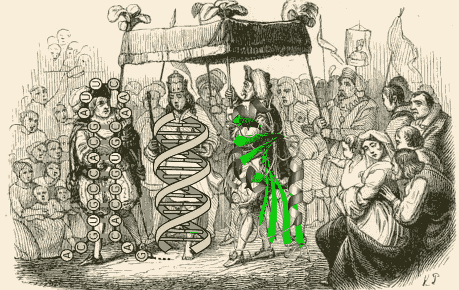

修改自维基百科[皇帝的新衣](https://en.wikipedia.org/wiki/The_Emperor%27s_New_Clothes)

这是我的专栏 [**生命科学的数理统计与机器学习**](https://towardsdatascience.com/tagged/stats-ml-life-sciences?source=post_page---------------------------) 的**第二十二篇**文章，在这里我用通俗易懂的语言讨论了计算生物学中常见的一些神秘的分析技术。全基因组 [**基因分型**](https://en.wikipedia.org/wiki/Genotyping) 和[**全基因组测序**](https://en.wikipedia.org/wiki/Whole_genome_sequencing)**【WGS】**给生命科学中的基因研究带来了前所未有的分辨率，但也导致了高维度[遗传变异](https://en.wikipedia.org/wiki/Genetic_variation)数据的快速增长，遭受了 [**维数灾难**](https://en.wikipedia.org/wiki/Curse_of_dimensionality) 。在本文中，我将给出这个问题的一些理论背景，并讨论为什么在现代[遗传学](https://en.wikipedia.org/wiki/Genetics)和[基因组学](https://en.wikipedia.org/wiki/Genomics)中进行任何有意义和稳健的分析都极具挑战性。

# 基因组学:进步还是倒退？

从事基因组数据工作的每个人可能都至少听过一次资深同事说过的一句话:

> 我记得我曾经研究 10 种基因变异，现在由于全基因组测序技术，我们可以分析数百万种基因变异。

每当我听到这个短语，我就会想，当一名分析师与 10 种基因变异打交道时，他的生活是多么轻松，而如今分析百万维的基因变异数据是多么令人头痛。我担心基因组学研究的稳健性的原因是因为我通常从矩阵维度的 T2 角度考虑任何类型的数据。

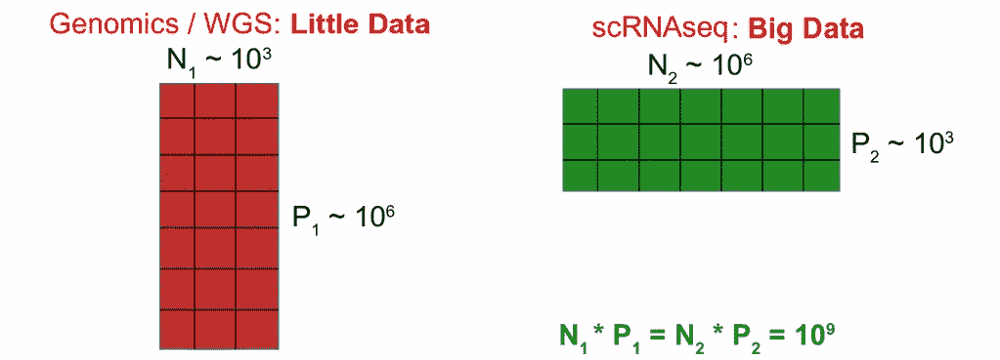

作者图片

对我来说，分析技术的选择取决于 N(统计观察值、样本的数量)和 P(变量/测量值/特征的数量)之间的比率。在上图中，您可以看到遗传变异数据矩阵(左)的这一比率与 scRNAseq 数据(右)非常不同，尽管维度的乘积是相等的。事实上，通常对于一个 WGS 项目，我们可以对大约 1000 个样本进行测序(参见 [1000 个基因组项目](https://en.wikipedia.org/wiki/1000_Genomes_Project))，而我们发现个体基因组之间有数百万个突变差异，因此特征空间是百万维的。这与[单细胞测序](https://en.wikipedia.org/wiki/Single_cell_sequencing)中的数据结构是正交的，在单细胞测序中，样本大小每年都打破记录，接近**百万个测序的细胞**，而每个细胞表达的基因数量通常被限制在大约 1000 个，至少对于高通量 [10X 基因组学](https://www.10xgenomics.com/)技术而言是如此。因此，虽然包含相似数量的元素，但来自遗传变异和 scRNAseq 的数据矩阵却截然不同。我将 **scRNAseq 称为大数据**，因为它为分析提供了很大的灵活性和**统计能力**。相比之下，我倾向于将**基因变异视为少量数据**，因为使用这种高维数据类型有许多限制。

# 基因组学中的高维 P >> N 极限

通常，我会选择一种特定类型的分析，着眼于数据的维度。例如，如果 N ~ P 或 N > P，我们可以使用传统的[频率统计](https://en.wikipedia.org/wiki/Frequentist_inference)。如果我们有很多数据点，即 N > > P(流行病学极限)，人们当然可以再次使用频率统计，但这个极限给了我们更多的自由来尝试[非线性方法](https://en.wikipedia.org/wiki/Nonlinear_system)，如机器和深度学习。最后，在最困难的极限 P > > N(高维数据)中，频率统计的假设，如正态假设，不再有效，人们应该在贝叶斯方法中使用一些[正则化](https://en.wikipedia.org/wiki/Lasso_(statistics))或[先验](https://en.wikipedia.org/wiki/Prior_probability)。如你所见，基因变异数据落入 P > > N 极限。

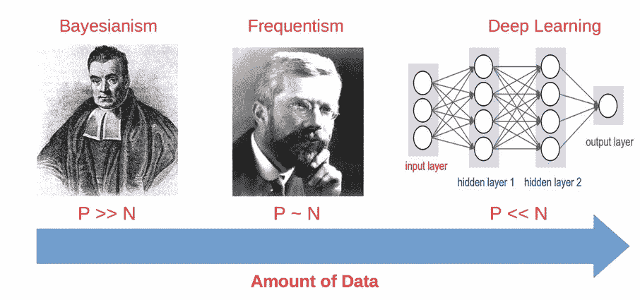

图片由作者修改自[维基百科](https://en.wikipedia.org/wiki/Thomas_Bayes)

为什么在极限 P >> N 中继续使用传统的频率统计是危险的？一个例子是线性回归 Y~X 问题，其中 X 是高维的基因型矩阵，Y 是感兴趣的变量(性状或表型)。原来线性回归问题在高维(P >> N)极限下无法求解是因为协方差矩阵不能求逆，在极限下由于[维数灾难](https://en.wikipedia.org/wiki/Curse_of_dimensionality)而发散。

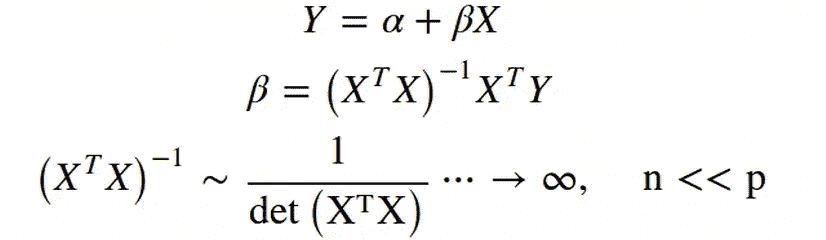

另一个例子是最大似然法中著名的 [**有偏方差估计**](https://en.wikipedia.org/wiki/Bias_of_an_estimator) (这是频率统计的同义词)。可以[推导出](https://people.csail.mit.edu/xiuming/docs/tutorials/reml.pdf)最大化 p 维多元高斯分布估计的方差为

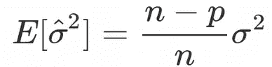

在这里，您可以清楚地看到 N 和 P 之间的**相互作用，即 P 越接近 N(仍然提供 N > P ),方差估计值就越有偏差。我不知道这个方程在高维极限 P > > N 下会是什么样子。我假设[卡尔·皮尔逊](https://en.wikipedia.org/wiki/Karl_Pearson)、[罗兰费希尔](https://en.wikipedia.org/wiki/Ronald_Fisher)和其他频率主义方法的创始人从来没有考虑过可能存在维数为 P > N 的数据**

一种有趣的方式来展示高维(P >> N)和低维(P << N) data is to compute the [主成分分析(PCA)](https://en.wikipedia.org/wiki/Principal_component_analysis) 之间的差异，并显示特征值的分布，这至少对于具有不同维度的[随机矩阵](https://en.wikipedia.org/wiki/Random_matrix)可以很容易地完成。

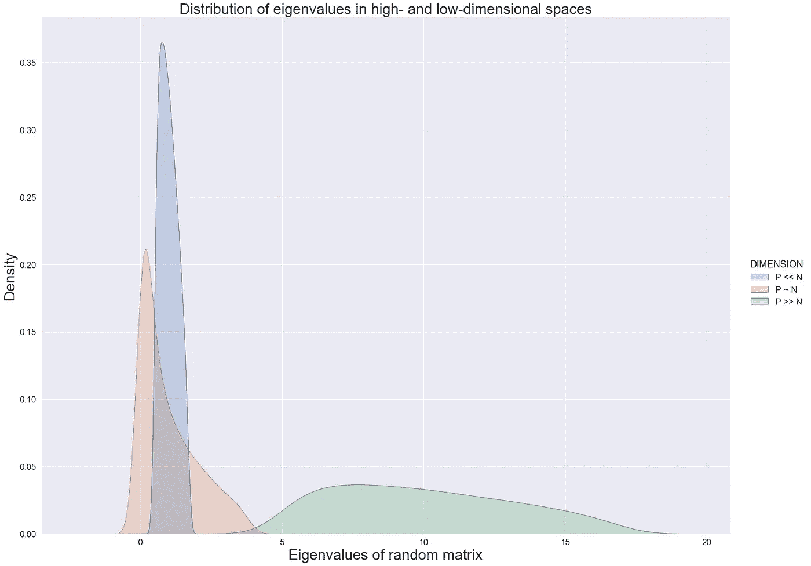

从上图中，我们可以看到不同维度数据的特征值分布形状和计算范围之间的明显差异。特征值遵循 [Marchenko-Pastur](https://en.wikipedia.org/wiki/Marchenko%E2%80%93Pastur_distribution) 定律，这种分布可用于进一步研究高维基因组数据的性质。

# 基因组数据的稀疏性

基因组学中维数灾难的一个显著表现是基因组学数据的稀疏性。稀疏性是指对实验中测量的某些变量范围缺乏统计观察(通常是由于**采样**不良)。在基因组学的情况下，稀疏性是无法找到足够多的 [**稀有等位基因**](https://en.wikipedia.org/wiki/Allele) 携带者的结果。考虑 100 个个体中的 3 个[单核苷酸多态性](https://simple.wikipedia.org/wiki/Single_nucleotide_polymorphism) [基因型](https://en.wikipedia.org/wiki/Genotyping)。假设所有三个 SNP 的[次要等位基因频率(MAF)](https://en.wikipedia.org/wiki/Minor_allele_frequency) 为 10%，我们可以预计每个 SNP 只有 10 个次要等位基因携带者，两个 SNP 同时只有 1 个次要等位基因携带者，所有三个 SNP 位置同时有 0 个次要等位基因的样本。

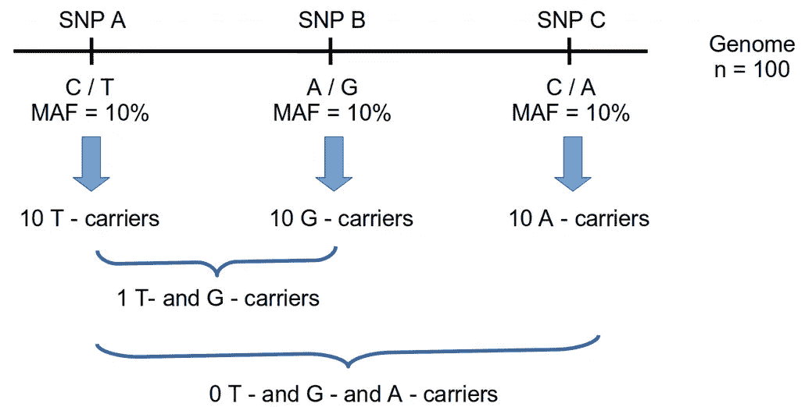

作者图片

因此，我们原则上不能将这 100 个个体的特征与所有 3 个 SNPs 的次要等位基因联系起来。此外，即使我们试图同时针对仅两个 SNPs**、Phen ~ SNP1 + SNP2(即在 2 维空间中)进行表型(Phen)的关联，我们仍然不能稳健地计算它，因为缺少对两个次要等位基因一起的携带者的观察(**仅有 1 个样本**)。在下图中，圆圈是次要等位基因的载体。对于 1D 问题，Phen ~ SNP A，我们有 10 个次要和 90 个主要等位基因携带，这可能足以进行稳健的线性或逻辑回归分析。但是，当我们遇到一个 2D 问题，Phen ~ SNP A + SNP B，我们在 2D 参数空间的右下方只有 1 个样本，由于**采样不当**，无法进行回归分析。**

**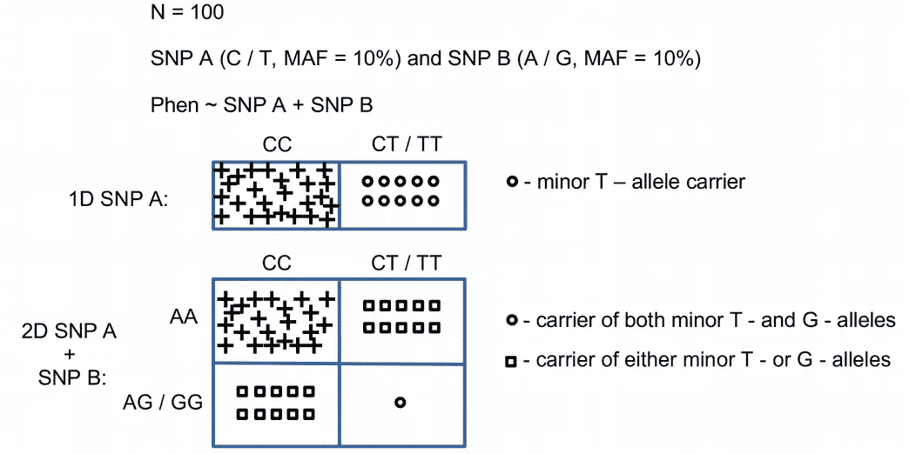**

**作者图片**

**因此，尽管合理的样本量 n=100(至少对于进化生物学来说是合理的样本量)，我们不能计算两个 SNP 对一个性状变异(Phen)的同时影响。此外，即使是 n=50 万参与者的英国生物银行也不能一次分析超过 4-5 个 MAF = 10%的 SNPs。注意，对于 p=1 000 000 个 SNPs(遗传英国生物银行数据集的近似维数)，样本量 n = 500 000 并不足够大，我们在 p > > n 处仍有稀疏数据，遭受**维数灾难**。**

# **基因组学中的缺失遗传力问题**

**实际上，我们能做的最好的事情就是一次分析 1 个 SNP，类似于[**【GWAS】**](https://en.wikipedia.org/wiki/Genome-wide_association_study)【全基因组关联研究】。这意味着我们无法捕捉到变体之间的任何**相互作用** **，假设一个表现型可能是由来自多个变体的次要等位基因的**共现**引起的，而不是来自单个 SNPs 的影响。为了说明多个 SNPs 的影响，通常构建一个所谓的[多基因风险评分(PRS)](https://en.wikipedia.org/wiki/Polygenic_score) ，随后可以在独立样本中根据感兴趣的性状/表型进行验证。****

**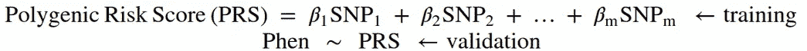**

**然而，这导致了一个被称为[的问题，即缺失遗传率问题](https://en.wikipedia.org/wiki/Missing_heritability_problem)。问题被公式化为**缺乏对来自遗传变异数据的感兴趣的表型的可靠预测**。换句话说，单独检测到与感兴趣的表型相关的遗传变异**，当在多基因风险评分(PRS)中折叠在一起时，不能解释感兴趣的表型中合理的**变异量**。****

********

****来自 Maher 等人，自然 456，18–21，2008，[图片来源](https://www.nature.com/news/2008/081105/full/456018a.html)****

****尽管已经提出了缺失遗传率问题的多种解释，但一件明显的事情是要注意，GWAS 的因果遗传变异是逐个搜索的(因为我们没有能力测试多个 SNP)并在 PRS 中以**加性**的方式放在一起，因此不能解释潜在可能构成表型变异的多个变异的 [**上位**](https://en.wikipedia.org/wiki/Epistasis) **非加性效应** **。******

****基因组学数据中导致个体而非集体测试基因变异的维数灾难的另一个重要后果是[必须校正多重测试](https://en.wikipedia.org/wiki/Multiple_comparisons_problem)，以减少[假阳性发现的数量](https://en.wikipedia.org/wiki/False_positives_and_false_negatives)。然而，这似乎并没有完全解决假阳性发现的问题。正如 Naomi Altman 等人在下面的 Nature Methods 文章中优雅地展示的那样，以 5% 的可接受的 [**假发现率**](https://en.wikipedia.org/wiki/False_discovery_rate) **校正多重测试仍然会导致大量假阳性，远远超出预期数量。******

****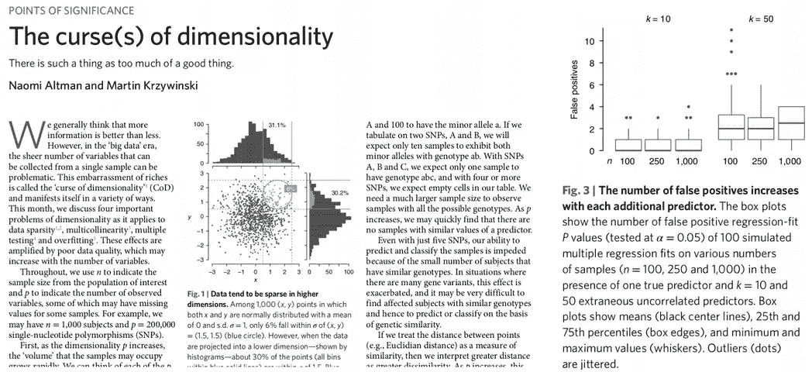****

****《维度的诅咒》。Nat 方法。2018 年 6 月；15(6):399–400****

****因此，即使在非常有力的 GWAS 研究中，也并不罕见地看到明显虚假的但强烈的基因信号，如“家庭车辆数量”、“看电视的时间”、“过去 3 个月每周使用手机”、“沙拉/生蔬菜摄入量”等。多亏了 [GWASbot](https://twitter.com/SbotGwa?ref_src=twsrc%5Egoogle%7Ctwcamp%5Eserp%7Ctwgr%5Eauthor) ，如今这种情况可以被探测和探索。****

****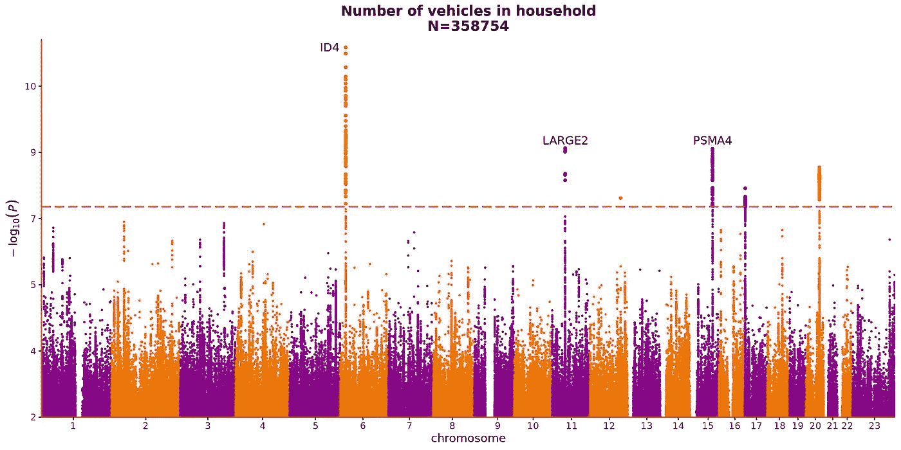****

****英国生物银行数据，来源: [GWASbot](https://twitter.com/SbotGwa/status/1212357023028908033)****

****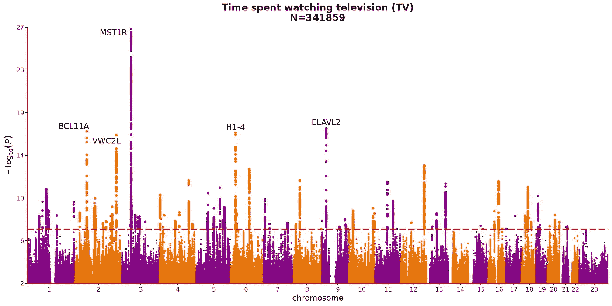****

****看电视的时间来自英国生物银行的数据，来源: [GWASbot](https://twitter.com/sbotgwa/status/1271063975132909569?lang=en)****

****那些表型很难相信是 [**可遗传的**](https://en.wikipedia.org/wiki/Heritability) ，因此它们强烈的“遗传信号”可能来源于[被另一个因素](https://en.wikipedia.org/wiki/Confounding)[如](https://en.wikipedia.org/wiki/Population_structure_(genetics))群体结构混淆。现实中很少知道混杂因素，这一事实使我们使用遗传研究预测常见性状(如疾病)的能力变得更加复杂，例如 [**精准医疗**](https://en.wikipedia.org/wiki/Precision_medicine) 。****

****因此，如果我们使用 GWAS 研究中发现的基因变异来预测常见疾病，如[二型糖尿病(T2D)](https://en.wikipedia.org/wiki/Type_2_diabetes) 和[腹主动脉瘤(AAA)](https://en.wikipedia.org/wiki/Abdominal_aortic_aneurysm) ，与基于**临床因素**(体温、血压等)的预测相比，这可能不会成功。)单独来看，见下文。****

****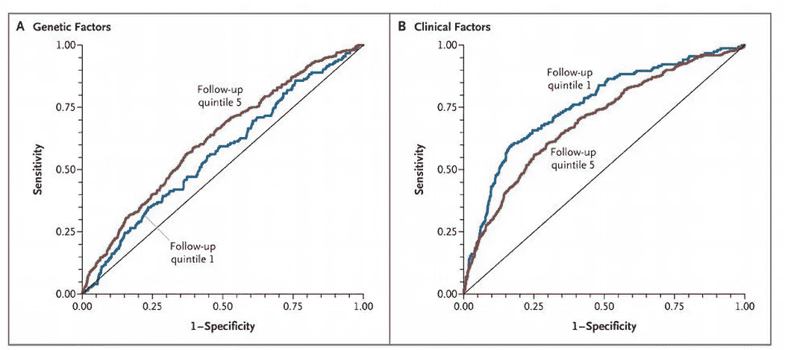****

****[Lyssenko 等人，2008，新英格兰医学杂志 359，2220–2232
临床风险因素、DNA 变异和二型糖尿病的发展](https://pubmed.ncbi.nlm.nih.gov/19020324/)****

****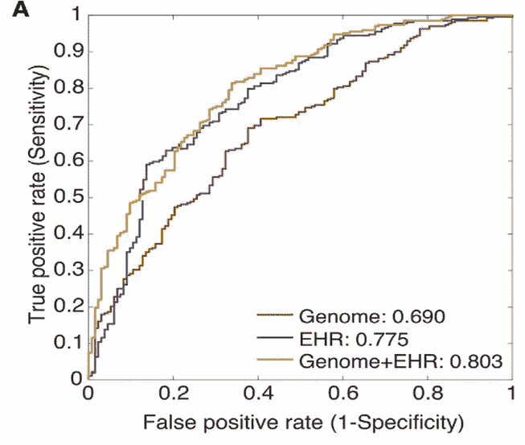****

****[李等，2018，Cell 174，1361–1372
解码腹主动脉瘤基因组学](https://pubmed.ncbi.nlm.nih.gov/30193110/)****

****此外，最近的一项研究表明，在区分复杂的人类疾病方面，**微生物组**数据**的预测能力超过了**GWAS 的研究。****

****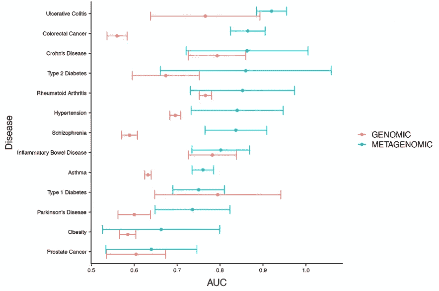****

****[Tierney 等人，在复杂人类疾病的鉴别中，微生物组的预测能力超过了全基因组关联研究](https://www.biorxiv.org/content/10.1101/2019.12.31.891978v1)****

****基于遗传变异数据的不良预测是数据的非常复杂的高维本质的另一个证明，该数据遭受维数灾难。****

# ****维数灾难理论****

****让我们给维数灾难一些理论背景。如果我们设想一个高维数据，比如基因变异，我们会非常惊讶地发现这些数据在高维数据中是多么奇怪。例如，让我们模拟一个均匀分布在 p 维球**中的数据，p = 2、5、10、100，将数据的任意两个维度可视化:******

******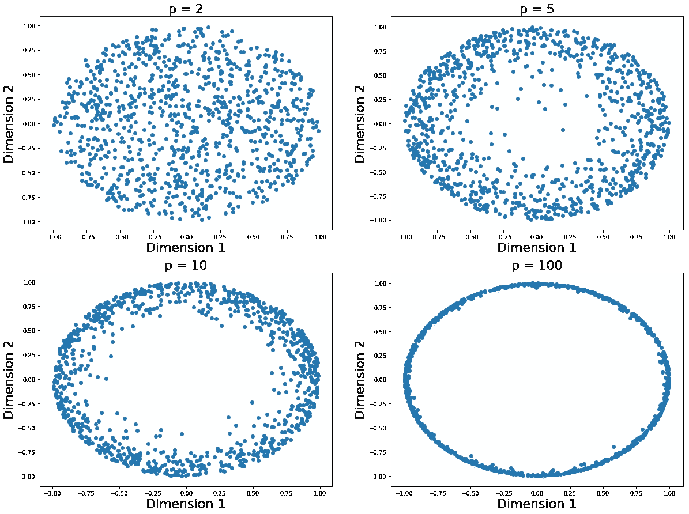************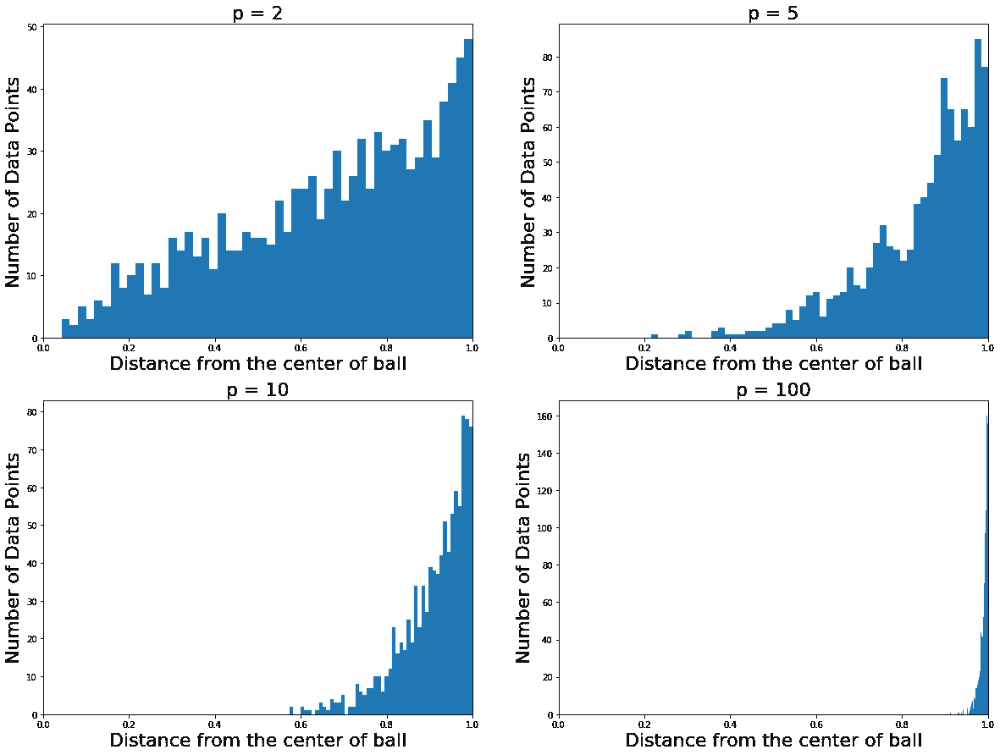******

******事实证明，当空间的维数增加时，数据点越来越集中在具有中空中心的 p 维球的表面上。此外，如果我们绘制成对的[欧几里得距离](https://en.wikipedia.org/wiki/Euclidean_distance)的直方图，随着空间维度的增长，数据点将看起来彼此越来越**等距**和**远离****，请注意当增加下图中的维度时，分布如何变得更窄并向更大的距离移动。********

******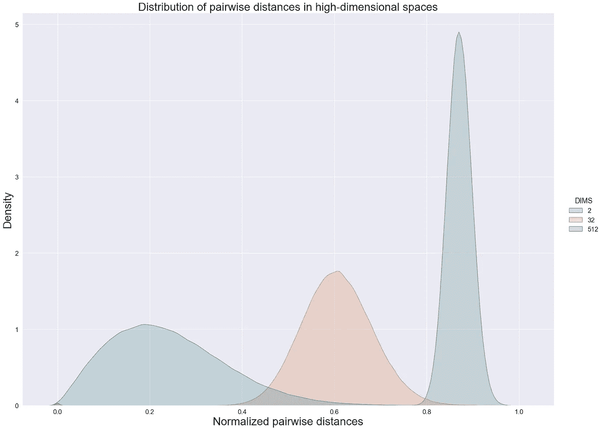******

******可以推导出平均成对欧几里德距离随着维数的平方根而增长。这个定律清楚地表明，在高维空间中，数据点**彼此远离**。******

****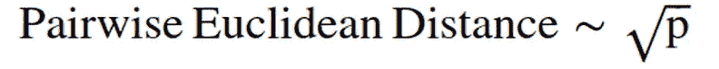****

****为了从经验上证明这一定律，我们将构建一个**随机数据矩阵**，计算所有数据点对之间的**欧几里德距离**，并可视化这种相关性。下图中的绿色曲线是平均距离，红色曲线显示平均值的两个标准偏差。****

****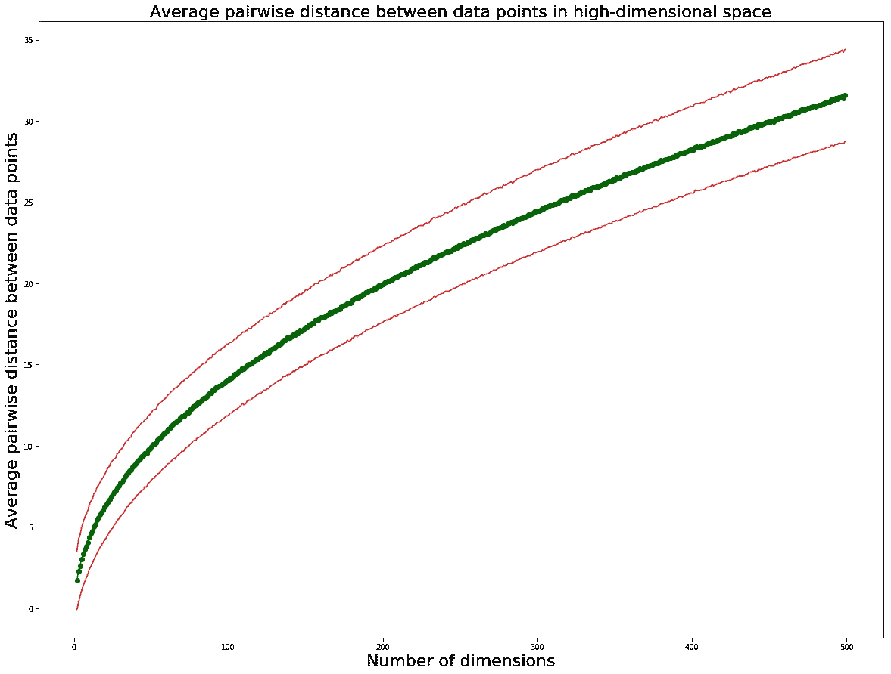********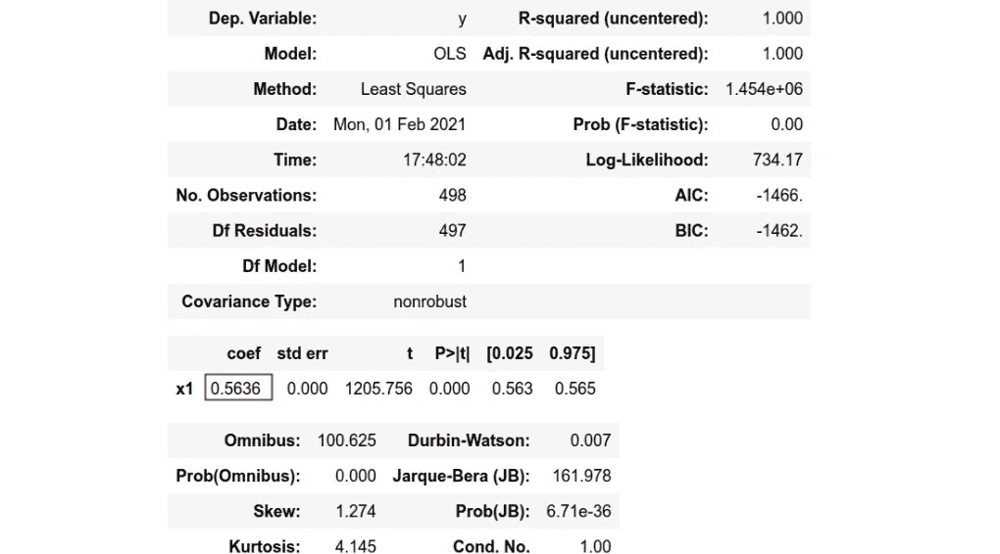********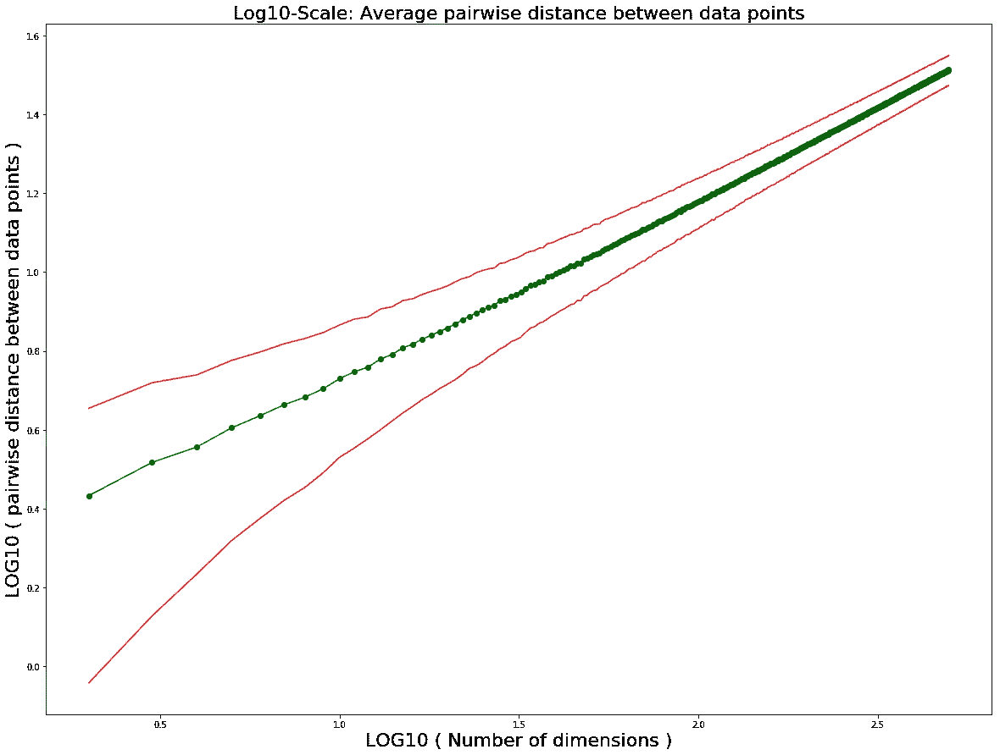****

****后一幅图显示了数据点之间的平均成对欧几里德距离，作为**对数标度**上维数的函数。计算普通最小二乘(OLS)线性回归可以得到直线的斜率等于 **0.56** ，接近于理论值 **0.5** 。以类似的方式，计算任何给定数据点与其最近、中间和最远邻居之间的平均距离，可以得到下图:****

********

****我们可以看到，在高维空间中，从一个数据点到其最近和最远邻居的距离之间的差异变得不可区分。这意味着我们不能再根据相似性度量将“好的”、“坏的”和“难看的”数据点组合在一起。因此，高维空间中的**聚类**被广泛认为是非常**不可靠的**，仅仅因为所有的数据点看起来**彼此同样相似**。就遗传变异数据而言，这意味着例如“患病”和“健康”个体**不能根据它们的遗传信息**被可靠地分开，这导致对性状的不良预测，并最终导致缺失遗传率问题。在我的上一篇文章[如何在高维空间中聚类](/how-to-cluster-in-high-dimensions-4ef693bacc6)中，我试图详细探讨聚类问题。您可能还想查看文章[在高维度中没有真正的影响](/no-true-effects-in-high-dimensions-1f56360182cd)，以更好地直观了解高维度数据分析中的怪异现象。****

****高维数据点分组不佳的另一个表现是数据点之间的相关性非常弱。下面，我们构造一个服从正态分布的随机数据矩阵，并计算所有数据点对之间的[皮尔逊相关系数](https://en.wikipedia.org/wiki/Pearson_correlation_coefficient)。****

****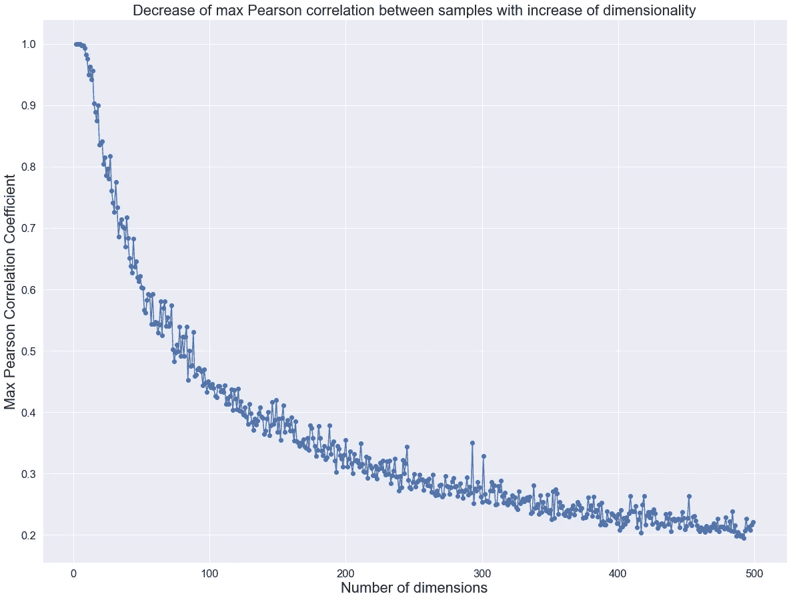****

****上图显示了样本对之间的**最大皮尔逊相关**，作为数据维度增加**的函数。我们观察到，当维数达到大约 100 时，没有一对数据点表现出与系数高于 0.5 的皮尔逊相关，这意味着数据点越来越难以在高维度中分组和聚类。就遗传变异而言，通过使用基因型的原始矩阵，根据样本的**遗传背景**将样本分配到某个**群体**是有问题的。为了解决这个问题，人们至少应该尝试 [**减小尺寸**](https://en.wikipedia.org/wiki/Dimensionality_reduction) 。******

# **对抗维数灾难的方法**

**我们能做些什么来最小化基因组数据中维数灾难的损害？我认为以下四个选项可以改进我们在遗传学研究领域的分析:**

*   **增加样本量(流行病学极限)**
*   **规则化([套索](https://en.wikipedia.org/wiki/Lasso_(statistics))，山脊，弹性网)**
*   **[降维](https://en.wikipedia.org/wiki/Dimensionality_reduction)(主成分分析，UMAP 等。)**
*   **使用[贝叶斯统计](https://en.wikipedia.org/wiki/Bayesian_statistics)(先验具有正则化效果)**

**增加样本量是一种蛮力方法，并不总是负担得起，但这是最直接的方法。**正则化**在我看来应该更多的用在遗传学研究中。至少在滑动窗口中用[套索](https://en.wikipedia.org/wiki/Lasso_(statistics))进行全基因组关联研究似乎是一件可行的事情，可以解决**上位**的问题，而不会因为维数灾难而产生很多问题。进行降维，用**潜变量**替代原始基因型数据，似乎是克服维数灾难问题的一种相对简单有效的方法，文献[中已经有一些有希望的尝试](https://www.nature.com/articles/s41431-021-00813-0)。最后，**贝叶斯统计**是在动力不足的研究中进行有意义分析的另一种方式，这要归功于**先验**，其本质上提供了**正则化**并降低了对于高维遗传变异数据**过度拟合的风险。****

# ****摘要****

****在这篇文章中，我们已经了解到，由于数据的高维性会遭受**维数灾难**，因此用遗传变异数据进行稳健分析**是**极具挑战性的**。由于样本量小和遗传变异数据的稀疏性，遗传学分析通常会导致常见性状的预测能力差，这就是所谓的**缺失遗传力**问题。当数据点变得**等距**并且彼此**相关性很差**时，高维数据表现出**反直觉**的方式，这导致在**聚类**数据时出现严重问题。******

**像往常一样，让我在下面的评论中知道生命科学和计算生物学中的哪些话题对你来说似乎是特别神秘的，我会在这个专栏中尝试回答这些问题。在我的 [github](https://github.com/NikolayOskolkov/GenomicsNewClothes) 上查看完整的笔记本。在 Medium [关注我，在 Twitter @NikolayOskolkov 关注我，在 Linkedin](https://medium.com/u/8570b484f56c?source=post_page-----6301ab9798a7--------------------------------) 关注我。在下一篇文章中，我们将讨论如何在 UMAP 空间聚集**，敬请关注。****