# 温和介绍 2D 手姿态估计:方法解释

> 原文：<https://towardsdatascience.com/gentle-introduction-to-2d-hand-pose-estimation-approach-explained-4348d6d79b11?source=collection_archive---------8----------------------->

## *让自己舒服点，这是一篇很长的文章*

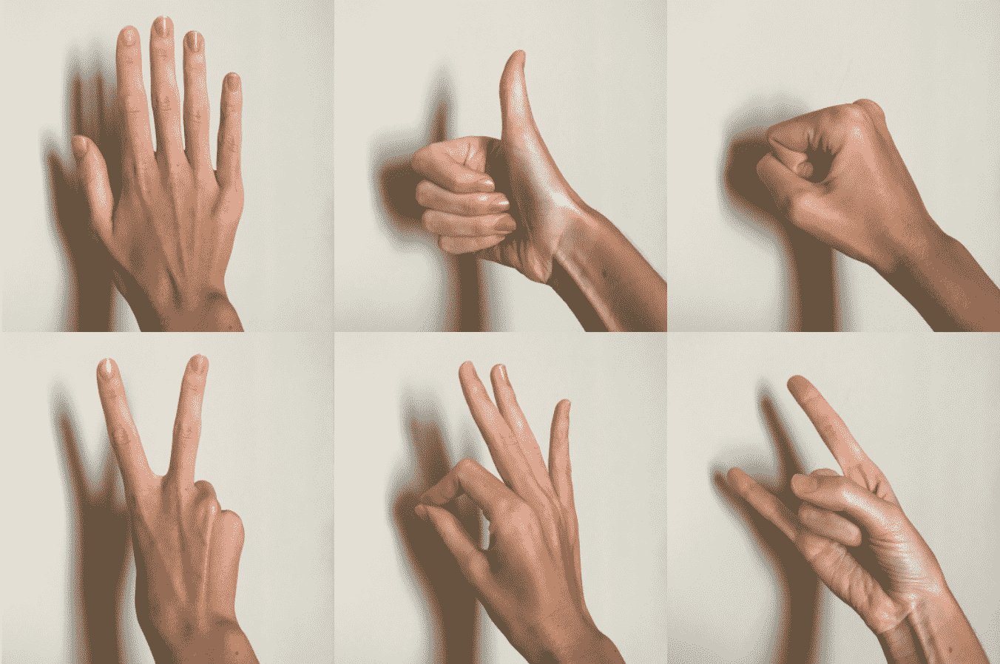

作者图片

2018 年，我花了 6 个月时间完成了关于手部姿态估计的硕士论文。那是我生命中充满挑战和深刻见解的一段时期，由此产生了 40 页的研究报告。直到现在，我还会收到工作面试邀请，以及感谢信和问题信，这让我认为这项研究仍然有意义，即使 3 年已经过去了——对于深度学习来说，这是一段很长的时间。

我的论文是关于 2D 和从一个单一的 RGB 图像的三维手姿态估计。3D 部分是…嗯…我不会说这是一个彻底的失败，但接近于失败: )然而，2D 部分(令人惊讶地)可与当时最先进的方法相媲美。

在接下来的几个月里，我计划将我的论文转化为一系列关于 2D 手部姿态估计的人性化教程:今天我们从温和地介绍这种方法开始，下一次我将展示如何在代码中实现它，稍后我们将介绍几种更高级的技术来提高模型性能。

好奇吗？我们走吧！

**内容**

# 在手部姿势估计任务中，我们到底在估计什么

一个好问题开始。

手的姿态由其关键点的位置来定义。因此，在手部姿态估计任务中，我们正在寻找关键点位置。

手有 21 个关键点:手腕+ 5 个手指* (3 个手指关节+ 1 个指尖)= 21。想想看:知道了每个关键点的位置，我们就很容易理解一个人是否表现出“手掌向下”、“拇指向上”、“拳头”或“和平”的手势。

秩序很重要。我们不仅仅需要“位置云”，我们需要关键点-位置对应。手腕在哪里？食指的指尖在哪里？等等。

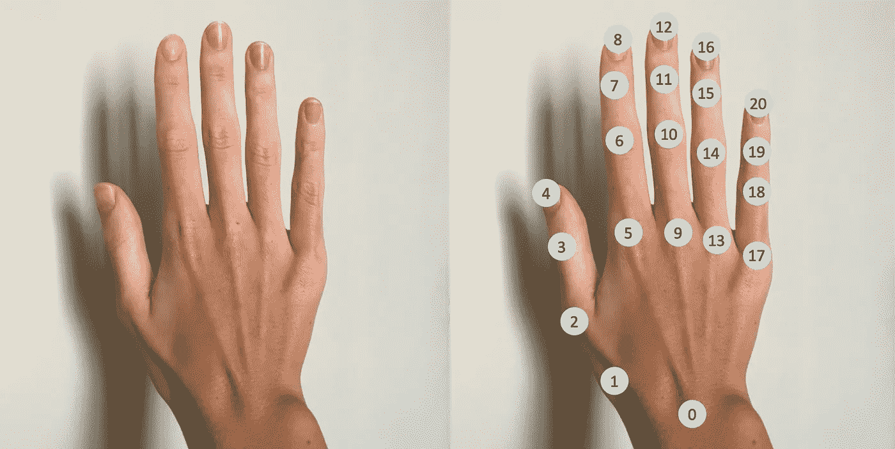

*图片 1。手关键点。这里秩序很重要。作者图片*

一个典型的 2D 手姿态估计器看起来像这样:

*   **输入**:手形图像。对于许多手部姿态估计器来说，这是一个重要的假设:输入图像中只有一只手，并且图像被裁剪以排除任何其他身体部位和背景项目。
*   **输出**:( x，y)关键点位置列表。位置可以表示为像素位置，其中 x 和 y 在范围[0，image_size]内，或者表示为归一化位置-在范围[0，1]内。归一化位置是像素位置除以图像大小。希望，下面的例子能说清楚。

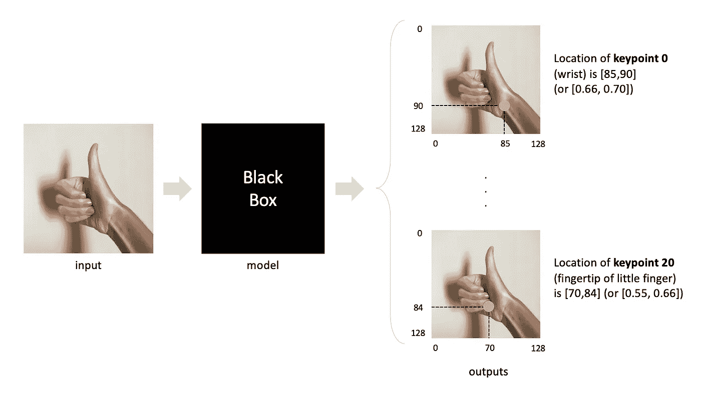

*图片 2。典型 2D 手姿态估计器的可视化*。作者图片

还有几件事需要澄清。

二手怎么样？通常，我们训练姿态估计器只为右手(或左手)工作。如果我们想对左手进行推理，我们只需给出一个看起来完全像右手的镜像模型。

通常，在论文(或演示)中**手的姿势被可视化为一个骨架**，有时还有多色手指。不要让它误导你，骨骼的绘制是为了可视化的目的，通过用线连接关键点。我们知道关键点的顺序，所以我们知道连接哪些关键点对来绘制骨架，对吗？

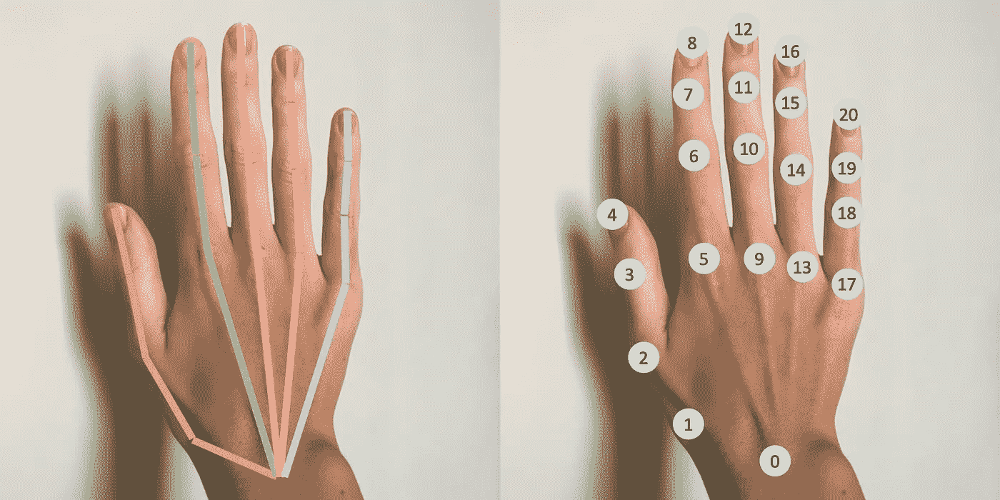

*图片 3。左图:手部姿势是如何被可视化的。右图:如何估计手部姿势。作者图片*

在本教程中，我们将学习**如何从单一的 RGB 图像**中估计 2D 的手部姿态。这意味着，我们将训练一个输入单个 RGB 图像并输出图像平面上的关键点位置的模型。然而，手姿态估计是一个不同任务的大家族:你可以估计具有单个 RGB、单个深度、单个 RGBD(RGB+深度)图像或者甚至多个图像的 2D 或者甚至 3D 手姿态。也许，我会写一个帖子展示所有这些任务的多样性。但是现在，让我们继续。

# 哪里可以找到数据集(以及如何理解它)

尽管收集和(更重要的是)标记手部姿势数据并不是一件容易的事情，但互联网上有几十个数据集。根据您的研究或业务目标，您可能需要:

*   真实或合成数据
*   照片或视频序列
*   图像类型:RGB、深度、RGBD 或立体
*   显示符号或与物体互动的手
*   自我中心或第三人称观点
*   标签:2D 位置，三维位置，网格，手面具，...
*   标记的关键点数量
*   被遮挡的关键点是否被标记，图像中是否存在所有关键点等

你可以在 Github 资源库[2]中找到的所有开源数据集的完整列表。出于学习和研究的目的，您可以随意使用这些数据集，但是，如果您计划为企业培训模型，请确保数据集许可允许这样做。

对于本教程，我选择了 FreiHAND 数据集[3]。它包含 33k 个右手实像，并有 21 个关键点的 2D 标签。这就是我们目前所需要的。

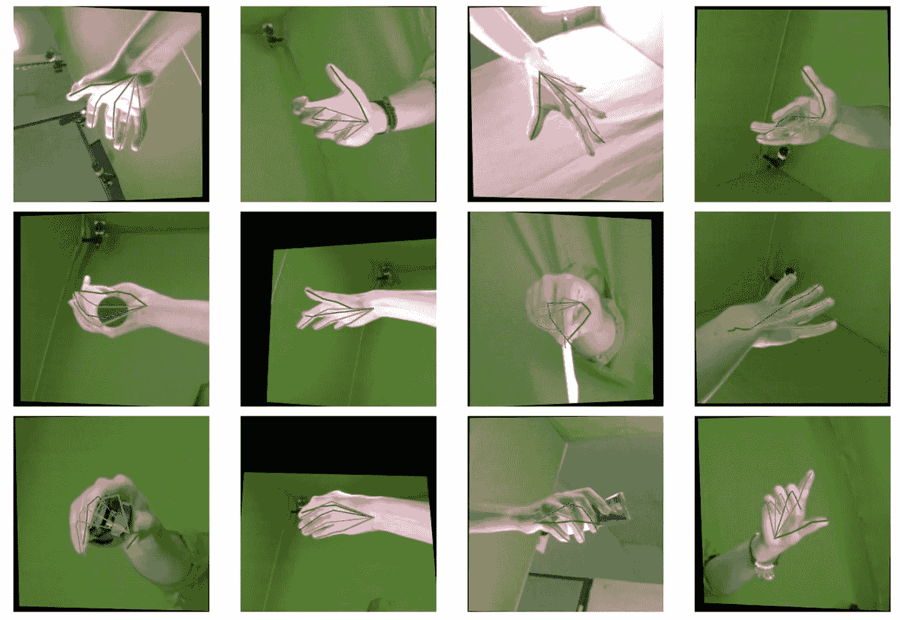

*图片 4。带有 2D 关键点标签的弗赖汉德数据集的随机样本。
颜色:拇指绿色，食指青色，中指蓝色，戒指粉色，小指红色。*

FreiHAND 数据集干净且结构良好，但是，请注意:

*   关键点位置的顺序和我在图 1 中展示的一样。标签存储在 2D numpy 数组中，其中手腕的位置在第 0 行，小指指尖的位置在第 20 行。
*   你需要自己计算 2D 的位置，使用 3D 位置和相机矩阵。使用我在 FreiHAND 数据集 Github repo [4]中找到的公式:

```
def projectPoints(xyz, K): 
    xyz = np.array(xyz) 
    K = np.array(K) 
    uv = np.matmul(K, xyz.T).T 
    return uv[:, :2] / uv[:, -1:]
```

*   在训练部分，有 130，240 个图像，只有 32，560 个标签。这些标签仅适用于前 32，560 张原始图像。如果您想要在所有图像(原始图像+增强图像)上训练模型，以下是获取标签的方法:

```
image_labels = labels_array[image_id % 32560]
```

那是因为图像 32560 看起来和图像 0 一模一样，以此类推。

# 如何对训练数据进行预处理

下面是一个逐步说明:

1.将数据集拆分为训练、验证和测试部分。像往常一样，训练集将用于训练模型，验证部分我们选择何时停止训练，我们在测试集上评估模型性能。

2.将图像大小调整为 128×128 像素。手是一个简单的物体，所以这样的尺寸应该没问题。如果关键点位置是像素格式，请确保您也“调整”它们的大小。

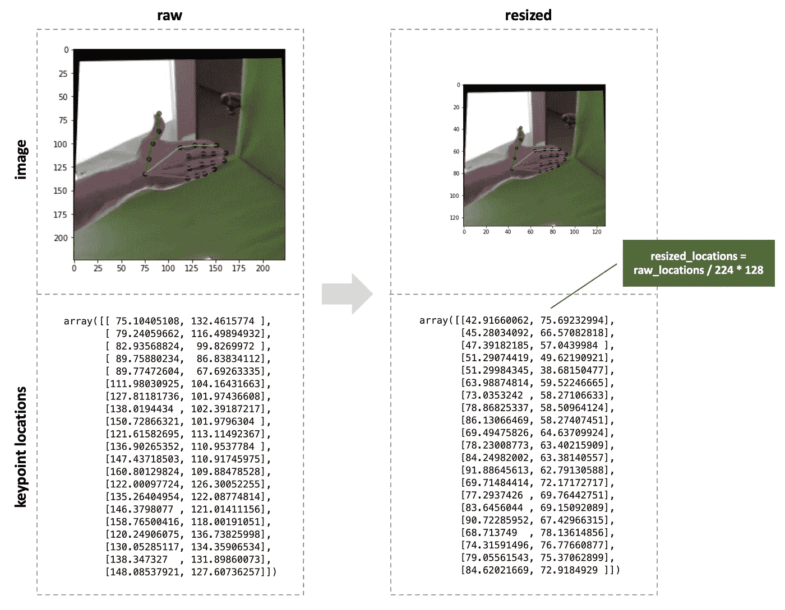

*图片 5。调整图像大小时，关键点位置也应该“调整大小”。作者图片*

3.原始图像值在范围[0，255]内，最小-最大缩放它们到范围[0，1]内。

4.标准使用训练集平均值和标准偏差归一化图像。每个通道(R，G，B)分别归一化，所以总共有 3 个均值和 3 个标准差。通道均值(和标准差)是在一个颜色通道内的所有图像的所有像素中计算的。

5.从一系列关键点位置创建热图。用热图估计姿势是 2D 手(和人类)姿势估计中广泛使用的方法，你会在任何论文中看到它(稍作修改)。
我相信研究[5]是最早使用热图的领域之一。

我们需要为每个关键点创建一个单独的热图，因此总共有 21 个热图。详情请看下图。

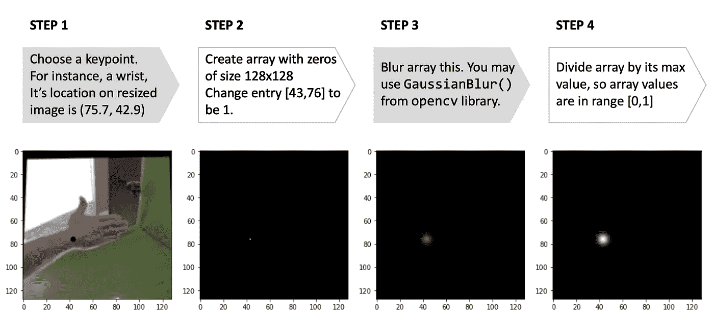

*图片 6。如何为关键点创建热图？作者图片*

热图是模糊的，以防止模型过度拟合，并使学习稳定和更快。实际的模糊参数并不重要，这里唯一的规则是不要让关键点“点”太大或太小。需要最终的最小-最大缩放，因为我们将在神经网络的最后一层使用 Sigmoid 变换，因此热图和模型预测在相同的范围内。

总结一下:

*   x 是大小为 3x128x128 的图像。
*   y 是一个大小为 21x128x128 的数组，包含 21 个与输入图像大小相同的堆叠热图。确保热图顺序与图 1 中的关键点顺序相同。

# 使用什么模型架构

我们需要某种编码器-解码器模型，因为输出与输入的大小相同——128×128。我个人在这里的偏好是 UNet [6]。我和 UNets 一起工作过很多次，用它们完成各种分割任务，它们的表现总是令人惊叹。

我们不需要像原始论文[6]中那样复杂的 UNet，因为手是一个简单的对象。让我们从这样的事情开始:


*图 7。我的简单的自定义 UNet-like 模型 2D 手姿态估计*。作者图片

# 培训详情

**损失。**大多数论文使用热图的 MSE 损失，例如，这两篇关于 2D 人体姿态估计的流行论文— [7]，[8]。我花了一些时间玩 MSE 损失，但它就是不起作用。

然后我找到了论文[9]，其中作者使用交集/并集(IoU)损失训练了一个语义分割模型。2D 手部姿态估计类似于分割，唯一的区别是热图具有范围[0，1]内的连续值，而不仅仅是二进制标签 0/1 作为分割掩码。然而，我们可以使用[9]中的公式，对热图稍加修改。而且很管用！

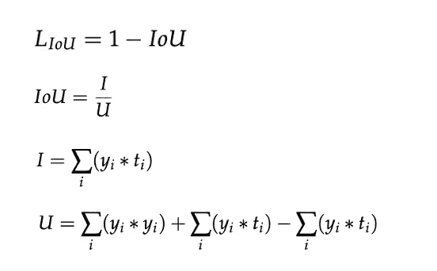

*形象 8。如何计算热图的 IoU 损失？yi —预测值，ti —热图*中像素的目标值。*分别为每个热图计算损失，然后在所有 21 个热图中求平均值，再在批中的图像中求平均值。*

**训练。**对于本教程，我用 batch_size=48 和 batches_per_epoch=50 对模型进行了训练。我从学习率=0.1 开始，每次训练损失停止减少时，就减少一半。当验证集上的损失停止下降时，我完成了培训。收敛花了大约 200 个历元(在 GPU 上花了 2 个小时)，我最终的训练和验证损失分别是 0.437 和 0.476。

这些数字只是地标。在训练您的模型时，您可能会得出不同数量的要收敛的历元和略有不同的最终损失。此外，随意增加/减少批量大小以适应您的机器内存，并增加/减少学习率。

# 理解并可视化模型预测

所以现在我们有了一个输出热图的训练过的模型。然而，热图不是关键点位置，因此需要额外的后处理。通过查看热图，我们可以很容易地理解模型认为关键点位于何处。是的，它是“白色”区域的中心，一个具有最大值的区域。因此，让我们在后期处理中加入相同的逻辑。

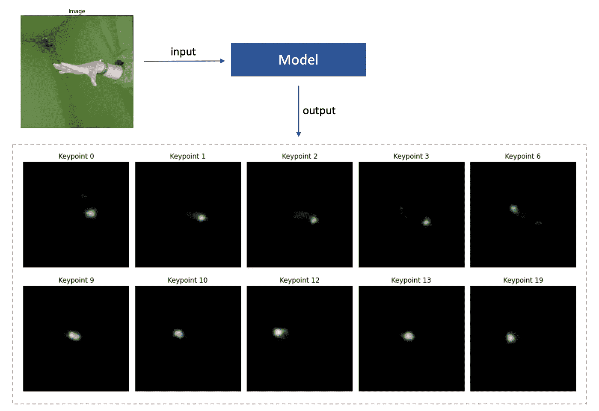

*图片 9。测试集中随机图像的模型输出。作者图片*

有两个选项:

1.  最简单的是，我们可以在热图中找到一个值最大的像素。这个像素的(x，y)位置是关键点位置。
2.  但是更可靠的方法是计算所有热图值的平均值。关于如何做到这一点的详细信息，请参见下图。

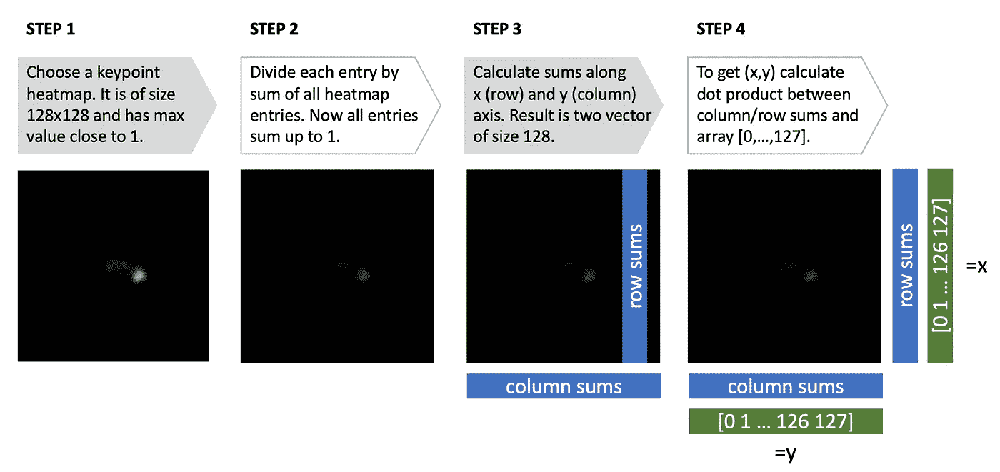

*图片 10。如何通过平均计算热图中的关键点位置？作者图片*

现在我们准备评估模型并可视化预测。该模型适用于大多数姿势，但是，它不适用于具有严重关键点遮挡的姿势。好吧，标记被遮挡的关键点即使对于人类注释者来说也不是一件容易的事情。

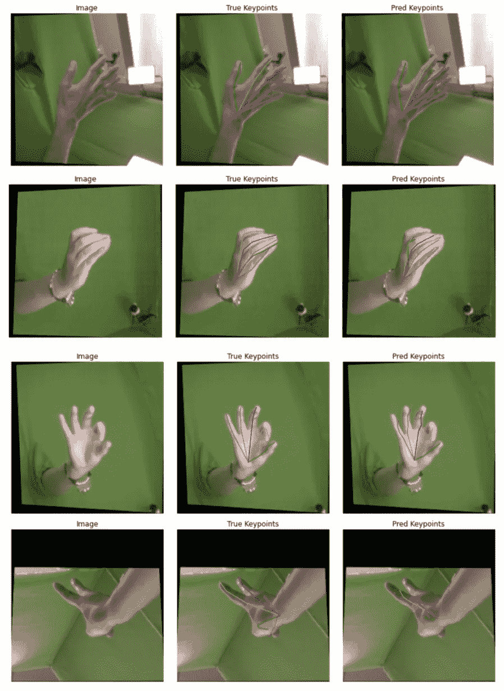

*图 11。可视化测试集上的预测。*

这是测试集上的模型精确度。通过对图像中所有关键点的误差进行平均，然后对所有图像的误差进行平均，来计算平均误差。4.5% —还不错！

*   平均误差:图像尺寸的 4.5%
*   平均误差:图像 128×128 为 6 个像素
*   平均误差:图像 224×224 为 10 像素

# 下一步是什么

我很高兴你已经读到这里了。希望，现在 2D 手的姿势估计对你清楚多了。但是…

当你能编码的时候你就知道了，对吗？: )所以在本教程的下一部分，我将分享和解释所有的代码，你将学习如何自己训练一个 2D 手姿态估计器。不要关闭你的 Jupyter 笔记本！

*更新:第二部已经在* [*这里可用。*](https://notrocketscience.blog/gentle-introduction-to-2d-hand-pose-estimation-lets-code-it/)

## 参考

[1]如果你想检查我的论文，这里有[正文](https://er.ucu.edu.ua/bitstream/handle/1/1327/Chernytska%20-%203D%20Hand%20Pose%20Estimation%20from%20Single%20RGB%20Camera%20-%20master%20thesis.pdf)和[代码](https://github.com/OlgaChernytska/3D-Hand-Pose-Estimation)。

[2]"[Awesome Hand Pose Estimation](https://github.com/xinghaochen/awesome-hand-pose-estimation)"，这是一个 Github 知识库，包含一系列开源数据集和论文。

[3] FreiHAND 数据集，[这里](https://lmb.informatik.uni-freiburg.de/resources/datasets/FreihandDataset.en.html)可以下载。

[4] FreiHAND 数据集 [Github 知识库](https://github.com/lmb-freiburg/freihand)。

[5]托马斯·菲斯特，詹姆斯·查尔斯，安德鲁·齐塞曼。"[视频中人体姿态估计的流动变换](https://arxiv.org/abs/1506.02897)"

[6]奥拉夫·龙内贝格，菲利普·菲舍尔，托马斯·布罗克斯。" [U-Net:生物医学图像分割的卷积网络](https://arxiv.org/abs/1505.04597)"

[7]施-韦恩，瓦伦·罗摩克里希纳，金德武夫，亚塞尔·谢赫。[回旋摆姿机](https://arxiv.org/abs/1602.00134)

[8]亚历杭德罗·纽维尔，·杨，贾登."[用于人体姿态估计的堆叠沙漏网络](https://arxiv.org/abs/1603.06937)"

[9]阿蒂古尔·拉赫曼博士和王洋。"[优化用于图像分割的深度神经网络中的交并运算](http://cs.umanitoba.ca/~ywang/papers/isvc16.pdf)"

*原载于 2021 年 4 月 21 日*[*https:notrocketseconomy . blog*](https://notrocketscience.blog/)*。*

*如果你想阅读更多类似的教程，请订阅我的博客“不是火箭科学”——*[*电报*](https://t.me/notrocketscienceblog) *和* [*推特*](https://twitter.com/nRocketScience) *。*