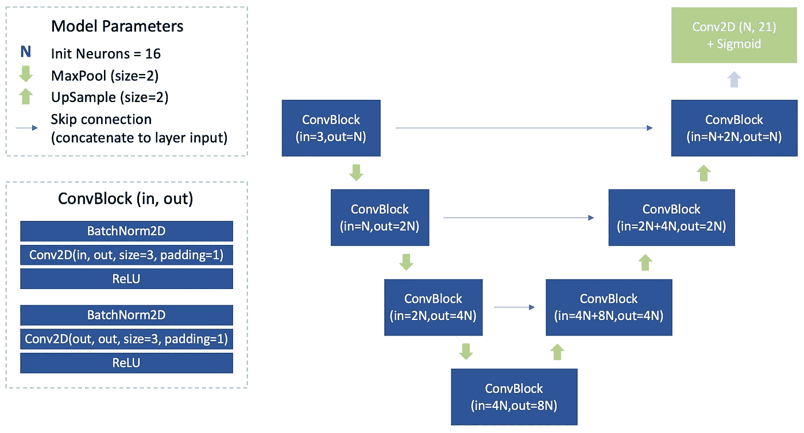

# 温柔介绍 2D 手姿势估计:我们来编码吧！

> 原文：<https://towardsdatascience.com/gentle-introduction-to-2d-hand-pose-estimation-lets-code-it-6c82046d4acf?source=collection_archive---------17----------------------->

## 了解如何在 PyTorch 中训练 2D 手部姿态估计器。本教程也可能是您对 PyTorch 的介绍。


作者图片

欢迎回来！

我们继续我们的手姿态估计之旅。现在你正在读第二部分，是关于编码和 PyTorch 的。我强烈建议您在深入研究编码之前阅读第一部分:

</gentle-introduction-to-2d-hand-pose-estimation-approach-explained-4348d6d79b11>  

这将对你理解数据集、预处理、建模、训练和评估有很大帮助。

对于本教程，我已经创建了一个 [Github 库](https://github.com/OlgaChernytska/2D-Hand-Pose-Estimation-RGB)，在那里你可以找到关于训练手部姿态估计器和进行推理的完整代码。你可以现在或以后去那里——克隆它，阅读它并运行它。它是在 PyTorch 中实现的，如果您以前没有使用过这个库，这是一个很好的开始机会！这里不需要 PyTorch 的经验；我将解释所有的主要概念，所以本教程也可以作为你对 PyTorch 的介绍。

现在…打开你们的 Jupyter 笔记本！

**内容**
数据
让我们训练
—数据加载器
—模型
—训练器
让我们做推理
—后期处理
—评估
接下来

# 数据

先说数据。我们将使用 FreiHAND 数据集，您可以[在此](https://lmb.informatik.uni-freiburg.de/resources/datasets/FreihandDataset.en.html)下载。花些时间阅读数据集描述、探索归档结构以及打开图像和文件将会非常有用。请熟悉我们将在本教程中使用的数据。


*图片 1。FreiHAND 数据集文件夹结构。绿色表示本教程所需的文件。作者图片*

现在，我们只需要一个包含 RGB 图像和 2D 标签的文件夹。通过使用相机矩阵将 3D 标签投影到图像平面上来计算 2D 标签。这是我在 FreiHAND 数据集 [Github repo](https://github.com/lmb-freiburg/freihand) 中找到的一个公式:

```
def projectPoints(xyz, K):     
    xyz = np.array(xyz)     
    K = np.array(K)     
    uv = np.matmul(K, xyz.T).T     
    return uv[:, :2] / uv[:, -1:]
```

我们将只使用前 32，560 张图像，即原始图像。数据集中的其他图像与原始图像完全相同，但有背景增强，所以我们现在跳过它们。

**数据集分割。** FreiHAND 数据集已经看起来像一组混洗的手图像，因此我们可以按图像 id 进行分割。让前 80%成为训练部分，接下来的 15% —验证，最后的 5% —测试。训练图像主要用于训练、验证(控制验证损失并决定何时停止模型训练)和测试(进行最终模型评估)。


*形象二。数据集分为训练、验证和测试部分。作者图片*

# 让我们训练吧

为了训练一个模型，我们需要:

*   **数据加载器类。** FreiHAND 数据集(因为大多数图像数据集)太大，无法完全存储在 RAM 中，因此我们将使用批量训练来训练模型。因此，需要 DataLoader，它遍历数据集，一次只加载一批数据。
*   **模特类。**我们将创建自己的定制 UNet 类模型。
*   **培训师类。**这个类完成所有的训练:请求批量数据，获得模型预测，计算损失，更新模型权重，评估模型，并在验证损失停止减少时完成训练。

我们现在将详细讨论所有这些类。并查看一个[笔记本](https://github.com/OlgaChernytska/2D-Hand-Pose-Estimation-RGB/blob/972c2102d95e14ebb37b1cbd452018ebd6706a44/notebooks/Train%20Notebook.ipynb)有完整的培训流程。


*图三。培训渠道和所需 PyTorch 课程。作者图片*

## 数据加载器

我们将使用两个 PyTorch 类来加载数据。

[**数据加载器**](https://pytorch.org/docs/stable/data.html#torch.utils.data.DataLoader) **。**这个类是在 PyTorch 中实现的，所以你只要调用它，提供 Dataset 类的一个实例和一些其他参数(检查它们的含义[这里](https://pytorch.org/docs/stable/data.html#torch.utils.data.DataLoader)):

```
train_dataloader = DataLoader( 
    dataset=train_dataset, 
    batch_size=48, 
    shuffle=True, 
    drop_last=True, 
    num_workers=2 
)
```

现在我们可以像这样循环数据加载器:

```
for data_batch in train_dataloader: 
    # do something
```

[**数据集**](https://pytorch.org/docs/stable/data.html#torch.utils.data.Dataset) **。PyTorch 有一个已实现数据集的小列表，你可以在那里找到你需要的。但是，请做好准备—在大多数情况下，您将编写自己的数据集类。今天就是这一天。**

当您遵循以下规则时，数据集类不难编写:

*   你的数据集类继承(子类)[*torch . utils . data . Dataset*](https://pytorch.org/docs/stable/data.html#torch.utils.data.Dataset)
*   你需要重写函数 *__len__()* ，它返回数据集的长度。您可以在这里输入带标签文件的长度，或者文件夹中图像的数量。
*   并且您需要重写函数 *__getitem__()* ，该函数获取样本 id 并返回一个包含图像及其标签的列表或字典。稍后， *__getitem__()* 的输出会被 DataLoader 批量堆栈。

因此，FreiHAND 数据集的数据集类应该如下所示。完整版在 [Github](https://github.com/OlgaChernytska/2D-Hand-Pose-Estimation-RGB/blob/main/utils/dataset.py) 上。

```
from torch.utils.data import Dataset

class FreiHAND(Dataset):
    def __init__(self, config, set_type="train"):
        ## initialize path to image folders
	## initialize paths to files with labels
	## create train/test/val split
	## define data augmentations

    def __len__(self):
	return len(self.anno)

    def __getitem__(self, idx):
        ## load image by id, use PIL librabry
        ## load its labels
        ## do augmentations if needed
        ## convert everything into PyTorch Tensors

        return {
            "image": image,
            "keypoints": keypoints,
            "heatmaps": heatmaps,
            "image_name": image_name,
            "image_raw": image_raw,
        }
```

我个人倾向于将所有图像信息添加到 *__getitem__()* 输出中——原始图像、调整大小和标准化的图像、图像名称、数字形式的关键点以及热图形式的关键点。当我调试、绘制图像或评估模型准确性时，它大大简化了我的生活。

不要忘记使用[函数](https://github.com/OlgaChernytska/2D-Hand-Pose-Estimation-RGB/blob/972c2102d95e14ebb37b1cbd452018ebd6706a44/utils/prep_utils.py#L37)计算 R、G、B 通道平均值和标准偏差(就在数据集和数据加载器初始化之前)。然后将值添加到 Dataset 类中的 *Normalize()* 转换中；它发生在 *Resize()* 变换之前或之后——查看[这里](https://github.com/OlgaChernytska/2D-Hand-Pose-Estimation-RGB/blob/972c2102d95e14ebb37b1cbd452018ebd6706a44/utils/dataset.py#L59)如何做到这一点。只有现在—初始化数据集和数据加载器。

总之，将有 3 个数据集类实例(train_dataset、val_dataset 和 test_dataset)和 3 个数据加载器类实例(train_dataloader、val_dataloder 和 test_dataloader)。这是因为训练集、验证集和测试集是完全不同的图像集。

但是，您不需要编写 3 个不同的数据集类。一个就够了。创建数据集实例时只需提供 *set_type* 参数，如下所示:

```
train_dataset = FreiHAND(config=config, set_type="train") 
train_dataloader = DataLoader( 
    dataset=train_dataset, 
    batch_size=config["batch_size"], 
    shuffle=True, 
    drop_last=True, 
    num_workers=2 
)
```

确保在数据集类中有一个代码片段，将图像分成训练、验证和测试部分。

## 模型

PyTorch 中的[实现和预训练模型](https://pytorch.org/vision/stable/models.html)的列表非常庞大——有用于图像分类、视频分类、语义和实例分割、对象检测的模型，甚至还有一个用于[人体关键点检测的模型](https://pytorch.org/vision/stable/models.html#keypoint-r-cnn)。受过预先训练。是不是很酷？！

但是出于研究的目的，我们将实现我们自己的类似 UNet 的架构。这一个:



*形象 4。我的自定义 UNet-like 模型 2D 手姿态估计。作者图片*

PyTorch 中的所有定制模型都应该子类化 [*torch.nn.Module*](https://pytorch.org/docs/stable/generated/torch.nn.Module.html#torch.nn.Module) 并重写函数 *forward()* 。UNet 不是典型的前馈网络，它具有跳跃连接。因此，在向前传递的过程中，应该保存一些层的输出，稍后再与更深层的输出连接。这里没有问题，你可以写任何类型的向前传球，PyTorch 会理解如何自己向后传球。

因此，我们的定制 UNet 模型应该是这样的。而这里有一个[完整版](https://github.com/OlgaChernytska/2D-Hand-Pose-Estimation-RGB/blob/main/utils/model.py)。

```
class ShallowUNet(nn.Module):     
    def __init__(self, in_channel, out_channel): 
        super().__init__()  
        # initialize layer - custom or from PyTorch list def forward(self, x):  
        # implement forward pass  
        # you can do literally anything here  
        return out
```

顺便说一下，如果你的模型有一些重复的块，你可以将块实现为模块，就像模型一样——通过子类化 *torch.nn.Module* 并重写函数 *forward()* 。看，我是怎么用 UNet 中的双卷积块做到的。

```
class ConvBlock(nn.Module):     
    def __init__(self, in_depth, out_depth):
        super().__init__()
        self.double_conv = nn.Sequential(
            nn.BatchNorm2d(in_depth), 
            nn.Conv2d(in_depth, out_depth, kernel_size=3, padding=1, bias=False),
            nn.ReLU(inplace=True), 
            nn.BatchNorm2d(out_depth), 
            nn.Conv2d(out_depth, out_depth, kernel_size=3, padding=1, bias=False), 
            nn.ReLU(inplace=True), 
        )      def forward(self, x): 
        return self.double_conv(x)
```

## 运动鞋

训练师类是 PyTorch 根本没有的，所以你需要从头开始写，使用来自 [PyTorch 教程](https://pytorch.org/tutorials/)的代码片段。

有时这让我感到害怕，但有时我看到了好处:它让我更好地理解训练过程中发生的事情，并让我完全控制训练。

这是训练师的代号。我不打算在这篇文章中展示训练器代码，因为确切的代码没有数据集和模型类那么重要。顺便说一下，你甚至不需要把培训师写成一个职业，这是我个人的偏好。你可以使用函数，或者只是把你所有的训练代码放在一个 Jupyter 笔记本单元中——由你决定。

但是，在编写培训代码时，需要记住一些事情:

*   每个时期应该具有训练和评估阶段。在训练之前，您需要显式地将模型置于训练模式，这样做— *model.train()* 。评测也是一样——*model . eval()*。这是因为一些层在训练和评估/推断期间可能表现不同，例如 Dropout 和 BatchNorm。
*   在评估过程中，您可以额外使用 *torch.no_grad()* 功能。它告诉你的模型“现在不要计算梯度”，所以向前传递会更快，使用更少的内存。
*   您不必在训练(或验证)期间遍历所有训练(或验证)数据集。好主意是限制每个时期的训练和验证批次的数量。
*   对于那些对 GPU 培训感兴趣的人。您的数据和模型应该在完全相同的设备上。默认情况下，torch 张量和模型被初始化在 CPU 上，因此如果 GPU 可用，您应该显式地将它们转移到 GPU。下面是如何做到这一点的代码片段:

```
device = torch.device("cuda" if torch.cuda.is_available() else "cpu") 
model = model.to(device) 
inputs = data["image"].to(device) 
labels = data["heatmaps"].to(device)
```

是的，标签也一样，否则你将无法计算损失，因为模型输出是在 GPU 上。

在 GPU 上训练模型并在 CPU 上运行预测是没问题的，反之亦然。仅在加载模型权重时这样做:

```
device = torch.device("cuda" if torch.cuda.is_available() else "cpu") 
model.load_state_dict(torch.load(model_path, map_location=device)))
```

**损失。** PyTorch 已经实现了[标准损耗](https://pytorch.org/docs/stable/nn.html#loss-functions)，但是，如果你想使用自定义损耗，那就是你需要自己编写的。自定义损耗的实现方式与模型相同——通过子类化 *torch.nn.Module* 和重写函数 *forward()* 。下面是一个简短的模板，完整版本你可以在这里找到。

```
class IoULoss(nn.Module): 
    def __init__(self): 
        super(IoULoss, self).__init__() 
        #initialize parameters     def forward(self, y_pred, y_true): 
        #calculate loss from labels and predicitons 
        return loss
```

关于训练就是这样。如果你还没做过，我真的推荐你去翻翻 [Train Notebook.ipynb](https://github.com/OlgaChernytska/2D-Hand-Pose-Estimation-RGB/blob/main/notebooks/Train%20Notebook.ipynb) 。

如果您希望自己重新训练模型，这应该是本教程前一部分的一个有用的文本片段:

*“对于本教程，我用 batch_size=48 和 batches_per_epoch=50 对模型进行了训练。我从学习率=0.1 开始，每次训练损失停止减少时，就减少一半。当验证集上的损失停止下降时，我完成了培训。收敛花了大约 200 个历元(在 GPU 上花了 2 个小时)，我最终的训练和验证损失分别是 0.437 和 0.476。*

这些数字只是地标。在训练您的模型时，您可能会得出不同数量的要收敛的历元和略有不同的最终损失。此外，随意增加/减少批量大小以适应您的机器内存，并增加/减少学习率。"

祝你好运！

# 让我们做推论

推理管道比训练管道简单得多。我们只需要:

*   加载训练好的模型；
*   为测试集创建 dataloader 的实例；
*   编写将热图转换为关键点位置矢量的后处理器；
*   并且，理想情况下，计算测试集的预测误差，以评估模型性能。

完整代码请参考[推理笔记本. ipynb](https://github.com/OlgaChernytska/2D-Hand-Pose-Estimation-RGB/blob/main/notebooks/Inference%20Notebook.ipynb) 。

在您理解培训部分之后，加载模型、创建测试数据加载器和运行预测应该是容易的任务。但是在后处理和评估方面，我们现在将更加关注。


*形象 4。详细的推理管道。作者图片*

## 后处理

通过在所有热图值中求平均值来计算关键点位置更好。而这里是[代码](https://github.com/OlgaChernytska/2D-Hand-Pose-Estimation-RGB/blob/972c2102d95e14ebb37b1cbd452018ebd6706a44/utils/prep_utils.py#L114)。


*图片 5。如何通过平均计算热图中的关键点位置？作者图片*

## 估价

在测试集上计算平均预测误差是必须做的事情。是的，您可以更进一步，报告最大和最小图像误差，显示百分位数，通过手指和关节计算误差，并可视化具有最大和最小误差的图像。但是现在，让我们保持简单。

以下是我的手部姿态估计器在测试集上的评估结果:

*   每个关键点的平均误差:图像尺寸的 4.5%
*   每个关键点的平均误差:图像 128×128 为 6 个像素
*   每个关键点的平均误差:图像 224×224 为 10 个像素

每个关键点的平均误差意味着 1)图像中的所有关键点和 2)数据集中的所有图像之间的平均误差。它可以报告为图像大小的百分比，或者原始图像或调整大小的图像的像素误差。这里的关键点误差是图像平面上实际和预测关键点位置之间的欧几里德距离。


*图片 6。一些关键点预测误差的可视化。作者图片*

# 下一步是什么

希望现在，在阅读完整教程并浏览代码后，2D 手姿态估计对你来说不再是一个复杂的任务。

然而，我们今天训练的手部姿态估计器还远远不能用于生产。它不适用于关键点被遮挡的姿态，并且不适用于来自不同数据集的图像。有很多需要改进的地方。

出于学习目的，从简单的东西开始，慢慢地，一步一步地将更高级的技术引入算法是一个好主意。也许以后我会写关于这些技术的教程。有兴趣就告诉我: )

*原载于 2021 年 4 月 30 日*[*https://notrocketseconomy . blog*](https://notrocketscience.blog/)*。*

*如果你想阅读更多类似的教程，请订阅我的博客“不是火箭科学”——*[*电报*](https://t.me/notrocketscienceblog) *和* [*推特*](https://twitter.com/nRocketScience) *。*