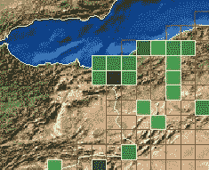
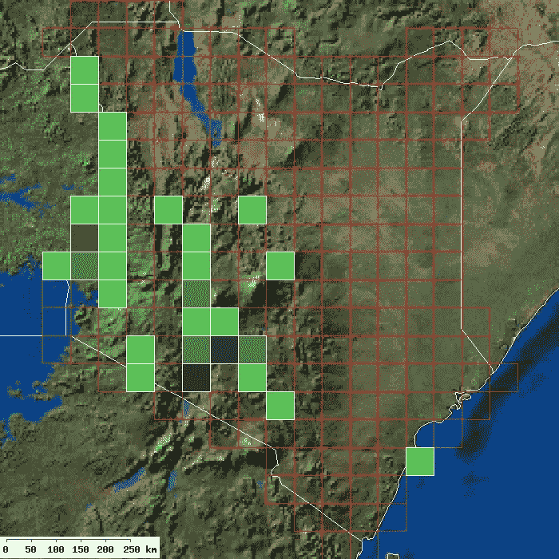
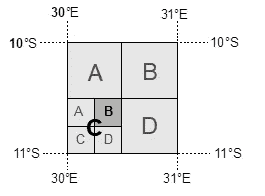
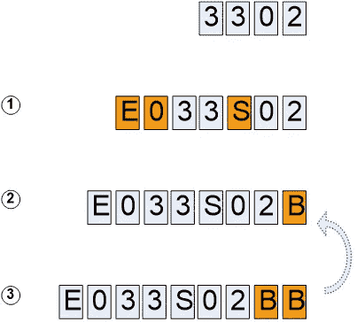
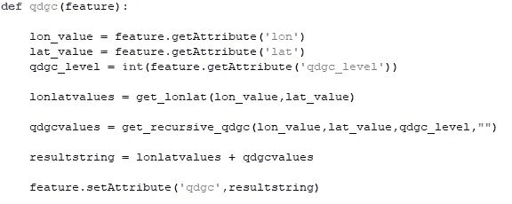
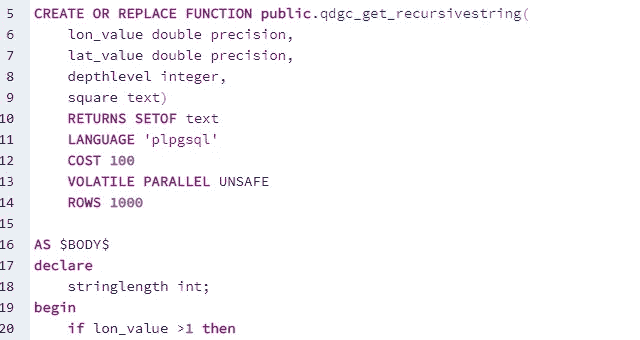

# 地理编码和概化

> 原文：<https://towardsdatascience.com/geocoding-and-generalisations-41fa5652d34c?source=collection_archive---------25----------------------->

## 通过使用网格单元概括世界来理解世界。从细节到知识。

作者图片

网格单元非常适合概括信息。这个故事是关于地理编码、概化和空间数据集的可用性，空间数据集可用于通过地理信息系统呈现空间参考数据。它最后指向优秀的 Zenodo 网站，在那里可以分发处理过的文件。

# 地理编码

地理编码是一种使用文本和数字的组合来唯一表示地理实体的方法。它可能是一个地点或一个物体。这是通过我们对地名的使用嵌入到我们的语言中的。

我们大多数人住在一条有名字的街上，一栋有编号的房子里。Abbey road 5 就是这样一个地理编码。这不是一个特别好的名字，因为世界上有数十条甚至数百条道路使用这个名字。你们中的一些人可能对地理编码系统很熟悉。它的基础是基于三个单词建立一个唯一的标识符。它工作得很好。

本文中介绍的地理编码系统并不完美，不是最好的，也不是最容易使用的。但是它很好，而且是免费的！

# 概括

在生态学和社会科学中，概括是理解空间模式的关键。空间模式使我们能够了解生态条件、疾病传播、人口模式等等。

概括是一种权衡。在任何给定的时间点准确地知道动物在自然的某一部分的位置是没有多大帮助的。要管理一个国家公园，更全面地了解动物在整个时间里的位置是有意义的。如果我们知道动物在规则网格系统中的特定细胞内移动，我们可以利用这一点将这一信息与我们所知道的该区域的其他信息进行交叉。因此，更少的细节给了我们更多关于某个领域的有用知识。所以要管理动物，你必须放开它们的确切位置。只要你能把他们的立场概括到一个有用的水平，这并不重要。这就是不知道一切的力量。

如何使用网格单元说明坦桑尼亚的物种观测。(图片由作者提供)

找到正确的概括水平并不容易。我在本文中展示的数据集系统允许用户选择要使用的网格的相关大小。它可以让你从全度网格一直到茶杯大小——如果那是你喜欢的。如果那是你喜欢的…

# 四分之一度网格单元

四分之一度网格单元结合了上述两种情况。该标准代表了一种方法，即制作覆盖特定区域的(几乎)相等面积的正方形，以表示所覆盖区域的特定质量。正方形本身是基于覆盖地球的度数正方形。赤道周围有 360 条经线，从北极到南极有 180 条纬线。实话实说——178 行两点(极点)。这总共给了我们覆盖地球的 64800 块瓷砖。

这怎么变成地理编码系统了？每个角度方块由对主角度方块的完全引用来指定。第一季第 10 集提到了坦桑尼亚的一个广场。 **S** 表示正方形在赤道以南， **E** 表示在零子午线以东。这些数字指的是经度和纬度。

如何将经度/纬度单元划分为更小的格网单元。(图片由作者提供)

没有子级参考的正方形也称为 QDGC level 0。这是一个正方形，基于一个完整的经度和一个完整的纬度。QDGC 0 级方块本身被分成四个，其中方块被命名为 A、B、C 和 D，成为 1 级 QDGC。

该过程可以描述如下:

1.  每个度数方格由七个字符表示。第一个字符表示正方形是零子午线的东方还是西方(E 或 W)。接下来的三个数字表示方块从哪个经度开始。下一个字符表示方块是在赤道以北还是以南(北或南)。接下来是两个数字，表示到赤道线的横向距离。这是对唯一度平方的引用，称为 QDGC 级。
2.  每个角度方块被分成四个方块，其中左上象限被指定为 A，右上象限被指定为 B，左下象限被指定为 C，右下象限被指定为 d，这就是 QDGC 级别 1。
3.  每个生成的象限都要经过与步骤 2 中所述相同的过程。在每次迭代结束时添加一个字符象限指示器(A、B、C 或 D)。每迭代一次，级别数增加一(图 5)。

制作 QDGC 代码的必要步骤。(图片由作者提供)

你可以在几年前我和一些同事写的一篇文章[中读到更多关于这个系统的内容。](https://www.researchgate.net/publication/230360048_Using_the_extended_quarter_degree_grid_cell_system_to_unify_mapping_and_sharing_of_biodiversity_data)

# 生成 QDGC 网格

大约 15 年前，我开始生产供个人使用的网格电池。当时我使用 ArcGIS 和 python 来生成文件。

使用 Python 时的代码示例。(图片由作者提供)

当我们着眼于 1 级或 2 级时，生成网格并不困难。坦桑尼亚有 529 个一级牢房、1.980 个二级牢房和 7.830 个三级牢房。在大约 700x700 米的第 7 层，该数字增加到 1.960.800。不需要数学天才也能想到为所有非洲国家生产网格电池是一项艰巨的任务。每升一级，人数增加四倍。

今天，生产完全是使用 PL/pgSQL 函数完成的，这些函数严重依赖于 PostGIS 3.1。在 PostGIS 中进行所有处理加快了整个过程。处理坦桑尼亚从 1 级到 7 级的网格仍然需要 4 分 36 秒。为所有非洲国家做这件事需要很多时间。

PLpgSQL 中的编码函数。(图片由作者提供)

上周我用了几个晚上完成了处理，现在可以展示所有非洲国家的 QDGC 文件。原始文件以 geopackage 格式分发。为了节省空间，他们被压缩使用 7-zip 程序。

用于非洲的 54 个压缩格式的文件总共为 1.2 GB。未压缩的大小约为 32 GB。

# 使用 Zenodo 共享

我以前依赖于从我自己的网站上发布文件，现在我已经开始通过 Zenodo 分享它们了。

> OpenAIRE 项目是欧洲开放存取和开放数据运动的先锋，受欧盟委员会委托，通过为欧盟委员会资助的研究提供一个包罗万象的存储库来支持其新生的开放数据政策。CERN 是 OpenAIRE 的合作伙伴，也是开源、开放访问和开放数据的先驱，它提供了这种能力，Zenodo 于 2013 年 5 月推出。(https://about.zenodo.org/来源

芝诺多有社区，代表上传到芝诺多的文件的从属关系。所有 qdgc 文件都上传到 QDGC 社区:

 [## 四分之一度网格单元

### 这个社区收集空间数据文件(数据集)，代码和论文相关的季度…

zenodo.org](https://zenodo.org/communities/qdgc/) 

用芝诺多存储的所有文件都配有一个独特的数字对象标识符( [doi](https://no.wikipedia.org/wiki/Digital_object_identifier) )。如果你最终在你的研究中使用数据集，或者出于其他好的原因，你需要一个参考。因此，坦桑尼亚的四分之一格网像元数据集版本 1.0.0 可引用如下:

> 拉格瓦尔德.拉森。(2021).qdgc 坦桑尼亚(版本 1 . 0 . 0)[数据集]。芝诺多。[http://doi.org/10.5281/zenodo.4452672](http://doi.org/10.5281/zenodo.4452672)

从现在开始，这是我存放所有与四分之一度网格单元相关的文件的地方。

# 这是什么意思？

真的不多。如果您需要一组适用于概化的地理编码空间参考对象，请使用它。如果你不喜欢，我希望你喜欢这本书。感谢您的阅读！