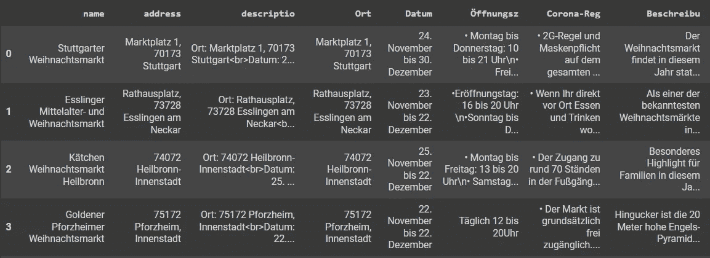
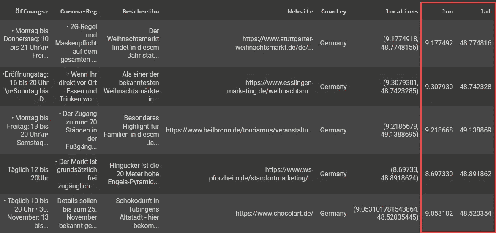

# 用 Python 对 CSV 进行地理编码

> 原文：<https://towardsdatascience.com/geocoding-csv-in-python-5d45bf01694e?source=collection_archive---------15----------------------->

## 2021 年德国巴登符腾堡州圣诞市场的一个例子


由[丹尼尔斯·乔菲](https://unsplash.com/@ydaniels?utm_source=medium&utm_medium=referral)在 [Unsplash](https://unsplash.com?utm_source=medium&utm_medium=referral) 上拍摄的照片

地理编码是通过输入全球各地的地址数据来定位坐标的过程。在大多数地理数据分析过程中，这是一个非常基本的步骤。这篇简短的教程让您深入了解如何使用 Python 中的 **geopy** 库进行地理编码。只需要几行 Python 脚本和几分钟就可以学会。本教程的用例是对德国巴登符腾堡州 2021 圣诞市场地址数据进行地理编码，数据以 CSV 格式提供。

# **土工格栅的安装和基础。**

您可以使用以下脚本安装 geopy:

```
**$ pip install geopy**or in Colab: 
**!pip install geocoder**
```

安装 geopy 后，您可以通过导入这个 geopy 库来启动一个新的 Python 文件。

```
import geocoder
```

使用 geopy 非常简单。它包括许多地理编码服务的地理编码器类，如[OpenStreetMap nomim](https://nominatim.org/)、 [Google Geocoding API (V3)](https://developers.google.com/maps/documentation/geocoding/) 等等。例如，您可以使用以下脚本调用带有 osm 的地理编码器:

```
g = geocoder.osm('Eiffel Tower')>>> g.osm{
   'x': 2.2944990543196795, 
   'y': 48.858260200000004, 
   'addr:housenumber': '5', 
   'addr:street': 'Avenue Anatole France', 
   'addr:city': 'Paris', 
   'addr:state': 'Île-de-France', 
   'addr:country': 'France', 
   'addr:postal': '75007'
}
```

# 将 CSV 读给熊猫数据框

现在，让我们尝试使用 geopy 对 CSV 表中的数据进行地理编码。我们可以从将 CSV 数据集导入熊猫数据帧开始。本例中的 CSV 将是德国 BW 的圣诞节市场地址，此处[公开提供](https://icity.hft-stuttgart.de/christmas_market_2021/ChristmasMarketData.csv)(由作者创建)。

```
import pandas as pd
df = pd.read_csv("ChristmasMarketData.csv")
df.head()
```



**圣诞市场地址数据示例**(作者提供)

# 对数据帧进行地理编码

现在，让我们对数据帧进行地理编码。在此之前，我们需要一个函数来返回必要的地理编码信息，即`g.osm['x']`和`g.osm['y']`，如下所示

```
def geocoding(input_address):
   g = geocoder.osm(input_address)
   return g.osm['x'], g.osm['y']
```

然后，我们可以将这个函数应用于地址栏中的数据帧。

```
df['locations'] = df['address'].apply(geocoding)
df[['lon','lat']] = pd.DataFrame(df['locations'].tolist(),
                                 index=df.index)
df.head()
```



**生成的地理编码圣诞市场地址**(作者)

而且，大概就是这样。你可以在[https://icity.hft-stuttgart.de/christmas_market_2021](https://icity.hft-stuttgart.de/christmas_market_2021)查看可视化结果地理编码圣诞市场数据


**地理编码圣诞市场地址的可视化**(作者)

总之，本文概述了如何使用 geopy 库对 CSV 数据和 Pandas 数据帧进行地理编码。

我希望你喜欢它，并发现它对你的日常工作或项目有用。如果你有任何问题，请随时联系我。

关于我&查看我所有的博客内容:[链接](https://joets.medium.com/about-me-table-of-content-bc775e4f9dde)

**平安健康！**
**感谢阅读。👋😄**