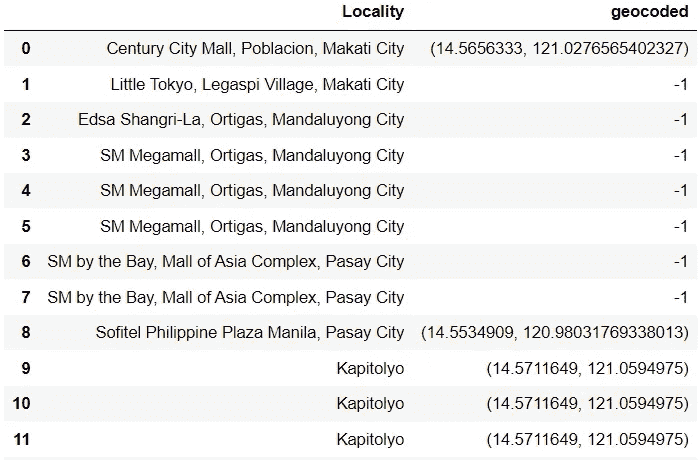

# Python 中的地理编码:完整指南

> 原文：<https://towardsdatascience.com/geocoding-in-python-a-complete-guide-d68a4faafdc6?source=collection_archive---------14----------------------->

## 使用 Python 进行地理编码的分步教程


安德鲁·斯图特斯曼在 [Unsplash](https://unsplash.com/s/photos/map?utm_source=unsplash&utm_medium=referral&utm_content=creditCopyText) 上的照片

# 介绍

在处理机器学习的大型数据集时，您是否遇到过类似这样的地址列？


作者图片

位置数据可能非常混乱，难以处理。

很难对地址进行编码，因为它们的基数非常高。如果您尝试使用类似 one-hot 编码的技术对这样的列进行编码，这将导致高维度，并且您的机器学习模型可能性能不佳。

克服这个问题最简单的方法就是**对这些列进行地理编码**。

# 什么是地理编码？

地理编码是将地址转换为地理坐标的过程。这意味着您将把原始地址转换成纬度/经度对。

# Python 中的地理编码

有许多不同的库可以帮助你用 Python 做到这一点。最快的是 **Google Maps API，**如果你有超过 1000 个地址需要在短时间内转换，我推荐使用。

然而，谷歌地图 API 不是免费的。你需要为每 1000 个请求支付大约 5 美元。

谷歌地图 API 的一个免费替代品是 OpenStreetMap API。然而，OpenStreetMap API 要慢得多，而且也不太准确。

在本文中，我将用这两个 API 带您完成地理编码过程。

# 方法 1:谷歌地图应用编程接口

让我们首先使用 Google Maps API 将地址转换成纬度/经度对。为此，你首先需要创建一个谷歌云账户，并输入你的信用卡信息。

虽然这是一项付费服务，但当你第一次创建谷歌云账户时，谷歌会给你 200 美元的免费积分。这意味着您可以使用他们的地理编码 API 进行大约 40，000 次呼叫，然后才需要付费。只要你没有达到这个限额，你的账户就不会被扣款。

首先，[用 Google Cloud 设置一个免费账户](https://cloud.google.com/gcp/getting-started)。然后，一旦你建立了一个帐户，你就可以按照[这个](https://www.youtube.com/watch?v=OGTG1l7yin4)教程来获得你的谷歌地图 API 密钥。

一旦你收到你的 API 密匙，你就可以开始编码了！

## 先决条件

在本教程中，我们将使用 [Zomato Restaurants Kaggle](https://www.kaggle.com/shrutimehta/zomato-restaurants-data) 数据集。确保将数据集安装在您的路径中。然后，使用以下命令安装 googlemaps API 包:

```
pip install -U googlemaps
```

## 进口

运行下面几行代码来导入入门所需的库:

```
import csv
import pandas as pd
import googlemaps
```

## 读取数据集

现在，让我们读取数据集并检查数据帧的头部:

```
data = pd.read_csv('zomato.csv',encoding="ISO-8859-1")
df = data.copy()
df.head()
```


作者图片

这个数据帧有 21 列和 9551 行。

我们只需要 address 列进行地理编码，因此我将删除所有其他列。然后，我将删除重复的地址，这样我们只获得唯一的地址:

```
df = df[['Address']]
df = df.drop_duplicates()
```

再看一下数据帧的头部，我们只能看到地址列:


作者图片

太好了！我们现在可以开始地理编码了。

## 地理编码

首先，我们需要用 Python 访问我们的 API 密钥。为此，请运行以下代码行:

```
gmaps_key = googlemaps.Client(key="your_API_key")
```

现在，让我们先尝试对一个地址进行地理编码，然后看看输出。

```
add_1 = df['Address'][0]
g = gmaps_key.geocode(add_1)
lat = g[0]["geometry"]["location"]["lat"]
long = g[0]["geometry"]["location"]["lng"]
print('Latitude: '+str(lat)+', Longitude: '+str(long))
```

上述代码的输出如下所示:


作者图片

如果你得到上面的输出，太好了！一切正常。

我们现在可以对整个数据帧重复这一过程:

```
# geocode the entire dataframe:

def geocode(add):
    g = gmaps_key.geocode(add)
    lat = g[0]["geometry"]["location"]["lat"]
    lng = g[0]["geometry"]["location"]["lng"]
    return (lat, lng)

df['geocoded'] = df['Address'].apply(geocode)
```

让我们再次检查数据帧的头部，看看这是否有效:

```
df.head()
```


如果你的输出看起来像上面的截图，那么恭喜你！您已成功对整个数据帧中的地址进行了地理编码。

# 方法 2: OpenStreetMap API

OpenStreetMap API 是完全免费的，但是比 Google maps API 慢，也不准确。

这个 API 无法定位数据集中的许多地址，所以这次我们将使用*位置*列。

在我们开始本教程之前，让我们看看*地址*和*地点*列之间的区别。为此，请运行以下代码行:

```
print('Address: '+data['Address'][0]+'\n\nLocality: '+data['Locality'][0])
```

您的输出将如下所示:


作者图片

*地址*列比*位置*列更细粒度，它提供了餐馆的确切位置，包括楼层号。这可能是 OpenStreetMap API 无法识别地址的原因，但位置可以识别。

让我们对第一个地点进行地理编码，并查看输出。

## 地理编码

运行以下代码行:

```
import url
import requests

data = data[['Locality']]

url = 'https://nominatim.openstreetmap.org/search/' + urllib.parse.quote(df['Locality'][0]) +'?format=json'
response = requests.get(url).json()
print('Latitude: '+response[0]['lat']+', Longitude: '+response[0]['lon'])
```

上述代码的输出与 Google Maps API 生成的结果非常相似:


作者图片

现在，让我们创建一个函数来查找整个数据帧的坐标:

```
def geocode2(locality):
    url = 'https://nominatim.openstreetmap.org/search/' + urllib.parse.quote(locality) +'?format=json'
    response = requests.get(url).json()
    if(len(response)!=0):
        return(response[0]['lat'], response[0]['lon'])
    else:
        return('-1')

data['geocoded'] = data['Locality'].apply(geocode2)
```

太好了！现在，让我们看看数据帧的头部:

```
data.head(15)
```



作者图片

请注意，该 API 无法为数据帧中的许多位置提供坐标。

尽管它是谷歌地图 API 的一个很好的免费替代品，但是如果你用 OpenStreetMap 进行地理编码，你可能会丢失很多数据。

本教程到此为止！我希望你从这里学到一些新的东西，并对处理地理空间数据有更好的理解。

祝您的数据科学之旅好运，感谢您的阅读！

本文原载[此处](https://www.natasshaselvaraj.com/a-step-by-step-guide-on-geocoding-in-python/)。