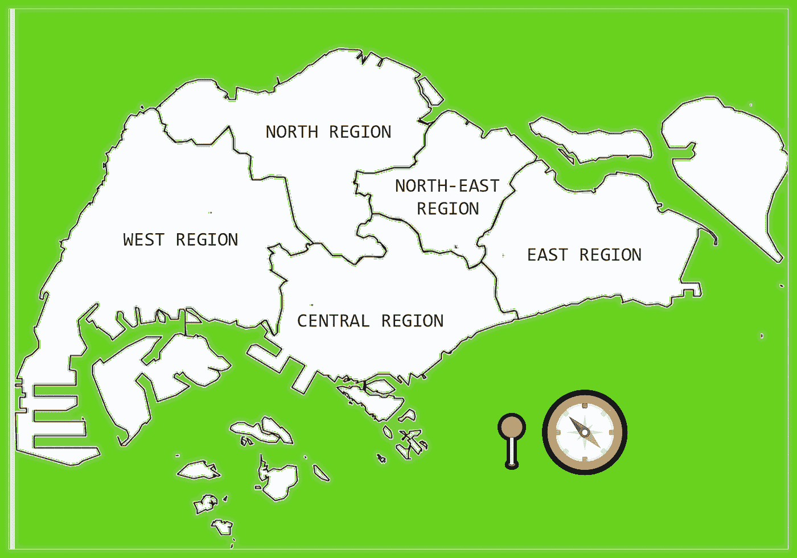

# 使用 Turf Mapbox SDK 地理编码位置

> 原文：<https://towardsdatascience.com/geocoding-locations-with-turf-mapbox-sdk-934dbdef567b?source=collection_archive---------31----------------------->

## 用 Java 实现常见的 Turf 功能。用例+完整源代码。

大多数熟悉地理空间 web 应用程序的地理信息系统(GIS)从业者都遇到过被称为 [TurfJS](https://turfjs.org/) 的 JavaScript 实用程序，这是一个开源的地理空间分析工具。虽然 Turf 以其多功能性和广泛的地理空间功能而闻名，但它的一个常见用例通常涉及对自定义边界内的特定位置坐标进行地理编码— **，即标记特定区域/地区/地带到目标位置**。

*更深入的细节，请参考下面的文章:*

</using-turf-js-to-geocode-coordinates-with-custom-boundaries-bb843b7150d0>  

为了说明这种功能，以国家**新加坡**为例，该岛被划分为 **5 个独立的区域** — **中部、北部、东北部、东部&西部**。



作者插图|新加坡分为 5 个不同的地区

为了标记 **❝National 牙科中心(NDC)❞** 大楼所处的正确区域，需要两个特定的空间数据输入:

**输入(1)**5 个区域的几何多边形/多多边形特征(在演示 HTML 代码中指定为 GeoJSON 对象— `boundaries`)

**输入(2)** 目标位置的建筑坐标—国家牙科中心(在演示 HTML 代码中指定为 GeoJSON 对象— `targetLocations`)

**注意:**完整的 HTML 代码实现可以在[这里](https://gist.githubusercontent.com/incubated-geek-cc/0823cd9680be1f91643816eaa044db14/raw/35476c9674e3d2b5212844a14e3c3fd6cce24b38/geocodeNDC.html)找到

**输出如下:**

```
{
  "type": "FeatureCollection",
  "features": [
    {
      "type": "Feature",
      "properties": {
        "BLK_NO": "5",
        "BUILDING": "NATIONAL DENTAL CENTRE",
        "ROAD_NAME": "SECOND HOSPITAL AVENUE",
        "POSTAL": "168938",
        "REGION_N": "CENTRAL REGION",
        "REGION_C": "CR"
      },
      "geometry": {
        "type": "Point",
        "coordinates": [
          103.838232475714,
          1.27975902116932
        ]
      }
    }
  ]
}
```

> *由此我们可以推导出* ***国家牙科中心*** *位于新加坡的* ***中部*** *。*

**重要:**注意，我在上面的 HTML 代码中使用的 Turf 库的版本是 [turf-3.5.1.js](https://gist.githubusercontent.com/incubated-geek-cc/0823cd9680be1f91643816eaa044db14/raw/35476c9674e3d2b5212844a14e3c3fd6cce24b38/turf-3.5.1.js) ，使用的实用方法是`booleanPointInPolygon(<Point>, <Polygon/MultiPolygon>)`

# 用 Java 编程语言实现

由于到目前为止，还没有关于 Java 对等物[TurfJS](https://turfjs.org/)—[map box Turf SDK](https://github.com/mapbox/mapbox-java/blob/main/docs/turf-port.md)的全面文档，以下是在 Java 编程语言中模拟这一完全相同的功能的逐步指南。

## 要包含在类路径中的 JAR 依赖项列表


作者截图 mapbox sdk turf 库使用的 JAR 依赖项列表|注意:json-org JAR 作为一个实用程序类包含在本演示中，用于解析 Java 编程语言中的 json 对象

## 以下是我的 [GitHub repo](https://github.com/incubated-geek-cc/TurfInJava) 对每个输入的直接链接:

*   必需的 JAR 依赖关系:[链接](https://github.com/incubated-geek-cc/TurfInJava/tree/main/dependencies)
*   要运行的完整 Java 代码片段:[GeocodeNDC.java](https://raw.githubusercontent.com/incubated-geek-cc/TurfInJava/main/GeocodeNDC.java)

## Java 代码的最终输出(与上面 JavaScript 中的输出相同):


作者截图|请注意，GeoJson 已使用属性“REGION_N”和“REGION_C”进行标记。仅供参考:上面的 Java 应用程序是在 Netbeans IDE 中构建的

## 用 Java 实现草坪 GIS 工具的基本原理

虽然考虑到 TurfJS 是一个 JavaScript 库，它在很大程度上满足了我的大多数个人 GIS 用例，但是在常规情况下，当总信息量超过浏览器能够处理的数据量时:


作者图片|谷歌 Chrome 浏览器因通过浏览器网络工具处理大量数据而崩溃

因此， [TurfJS](https://turfjs.org/) 的非浏览器替代品对于执行相同的功能是必要的。最好使用 [Mapbox Turf SDK](https://github.com/mapbox/mapbox-java/blob/main/docs/turf-port.md) 代替 [TurfJS](https://turfjs.org/) 的其他场景包括:

*   当需要处理大量的数据集时
*   当需要定期进行地理编码时，需要调度或数据流水线(例如使用 [Pentaho](https://marketplace.hitachivantara.com/pentaho/) )

## 非常感谢你坚持到这篇文章的结尾！❤希望你觉得这个指南很有用，如果你想了解更多的 GIS、数据分析和网络应用相关的内容，请随时关注我。会非常感激😀

<https://geek-cc.medium.com/membership> 