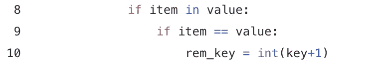

# 动态地理编码:清理公寓号

> 原文：<https://towardsdatascience.com/geocoding-on-the-fly-cleaning-apartment-numbers-c2ab32e11a6b?source=collection_archive---------48----------------------->

由 [Unsplash](https://unsplash.com/s/photos/apartment?utm_source=unsplash&utm_medium=referral&utm_content=creditCopyText) 上的 [CHUTTERSNAP](https://unsplash.com/@chuttersnap?utm_source=unsplash&utm_medium=referral&utm_content=creditCopyText) 拍摄

在我的上一篇文章中，我谈到了为地理编码清理数据。我先说一下地理编码器。外面有很多选择。有些你可能听说过。当然，谷歌有一个非常容易使用的、构建良好的地理编码服务。如果你正在处理成千上万的地址，我建议你仔细研究一下。不过，我不会使用谷歌。像谷歌这样的知名服务的问题在于它们是有限的。他们有一个免费的层级结构，过去是付费服务。一旦你学会了这种格式，他们就会向你收取更多的费用。这并不是一件坏事，但我正专注于快速、低成本的解决方案，让您可以快速获得一些东西，而不必获得额外的许可。

我使用的是使用 OpenStreetMap 地理编码服务的 nomim。地理编码有时可能不可靠，但它肯定是一致的。因此，提前设置一些遵循一致性的代码可以让您快速处理请求并获得地址列表的 XY 坐标。OpenStreetMap 不喜欢的是公寓号，或者任何跟在道路名称后面的东西。因此，我将带您浏览的这段代码将有助于从您的专栏中删除这些内容。我希望你喜欢 python 字典，因为这将是一个很好的练习。

第一部分定义了一个名为 rem_apt 的函数，它接收一个序列，并将其拆分成一个字符串列表。然后从列表中创建一个临时字典。这给了我们一个键来处理每个值。现在，我可以计算服务地址 road name 中有多少个字符串。最后，我创建一个空列表来存储要删除的键。

第 6 行遍历字典项，并遍历一个名为 road_types 的变量。这是一个 csv，我从 USPS 的道路类型列表中创建的，在这里找到了。我把信息复制粘贴成 csv 文件，只保留了“邮政服务标准后缀缩写”一栏。它作为字符串的数据帧导入到我的代码中。这些将是我要寻找的道路名称，并在找到后删除所有字符。同样，一致性是关键，所以了解你的数据。我知道我的数据中的道路名称以缩写结尾。而那些使用道路名称作为道路一部分的不缩写。例如“J 大道”、“9 号公路”和“72 号县道”。

从第 8 行开始，我检查从服务地址 road name 创建的字符串字典(value)中是否有任何道路名称(item)。如果找到了，那么继续检查哪个值与它找到的项匹配。然后，我将 rem_key 值设置为 key +1，并确保它是一个整数。

现在，我遍历其余的值，将找到的值后面的每个键添加到 rep_all_after 列表中。我在关键字上加一个加号，直到到达字典的末尾。这将存储这个既得循环之外的密钥，以供下一次使用。

现在，我可以使用这个键列表从字符串字典中弹出(删除)道路名称之前的所有值。最后返回一串剩余的值。

这最后一段代码通过寻址遍历原始 cust_add_db，用 rem_apt 函数提供的干净 rd 值替换 rd 值。

此时，您可以通过执行以下操作之一来验证您的信息:

*   cust_add_db['rd']。值计数()
*   cust_add_db['rd']。独一无二的

现在我们已经有了一个干净的数据集，接下来的文章将重点关注为我们的服务地址提取 XY 坐标和其他政治实体。