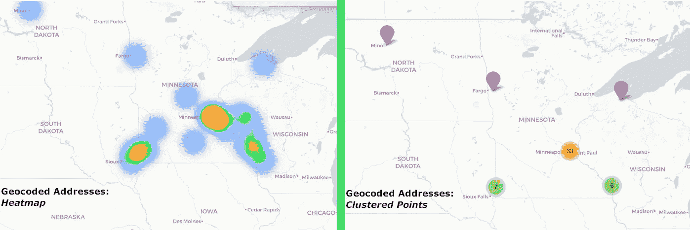
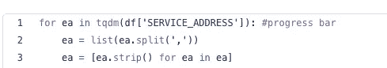
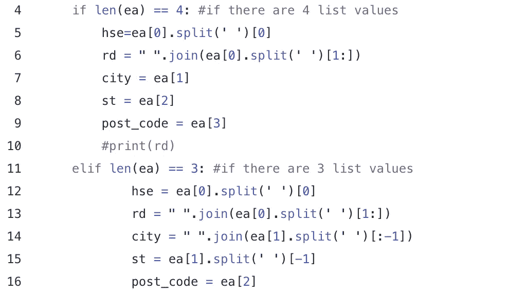
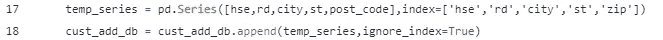
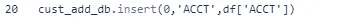

# 动态地理编码:清理数据

> 原文：<https://towardsdatascience.com/geocoding-on-the-fly-cleaning-the-data-850b82e4e19b?source=collection_archive---------46----------------------->

地理编码是制图的一个基本要素。这是一个地址列表，并给他们一个 XY 坐标来定位。此 XY 坐标允许您将符号系统类添加到报告中，如下例所示:

照片来自作者的个人项目

有几个步骤可以到达那里。首先是清理数据集。在我的职业生涯中，我注意到了一致性的重要性。即使有些东西被错误地编目，重要的是它被一贯地错误地完成。因此，了解数据的结构是重中之重。首先，您需要查看以下清单:

*   我的数据集中有多少行和列？
*   列的数据类型是什么？这对数据有意义吗？
*   显示前 5 或 10 行数据，数据看起来像什么？
*   无论您使用哪种语言，都要做一些数值计算，以便更好地了解每一列中的数据是如何组织的。

现在，我将提供一个 python 脚本，当我得到一个服务地址数据表时，我将使用这个脚本。然后我会检查代码行的含义。首先，我将创建一个数据框架来放置我的地理编码信息。这可以在以后连接到原始数据框架，或者可以作为附加工作表保存在原始 excel 文件中。

第一行是用要计算的列创建数据框架。然后，我添加了一个地址字段，这将使结合门牌号和道路更容易为最终干净的地址字段。

此脚本用于将单个地址列分解为多个数据列，作为可追加到临时数据帧的临时数据集。

作者创建的代码

首先，我遍历每个服务地址行，并使用 tqdm 库提供一个进度条。我知道 service address 列是一个 string 对象，所以我将它分开，用逗号分隔，并将值放入一个对该行唯一的列表中。然后我使用列表理解从每个值中去掉所有的前导和尾随空格。

在下一组 if 和 elif 语句中，我将寻找字符串中值的长度。因为我知道服务地址是以下列格式之一书写的:

*   纽约州所有地方市主街 1234 号，邮编 8000–000
*   城市州所有地方主街 1234 号，8000–000

对于每条语句，我通过从列表中取出每个字符串变量并适当地分解它来定义门牌号、道路名称、城市、州和邮政编码的变量。

代码的最后一部分将所有已定义的变量编译成一个临时序列，其索引与列名相匹配。然后将它作为一行追加到临时 cust_add_db 中。您可以添加到 dataframe 中的一行代码是一个惟一的索引号，它有助于将它连接回原始数据。

在我的下一篇文章中，我将讨论可以帮助查找和删除公寓号码、单元等的代码。这些可能会混淆开源地理编码服务。