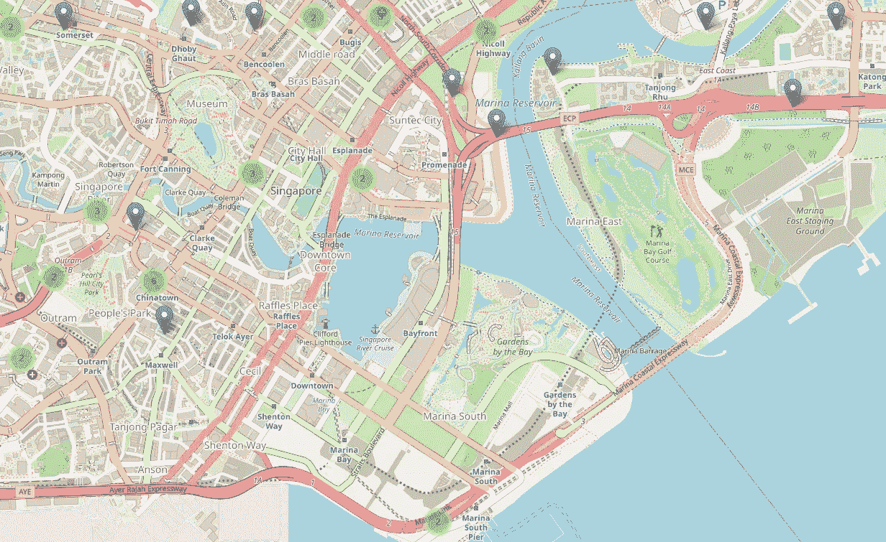
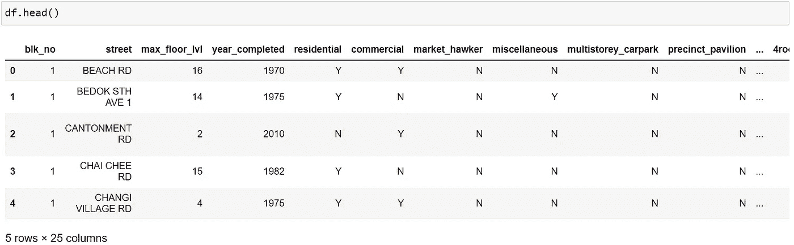
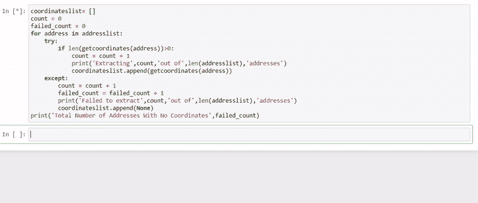

# 地理编码新加坡坐标:OneMap API

> 原文：<https://towardsdatascience.com/geocoding-singapore-coordinates-onemap-api-3e1542bf26f7?source=collection_archive---------12----------------------->

## 免费轻松地将地址转换成坐标



新加坡市区(*图片作者*

使用 Google API 进行地理编码是广为人知的方法。然而，一旦你完成了你的免费学分就要花钱。作为一名经常使用 Tableau 和 Python 进行地理空间可视化的数据分析师，坐标对于绘图非常重要。在本文中，我将演示如何使用新加坡土地管理局(SLA)开发的免费且精确的地理编码 API 对新加坡坐标进行地理编码。

**第一步:导入相关包**

```
import pandas as pd
import requests
```

**第二步:读取熊猫的数据集并检查它**

```
df = pd.read_csv(r"C:\Users\shawn\Downloads\hdb-property-information\hdb-property-information.csv")
df.head()
```

我正在使用的数据集来自 Data.gov.sg，它包含了现有住房发展委员会(HDB)大厦的位置、最高楼层、完工年份、建筑类型和每座大厦的 HDB 公寓数量(按公寓类型分类)等。我从读取 pandas 的数据开始，查看前 5 行，看看我可以使用哪些列。出于演示的目的，并使其尽可能真实，我不会清理数据来显示您如何仍然可以使用 OneMap API。



数据集的前 5 行

**第三步:创建一个可以输入 API 的通讯录**

```
df['Address'] = df['blk_no'] + " " + df['street']
addresslist = list(df['Address'])
```

因为没有地址列，所以我将包含街区号和街道名称的列连接起来，并将其保存到一个新列中。地理编码需要某种形式的地址，因此有必要继续此步骤。接下来，我将新创建的列转换成一个列表，然后可以通过 OneMap API 运行该列表。

**步骤 4:编写地理编码函数**

```
def getcoordinates(address):
    req = requests.get('[https://developers.onemap.sg/commonapi/search?searchVal='+address+'&returnGeom=Y&getAddrDetails=Y&pageNum=1'](https://developers.onemap.sg/commonapi/search?searchVal='+address+'&returnGeom=Y&getAddrDetails=Y&pageNum=1'))
    resultsdict = eval(req.text)
    if len(resultsdict['results'])>0:
        return resultsdict['results'][0]['LATITUDE'], resultsdict['results'][0]['LONGITUDE']
    else:
        pass
```

我首先将函数定义为`getcoordinates`。使用`requests`模块，我将使用它在 OneMap API 上搜索信息。为了检索信息，必须将地址作为字符串插入到给定的 URL 中。接下来，我使用`eval()`函数作为 Python 表达式对其求值。因为不是所有的地址都有坐标，所以我使用 if else 语句只获取有结果的地址。

**第五步:编写一个带条件的 for 循环**



for 循环将开始提取坐标，同时让您知道是否成功

```
coordinateslist= []
count = 0
failed_count = 0
for address in addresslist:
    try:
        if len(getcoordinates(address))>0:
            count = count + 1
            print('Extracting',count,'out of',len(addresslist),'addresses')
            coordinateslist.append(getcoordinates(address))
    except:
        count = count + 1           
        failed_count = failed_count + 1
        print('Failed to extract',count,'out of',len(addresslist),'addresses')
        coordinateslist.append(None)
print('Total Number of Addresses With No Coordinates',failed_count)
```

现在，我开始创建一个空列表来追加提取的坐标。接下来，我放了一个计数函数。通过这样做，我能够知道当前的进度以及没有坐标的地址的总数。这将使我很容易保持跟踪。接下来，我输入一个 try else 条件，这将允许 for 循环继续运行，即使其中一个地址未能从 API 中检索到任何坐标。这对于确保循环顺利运行特别有用，尤其是对于不能从 API 生成任何结果的脏数据集。此外，您仍然能够获得大部分坐标。然后，您可以过滤剩余的脏地址并清理它们，这样您的生活会更轻松，因为您需要清理的内容更少了！

**步骤 6:将获得的坐标连接回原始数据帧**

```
df_coordinates = pd.DataFrame(coordinateslist)
df_combined = df.join(df_coordinates)
df_combined  = df_combined .rename(columns={0:'Latitude', 1:'Longitude'})
```

最后，我将坐标列表转换成数据帧，并将其连接到原始数据帧。由于指数不变，它将完美地加入。我还将列名重命名为 Latitude 和 Longitude，以便更好地反映数据帧中的数据类型。

**总结**

*   步骤 1:导入相关的包
*   第二步:阅读熊猫的数据集并检查它
*   步骤 3:创建一个可以输入 API 的地址列表
*   步骤 4:编写地理编码函数
*   步骤 5:编写一个带条件的 for 循环
*   步骤 6:将获得的坐标连接回原始数据帧

我希望你喜欢我的文章，并且它说服你尝试这个 OneMap API！新加坡政府采取了许多重大举措来公开数据集。因此，探索并看看您能从数据分析项目中得到什么是有用的。你可以在我的 [Github](https://github.com/shawnthamks/OneMap-API) 上查看完整代码。