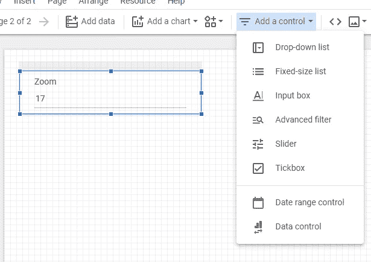

# Google Data Studio 中的地理热图

> 原文：<https://towardsdatascience.com/geographic-heatmaps-in-google-data-studio-a603c09a3d02?source=collection_archive---------10----------------------->

在我的[上一篇文章](/spatial-binning-with-google-bigquery-d118afba6273)中，展示了如何将地理坐标绑定到可以在地图上有效可视化的方块中。下一步自然是用颜色填充这个网格，以显示与坐标相关的任何度量的空间变化，即地理热图。在这里，我们将展示如何使用 Google BigQuery 和 Google Data Studio 来实现这一点。


丹尼斯·库默在 [Unsplash](https://unsplash.com?utm_source=medium&utm_medium=referral) 上拍摄的照片

## 数据集:纽约出租车出行

首先，我们需要地理参考数据，幸运的是 BigQuery 提供了几个公共数据集来帮助我们。这里我们将使用一个[数据集](https://console.cloud.google.com/marketplace/product/city-of-new-york/nyc-tlc-trips)，它包含纽约的出租车行程，上面有上下车的准确位置。这个想法是在地图上显示在给定的时间范围内，从一个给定的接送区，覆盖纽约的每个区块的下车数量。我们可以在同一数据集中的专用表中找到这些区域的边界。

## 从经度和纬度到瓦片坐标

第一步是将每个拾取和放下事件映射到所需大小的相应图块。我们严格遵循此处描述的[程序:](/spatial-binning-with-google-bigquery-d118afba6273)

```
DECLARE
  START_DATE DATE;
DECLARE
  END_DATE DATE;
DECLARE
  ZOOM INT64;
SET
  START_DATE='2015-01-01';
SET
  END_DATE='2015-01-01';
SET
  ZOOM=17;
SELECT
  ZOOM || TRUNC((pickup_longitude*ACOS(-1)/180+ACOS(-1))/(2*ACOS(-1))*POW(2,ZOOM))|| -- *pick-up x coordinate*
  TRUNC((POW(2,ZOOM)/(2*ACOS(-1))*(ACOS(-1)-SAFE.LN(TAN(ACOS(-1)/4+(pickup_latitude/180*ACOS(-1))/2)))))-- *pick-up y coordinate*
  AS pickup_tile_id,
  ZOOM || TRUNC((dropoff_longitude*ACOS(-1)/180+ACOS(-1))/(2*ACOS(-1))*POW(2,ZOOM)) || *-- drop-off x coordinate*
  TRUNC((POW(2,ZOOM)/(2*ACOS(-1))*(ACOS(-1)-SAFE.LN(TAN(ACOS(-1)/4+(dropoff_latitude/180*ACOS(-1))/2))))) -- *drop-off y coordinate*
  AS dropoff_tile_id,
FROM
  `bigquery-public-data.new_york_taxi_trips.tlc_yellow_trips_2015`
WHERE
  DATETIME_TRUNC(pickup_datetime,
    DAY) BETWEEN START_DATE
  AND END_DATE
```

我们引入了一些参数，如`START_DATE` *、* `END_DATE` *、*和`ZOOM`，以提供动态改变时间范围和瓦片大小的灵活性。使用这里使用的默认值，我们只需要 5.3 秒就可以得到输出，但是“繁重”的工作仍然要做，所以如果您想在几秒钟内得到输出而不保存部分结果，就要避免使用更大的时间范围😃。


上面代码的输出

因此，上面的代码为我们提供了包含每次旅行的接送点的瓦片的唯一 id。

## 用瓷砖覆盖纽约的出租车区域

接下来，我们需要知道刚刚找到的每个图块属于哪个区域，因此我们如下进行:

1.  使用表`bigquery-public-data.new_york_taxi_trips.taxi_zone_geom` 访问每个滑行区域的边界和名称。
2.  找到包围每个区域的[包围框](https://cloud.google.com/bigquery/docs/reference/standard-sql/geography_functions#st_boundingbox)，由两对坐标定义，即`(xmin,ymin)`(左下角)和`(xmax,ymax)` (右上角)。
3.  确定包含瓷砖坐标`(tile_x_xmin_ymin,tile_y_xmin_y_min)`和`(tile_x_xmax_ymax,tile_y_xmax_y_max)`的`(xmin,ymin)`和`(xmax,ymax)`的瓷砖。
4.  生成从左下角到右上角的剩余图块。


用方形瓷砖覆盖世贸中心。

请注意，我们可能有一个图块与两个或更多不同的区域重叠:


一个单幅图块覆盖四个不同的区域。

这引入了一定程度的不确定性，必须加以解决:每个区块必须属于且仅属于一个区域。例如，我们可以将其与包含其中心的区域相关联，但我们将遵循不同的方法，即评估瓷砖与每个区域之间的相交区域，并仅保留最大的区域。这可能需要大约一分钟的时间来完成，所以最好将结果保存在一个表中，并在需要时使用该输出。下面是完成刚才描述的过程的代码:

```
DECLARE
  ZOOM INT64;
SET
  ZOOM=17;
WITH
  bounding_box AS(
  SELECT
    zone_name,
    zone_geom,
    ST_BOUNDINGBOX(zone_geom) BB
  FROM
    `bigquery-public-data.new_york_taxi_trips.taxi_zone_geom` ),
  tiles_at_corners AS(
  SELECT
    zone_name,
    zone_geom,
    TRUNC((BB.xmin*ACOS(-1)/180+ACOS(-1))/(2*ACOS(-1))*POW(2,zoom)) tile_x_xmin_ymin,
    TRUNC((POW(2,ZOOM)/(2*ACOS(-1))*(ACOS(-1)-SAFE.LN(TAN(ACOS(-1)/4+(BB.ymin/180*ACOS(-1))/2))))) tile_y_xmin_ymin,
    TRUNC((BB.xmax*ACOS(-1)/180+ACOS(-1))/(2*ACOS(-1))*POW(2,zoom)) tile_x_xmax_ymax,
    TRUNC((POW(2,ZOOM)/(2*ACOS(-1))*(ACOS(-1)-SAFE.LN(TAN(ACOS(-1)/4+(BB.ymax/180*ACOS(-1))/2))))) tile_y_xmax_ymax,
  FROM
    bounding_box)
SELECT
  zone_name,
  tile_id,
  ST_MAKEPOLYGON( ST_MAKELINE([ ST_GEOGPOINT(NW_LONG,
        NW_LAT),
      ST_GEOGPOINT(NE_LONG,
        NE_LAT),
      ST_GEOGPOINT(SE_LONG,
        SE_LAT),
      ST_GEOGPOINT(SW_LONG,
        SW_LAT),
      ST_GEOGPOINT(NW_LONG,
        NW_LAT) ])) polygon
FROM (
  SELECT
    zone_name,
    zone_geom,
    ZOOM || tile_x || tile_y tile_id,
    180/ACOS(-1)*(2*ACOS(-1)*tile_x/POW(2,ZOOM)-ACOS(-1)) AS NW_LONG,
    360/ACOS(-1)*(ATAN(EXP(ACOS(-1)-2*ACOS(-1)/POW(2,ZOOM)*tile_y))-ACOS(-1)/4) AS NW_LAT,
    180/ACOS(-1)*(2*ACOS(-1)*(tile_x+1)/POW(2,ZOOM)-ACOS(-1)) AS NE_LONG,
    360/ACOS(-1)*(ATAN(EXP(ACOS(-1)-2*ACOS(-1)/POW(2,ZOOM)*tile_y))-ACOS(-1)/4) AS NE_LAT,
    180/ACOS(-1)*(2*ACOS(-1)*(tile_x+1)/POW(2,ZOOM)-ACOS(-1)) AS SE_LONG,
    360/ACOS(-1)*(ATAN(EXP(ACOS(-1)-2*ACOS(-1)/POW(2,ZOOM)*(tile_y+1)))-ACOS(-1)/4) AS SE_LAT,
    180/ACOS(-1)*(2*ACOS(-1)*(tile_x)/POW(2,ZOOM)-ACOS(-1)) AS SW_LONG,
    360/ACOS(-1)*(ATAN(EXP(ACOS(-1)-2*ACOS(-1)/POW(2,ZOOM)*(tile_y+1)))-ACOS(-1)/4) SW_LAT
  FROM (
    SELECT
      zone_name,
      zone_geom,
      (tile_x_xmin_ymin + x) tile_x,
      (tile_y_xmin_ymin + y) tile_y
    FROM
      tiles_at_corners,
      UNNEST(GENERATE_ARRAY(0,tile_x_xmax_ymax-tile_x_xmin_ymin,1)) x,
      UNNEST(GENERATE_ARRAY(tile_y_xmax_ymax-tile_y_xmin_ymin,0,1)) y) )
WHERE
  TRUE QUALIFY ROW_NUMBER() OVER (PARTITION BY tile_id ORDER BY st_area(st_intersection(polygon, zone_geom)) DESC)=1
```

确保对您认为以后需要的每个`ZOOM`值重复此过程。

## 准备最终查询

对于给定的`ZOOM`值，我们现在知道每个图块属于哪个滑行区域，因此我们可以从我们离开的地方继续:

```
DECLARE
  START_DATE DATE;
DECLARE
  END_DATE DATE;
DECLARE
  ZOOM INT64;
SET
  START_DATE='2015-01-01';
SET
  END_DATE='2015-01-01';
SET
  ZOOM=17;
SELECT
  trips.*,
  t.polygon
FROM (
  SELECT
    t1.zone_name pickup_zone_name,
    t2.zone_name dropoff_zone_name,
    dropoff_tile_id,
    COUNT(*) trips
  FROM (
    SELECT
      ZOOM || TRUNC((pickup_longitude*ACOS(-1)/180+ACOS(-1))/(2*ACOS(-1))*POW(2,ZOOM)) || TRUNC((POW(2,ZOOM)/(2*ACOS(-1))*(ACOS(-1)-SAFE.LN(TAN(ACOS(-1)/4+(pickup_latitude/180*ACOS(-1))/2))))) AS pickup_tile_id,
      ZOOM || TRUNC((dropoff_longitude*ACOS(-1)/180+ACOS(-1))/(2*ACOS(-1))*POW(2,ZOOM)) || TRUNC((POW(2,ZOOM)/(2*ACOS(-1))*(ACOS(-1)-SAFE.LN(TAN(ACOS(-1)/4+(dropoff_latitude/180*ACOS(-1))/2))))) AS dropoff_tile_id,
    FROM
      `bigquery-public-data.new_york_taxi_trips.tlc_yellow_trips_2015`
    WHERE
      DATETIME_TRUNC(pickup_datetime,
        DAY) BETWEEN START_DATE
      AND END_DATE ) trips
  INNER JOIN
    NY_Taxi_Trips.Tiles t1
  ON
    pickup_tile_id=t1.tile_id
  INNER JOIN
    NY_Taxi_Trips.Tiles t2
  ON
    dropoff_tile_id=t2.tile_id
  GROUP BY
    pickup_zone_name,
    dropoff_zone_name,
    dropoff_tile_id) trips
INNER JOIN
  NY_Taxi_Trips.Tiles t
ON
  dropoff_tile_id=t.tile_id
```

我们使用了几次表`NY_Taxi_Trips.Tiles`,它是我们在具有相应区域名称的瓷砖多边形之前保存的地方。因此，该查询的输出给出了在`START_DATE`和`END_DATE`之间的`dropoff_zone_name`中从`pickup_zone_name`到`dropoff_tile_id`记录的旅行次数。请注意，我们在最后一个`SELECT`语句中引入了`GEOGRAPHY`字段，即`polygon`，以避免加重前面步骤的负担。

一旦我们在 BigQuery 上测试了这个查询，我们就准备将它用于 Data Studio。我们只需要改变代码中引用声明参数的方式:

```
SELECT
  trips.*,
  t.polygon
FROM (
  SELECT
    t1.zone_name pickup_zone_name,
    t2.zone_name dropoff_zone_name,
    dropoff_tile_id,
    COUNT(*) trips
  FROM (
    SELECT
      [@ZOOM](http://twitter.com/ZOOM) || TRUNC((pickup_longitude*ACOS(-1)/180+ACOS(-1))/(2*ACOS(-1))*POW(2,[@ZOOM](http://twitter.com/ZOOM))) || TRUNC((POW(2,[@ZOOM](http://twitter.com/ZOOM))/(2*ACOS(-1))*(ACOS(-1)-SAFE.LN(TAN(ACOS(-1)/4+(pickup_latitude/180*ACOS(-1))/2))))) AS pickup_tile_id,
      [@ZOOM](http://twitter.com/ZOOM) || TRUNC((dropoff_longitude*ACOS(-1)/180+ACOS(-1))/(2*ACOS(-1))*POW(2,[@ZOOM](http://twitter.com/ZOOM))) || TRUNC((POW(2,[@ZOOM](http://twitter.com/ZOOM))/(2*ACOS(-1))*(ACOS(-1)-SAFE.LN(TAN(ACOS(-1)/4+(dropoff_latitude/180*ACOS(-1))/2))))) AS dropoff_tile_id,
    FROM
      `bigquery-public-data.new_york_taxi_trips.tlc_yellow_trips_2015`
    WHERE
      DATETIME_TRUNC(pickup_datetime,
        DAY) BETWEEN PARSE_DATE('%Y%m%d',
        [@DS_START_DATE](http://twitter.com/DS_START_DATE))
      AND PARSE_DATE('%Y%m%d',
        [@DS_END_DATE](http://twitter.com/DS_END_DATE))) trips
  INNER JOIN
    NY_Taxi_Trips.Tiles t1
  ON
    pickup_tile_id=t1.tile_id
  INNER JOIN
    NY_Taxi_Trips.Tiles t2
  ON
    dropoff_tile_id=t2.tile_id
  GROUP BY
    pickup_zone_name,
    dropoff_zone_name,
    dropoff_tile_id) trips
INNER JOIN
  NY_Taxi_Trips.Tiles t
ON
  dropoff_tile_id=t.tile_id
```

1.  `ZOOM` → `@ZOOM`
2.  `START_DATE` → `@DS_START_DATE`
3.  `END_DATE` → `@DS_END_DATE`

## 在 Data Studio 中可视化热图

让我们在 Data Studio 中创建我们的报告，我们将保持它的简单:

1.  去 https://datastudio.google.com/的。
2.  **创建** > **报表。**
3.  选择 **BigQuery 连接器。**
4.  选择**自定义查询**并复制我们的查询。
5.  勾选**启用日期范围参数。**
6.  点击**添加一个参数**并定义最后一个参数，即`ZOOM`，使用以下配置:


缩放参数的定义

最后，点击**添加**，让我们创建我们的可视化！

首先，我们希望能够在查看模式下随时更改我们的参数值，因此我们转到**添加一个控件**，并选择插入一个**输入框**来控制缩放级别:



添加一个输入框来控制缩放参数。

我们重复此程序，插入**日期范围控件**和**下拉列表**，分别控制日期范围和起始提货区。我们也为两者选择默认值，即第一个为 2015 年的前 6 个月，第二个为“ *JFK 机场*”:


默认日期范围值。


我们为提货区选择一个默认值。

我们现在准备添加地图:

1.  转到**添加图表** > **谷歌地图>填充地图。**
2.  将地图插入报告中的任意位置。
3.  使用以下**字段**配置让其正常工作:


填充地图的字段配置。

我们也可以自定义地图样式，如下所示:

1.  使用**深色**款式
2.  不使用**边框重量**
3.  选择最大、中间和最小颜色的调色板: **#ffffff** 、 **#ffd54f** 和 **#212121**

请注意，作者是色盲，这可能是最糟糕的颜色选择，你可以随意改变😃。

在这一点上，我们应该得到这样的东西:


我们的首次热图可视化！

我们注意到只有一小块突出显示的区域，这里显然聚集了来自 JFK 机场的大部分旅行。如果我们希望我们的热图看起来不那么平坦，我们可以通过更改图表配置中的**颜色度量**将比例从线性更改为不同的比例:


修改公制以更改比例

例如，使用`SQRT(SUM(trips))`,我们得到一个稍微不同的可视化:


我们现在可以尝试不同的提货区:


或者不同瓷砖尺寸:


该是你进一步实验的时候了！

享受😃！