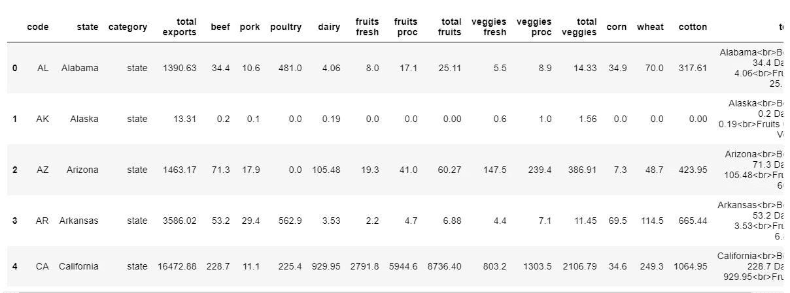
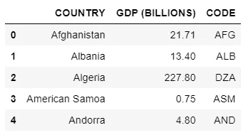

# 用 Plotly 绘制地图的地理图

> 原文：<https://towardsdatascience.com/geographical-plotting-of-maps-with-plotly-4b5a5c95f02a?source=collection_archive---------10----------------------->

## 使用 Plotly 创建交互式地图来显示您的数据。


Marjan Blan | @marjanblan 在 [Unsplash](https://unsplash.com?utm_source=medium&utm_medium=referral) 上的照片

# **什么是地理标图？**

地理绘图是一种显示全球范围以及一个国家各州数据的方法，通常以丰富多彩的方式显示。它在数据分析和可视化中起着重要的作用。它通常在构建仪表板以呈现广泛的数据时使用。

为了创建交互式地图，我们使用 python 的 plotly 库。Plotly 用于制作交互式图形，以及创建其他可视化。

点击[此处](https://medium.com/swlh/principles-of-plotly-e7c9abb88528)了解更多关于 plotly 的信息。

让我们把这个教程分成两部分。在第一部分中，我们将关注基于国家的地理绘图数据，在我们的例子中，这将是美国的农业出口。在第二部分，我们将使用一个随机的全球 GDP 数据集。这两个数据集都可以在[这里](https://github.com/jendcruz22/Medium-articles/tree/master/Geographical%20plotting%20with%20plotly)找到。

## **先决条件:**

对 python 编程的基本理解。特别是 python 的 [matplotlib](/visualizations-with-matplotlib-4809394ea223) 和 [plotly](https://medium.com/swlh/principles-of-plotly-e7c9abb88528) 库。

首先导入以下模块:

```
import pandas as pd
import chart_studio.plotly as py
import plotly.offline as po
import plotly.graph_objs as pg
import matplotlib.pyplot as plt
%matplotlib inline
```

你需要启动 plotly 的笔记本模式来显示笔记本里面的情节。这将允许您离线生成图形并将它们保存在本地机器中。

这可以通过以下方式完成:

```
po.init_notebook_mode(connected = True)
```

我们加载了基于美国农业出口的第一个数据集。

```
AE = pd.read_csv(‘AgriculturalExport.csv’)
AE.head()
```



作者图片

在这里，州代码是至关重要的，因为当我们绘制地理图时，它可以帮助我们定位。

在绘制数据时，您需要考虑几个因素，例如:您需要什么样的输出？要显示哪些位置？每个位置需要显示的值是什么？最后但同样重要的是，需要什么样的颜色、样式或文字？所有这些基本值都在我们的数据变量(即字典)下。您可以使用不同的地图类型。这里我们使用的是 choropleth，这是一个不需要任何其他库的基本图形。然后我们有位置，即位置代码。接下来，我们需要 locationmode，它告诉我们计划指定位置的方法。在我们的示例中，我们将位置模式设置为 usa-states。现在我们需要位置的值，然后当鼠标悬停在每个提到的位置上时显示文本。

```
data = dict(type = ‘choropleth’, 
 locations = [‘AL’, ‘AK’, ‘AR’, ‘CA’], 
 locationmode = ‘USA-states’, 
 z = [1,2,30,40,50], 
 text = [‘alabama’, ‘alaska’, ‘arizona’, ‘pugger’, ‘california’])
```

在布局变量中，我们只需要用 geo 表示的范围。确保美国不是用大写字母写的，因为那会导致错误。

```
layout = dict(geo = {'scope':'usa'})
```

x 变量使用我们之前导入的 plotly.graph_objs 模块来绘制状态的结构。在我们的例子中，那是美国。我们向 x 传递两个参数:数据和布局。数据表示在特定范围上表示的数据；布局定义了我们在那里使用什么样的范围。

```
x = pg.Figure(data = [data] ,
layout = layout)
po.iplot(x)
```

现在，我们只需要根据数据集中可用的值来更改布局和数据。我们编写 AE['code']从我们的数据集中调用州代码，而不是键入每个州的代码。类似地，z 将表示每个州的总出口，如下所示。谈到文本变量，我们的数据集包括一个名为 text 的列，显示每个州的农业出口的所有数据，因此我们没有将文本变量更改为州名，而是编写 AE['text']。从而显示每个州的所有导出信息。

```
data = dict(type = 'choropleth', 
            locations = AE['code'], 
            locationmode = 'USA-states', 
            z = AE['total exports'], 
            text = AE['text'])
```

至于布局，我们现在讨论的不仅仅是范围，所以我们可以添加显示湖和标题，如下所示:

```
layout = dict(title = 'USAs Agricultural Exports', 
              geo = dict(scope = 'usa' , 
                         showlakes = True, 
                         lakecolor = 'rgb(0,191,255)'))x = pg.Figure(data = [data], 
              layout = layout)
po.iplot(x)
```

您可以使用不同的色标，如波特兰、绿色等，甚至可以为您的数据添加颜色条，如下所示:

```
data = dict(type = 'choropleth', 
            locations = AE['code'], 
            locationmode = 'USA-states', 
            z = AE['total exports'], 
            text = AE['text'], 
            colorscale = 'Greens', 
            colorbar = {'title' : 'colorbar'})layout = dict(title = 'USAs Agricultural Exports with the lakes', 
              geo = dict(scope='usa' , 
                       showlakes = True, 
                       lakecolor = 'rgb(0,191,255)'))x = pg.Figure(data = [data], 
              layout = layout)
po.iplot(x)
```

我们现在已经到了文章的第二部分，我们将绘制全球范围的地理图表。为此我们将使用我们的[全球 GDP 数据集](https://github.com/jendcruz22/Medium-articles/blob/master/Geographical%20plotting%20with%20plotly/GlobalGDP.csv)。

```
G_GDP = pd.read_csv('GlobalGDP.csv')
G_GDP.head()
```



作者图片

所以，让我们再次定义数据和布局。

```
data = dict(type='choropleth', 
            locations = G_GDP['CODE'], 
            z = G_GDP['GDP (BILLIONS)'], 
            text = G_GDP['COUNTRY'])
```

当我们在全球范围内绘制地图时，布局现在将由投影属性而不是范围组成。

```
layout = dict(title = 'Global GDP - hammer projection',
              geo = dict( projection = {'type':'**hammer**'},
                         showlakes = True, 
                         lakecolor = 'rgb(0,191,255)'))x = pg.Figure(data = [data], 
              layout = layout)
po.iplot(x)
```

这些图的有趣之处在于，您可以方便地放大、浏览和查看绘制在全球各地的数据。这是因为我们的投影类型:锤子。我们可以使用其他投影类型查看相同的数据，如自然地球、罗宾逊、墨卡托、立体投影等。下面给出了一些投影类型的代码和输出。

```
layout = dict(title = 'Global GDP - robinson projection', 
              geo = dict( projection = {'type':'**robinson**'}, 
                         showlakes = True, 
                         lakecolor = 'rgb(0,191,255)'))x = pg.Figure(data = [data], 
              layout = layout) 
po.iplot(x)
```

```
layout = dict(title = 'Global GDP - natural earth projection', 
              geo = dict( projection = {'type':'**natural earth**'}, 
                         showlakes = True, 
                         lakecolor = 'rgb(0,191,255)'))
x = pg.Figure(data = [data], 
              layout = layout)
po.iplot(x)
```

```
layout = dict(title = 'Global GDP - mercator projection', 
              geo = dict(projection = {'type':'**mercator**'}, 
                       showlakes = True, 
                       lakecolor = 'rgb(0,191,255)'))x = pg.Figure(data = [data], 
              layout = layout)
po.iplot(x)
```

```
layout = dict(title = 'Global GDP - stereographic projection', 
              geo = dict(projection = {'type':'**stereographic**'}, 
                       showlakes = True, 
                       lakecolor = 'rgb(0,191,255)'))x = pg.Figure(data = [data], 
              layout = layout)
po.iplot(x)
```

```
layout = dict(title = 'Global GDP - orthographic projection', 
              geo = dict( projection = {'type':'**orthographic**'}, 
                       showlakes = True, 
                       lakecolor = 'rgb(0,191,255)'))x = pg.Figure(data = [data], 
              layout = layout)
po.iplot(x)
```

您可以移除投影的边界，如下所示:

```
layout = dict(title = 'Global GDP - robinson projection without borders', 
              geo = dict(showframe = False, 
                       projection = {'type':'robinson'}, 
                       showlakes = True, 
                       lakecolor = 'rgb(0,191,255)'))x = pg.Figure(data = [data], layout = layout)
po.iplot(x)
```

要了解更多关于 Plotly 的地图配置和样式，你可以参考它的[文档](https://plotly.com/python/maps/)。

这篇文章的全部代码可以在[这里](https://github.com/jendcruz22/Medium-articles/tree/master/Geographical%20plotting%20with%20plotly)找到。

我希望这个快速教程是有帮助的。谢谢你阅读它！

> 你可以在这里联系我。