# 用 Python 处理几何和泊松随机变量

> 原文：<https://towardsdatascience.com/geometric-and-poisson-random-variables-with-python-e5dcb63d6b55?source=collection_archive---------23----------------------->

## 用 Python 实现大学统计

# 介绍

在一系列的每周文章中，我将涉及一些重要的统计学主题。

目标是使用 Python 来帮助我们获得对复杂概念的直觉，从经验上测试理论证明，或者从零开始构建算法。在本系列中，您将会看到涵盖随机变量、抽样分布、置信区间、显著性检验等主题的文章。

在每篇文章的最后，你可以找到练习来测试你的知识。解决方案将在下周的文章中分享。

迄今发表的文章:

*   [伯努利和二项随机变量与 Python](/bernoulli-and-binomial-random-variables-d0698288dd36)
*   [用 Python 从二项式到几何和泊松随机变量](/geometric-and-poisson-random-variables-with-python-e5dcb63d6b55)
*   [用 Python 实现样本比例的抽样分布](/sampling-distributions-with-python-f5a5f268f636)
*   [Python 的置信区间](/confidence-intervals-with-python-bfa28ebb81c)
*   [使用 Python 进行显著性测试](/significance-or-hypothesis-tests-with-python-7ed35e9ac9b6)
*   [用 Python 进行组间差异的双样本推断](/two-sample-inference-for-the-difference-between-groups-with-python-de91fbee32f9)
*   [分类数据的推断](/inference-for-categorical-data-9f3c6034aa57)
*   [高级回归](/advanced-regression-f74090014f3)
*   [方差分析— ANOVA](/analysis-of-variance-anova-8dc889d2fc3a)

像往常一样，代码可以在我的 [GitHub](https://github.com/luisroque/College_Statistics_with_Python) 上找到。

## 比较几何随机变量和二项随机变量

让我们从概述什么是二项随机变量(RV)开始。以下是清单:

*   审判是独立的；
*   每次试验都可以分为成功或失败；
*   固定的试验次数；
*   每次试验成功的概率是恒定的。

这种变量的一个例子可以是 *X* ，*在 10 次掷骰子后 5 的数量*。注意试验是独立的；在第一次试验中滚动骰子不影响在第二次试验中滚动骰子。我们可以清楚地将试验分为成功(我们得到了 5 分)或失败(我们得到了除 5 分之外的任何数字)。我们掷 10 次骰子，所以 10 代表我们的试验次数。最后，成功的概率是恒定的，因为我们总是一次又一次地使用同一个骰子，所以得到 5 的概率总是 1/6。

那么，二项式 RV 和几何式 RV 有什么区别呢？当我定义几何 RV *Y* ，*掷骰数直到你在公平骰子*上得到一个 5 时，看看你是否能找出差异。在继续之前考虑一下(参考清单)。

主要区别是试验次数固定；我们已经没有了。据我们所知，它可能是一个古戈尔(10^100)卷数。

```
from IPython.display import Image
import numpy as np
import seaborn as sns
from scipy.stats import binom
```

## 几何随机变量的概率

克里斯蒂亚诺·罗纳尔多的点球转化率约为 84%，是世界上最好的之一。

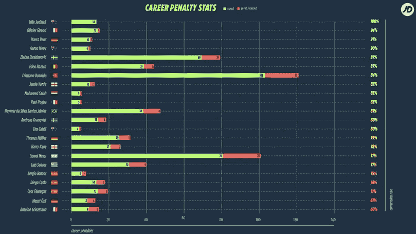

图 1:22 位世界最佳点球手的职业生涯点球统计；[来源](https://www.jd-sports.com.au/page/world-cup-penalty-statistics/)

现在想象罗纳尔多罚点球，直到他罚丢一个球。设 *X* 为他第一次罚球不进的射门次数。c 罗第一次投篮不中发生在第 4 次试射的概率有多大？

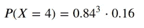

你可以看到上面的等式是前三次投篮得分的概率 0.84 乘以第四次失误的概率 0.16 的乘积。回想一下，这些尝试是独立的；这就是为什么我们可以像这里一样把它们繁殖起来。

所以 c 罗连续进 3 个点球，然后第 4 个罚丢的概率在 10%左右。

```
0.84**3*0.160.09483263999999998
```

我们可以将几何分布的概率质量函数概括如下:

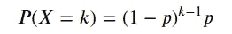

## **累积几何概率**

在计算累积几何概率时，我们可以从两个不同的角度来看。

让我们假设成功的概率 *p* =0.1，我们要计算 *P(X < 5)* 。

我们可以这样想:

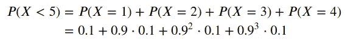

或者我们可以反过来想，前 4 次试验都没有成功，所以:

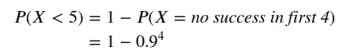

```
def geomcdf_1(p, x):
    # implementing first approach
    prob = 0
    for i in range(x-1):
        prob+=p*(1-p)**i
    return probdef geomcdf_2(p, x):
    # implementing second approach
    prob = 1-(1-p)**(x-1)
    return probgeomcdf_1(0.1, 5)0.34390000000000004geomcdf_2(0.1, 5)0.3439
```

我们可以看到，实现任何一种方法都会得到相同的结果。然而，第二种方法的计算成本要低得多，因为我们不需要遍历所有情况。

## 几何随机变量的期望值

任何离散 RV 的概率是概率加权结果的总和。

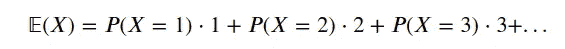

在几何 RV 中，我们已经知道如何计算概率。例如， *P(X=1)* 是一次成功的概率，因此 *P(X=1)=p* 。在 *P(X=2)，*我们有两次试验，因此必然有一次不成功的试验和一次成功的试验，因此 *P(X=2)=(1-p)p* 等等。

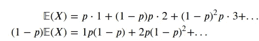

如果我们减去这两个方程，

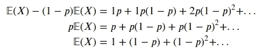

这就是我们的经典几何级数，其公比是 *(1-p)* 。事实上，这也是我们称之为几何 RV 的原因之一。一个几何级数的和为 *1/(1-r)* ，其中 *r* 为公比。

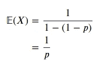

现在我们已经得到了几何 RV 的期望值，让我们通过实验看看是否能得到相同的结果。

```
p=0.2
X = np.random.geometric(p, 1000000)

print('Theoretical expected value: ' + str(X.mean()))
print('Empirically calculated expected value: ' + str(1/p))Theoretical expected value: 5.00225
Empirically calculated expected value: 5.0
```

这就对了，我们可以对我们的推导感到满意了。

## 比较泊松随机变量和二项随机变量

我们能从二项式随机变量(RV)中近似出一个泊松随机变量(RV)吗？

让我们将 RV *X* 定义为我们看到经过我们街道的 UberEats 摩托车的数量。

如果我们试图建立在这个想法上，我们会以某种方式得到一个期望值 *X* ，看起来像这样:

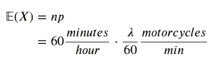

我们的概率是这样的:

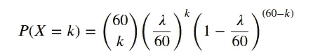

问题是，每分钟都有超过一辆摩托车经过我们的街道，而我们目前的设置无法解释这一点。但是有一种方法可以做到这一点，因为我们可以更细化。

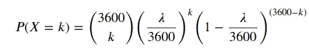

现在，我们在用秒来工作，每秒钟看到 1 辆摩托车的概率相当小。但是我们仍然可以面对半秒钟内有两辆摩托车经过我们街道的问题。所以我们可以把它变得更小。我想你知道这是怎么回事了。

我们需要理解当 *n* 趋于无穷大时会发生什么。在深入讨论这个问题之前，让我们先修改一下在我们的证明中需要用到的三个性质。前两个与限制有关:

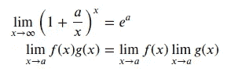

第三个是组合学:

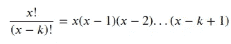

利用这些性质，我们可以直观地看出泊松 RV 实际上是二项式 RV 的导数。

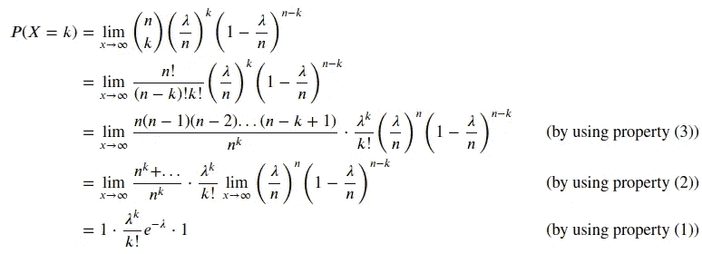

我们刚刚得到了泊松分布的概率质量函数。

## 通过计算概率质量函数值来证明

我们总是希望我们的证明和推导是安全的，所以让我们首先计算二项式 RV 的 *n* 的不同值的概率质量函数，然后将结果与相同速率的泊松 RV 进行比较。

```
from scipy.stats import binom, poisson
import matplotlib.pyplot as pltn1 = 20
n2 = 60
n3 = 3600
λ = 9

x = np.arange(9)

X1 = binom.pmf(x, n1, λ/n1)
X2 = binom.pmf(x, n2, λ/n2)
X3 = binom.pmf(x, n3, λ/n3)

Z = poisson.pmf(x, 9)print(f'P(X1<=9) of a Binomial RV with n={n1}: ' + str(np.sum(X1)))
print(f'P(X2<=9) of a Binomial RV with n={n2}: ' + str(np.sum(X2)))
print(f'P(X3<=9) of a Binomial RV with n={n3}: ' + str(np.sum(X3)))
print(f'P(Z<=9) of a Poisson RV with λ={λ}: ' + str(np.sum(X3)))P(X1<=9) of a Binomial RV with n=20: 0.41430623411611534
P(X2<=9) of a Binomial RV with n=60: 0.44482436484547344
P(X3<=9) of a Binomial RV with n=3600: 0.455487676774296
P(Z<=9) of a Poisson RV with λ=9: 0.455487676774296
```

注意我们的直觉是正确的；随着 *n* 的值变得更大，我们实际上正在逼近泊松 RV 的相同概率。

## 抽样证明

我们可以通过从上面定义的 RVs 中取样来做同样的练习，然后计算概率。

```
X1 = binom.rvs(n=n1, p=λ/n1, size=100000)
X2 = binom.rvs(n=n2, p=λ/n2, size=100000)
X3 = binom.rvs(n=n3, p=λ/n3, size=100000)

Z = poisson.rvs(9, size=100000)print(f'P(X1<=9) of a Binomial RV with n={n1}: ' + str(X1[X1<9].shape[0]/X1.shape[0]))
print(f'P(X2<=9) of a Binomial RV with n={n2}: ' + str(X2[X2<9].shape[0]/X2.shape[0]))
print(f'P(X3<=9) of a Binomial RV with n={n3}: ' + str(X3[X3<9].shape[0]/X3.shape[0]))
print(f'P(Z<=9) of a Poisson RV with λ={λ}: ' + str(Z[Z<9].shape[0]/Z.shape[0]))P(X1<=9) of a Binomial RV with n=20: 0.41375
P(X2<=9) of a Binomial RV with n=60: 0.44721
P(X3<=9) of a Binomial RV with n=3600: 0.45365
P(Z<=9) of a Poisson RV with λ=9: 0.45409
```

我们还可以绘制每个分布的概率质量函数，注意当 *n* =3600 时，这个近似值实际上是非常好的。

```
_,ax = plt.subplots(2, 2, figsize=(25, 10), sharey=True, sharex=True)
ax = ax.ravel()

λ=9

ax[0].hist(binom.rvs(n=20, p=9/20, size=100000), bins=50)
ax[0].set_title(f'Binomial RV with n={20}, p={9}')
ax[1].hist(binom.rvs(n=60, p=9/60, size=100000), bins=50, color='darkorange')
ax[1].set_title(f'Binomial RV with n={60}, p={9}')
ax[2].hist(binom.rvs(n=1000000, p=9/1000000, size=100000), bins=50, color='black');
ax[2].set_title(f'Binomial RV with n={3600}, p={9}')
ax[3].hist(poisson.rvs(9, size=100000), bins=50, color='red')
ax[3].set_title(f'Poisson RV with λ={9}');
```

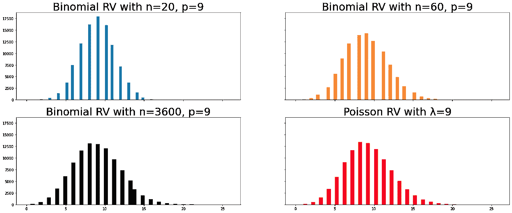

图 2:使用具有不同 *n 值的二项式 RV 来近似泊松 RV；请注意，随着 n 变大，二项式 RV 的采样分布形状越来越接近泊松 RV 的采样分布。*

# 练习

你将在下周的文章中找到答案。

1.  你有一副标准的牌，你在挑选牌，直到你得到一张女王(如果他们不是女王，你替换他们)。你需要挑 5 张牌的概率是多少？而不到 10？而且超过 12 个？
2.  Jorge 对冰柜进行检查。他发现 94%的冰柜成功通过了检查。设 *C* 为 Jorge 检查的冰柜数量，直到某个冰柜未通过检查。假设每次检查的结果都是独立的。
3.  佩德罗罚球命中率为 25%。作为热身，佩德罗喜欢罚任意球，直到他罚进为止。设 M 为佩德罗第一次任意球射门的次数。假设每个镜头的结果是独立的。找出佩德罗第一次投篮不到 4 次的概率。
4.  构建一个计算泊松 PMF 的函数，除了使用来自`numpy`的`np.exp`之外，不使用任何来自外部包的函数。选择一些参数，并将您的结果与`scipy`中的`pmf`函数进行比较。
5.  构建一个计算泊松 CDF 的函数，而不使用任何外部包。选择一些参数，并将您的结果与`scipy`中的`cdf`函数进行比较。

## 上周的答案

```
def fact(n):
    x = 1
    for i in range(1, n+1):
        x *= i
    return x

def comb(n, k):
    x = 1
    return fact(n)/(fact(k)*fact(n-k))

def binompmf(prob, n, k):
    return comb(n,k)*prob**k*(1-prob)**(n-k)

def binomcdf(prob, n, x):
    result = 0
    for x_ in range(0, x+1):
        result += binompmf(prob, n, x_)
    return result
```

1.一家公司生产瓶装水。在其主要工厂，有缺陷的瓶子数量是 5%。质量检查包括随机选择和测试 1000 瓶。这些样品中有缺陷的瓶子数量的平均值和标准偏差是多少？

```
print('μ_x={}'.format(1000*0.05))
print('σ_x={}'.format((1000*0.05*(1-0.05))**(1/2)))μ_x=50.0
σ_x=6.892024376045111
```

2.一家葡萄酒公司正在进行促销活动，声称每 4 箱葡萄酒中有 1 箱含有惊喜。假设你会买 5 箱这款酒，让 X 代表你在这些箱子里可以赢得的惊喜数量。假设这些盒子代表随机样本，并假设盒子之间的惊喜是独立的。你在 5 个盒子中最多赢得 1 个惊喜的概率是多少？

(你能用三种不同的方法解决这个问题吗？提示:通过抽样，对个体概率求和，并使用 CDF)

```
# We want to calculate P(X<=1)

# Solution 1: By sampling

x = np.random.binomial(5, 0.25, 1000000)

x[x<=1].shape[0]/x.shape[0]0.632957# Let's draw our discrete distribution

sns.histplot(x, stat="density", discrete=True, shrink=0.3);
```

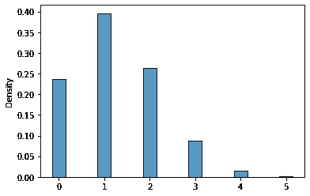

```
# Solution 2: Solve it by calculating the probability for each case (X=0 and X=1)

# Using our function
print(str(binompmf(0.25, 5, 0) + binompmf(0.25, 5, 1)))

# Using scipy package
print(str(binom.pmf(0, 5, 0.25)+binom.pmf(1, 5, 0.25)))0.6328125
0.6328125# Solution 3: Using the CDF

# Using our function
print(str(binomcdf(0.25, 5, 1)))

# Using scipy package
print(str(binom.cdf(1, 5, 0.25)))0.6328125
0.6328125
```

3.一位数学老师正在和她的学生一起做一个活动，她给他们一个 20 个问题的选择题，而他们一个答案也不知道。学生需要猜测每个问题，每个问题有 5 个可能的选择，其中一个是正确的。每个学生答对的问题数量的平均值和标准差是多少？

你能用两种不同的方法解决这个问题吗？提示:通过采样和使用我们上面做的理论推导)

```
# Solution 1: solving by sampling

n = 20
p = 0.2

# Using numpy package
X = np.random.binomial(20, 0.2, 1000000)

print(X.mean())
print(X.std())4.001996
1.7910455091884183# Using the theoretical derivation

μ_x = n*p
σ_x = (n*p*(1-p))**(1/2)

print(μ_x)
print(σ_x)4.0
1.7888543819998317
```

保持联系: [LinkedIn](https://www.linkedin.com/in/luisbrasroque/)