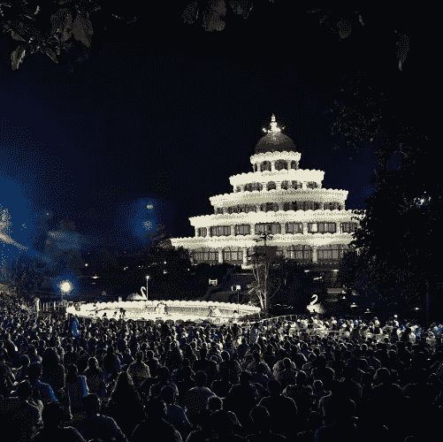
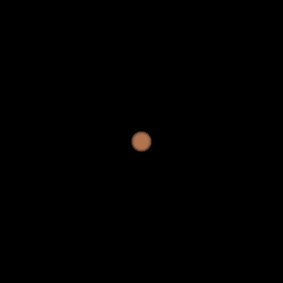

# PyTorch 几何艺术

> 原文：<https://towardsdatascience.com/geometric-art-with-pytorch-c6d92bf3e320?source=collection_archive---------46----------------------->

## 使用 Pytorch 和几何形状通过深度学习创建艺术。

(图片由作者提供)[须弥山](https://www.artofliving.org/sumeru-mantap)

在浏览这个[谷歌实验画廊](https://experiments.withgoogle.com/)的时候，我偶然发现了这个有趣的[工具](https://experiments.withgoogle.com/geometrize)。在该算法中，输入图像用简单的几何形状如圆形、椭圆形、三角形、矩形等重建。在这个过程中，一个真实的图像开始看起来更像一幅画或一幅漫画。你可以在这个[网站](https://www.geometrize.co.uk/)上查看例子。他们算法的工作方式是逐步优化输入图像和构建图像之间的像素级均方误差损失。每个形状以连续的方式被单独优化，并且该算法是爬山算法而不是基于梯度的方法。

我开始想知道这项任务是否可以使用基于梯度的算法来完成，以及是否所有的形状都可以并行优化，而不是顺序进行。为了应用基于梯度的算法，损失函数需要被转换成关于参数和参数可微分的形式，在这种情况下，参数是几何形状的位置和尺寸。MSE 损失相对于这些参数是不可微的，因为 RGB 颜色值从形状内部到外部的过渡本质上是离散的，它是不连续和不可微的。要将其转换为可微形式，需要进行以下转换。

让我们从一个 360* 360 像素的图像开始，我想在图像的中心放一个圆。以图像的中心为原点，每个像素被分配一个(R，theta)值，图像的宽度为一个单位。下图显示了以原点为中心的半径为 0.2 的圆，其中圆内区域的值等于 Tanh(5*(0.2-R)/0.2)，圆外区域的值等于零。Tanh 激活使从内到外的过渡平滑，但仍保持其突然性。梯度出现在圆的外 20 %,这就是学习发生的地方！。

***类比量子力学，tanh 激活将几何物体的类粒子性质转化为类波性质！***

(作者提供的图片)1)像素的径向值 2)像素的角度值(从-π到π)3)双曲正切激活后的值 4)使用的双曲正切激活函数

再添加几个参数来控制旋转，并在 X 和 Y 方向缩放图像，我们就可以开始构建椭圆了。下面的动画显示了一个示例，其中给定了一个椭圆作为目标图像，并使用梯度下降将单个几何对象转换为椭圆。

(图片由作者提供)1)目标图片 2)使用梯度下降和 Tanh 激活的学习过程以及 Pytoch 亲笔签名的魔力！

您可以注意到椭圆的边界变得模糊，因为这是过渡发生的地方，并且 RGB 值被设置为等于 Tanh 激活后的值和损失(在这种情况下为像素 MSE)。

# 让我们画画吧

> 现在我们已经准备好开始绘画了，我们所需要的只是一堆这样的圆圈，一些数学知识，一些颜色和 Pytorch 的亲笔签名来完成这个魔术！

现在，当我拍摄多个几何对象时，对象之间会有重叠，所以接下来需要解决的是图片中对象的排序。因此，排序是在对象的区域上完成的，较大的对象在背景中，较小的对象移动到前面。我还为对象的不透明度添加了一个参数，可以在开始优化之前设置。

最初，对象随机散布在整个图像中，并且对象的 RGB 值被设置为等于它们在图像中所占区域的加权平均 RGB 值，其中权重等于图片中对象的权重，例如，如果对象在前面，则权重将高于它在背景中的情况。如果对象边界处图片的实际颜色与对象的颜色相同，则对象在该方向上扩展，如果不同，则从该方向检索或收缩。对象的边界充当颜色传感器，因为渐变只存在于边缘。

(图片由作者提供)1)目标图像([生活艺术国际中心](https://www.artofliving.org/sumeru-mantap)的 Sumeru Mantap)具有 500 个旋转椭圆的优化图像 3)去除边缘模糊后的图像。

在上面的图中，你看到的是一个用 500 个旋转椭圆重建的图像。它看起来或多或少像一幅画，第二幅图像是优化后的图像，第三幅是去除边缘过渡效果后的图像。对象的不透明度设置为 50%。

下面的动画展示了优化过程！

1)显示 500 个对象的优化过程的动画 2)显示对象在最终图像中的放置顺序的动画。

下面的另一个例子是 1000 个不透明度为 80%的对象。

(图片由作者提供)1)目标图像([国际生活艺术中心的 Vishalakshi Mantap](https://www.artofliving.org/badantogast/art-living-international-center-bangalore-0))2)具有 1000 个旋转椭圆的优化图像 3)去除边缘模糊后的图像。

1)显示 1000 个对象的优化过程的动画 2)显示对象在最终图像中的放置顺序的动画。

# 傅立叶形状

到目前为止，我们只处理了圆形和椭圆形，我们可以移动到更多的几何对象，如正方形，三角形等。傅立叶级数。通过在方程中加入足够多的傅立叶级数项，我可以构造出任何封闭的形状。看看下面的几个例子，我优化了一个单一的几何对象，从一个圆形到想要的形状。

(图片由作者提供)展示各种形状优化过程的动画。1)三角形 2)心形 3)星星 4)云 5)手 6)鸟

以下是各自的目标图像

(按作者分类的图片)各自的目标图片

前三幅图像比较容易近似，所以只使用了 10 个傅立叶级数项，而后三幅图像使用了 50 个傅立叶级数项，但是对于最后一个形状，50 个项仍然不足以以以良好的质量近似该鸟。

现在，我可以通过保存傅立叶项的权重，得到想要的物体形状的方程，并使用它们来代替椭圆构建图像。

下面是一个例子，我用随机形状优化图像，每个形状都用自己的傅立叶系数优化。

(图片由作者提供)1)目标图像([Vishalakshi Mantap](https://www.artofliving.org/badantogast/art-living-international-center-bangalore-0))2)500 个随机形状的优化过程 3)显示几何形状排序的动画

但是我们可以固定傅立叶系数来得到一个特定的形状，比如三角形、正方形或心形。我将在下一篇文章中分享这些特定形状的结果。同时，你可以在这里访问代码[。](https://github.com/msachin93/pytorch_art)

我已经在这个[视频里详细解释了算法。](https://www.youtube.com/watch?v=OSA5fZZwEW4)
此处阅读更多博客[。](https://smodi93.wixsite.com/msachin/blogs)