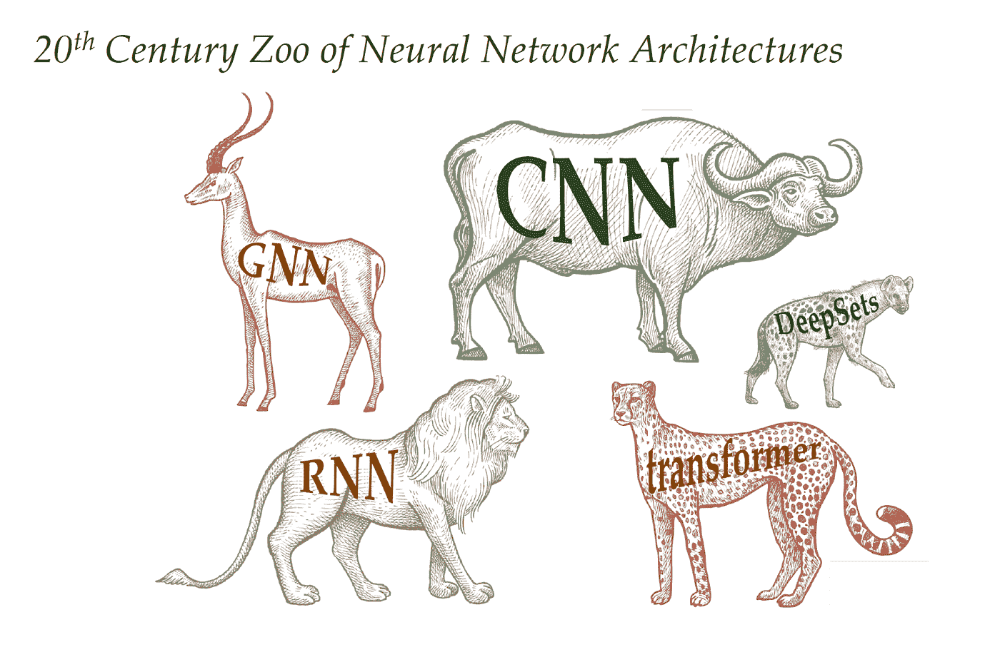
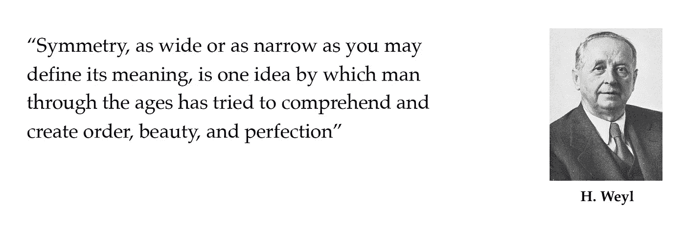
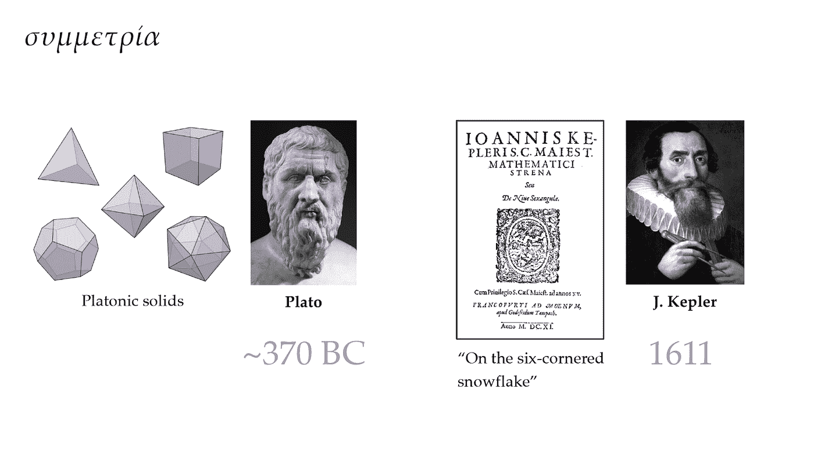
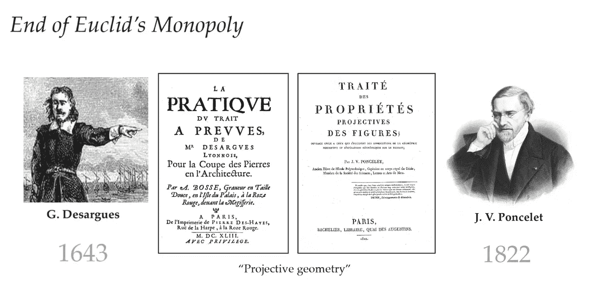
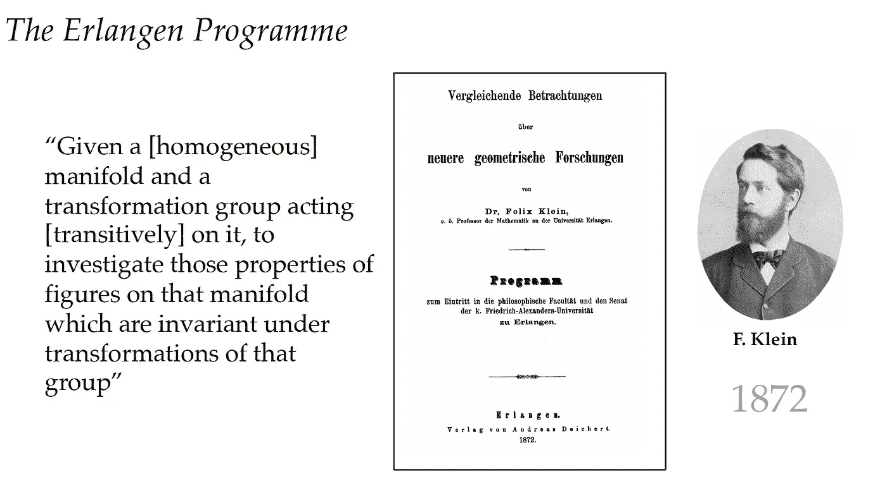
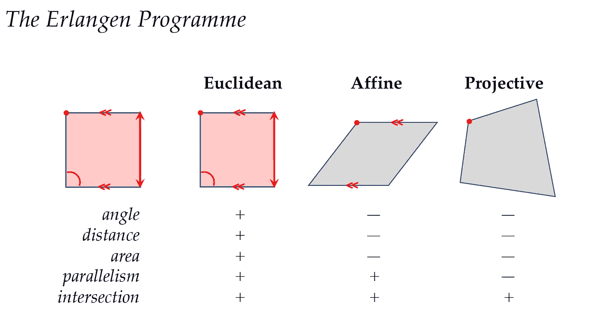

# 几何深度学习简介

> 原文：<https://towardsdatascience.com/geometric-deep-learning-da09e7c17aa3?source=collection_archive---------12----------------------->

## [几何深度学习](https://towardsdatascience.com/tagged/geometric-deep-learning)

## **机器学习的埃尔兰根计划**

*的一系列博文，关于* [*几何深度学习(GDL)课程*](https://geometricdeeplearning.com/lectures/) *，在 AMMI 计划；* [*非洲机器智能硕士*](https://aimsammi.org/) *，所教* [*迈克尔·布朗斯坦*](https://www.imperial.ac.uk/people/m.bronstein) *，* [*琼·布鲁纳*](https://cims.nyu.edu/~bruna/) *，* [*塔科·科恩*](https://tacocohen.wordpress.com/) *，以及* [*佩塔尔·韦利奇科维奇*](https://petar-v.com/)

深度学习的快速发展创造了不同的神经网络架构，这些架构在各个数据科学领域都取得了成功。同时，我们在这些架构之间没有一个明确的统一原则，所以很难理解它们之间的关系。在这篇文章中，我们回顾了各种数学家对*对称性*的定义，以及*埃尔兰根程序*的出现，以及它是如何以*几何深度学习*的名义进入深度学习的。我们将看到深度学习的当前状态如何让我们想起 19 世纪的许多几何。

我们主要参考的是四位导师的 [*GDL 原书*](https://arxiv.org/abs/2104.13478) ，以及 [*GDL 课程*](https://geometricdeeplearning.com/lectures/)at[*AMMI*](https://aimsammi.org/)*。*

来自 GDL 的图片课程:第一讲

*这篇博文与*[*MohammedElfatih Salah*](https://www.linkedin.com/in/mohammedelfatih-salah-0b29b4169/?originalSubdomain=sd)合著

如果你想要一个简单的词来描述我们将要谈论的内容，并对几何深度学习(GDL)的思想有一个直觉，那将是*对称性*。让我们回顾历史，看看数学家们是如何定义这个词的。20 世纪最优秀的数学家之一 H. Weyl 给出了关于 T4 对称性的第一个定义。Weyl 在他关于*对称性*的话里说:

*图片*来自 GDL 课程:第一讲

追溯到古希腊人，他们也用这个术语来模糊地表达比例、和谐和音乐之美。

第一个例子是*五个正多面体*，或者是雅典哲学家柏拉图提出的柏拉图立体。柏拉图立体是三维空间中的凸正多面体。在正多面体中，面在形状和大小上是相同的，所有的角和所有的边也是相同的。并且同样数量的面在每个顶点相遇。

类似的例子来自古希腊，对称形状的水结晶是由数学家 j .开普勒提出的。他写了一本名为 [*的关于六角雪花的书*](https://books.google.sn/books/about/The_Six_Cornered_Snowflake.html?id=yE8yTUFWLXgC&source=kp_book_description&redir_esc=y) ，在书中他解释了雪花的六面对称。

*图片*来自 GDL 课程:第一讲

*欧几里得几何*也是可以追溯到古希腊。另一位希腊数学家欧几里得对欧几里得几何定义如下:

> 在一个平面上，给定一条直线和一个不在该直线上的点，至多可以通过该点画出一条与给定直线平行的直线。

随着 19 世纪的到来，又经过了 [*射影几何*](https://en.wikipedia.org/wiki/Projective_geometry) 的发展；到了法国人庞斯列，这种*欧几里得几何学*告一段落。*射影几何*中，点和线是可以互换的；没有任何两条直线恰好在一点上是平行的。

*图片*来自 GDL 课程——作者编辑

有人会问非欧几何的第一次出现是什么？我们会说它来自俄罗斯数学家罗巴切夫斯基。他指出，在任何一点都有不止一条线可以延伸通过该点，并与该点不属于的另一条线平行。类似的想法也有，但我们在这里就不解释了，就是德国数学家 b .黎曼的曲面的*(*黎曼几何*)。*

*在所有这些发展之后，接近 19 世纪末，数学家们争论哪种几何是正确的，以及应该如何定义它。直到德国数学家 f·克莱因发表了*埃尔兰根纲领*，他在其中给出了所有这些问题的答案。*

> *当 F. Klein 提出 Erlangen 计划时，他只有 23 岁，在这个年龄，他被任命为巴伐利亚大学的教授。在这个埃尔兰根计划中，克莱恩将几何描述为对不变量和对称性的研究；这意味着在某一类变换下不变的性质。*

**

**图片*来自 GDL 课程:第一讲*

*所以我们可以从克莱因的话中清楚地看到，适当选择对称性可以定义不同的几何形状。例如，定义*欧几里德几何*的对称性是刚性运动。这些是平移、反射和旋转，它们保留了角度、距离、面积、线的平行度和交点等属性。*

**

**图片*来自 GDL 课程:第一讲*

*另一件重要的事情是，这个埃尔兰根计划(T21)扩展到了其他领域，尤其是在物理学领域。这里一个明显的例子是 *Noether 定理*，它指出一个物理系统运行的每一个明显的对称性都有一个相应的保护定律。在这个定理之前，如果你想发现能量守恒，你必须做非常详细的材料实验观察和测量，以确保能量保持不变，即使有一些微小的误差。但是 *Noether 定理*说能量守恒源于时间的平移对称性。所以相对清楚的是，你的实验结果，无论是昨天做的，今天做的，还是明天做的，都是一样的。*

> *我们还可以提到诺贝尔物理学家之一 p .安德森的话:"说物理学是对对称性的研究只是稍微夸大了一点。"*

*在经历了关于几何和对称性的漫长历史背景之后，你可能会问这与深度学习有什么关系。简单的答案是，深度学习的现状让我们想起了 19 世纪的许多几何。由于我们对于不同类型的数据有不同的神经网络架构(比如对于特殊数据有 CNN，对于顺序数据有 transformers，对于时态数据有 RNNs)，但是这些方法之间没有明确的统一原则。因此，很难理解它们之间的关系，这导致了相同概念的重新发明。*几何深度学习*揭示了统一在所有这些架构背后的基本原理。我们希望在*埃尔兰根计划*的本质上实现这种统一，这将在后面的帖子中澄清。*

*B 另外，正常的问题会是为什么要研究*几何深度学习，*或者 *GDL* 的目标是什么。我们可以说 GDL 有两个目的。首先，它解释了为什么当前最先进的架构是成功的(因为它们尊重数据的不变性，我们将在后面的帖子中解释)。第二，它提出了主要原则，如果我们遵循这些原则，我们可以为未来的任务构建更好的架构(我们还将有另一篇关于 *GDL 蓝图*的帖子)。*

> *“几何深度学习”一词在 2017 年的一篇论文中流行起来:[几何深度学习:超越欧几里德数据](https://arxiv.org/abs/1611.08097)发表在布朗斯坦等人撰写的 IEEE 信号处理杂志上。最近，布朗斯坦、布鲁纳、科恩和韦利奇科维奇写了一篇长文，这是一本名为[几何深度学习:网格、组、图、测地线和量规的书的预览。](https://arxiv.org/abs/2104.13478)*

*在这一系列的帖子中，我们将详细解释如何通过两个属性*对称性*和*比例分离*我们可以开发一个 *GDL 蓝图*作为当前最先进架构的框架。我们将在 *GDL 蓝图*的管道中讨论所谓的*几何域*或 *5 Gs* ，包括*网格、组、图、测地线和量规、*及其适当的结构。*

***参考文献**:*

*   *[GDL 课程](https://geometricdeeplearning.com/lectures/)，( [AMMI](https://aimsammi.org/) ，2021 年夏季)。*
*   *M. M .布朗斯坦第一讲[ [视频](https://youtu.be/PtA0lg_e5nA) | [幻灯片](https://bit.ly/3iw6AO9)。*
*   *米（meter 的缩写））m .布朗斯坦、j .布鲁纳、t .科恩和 p .韦利奇科维奇，[几何深度学习:网格、组、图形、测地线和量规](https://arxiv.org/abs/2104.13478) (2021)。*

*我们感谢 Rami Ahmed 对草案提出的宝贵意见。*