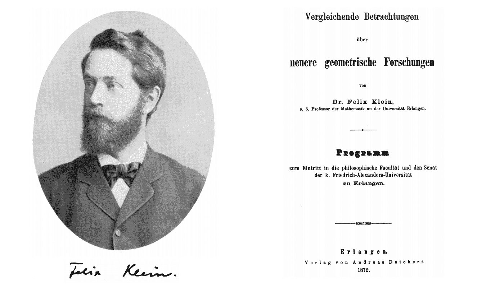
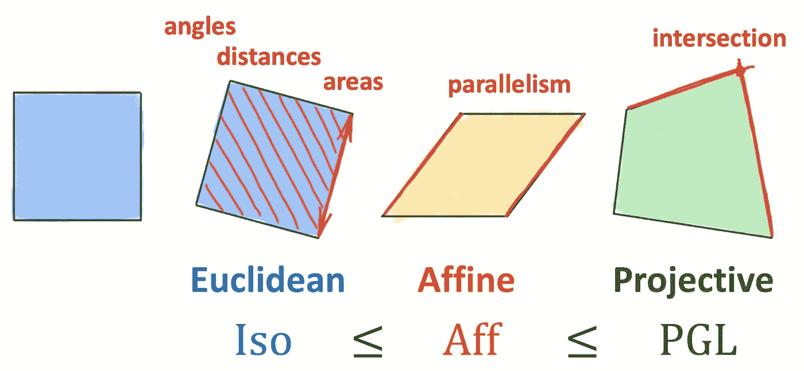
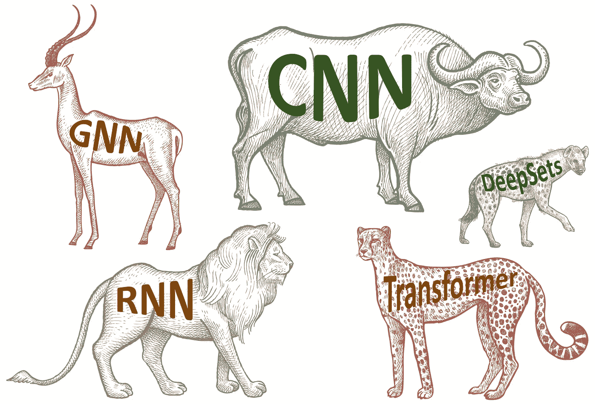
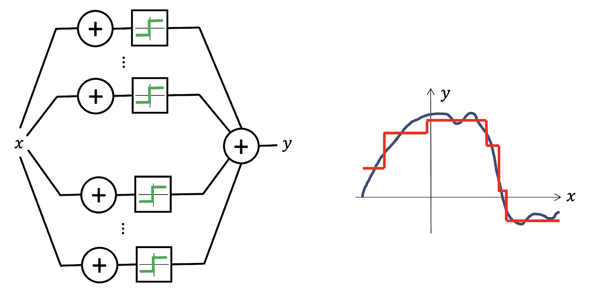
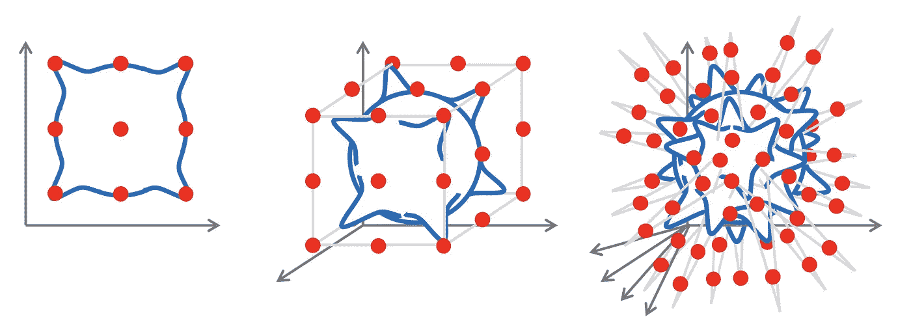
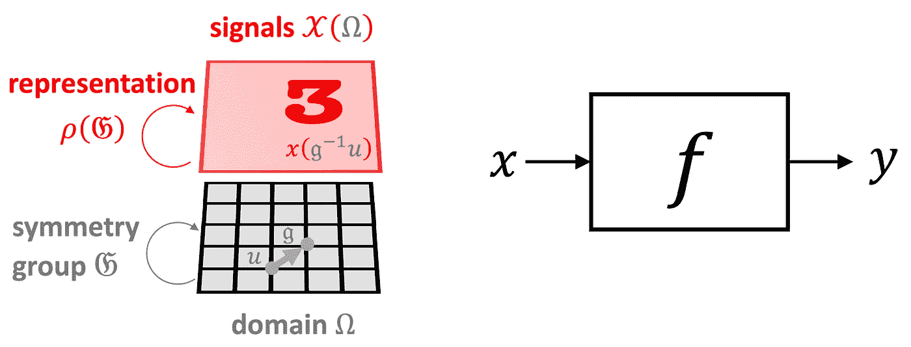
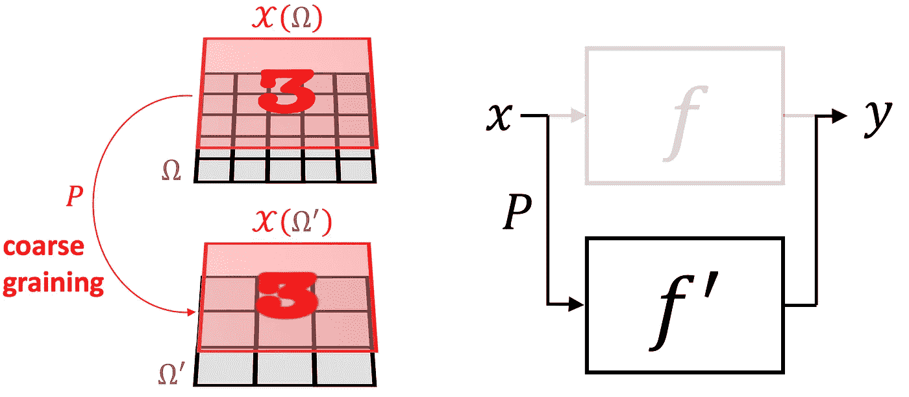
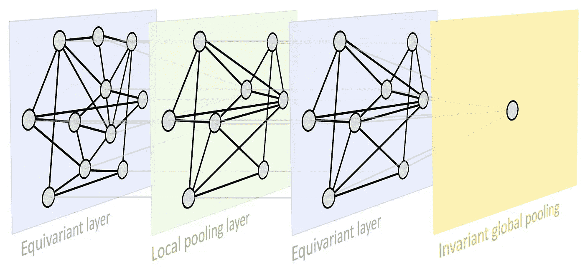
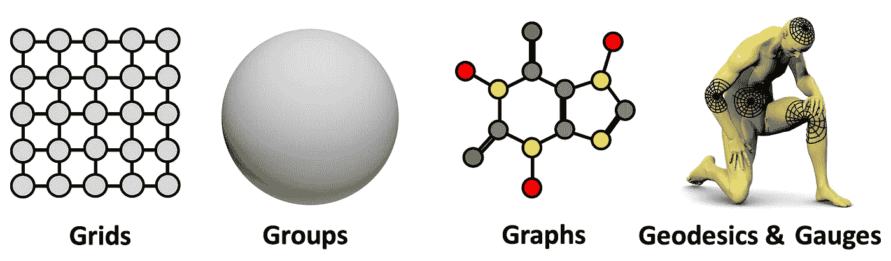

# 深度学习的几何基础

> 原文：<https://towardsdatascience.com/geometric-foundations-of-deep-learning-94cdd45b451d?source=collection_archive---------0----------------------->

## 曼梯·里的埃尔兰根计划

## 几何深度学习是从对称性和不变性的角度对一大类 ML 问题进行几何统一的尝试。这些原则不仅是卷积神经网络的突破性性能和图形神经网络最近成功的基础，而且还提供了一种构建新型特定问题归纳偏差的原则性方法。

*这篇博文与* [*琼·布鲁纳*](https://cims.nyu.edu/~bruna/) *，* [*塔可·科恩*](https://tacocohen.wordpress.com/) *和* [*佩塔尔·韦利奇科维奇*](https://petar-v.com/) *合著，基于 m·m·布朗斯坦、j·布鲁纳、t·科恩和 p·韦利奇科维奇的新“原型书”*

1872 年 10 月，巴伐利亚州埃尔兰根市一所小大学的哲学系任命了一位新的年轻教授。按照惯例，他被要求提供一个首次研究计划，他发表了有点长而无聊的标题*Vergleichende Betrachtungenüber neuere geometricsche Forschungen*(“近期几何研究的比较评论”)。这位教授名叫费利克斯·克莱因，当时只有 23 岁，他的开创性工作已经作为“埃尔兰根计划”载入了数学史。

费利克斯·克莱因和他的埃尔兰根计划。图片:维基百科/密歇根大学[历史数学文集](https://quod.lib.umich.edu/u/umhistmath/ABN7632.0001.001/2?rgn=full+text;view=pdf)。

十九世纪对几何学来说是非常富有成果的。在欧几里得之后的近两千年里，庞斯列构建射影几何，高斯、波尔约和罗巴切夫斯基构建双曲几何，黎曼构建椭圆几何，这是第一次表明，各种各样的几何是可能的。然而，这些构造很快就分化成独立和不相关的领域，那个时期的许多数学家质疑不同的几何图形如何相互关联，以及什么实际上*定义了*几何图形。

克莱因的突破性见解是将几何定义作为对*不变量*的研究，或者换句话说，是在某种类型的变换(*对称性*)下保留的结构。Klein 使用群论的形式来定义这种变换，并使用群及其子群的层次来分类由此产生的不同几何。因此，刚性运动组导致传统的欧几里得几何，而仿射或射影变换分别产生仿射和射影几何。重要的是，埃尔兰根计划仅限于齐次空间[2]和最初排除黎曼几何。

K *lein 的 Erlangen 程序将几何视为研究在某些类型的变换下保持不变的性质。2D 欧几里得几何是由刚性变换(模型化为等距群)定义的，它保持面积、距离和角度，因此也保持平行度。仿射变换保持平行，但距离和面积都不变。最后，射影变换具有最弱的不变性，仅保留了交集和交比，并且对应于三者中最大的组。因此，克莱因认为射影几何是最普遍的几何。*

埃尔兰根计划对几何和数学的影响非常深远。它也蔓延到其他领域，特别是物理学，对称性的考虑允许从第一原理推导守恒定律——这是一个惊人的结果，被称为 Noether 定理[3]。过了几十年，这个基本原理——通过规范不变性的概念(杨和米尔斯在 1954 年发展的广义形式)——被证明成功地统一了除重力之外的所有基本自然力。这就是所谓的标准模型，它描述了我们目前所知道的所有物理学。我们只能重复诺贝尔奖得主、物理学家菲利普·安德森[4]的话

> “说物理学是对对称性的研究只是稍微夸大了这一点。''

我们认为，深度(表征)学习领域的现状令人想起十九世纪几何的情况:一方面，在过去的十年里，深度学习带来了数据科学的革命，使许多以前认为遥不可及的任务成为可能——无论是计算机视觉、语音识别、自然语言翻译，还是下围棋。另一方面，我们现在有一大堆针对不同类型数据的不同神经网络架构，但几乎没有统一的原则。因此，很难理解不同方法之间的关系，这不可避免地导致相同概念的重新发明和重新标记。

今天的深度学习:一个架构的动物园，几个统一的原则。动物图像:ShutterStock。

几何深度学习是我们在[5]中引入的一个总括术语，指的是最近试图提出类似于 Klein 的 Erlangen 程序的 ML 的几何统一。它有两个目的:第一，提供一个通用的数学框架来推导最成功的神经网络结构，第二，给出一个建设性的程序来以有原则的方式构建未来的结构。

S 监督机器学习在其最简单的设置中本质上是一个函数估计问题:给定训练集上一些未知函数的输出(例如，带标签的狗和猫图像)，人们试图从一些假设类中找到一个函数 *f* ，该函数很好地符合训练数据，并允许预测先前看不见的输入的输出。在过去的十年中，大型高质量数据集(如 ImageNet)的可用性与不断增长的计算资源(GPU)相吻合，允许设计丰富的函数类，这些函数类有能力插值这样的大型数据集。

神经网络似乎是表示函数的合适选择，因为即使是最简单的架构，如感知器，在仅使用两层时也可以产生密集的函数类，允许以任何期望的精度逼近任何连续函数，这种特性被称为通用逼近[6]。

多层感知器是通用逼近器:只需一个隐藏层，它们就可以表示阶跃函数的组合，允许以任意精度逼近任何连续函数。

这个问题在低维中的设置是近似理论中的经典问题，该问题已经被广泛研究，具有精确的估计误差的数学控制。但在高维度中，情况完全不同:人们可以很快看到，为了逼近一个简单的类，例如 Lipschitz 连续函数，样本的数量随着维度呈指数增长——这种现象俗称为“维数灾难”。由于现代机器学习方法需要处理数千甚至数百万维的数据，维数灾难总是在幕后存在，使得这种天真的学习方法不可能实现。

维数灾难的图解:为了逼近一个由放置在 d 维单位超立方体(蓝色)的象限中的高斯核组成的 Lipschitz 连续函数，误差为 *ε，一个*需要𝒪(1/ *εᵈ* 样本(红点)。

这可能在像图像分类这样的计算机视觉问题中看得最清楚。即使是很小的图像也往往是非常高维的，但直觉上它们有很多结构，当人们将图像解析为向量并将其输入感知机时，这些结构就会被破坏并丢弃。如果图像现在仅移动了一个像素，矢量化输入将会非常不同，并且需要向神经网络显示大量示例，以了解移动的输入必须以相同的方式进行分类[7]。

不幸的是，在许多高维 ML 问题中，我们有一个来自输入信号几何的额外结构。我们称这种结构为“对称先验”,这是一个普遍的强有力的原则，给了我们在维数灾难问题上的乐观。在我们的图像分类示例中，输入图像 *x* 不仅仅是一个 *d* 维向量，而是在某个*域*ω上定义的信号，在这种情况下是一个二维网格。磁畴的结构由一个对称群*𝔊(在我们的例子中是 2D 平移群)捕获，它作用于磁畴上的点。在信号𝒳(ω的空间中)，基础域上的群作用(群的元素，𝔤∈𝔊)通过所谓的*群表示ρ* (𝔤)来表现——在我们的情况下，它只是简单的*移位算子*，一个 *d* × *d* 矩阵作用于一个 *d* 维向量【8】。*

几何先验的图示:输入信号(图像 x∈𝒳(ω))定义在域(网格ω)上，其对称性(平移群𝔊)通过群表示 *ρ(* 𝔤)(移位算子)作用于信号空间。对函数 f(例如，图像分类器)如何与该组交互做出假设限制了假设类别。

作为输入信号基础的域的几何结构对我们试图学习的函数类 *f* 施加了结构。人们可以拥有不受群体行动影响的*不变*函数，即对于任何𝔤∈𝔊，*f*(*ρ*(𝔤)*x*)=*f*(*x*)和 *x* 。另一方面，可能会有这样一种情况，其中函数具有相同的输入和输出结构，并且以与输入相同的方式进行变换——这种函数称为*等变函数*，并且满足*f*(*ρ*(𝔤)*x*)=*ρ*(𝔤)*f*(*x*)【9】。在计算机视觉领域，图像分类很好地说明了一种设置，在这种设置中，人们需要一个不变函数(例如，无论猫位于图像中的什么位置，我们仍然希望将其分类为猫)，而输出为逐像素标签掩码的图像分割是等变函数的一个示例(分割掩码应遵循输入图像的变换)。

另一个强大的几何先验是“尺度分离”。在某些情况下，我们可以通过“同化”附近的点来构建域的多尺度层次结构(下图中的ω和ω’)，并产生由*粗粒度*运算符 *P* 关联的信号空间层次结构。在这些粗尺度上，我们可以应用粗尺度函数。我们说一个函数 *f* 是*局部稳定的*如果它可以近似为粗粒度算子 *P* 和粗尺度函数*f*≈*f’*∘*p*的合成。虽然 *f* 可能依赖于长程相关性，但是如果它是局部稳定的，那么这些可以被分成局部相互作用，然后传播到粗尺度【10】。

尺度分离的图示，其中我们可以将精细层次函数 f 近似为粗层次函数 f’和粗粒度算子 P 的组合*f*≈*f’*∘*p。*

T 这两个原则为我们提供了一个非常通用的几何深度学习蓝图，它可以在大多数用于表示学习的流行深度神经架构中得到认可:一个典型的设计由一系列*等变层*(例如 CNN 中的卷积层)组成，可能后跟一个*不变全局池*层，将所有内容聚集到单个输出中。在某些情况下，也可以通过某种粗化过程来创建域的层次结构，这种粗化过程采用*本地池*的形式。

几何深度学习蓝图。

这是一个非常通用的设计，可以应用于不同类型的几何结构，例如*网格*，具有全局变换群的齐次空间，*图*(和集合，作为一个特例)，以及流形，其中我们具有全局等距不变性和局部规范对称性。这些原则的实施导致了当今深度学习中存在的一些最受欢迎的架构:卷积网络(CNN)，从*平移对称* 中出现的[，图形神经网络，DeepSets【11】和 Transformers【12】，实现*置换不变性*，对*时间扭曲不变的门控 rnn(如 LSTM 网络)*【13】，以及计算机图形和视觉中使用的内在网格 CNN【14】，它们可以从*规范对称*中导出**](/deriving-convolution-from-first-principles-4ff124888028?sk=0d77e2fd7863d457aeb2dac620dd133c)

几何深度学习的“5G”:网格、组(具有全局对称性的齐次空间)、图(以及作为特例的集合)和流形，其中几何先验通过全局等距不变性(可以使用测地线表示)和局部规范对称性来表现。

在未来的帖子中，我们将更详细地探索几何深度学习蓝图在“5G”上的实例[15]。最后一点，我们应该强调，对称性在历史上一直是许多科学领域的核心概念，其中物理学，正如在开始时已经提到的，是关键。在机器学习社区中，对称性的重要性早已得到认可，特别是在模式识别和计算机视觉的应用中，关于等变特征检测的早期工作可以追溯到 Shun'ichi Amari [16]和 Reiner Lenz [17]。在神经网络文献中，马文·明斯基和西蒙·派珀特[18]的感知机的组不变性定理对(单层)感知机学习不变量的能力提出了基本限制。这是研究多层架构[19–20]的主要动机之一，最终导致了深度学习。

[1]根据一个流行的观点，包括维基百科在内的许多来源都重复了这个观点，埃尔兰根计划是在 1872 年 10 月克莱因的就职演说中提出的。克莱因确实做过这样的演讲(虽然是在 1872 年 12 月 7 日)，但那是针对非数学专业的听众，主要是关于他的数学教育思想。现在所谓的“埃尔兰根计划”实际上是前面提到的[小册子](http://www.gutenberg.org/files/38033/38033-h/38033-h.htm)*Vergleichende Betrachtungen*，副标题为*program zum Eintritt in die philosophy sche fakultt und den Senat der k . Friedrich-Alexanders-universit t zu Erlangen*(“进入弗里德里希-亚历山大皇帝埃尔兰根大学哲学系和参议院的计划”，见[英文翻译](https://arxiv.org/pdf/0807.3161.pdf)。虽然埃尔兰根居功至伟，但克莱因在那里只呆了三年，1875 年转到慕尼黑工业大学(当时名为 *Technische Hochschule* ，接着是莱比锡(1880)，最后从 1886 年到退休在哥廷根定居。参见 r . Tobies[Felix Klein——数学家、学术组织者、教育改革家](https://link.springer.com/chapter/10.1007/978-3-319-99386-7_1) (2019)载于:h . g . Weigand et al .(eds)*The Legacy of Felix Klein*、Springer。

[2]齐次空间是指“所有点都相同”且任何一点都可以通过群作用转化为另一点的空间。在黎曼之前提出的所有几何都是如此，包括欧几里得、仿射和射影几何，以及第一批常曲率空间(如球面或双曲空间)上的非欧几里得几何。将克莱因的思想扩展到流形上花费了大量的努力和将近 50 年的时间，特别是由埃利·卡坦和法国几何学派。

[3]克莱因自己可能已经预见到他的想法在物理学中的潜力，抱怨“数学物理学家如何坚持不懈地忽视在许多情况下仅通过适度培养投影视图给他带来的优势”。到那个时候，通过变分法的观点来思考物理系统已经很普遍了，从“最小作用原理”推导出控制这种系统的微分方程，即作为一些功能(*作用*)的最小化。在 1918 年发表的一篇论文中，艾米·诺特表明，物理系统作用的每一个(可微)对称都有相应的守恒定律。无论如何，这是一个惊人的结果:事先，需要细致的实验观察来发现基本定律，如能量守恒，即使这样，这也是一个来自任何地方的经验结果。历史笔记见 C. Quigg，[座谈会:一个世纪的 Noether 定理](https://arxiv.org/pdf/1902.01989.pdf) (2019)，arXiv:1902.01989。

[4] P. W .安德森，[更多的是不同的](https://www.tkm.kit.edu/downloads/TKM1_2011_more_is_different_PWA.pdf) (1972)，科学 177(4047):393–396。

[5] M. M. Bronstein 等人[几何深度学习:超越欧几里德数据](https://arxiv.org/abs/1611.08097) (2017)，IEEE Signal Processing Magazine 34(4):18–42 试图从频谱分析的角度统一网格、图形和流形上的学习。“几何深度学习”这个术语实际上是在更早的时候，在迈克尔的[ERC·格兰特](https://cordis.europa.eu/project/id/724228)的提议中创造出来的。

[6]通用逼近定理有多个版本。这通常归功于 G. Cybenko，[通过叠加一个 s 形函数的近似法](http://citeseerx.ist.psu.edu/viewdoc/download?doi=10.1.1.441.7873&rep=rep1&type=pdf) (1989)控制、信号和系统数学 2(4):303–314 和 K. Hornik，多层前馈网络的近似能力(1991)，神经网络 4(2):251–257。

[7]解决计算机视觉中这一问题的方法来自于因研究视觉皮层而获得诺贝尔医学奖的胡贝尔和威塞尔在神经科学领域的经典著作。他们表明，大脑神经元被组织成局部感受野，这启发了一类新的具有局部共享权重的神经架构，首先是 K. Fukushima 的 Neocognitron，这是一种不受位置变化影响的模式识别机制的自组织神经网络模型(1980)，Biological Cybernetics 36(4):193–202，然后是卷积神经网络，Y. LeCun 等人的研讨会工作，Gradient-based learning applied to document recognition(1998)，Proc .IEEE 86(11):2278–2324，其中跨图像的权重分配有效地解决了维数灾难。

[8]注意，组被定义为一个抽象对象，没有说组元素*是什么*(例如某个域的变换)，只说它们*如何组成*。因此，非常不同种类的物体可能有相同的对称群。

[9]这些结果可以推广到近似不变和等变函数的情况，例如，参见 j .布鲁纳和 s .马拉特，[不变散射卷积网络](https://arxiv.org/pdf/1203.1513.pdf) (2013)，转。PAMI 35(8):1872-1886。

[10]尺度分离是物理学中使用的一个强有力的原理，例如在快速多极方法(FMM)中，这是一种最初开发的数值技术，用于加速 *n* 物体问题中长程力的计算。FMM 将紧密相连的来源组合在一起，并将其视为单一来源。

[11] M. Zaheer 等人，[深集](https://papers.nips.cc/paper/2017/file/f22e4747da1aa27e363d86d40ff442fe-Paper.pdf) (2017)，NIPS。在计算机图形社区，在 C. R. Qi 等人， [PointNet:用于 3D 分类和分割的点集的深度学习](http://stanford.edu/~rqi/pointnet/) (2017)中提出了类似的架构。

[12] A. Vaswani 等人，[注意就是你所需要的一切](https://papers.nips.cc/paper/2017/file/3f5ee243547dee91fbd053c1c4a845aa-Paper.pdf) (2017)，NIPS，介绍了现在流行的变压器架构。可以认为[是一个有完整图形的图形神经网络](/transformers-are-graph-neural-networks-bca9f75412aa)。

[13] C. Tallec 和 Y. Ollivier，[递归神经网络能扭曲时间吗？](https://arxiv.org/pdf/1804.11188.pdf) (2018)，arXiv:1804.11188。

[14] J. Masci 等人，[黎曼流形上的测地卷积神经网络](https://arxiv.org/pdf/1501.06297.pdf) (2015)，arXiv:1501.06297 是第一个在网格上的局部坐标图中应用滤波器的类卷积神经网络架构。是 T. Cohen 等人的特例，[规范等变卷积网络和二十面体 CNN](https://arxiv.org/pdf/1902.04615.pdf) (2019)，arXiv:1902.04615。

[15] M. M .布朗斯坦、j .布鲁纳、t .科恩和 p .韦利奇科维奇,《几何深度学习:网格、组、图形、测地线和量规》( 2021 年)

[16] S.-l. Amari，允许和检测不变信号变换的特征空间(1978)，联合会议。模式识别。Amari 也是著名的*信息几何*领域的先驱，该领域使用微分几何的工具研究概率分布的统计流形。

[17] R. Lenz，图像处理中的群论方法(1990)，Springer。

[18]明斯基和帕佩特。感知机:计算几何导论(1987)，麻省理工学院出版社。这是第二版的著名著作，因为第一个“人工智能冬天”而受到指责，它包括了额外的结果，并回应了对 1969 年早期版本的一些批评。

[19] T. J. Sejnowski，P. K. Kienker 和 G. E. Hinton,《用隐藏单元学习对称群:超越感知器》( 1986 年),《物理学 D:非线性现象》22(1–3):260–275

[20] J. Shawe-Taylor，将对称性纳入前馈网络(1989 年)，ICANN。对不变和等变神经网络采取表示理论观点的第一项工作是 J. Wood 和 J. Shawe-Taylor，表示理论和不变神经网络(1996)，离散应用数学 69(1–2):33–60。在深度学习的“现代时代”，将对称性构建到神经网络中是由 R. Gens 和 P. M. Domingos、[Deep symmetry networks](https://papers.nips.cc/paper/2014/file/f9be311e65d81a9ad8150a60844bb94c-Paper.pdf)(2014 年)、NIPS(另见 Pedro Domingos 的[2014 年 ICLR 邀请演讲](https://www.youtube.com/watch?v=LDggERm4yfA))完成的

感谢 Ben Chamberlain 对本文的校对，感谢 Yoshua Bengio、Charles Blundell、Andreea Deac、Fabian Fuchs、Francesco di Giovanni、Marco Gori、Raia Hadsell、Will Hamilton、Maksym Korablyov、Christian Merkwirth、Razvan Pascanu、Bruno Ribeiro、Anna Scaife、Jürgen Schmidhuber、Marwin Segler、Corentin Tallec、NGN Vu、Peter Wirnsberger 和 David Wong 对本文不同部分的反馈我们也感谢董晓文和皮埃特罗·里奥帮助我们打破“怯场”，展示了我们作品的早期版本。

*查看附加信息* [*项目网页*](http://www.geometricdeeplearning.com/)*[*朝向数据科学*](https://towardsdatascience.com/graph-deep-learning/home) *中型帖子、* [*订阅*](https://michael-bronstein.medium.com/subscribe) *迈克尔的帖子和* [*YouTube 频道*](https://www.youtube.com/c/MichaelBronsteinGDL) *，获取* [*中型会员资格*](https://michael-bronstein.medium.com/membership)*