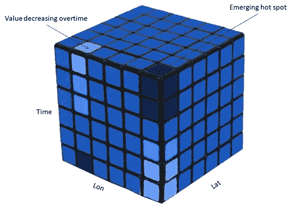

# Geopandas 实践:构建地理空间机器学习管道

> 原文：<https://towardsdatascience.com/geopandas-hands-on-building-geospatial-machine-learning-pipeline-9ea8ae276a15?source=collection_archive---------12----------------------->

## 最后一部分:关于如何处理地理空间机器学习的教程

第 1 部分:地理空间概念介绍( [*跟随此处*](/geopandas-hands-on-introduction-to-geospatial-machine-learning-6e7e4a539daf) )
第 2 部分:地理空间可视化和几何创建( [*跟随此处*](/geopandas-hands-on-geospatial-data-visualization-and-intro-to-geometry-7f2ed9df52ab) )
第 3 部分:地理空间操作( [*跟随此处*](/geopandas-hands-on-geospatial-relations-and-operations-a6e7047d7ba1#0bf5-2036d3ba94c4) )
第 4 部分:构建地理空间机器学习管道(本文)

[Marjan Blan | @marjanblan](https://unsplash.com/@marjan_blan?utm_source=medium&utm_medium=referral) 在 [Unsplash](https://unsplash.com?utm_source=medium&utm_medium=referral) 上的照片

在这篇文章中，我们将通过涵盖不同类别的地理空间机器学习任务以及如何实现它们来结束关于 *Geopandas 动手操作*的系列。

# 目录:

1.  概述
2.  地理空间回归
3.  地理空间分类
4.  地理空间聚类
5.  下一步是什么

# 概述

在之前的文章[中，我们讨论了地理特征是如何相互关联的。这种关系可以通过在 Geopandas 的操作中执行 *intersect* 或*来实现。此外，我们讨论了一个方便的空间操作*空间连接*，其中您可以对不同的地理特征执行聚合或分组功能(例如，为该区域的每栋房屋添加城市名称)。*](/geopandas-hands-on-geospatial-relations-and-operations-a6e7047d7ba1)

现在，我们将熟悉不同类型的地理空间机器学习任务，并获得关于它们与典型的非空间问题如何不同的早期直觉。我们将要讨论的常见任务是地理空间回归、分类和聚类。

# 地理空间回归

非空间回归问题考虑多个输入变量来估计目标输出的值。典型地，目标变量是连续变量的形式。

以一个回归任务为例，在给定一些其他预测因素的情况下，例如单元的大小、房间数量及其过去 20 年的历史销售价格，来预测房价。然后，您会找到使某个误差函数最小化的最佳拟合方程。

> 但是，在地理空间回归任务中，您需要将空间相关性作为因变量的一部分。

地理空间回归任务

如上图所示，您的房价(目标变量)现在具有空间感知能力。这意味着一所房子的位置可能会影响其邻近房子的价格。

不仅如此，独立输入变量也有其对应的空间依赖关系。例如，一栋房屋的历史价格会对其他房屋的历史价格产生影响。

在更一般的情况下，即使是独立变量也会对其他变量产生空间影响(例如，住宅区的房间数量会影响附近地区家庭的平均规模)。这些空间相互依赖性是地理空间回归问题的关键。

通常，可以获取这些空间相关性的一些更常见的地理空间回归算法有:

1.  普通最小二乘(OLS)回归，以及
2.  地理加权回归(GWR)

# 地理空间分类

同样，非空间分类任务会考虑多个输入变量来估计目标输出的类别。通常，目标输出以离散变量的形式表示一个特定的类(例如一只猫或一只狗)。

但是，在地理空间分类任务中，您通常会对像素级或整个栅格数据集执行分类。这可以包括语义分割、实例分割或栅格分类。

地理空间分类任务

上图说明了在给定栅格数据的情况下确定土地利用(如水体、森林、旱地、城市地区)的逐像素语义分割任务。

与典型的分类问题类似，地理空间分类任务可以使用深度神经网络(计算机视觉)、随机森林、支持向量机(SVM)或最大似然模型来解决。

# 地理空间聚类

最后但同样重要的是，另一个常见的地理空间机器学习任务包括地理空间聚类。在传统的非空间任务中，我们可以通过根据一些相似性度量(如距离、密度、*等*)将大量观察结果分组为几个“热点”来执行聚类。

但是根据地理第一定律:

> “一切事物都与其他事物相关，但近的事物比远的事物更相关。”—瓦尔多·托布勒

这使得地理空间机器学习环境中的聚类更加困难，因为我们还需要考虑每个观察在其空间环境中如何彼此相关(即空间受限的)。

地理空间聚类任务

一个有趣的地理空间聚类问题是**时空模式挖掘**。除了考虑不同观察点或多边形之间的空间依赖性，这类算法还考虑了时间依赖性。为了能够对空间-时间-观察点进行聚类，通常会构建一个三维图表，然后聚类算法可以在该图表中工作。

3D 时空地理空间聚类任务

解决地理空间聚类问题的一些更常见的模型有:

1.  空间约束多元聚类
2.  热点分析
3.  基于密度的聚类
4.  三维时空模式挖掘

***做订阅我的邮件简讯:***[*【https://tinyurl.com/2npw2fnz】*](https://tinyurl.com/2npw2fnz)****在这里我定期用通俗易懂的语言和漂亮的可视化总结 AI 研究论文。****

# *下一步是什么*

*地理空间机器学习领域非常广阔，我希望这篇文章能给你一瞥这个领域的多样性。如果你对任何相关的话题感兴趣，请不要犹豫让我知道。你也可以看看我的其他地理空间机器学习帖子:*

*</introduction-to-gaussian-process-programming-in-plain-english-8dd7a94cb18d> *