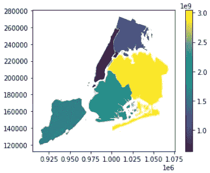
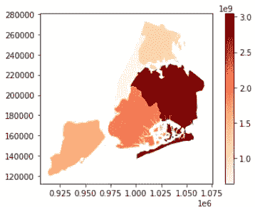
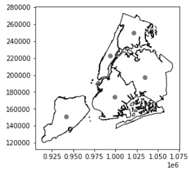
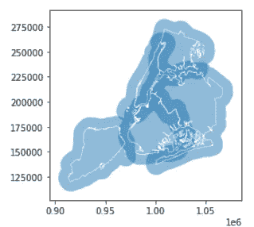
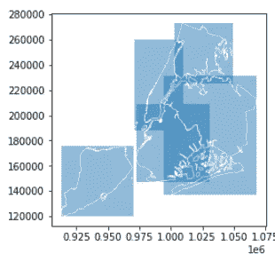

# Geopandas 动手操作:地理空间数据可视化和几何学介绍

> 原文：<https://towardsdatascience.com/geopandas-hands-on-geospatial-data-visualization-and-intro-to-geometry-7f2ed9df52ab?source=collection_archive---------19----------------------->

## 第 2 部分:关于如何处理地理空间机器学习的教程

第一部分:地理空间概念介绍( [*跟随此处*](/geopandas-hands-on-introduction-to-geospatial-machine-learning-6e7e4a539daf) )
第二部分:地理空间可视化和几何创建(*本文* )
第三部分:地理空间操作( [*跟随此处*](/geopandas-hands-on-geospatial-relations-and-operations-a6e7047d7ba1#0bf5-2036d3ba94c4) )
第四部分:构建地理空间机器学习管道( [*跟随此处*](/geopandas-hands-on-building-geospatial-machine-learning-pipeline-9ea8ae276a15) )


[Marjan Blan | @marjanblan](https://unsplash.com/@marjan_blan?utm_source=medium&utm_medium=referral) 在 [Unsplash](https://unsplash.com?utm_source=medium&utm_medium=referral) 上的照片

在本帖中，我们将介绍地理空间可视化的各个方面，并向您介绍如何使用 Geopandas 创建您自己的地理空间数据。

# 目录:

1.  概述
2.  地理空间可视化
3.  几何简介和创建您自己的地理空间数据

# 概述

在之前的文章[这里](/geopandas-hands-on-introduction-to-geospatial-machine-learning-6e7e4a539daf)中，我们讨论了 geopandas 的基础知识，比如它的底层数据类型、几何列和内置属性，我们可以很容易地对它们进行操作。

现在，我们将更深入地挖掘 geopandas，例如如何生成漂亮的地理空间可视化，并创建您自己的地理空间数据，供后续在机器学习管道中使用。

# 地理空间可视化

我们仍将使用 geopandas 提供的纽约行政区内置数据集。

```
import geopandas

path_to_data = geopandas.datasets.get_path("nybb")
gdf = geopandas.read_file(path_to_data)

gdf = gdf.set_index("BoroName")
```

假设我们想要可视化纽约每个区的相对面积大小。我们可以轻松地调用 plot()函数，与 Matplotlib 中的函数相同，并传入您想要绘制的列名，在本例中是“area”。

```
gdf["area"] = gdf.areagdf.plot("area", legend=True)
```



纽约行政区的面积大小

颜色似乎不能自然地表示连续变量，比如面积，让我们通过传递参数 *cmap* 来尝试改变颜色。

```
gdf.plot("area", legend=True, cmap="OrRd")
```



自然着色区

现在，哪一个区域更大就更明显了:被暗红色阴影笼罩的区域。如果您想查看配色方案及其相应标识符的列表，请点击此[链接](https://matplotlib.org/stable/tutorials/colors/colormaps.html)。

画两层或者标绘两层怎么样？回想一下，我们有先前的质心点:

```
gdf["centroid"] = gdf.centroid
```

我们可以绘制 2 个或更多的层，首先创建一个轴，我们将绘制 2 个或更多的层，并告诉 plot()函数在这个新创建的轴上绘制。

```
import matplotlib.pyplot as pltfig, ax = plt.subplots()
gdf.plot(ax=ax, color='white', edgecolor='black')
gdf['centroid'].plot(ax=ax)
plt.show()
```



两层绘图

# 几何学导论

下一个问题随之而来:我们能从现有的几何图形中创造出新的几何图形吗？是的，这篇文章将展示两个这样的例子。

## A.缓冲器

比方说，你想在纽约周围设立一个无人驾驶飞机禁飞区，因为有贵宾进入该州，我们可以在该地区周围划出 10，000 英尺的缓冲区。

```
# Get the boundary of each area
gdf["boundary"] gdf.boundary# buffering the active geometry by 10 000 feet (geometry is already in feet)
gdf["buffered"] = gdf.buffer(10000)
ax = gdf["buffered"].plot(alpha=.5)
gdf["boundary"].plot(ax=ax, color="white", linewidth=.5)
```



区域边界周围有 10，000 英尺的缓冲区

## B.信封

如果你想找到包围一个区域的最小的矩形，你也可以调用 envelope 函数并绘制出类似于上面的 Buffer 的几何图形。

```
Get the envelope of each area
gdf["enveloped"] = gdf.envelope# plotting the smallest rectangle envelope around an area
ax = gdf["enveloped"].plot(alpha=.5)
gdf["boundary"].plot(ax=ax, color="white", linewidth=.5)
```



感兴趣区域周围的最小包络

# 结论

就是这样！希望你今天能学到新东西。在下一篇文章中，我们将深入探讨如何执行地理空间操作，如合并、聚合、空间连接等。敬请期待！

***做订阅我的邮件简讯:***[*【https://tinyurl.com/2npw2fnz】*](https://tinyurl.com/2npw2fnz)****在这里我定期用通俗易懂的语言和漂亮的可视化总结 AI 研究论文。****