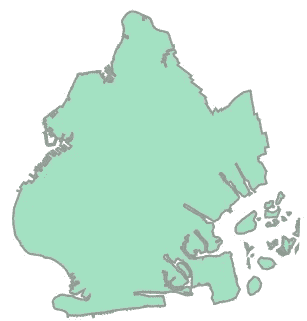
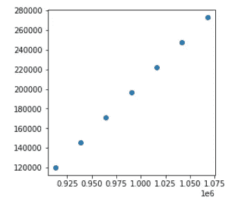
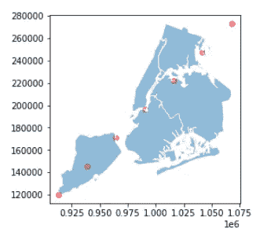

# Geopandas 实践:地理空间关系和操作

> 原文：<https://towardsdatascience.com/geopandas-hands-on-geospatial-relations-and-operations-a6e7047d7ba1?source=collection_archive---------37----------------------->

## 关于如何处理地理空间机器学习的教程

第 1 部分:地理空间概念介绍( [*跟随此处*](/geopandas-hands-on-introduction-to-geospatial-machine-learning-6e7e4a539daf) )
第 2 部分:地理空间可视化和几何创建( [*跟随此处*](/geopandas-hands-on-geospatial-data-visualization-and-intro-to-geometry-7f2ed9df52ab) )
第 3 部分:地理空间操作(*本帖* )
第 4 部分:构建地理空间机器学习管道( [*跟随此处*](/geopandas-hands-on-building-geospatial-machine-learning-pipeline-9ea8ae276a15) )


[Marjan Blan | @marjanblan](https://unsplash.com/@marjan_blan?utm_source=medium&utm_medium=referral) 在 [Unsplash](https://unsplash.com?utm_source=medium&utm_medium=referral) 上的照片

在前两篇文章中，我们讨论了 geopandas 的基础知识以及如何可视化地理空间数据集。这里，我们将介绍地理空间操作的基本概念，包括关系和空间连接。

# 目录:

1.  概述
2.  地理空间关系
3.  空间连接

# 概述

在我们继续本教程之前，请确保我们恢复了之前帖子的地理数据框。

```
# Import the necessary libraries
import geopandas
import shapely.geometry
import matplotlib.pyplot as plt# Initialize our geodataframe (gdf)
path_to_data = gpd.datasets.get_path("nybb")
gdf = gpd.read_file(path_to_data)# Set borough name as index
gdf = gdf.set_index("BoroName")# Get buffered region and centroid points
gdf["buffered"] = gdf.buffer(10000)
gdf['centroid'] = gdf.centroid
```

既然初步步骤已经定下来了，那就从教程开始吧。

# 地理空间关系

几何图形(如定义单个区的多边形或表示区域或点之间的边界以指示质心位置的线)可以彼此相关。

## A.交叉

假设我们提出以下问题:缓冲区是否与纽约的布鲁克林区相交？

首先我们得到布鲁克林的多边形

```
brooklyn = gdf.loc["Brooklyn", "geometry"]
```



布鲁克林区

然后我们可以检查缓冲区域是否与它相交。

```
gdf["buffered"].intersects(brooklyn)>>BoroName
>>Staten Island     True
>>Queens            True
>>Brooklyn          True
>>Manhattan         True
>>Bronx            False
>>dtype: bool
```

布朗克斯似乎离布鲁克林很远，边界外 10，000 英尺的缓冲区根本不与布鲁克林相交。

## B.在…之内

另一个问题可能类似地出现:形心是否包含在它们各自的区(即。唯一的质心)？这可以通过指定点的集合是否包含在所述多边形中的内关系来执行。

```
gdf["centroid"].within(brooklyn)>>BoroName
>>Staten Island    False
>>Queens           False
>>Brooklyn          True
>>Manhattan        False
>>Bronx            False
>>dtype: bool
```

不出所料，布鲁克林的质心位于布鲁克林多边形内，而不在其他区域内。

# 空间连接

我们可以使用 geopandas 执行的另一个重要的地理空间操作是空间连接。顾名思义，它允许两个不同的几何图形基于特定的几何标准进行连接。

让我们假设在这个区域内有几个公共汽车站，我们想要识别每个车站所在的行政区。

```
# Generate some points
b = [int(x) for x in gdf.total_bounds]
N = 6pointdf = gpd.GeoDataFrame([
    {'geometry': shapely.geometry.Point(x, y), 'value1': x + y, 'value2': x - y}
    for x, y in zip(range(b[0], b[2], int((b[2] - b[0]) / N)),
                    range(b[1], b[3], int((b[3] - b[1]) / N)))])# Make sure they're using the same projection reference
pointdf.crs = gdf.crs
```



随机生成的公交车站

想到的第一个解决方案是像以前一样执行一个 within 操作，然后对于每个区，将真正的索引值分配给该点(例如，如果汽车站 1 在布鲁克林，则将布鲁克林分配给该点项目)。从视觉上看，它可以表示为:



然后，可以按如下方式执行空间连接:

```
from geopandas.tools import sjoin# Joining the NYC borough INTO the pointdf
sjoin(pointdf, gdf, how="left", op="intersects")# The NaNs are the points that do not intersect with any borough
```

或者，如果您想删除 nan，可以执行一个*内部连接*来代替。

```
sjoin(pointdf, gdf, how="inner", op="intersects")
```

# 结论

就是这样！希望你今天能学到新东西。在下一篇文章中，我们将最终准备好建立我们的第一个地理空间机器学习管道。敬请期待！

***做订阅我的邮件简讯:***[*【https://tinyurl.com/2npw2fnz】*](https://tinyurl.com/2npw2fnz)****在这里我定期用通俗易懂的语言和漂亮的可视化总结 AI 研究论文。****