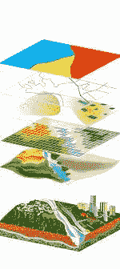
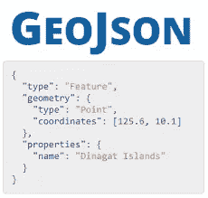
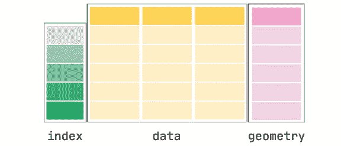
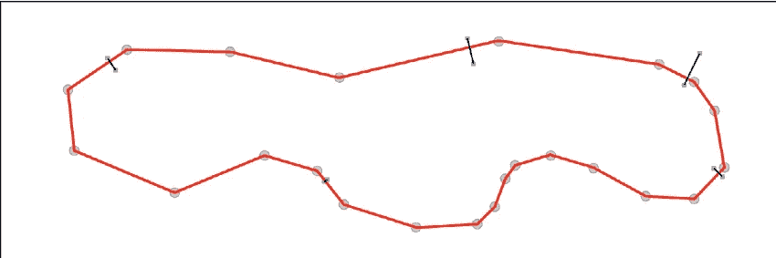
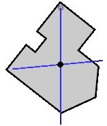

# geo pandas hand-on:地理空间机器学习介绍

> 原文：<https://towardsdatascience.com/geopandas-hands-on-introduction-to-geospatial-machine-learning-6e7e4a539daf?source=collection_archive---------10----------------------->

## 关于如何处理地理空间机器学习的教程

第一部分:地理空间概念介绍(*本帖* )
第二部分:地理空间可视化和几何创建( [*跟随此处*](/geopandas-hands-on-geospatial-data-visualization-and-intro-to-geometry-7f2ed9df52ab) )
第三部分:地理空间操作( [*跟随此处*](/geopandas-hands-on-geospatial-relations-and-operations-a6e7047d7ba1) )
第四部分:构建地理空间机器学习管道( [*跟随此处*](/geopandas-hands-on-building-geospatial-machine-learning-pipeline-9ea8ae276a15) )


[Marjan Blan | @marjanblan](https://unsplash.com/@marjan_blan?utm_source=medium&utm_medium=referral) 在 [Unsplash](https://unsplash.com?utm_source=medium&utm_medium=referral) 上的照片

在这篇文章中，我们将介绍基本的地理空间数据类型、属性，以及如何使用 geopandas 来实现这些。

# 目录:

1.  什么是 Geopandas
2.  装置
3.  地理空间概念
4.  基本几何属性介绍

# 什么是 Geopandas

Geopandas 是一个开源库，支持使用和操作 Python 中的地理空间数据。它扩展了 pandas 中使用的通用数据类型，允许许多独特的几何操作:地理系列和地理数据框架。Geopandas 也是建立在 shapely 之上进行几何运算；它的底层数据类型允许 Geopandas 以惊人的速度运行，并且适用于许多需要大型地理空间数据集的机器学习管道。

# 装置

现在我们已经对 Geopandas 有所了解，让我们开始安装过程。

有很多选择，但是我推荐使用 *conda* 安装，因为它为你的项目创建了一个新的环境，而不会影响你系统中的其他库。要安装 conda，请遵循以下链接:[安装 conda](https://docs.anaconda.com/anaconda/install/) 。

1.  创建一个新的 conda 环境并设置一些配置

```
conda create -n geo_env
conda activate geo_env
conda config --env --add channels conda-forge
conda config --env --set channel_priority strict
```

2.用康达安装

```
conda install python=3 geopandas
```

# 地理空间概念

## A.地理空间公共数据类型

您需要熟悉一些常见的地理空间数据类型:Shapefile(。shp)和 GeoJSON(。geojson)。

Shapefile 是一种矢量数据格式，主要由一家名为 ESRI 的公司开发和维护。它存储许多重要的地理空间信息，包括拓扑结构、形状几何等。



Shapefile 数据格式

*GeoJSON* ，与 JSON 类似，除了你与对象相关的典型属性(索引、名称等)之外，还存储*几何*信息(坐标、投影等)。



在 JSON 对象中添加了“geometry”关键字的 GeoJSON 格式示例

一旦使用 Geopandas 加载了这些数据格式中的任何一个，库将创建一个带有额外的*几何图形*列的数据帧。



地理数据框架(来源:geopandas.org)

这就是如何导入 Geopandas 库中内置的默认地理数据，我们将在本文和后续文章中使用这些数据。

```
import geopandas

path_to_data = geopandas.datasets.get_path("nybb")
gdf = geopandas.read_file(path_to_data)

gdf
```

# 基本几何属性介绍

现在，我们已经对地理空间数据以及如何使用 Geopandas 导入我们的第一个地理空间数据有了一些概念，让我们执行一些基本的方法来进一步巩固我们的理解。

首先，让我们把行政区的名称作为索引，使我们的探索更容易。

```
gdf = gdf.set_index("BoroName")
```

## 区域

从几何列，我们可以测量面积(如果它们是多边形或多多边形:因为我们不能测量线或点的面积)

```
gdf["area"] = gdf.areagdf["area"]
>>BoroName
>>Staten Island    1.623822e+09
>>Queens           3.045214e+09
>>Brooklyn         1.937478e+09
>>Manhattan        6.364712e+08
>>Bronx            1.186926e+09
>>Name: area, dtype: float64
```

## 多边形边界

由于我们的几何图形是多边形或多多边形，我们可以提取出对象的线坐标。比如说，当我们想要测量多边形物体的周长时，这是很有用的。



多边形边界线(来源:维基百科)

```
gdf['boundary'] = gdf.boundary>>gdf['boundary']
>>BoroName
>>Staten Island    MULTILINESTRING ((970217.022 145643.332, 97022...
>>Queens           MULTILINESTRING ((1029606.077 156073.814, 1029...
>>Brooklyn         MULTILINESTRING ((1021176.479 151374.797, 1021...
>>Manhattan        MULTILINESTRING ((981219.056 188655.316, 98094...
>>Bronx            MULTILINESTRING ((1012821.806 229228.265, 1012...
>>Name: boundary, dtype: geometry
```

## 图心

如果你想找到给定多边形的质心点，你可以如下调用 gdf 属性。



多边形质心(来源:维基百科)

```
gdf['centroid'] = gdf.centroid>>gdf['centroid']
>>BoroName
>>Staten Island     POINT (941639.450 150931.991)
>>Queens           POINT (1034578.078 197116.604)
>>Brooklyn          POINT (998769.115 174169.761)
>>Manhattan         POINT (993336.965 222451.437)
>>Bronx            POINT (1021174.790 249937.980)
>>Name: centroid, dtype: geometry
```

## 距离

现在我们已经知道了质心的位置，并想找出皇后和其他地方之间的距离，使用 distance()方法可以很容易地做到这一点:

```
queens_point = gdf['centroid'].iloc[1]
gdf['distance'] = gdf['centroid'].distance(queens_point)
```

然后，您可以执行许多空间聚合功能来找出平均、最大或最小距离。

```
gdf['distance'].mean() #To find the mean distance
gdf['distance'].max() #To find the maximum distance
gdf['distance'].min() #To find the minimum distance
```

# 结论

就是这样！希望你今天能学到新东西。在下一篇文章中，我们将深入探讨如何可视化这些地理空间数据并从头开始创建。敬请期待！

***做订阅我的邮件简讯:***[*https://tinyurl.com/2npw2fnz*](https://tinyurl.com/2npw2fnz)****在这里我定期用通俗易懂的英语和漂亮的可视化总结 AI 研究论文。****