# 欧洲发电的排放强度

> 原文：<https://towardsdatascience.com/geoplotting-emissions-intensity-of-electricity-generation-in-europe-90c22b378858?source=collection_archive---------13----------------------->

# *数据在循证决策中的作用*

> “任何可以衡量的东西都是可以改进的。”

T 迈克尔·戴尔的上述引述在几个方面和领域都适用。如果一个指标可以衡量，那么就有可能对其采取行动并加以改进。相比之下，没有衡量的东西是无法提高的。数据在决策中的作用越来越重要，因为数据提供证据，而证据是制定或改革政策的前提。

关于国家能源平衡和排放时间序列的统计数据集在能源和气候政策分析中至关重要。这些数据不仅揭示了历史趋势，还揭示了社会、政治、经济和技术因素如何推动能源消耗和温室气体排放。反过来，这些数据构成了评估一个国家未来排放轨迹以及满足特定气候目标和可持续性目标所需的能源系统转型的基础。

从全球来看，电力部门约占 GHG 排放量的四分之一，是最大的排放部门[1]。然而，电力部门也有可能与运输、供暖和工业等其他最终用途部门相结合。因此，终端使用部门的电气化和电力部门的去碳化被认为是减少 GHG 排放的两项重要措施。意识到这一点，全球几个国家正在从化石燃料发电转向低碳技术，如可再生能源。燃料在发电组合中的份额决定了发电的排放强度，即每生产一单位电力排放多少温室气体。

在这篇文章中，我将展示过去二十年欧洲发电的排放强度趋势，并讨论这一趋势背后的潜在原因。为此，我将使用 Python 的 geopandas 和 matplotlib 库。数据和笔记本都在这个 [GitHub 仓库](https://github.com/hbshrestha/Geospatial-Analysis)里。我们开始吧！

**导入包**

我从导入所需的包开始。我使用的 geopandas 版本是 0.8.2。由于我稍后将使用的裁剪功能与旧版本的 geopandas 不兼容。

```
import pandas as pd
import geopandas
import matplotlib.pyplot as plt
%matplotlib inline
from shapely.geometry import Polygon
import warnings
warnings.filterwarnings(action=”ignore”)
```

因为我想显示地图，所以我希望我的图形和字体稍微大一点。在这里，我为所有的图设置了图形大小和字体大小。

```
plt.rcParams[“figure.figsize”]=(12,10)
plt.rcParams[“font.size”]=12
```

Geopandas 为 matplotlib 库提供了一个高级接口来创建地图。它类似于 pandas 库，只是它由多边形或多多边形形式的特定位置的几何图形组成。首先，我将得到如下世界地图:

```
world = geopandas.read_file(geopandas.datasets.get_path(‘naturalearth_lowres’))
world.plot()
```

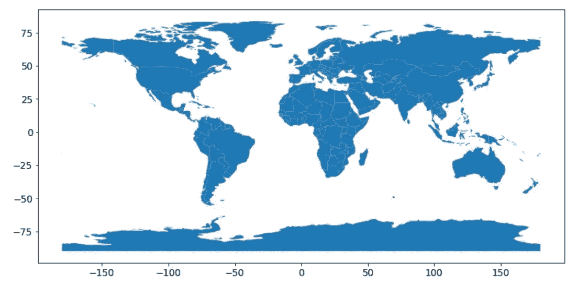

世界地图

Geoplotting 还允许根据此处的列表[将数据重新投影到 CartoPy 提供的任何地图投影中。](https://scitools.org.uk/cartopy/docs/latest/crs/projections.html)

```
fig=geoplot.polyplot(world,projection=geoplot.crs.Orthographic(), figsize=(8, 4))
plt.show()
```

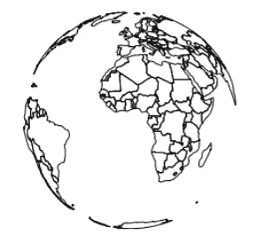

投影到正交投影的世界地图

**从世界地图中获取欧洲地图**

接下来，我从世界地图中只选择了欧洲地图。

```
europe=world[world.continent==”Europe”]
europe.plot()
```

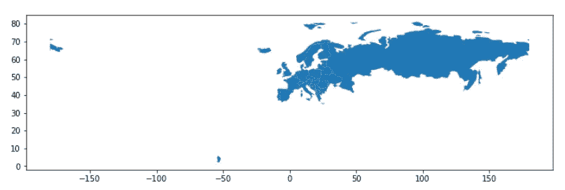

从世界地图中提取的欧洲地图

上面的欧洲地图还包括俄罗斯和冰岛。基于现有的数据，我想画出一些欧洲国家的排放强度。因此，我将俄国和冰岛排除在*欧洲*地理数据框架之外，如下所示:

```
#Remove Russia and Iceland from map of Europe
europe=europe[(europe.name!=”Russia”) & (europe.name!=”Iceland”)]
europe.plot()
```

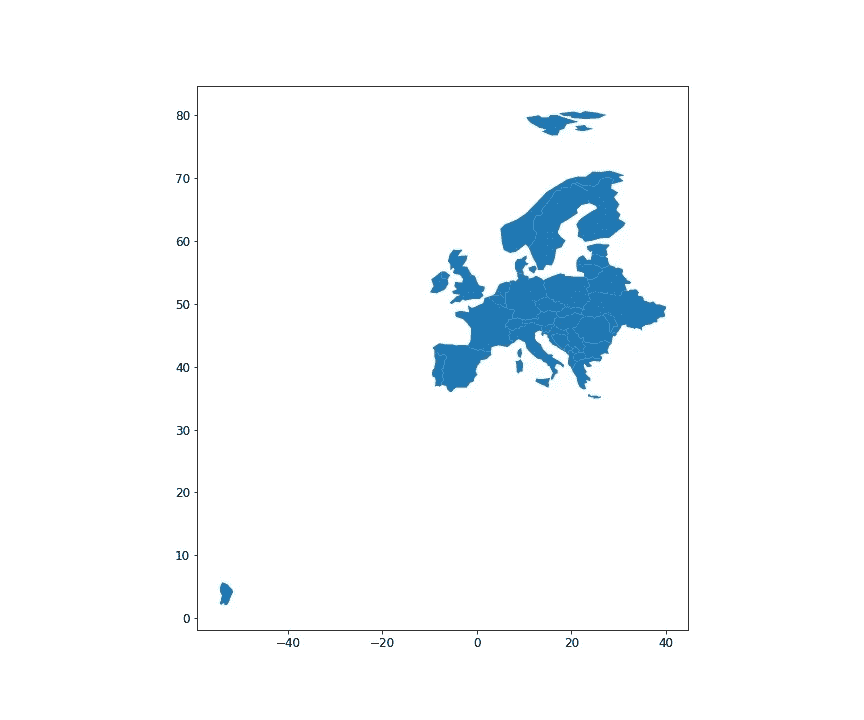

不包括俄罗斯和冰岛的欧洲地图

**用 Geopandas 裁剪矢量数据**

在地图的左下角，有一个南美洲的小区域。这个地区被称为法属圭亚那，行政上属于法国领土。因此，它将作为法国包含在地理数据框架中。但是，由于我要绘制法国(欧洲大陆的一部分)发电的排放强度，所以我想从地图中排除法属圭亚那。

我创建了一个自定义的形状良好的多边形，以便在地图中只包含我想要的欧洲地区。我创建了一个从西经 25°延伸到东经 40°和北纬 35°延伸到北纬 75°的多边形。我将多边形转换为地理数据框架，以便与我在上面创建的*欧洲*地理数据框架兼容。通过这种方式，我只捕获我想用作地理绘图参考的欧洲地区。

```
# Create a custom polygon
polygon = Polygon([(-25,35), (40,35), (40,75),(-25,75)])
poly_gdf = geopandas.GeoDataFrame([1], geometry=[polygon], crs=world.crs)fig,ax=plt.subplots()
ax=europe.plot(ax=ax)
poly_gdf.plot(edgecolor=”red”,ax=ax, alpha=0.1)plt.show()
```

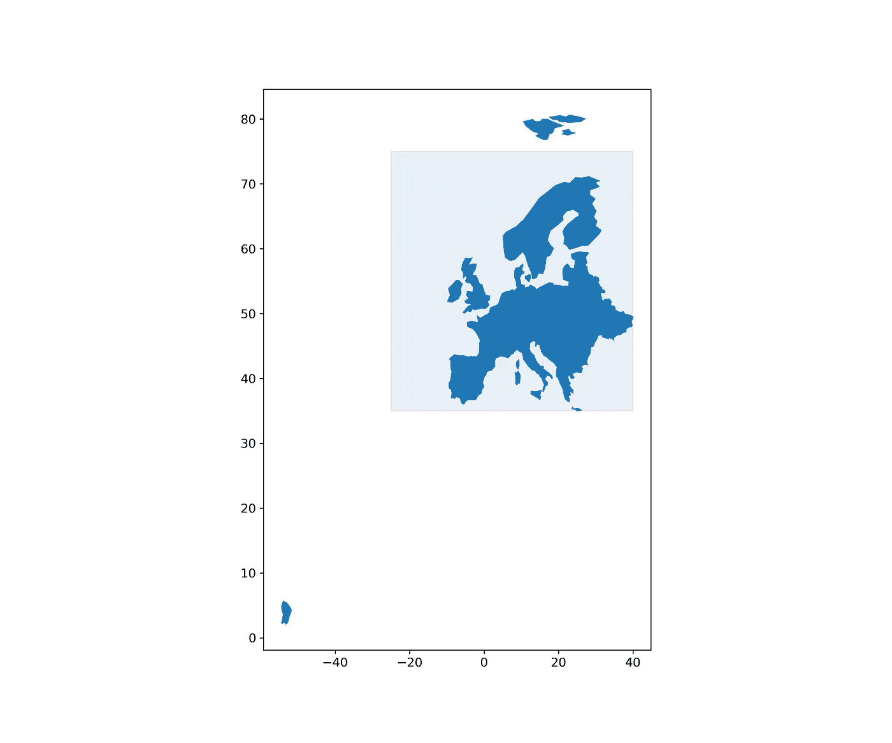

阴影部分表示要使用的区域。非阴影部分表示要剪切掉的区域。

我使用的 geopandas 版本(0.8.2)允许将几何裁剪到多边形几何的边界。这是一个很酷的功能，以前我只能在 GIS 软件中使用。裁剪允许从输入中提取要素。在 geopandas 中进行裁剪就像一行代码一样简单。

```
#Clip polygon from the map of Europe
europe=geopandas.clip(europe, polygon) 
europe.plot()
```

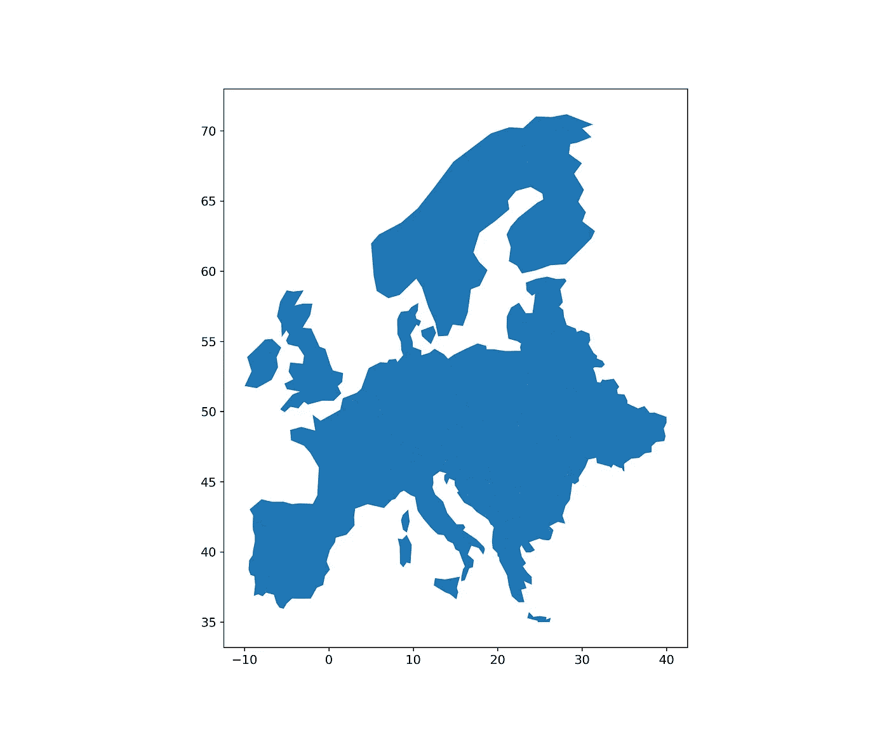

欧洲地图裁剪后可用。

现在我已经准备好了地图，我想用它来进行地理绘图。下一步我会研究数据。

**数据准备**

本分析中使用的数据基于 2021 年 12 月，可从我们的世界数据的[页面](https://ourworldindata.org/grapher/carbon-intensity-electricity)访问。该数据包括 2000 年至 2020 年欧洲发电的碳强度。

```
#Read csv file
df=pd.read_csv(“carbon-intensity-electricity.csv”)
df
```

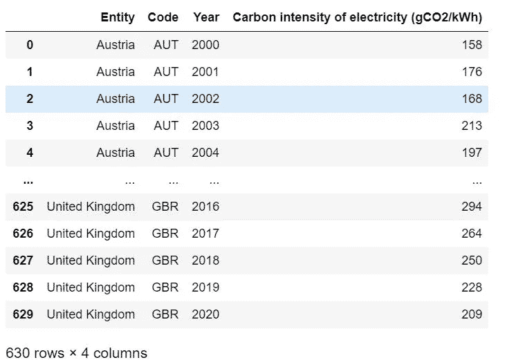

从 csv 文件中读取数据

数据框由名为“国家实体”的列组成。接下来，我检查在 *df* 数据框架和*欧洲*地理数据框架中列出的国家。

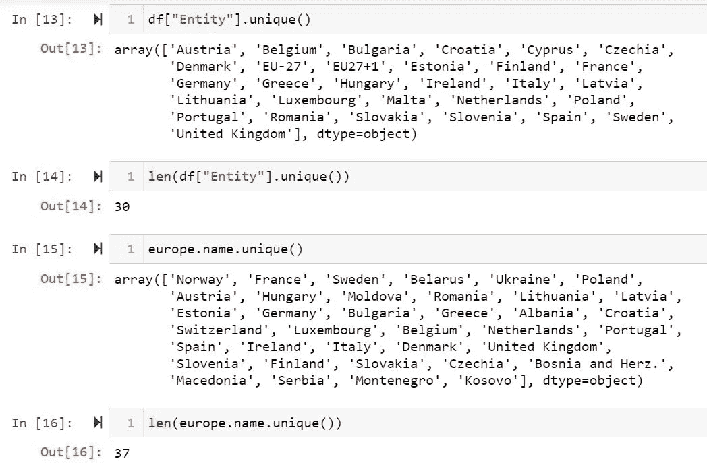

检查组成 *df* 和*欧洲*的国家名单和数量

我看到欧洲的国家比德国多。从 *df，*我只保留了同时出现在*欧洲*的国家。我还在 *df* 中只保留了 2000 年、2005 年、2010 年、2015 年和 2020 年的值，我想把它们可视化。我还将 *df* 转换为数据透视表，然后使用国家名称作为索引，五年作为列，转换为数据框架。

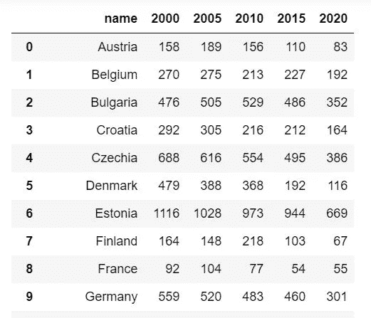

处理后的数据帧

接下来，我创建了另一个名为 *selected_countries* 的地理数据框架，作为 *europe* 的子集，它只包含 *df* 中的国家。我将来自 *df* 的排放强度值合并到*选定国家*中。

```
selected_countries=europe[europe.name.isin(list(df.name))]
selected_countries=selected_countries.merge(df,on=”name”,how=”left”)
```

**将它们放在一起**

我的目标是设想从 2000 年到 2020 年每五年欧洲发电的排放强度。为了在所有年份的地图上有一个统一的颜色范围，我选择所有年份和所有国家的最小和最大排放强度值作为变量的范围。

```
#Range of Variable you see as map color. Here I select the minimum and maximum of all the years selected.vmin=selected_countries[[“2000”,”2005",”2010",”2015",”2020"]].min().min()
vmax=selected_countries[[“2000”,”2005",”2010",”2015",”2020"]].max().max()
```

我在两行三列中创建了六个支线剧情，五个剧情对应五个不同的年份，第六个是一个空画布，上面画着一个问号，表示未来会怎样。组合地图的标题被指定，并且行之间的间距也被调整。

对于每个支线剧情，我用白烟色的*欧洲*地理数据框作为画布。在这个画布上，我绘制了特定年份的排放强度值，这些值来自 *selected_countries* 地理数据框架，颜色图(cmap)设置为“红色”。地图颜色的变量范围对所有支线剧情都是一样的。

增加了一个共同的颜色条，因为所有支线剧情的范围都是一样的。颜色条(cax)将被绘制到的轴是由我自己定义的。matplotlib . cm . scalar maptable()参数通过定义颜色图(此处为 cmap = " Reds ")并将变量的归一化范围取为[0.0，1.0]区间来描述颜色条。

```
 #Create subplots with 2 rows and 3 columns
fig,axs=plt.subplots(2,3)
fig.suptitle(“Emissions Intensity from electricity generation in Europe 2000–2020”, fontweight=”bold”,fontsize=15)#Adjust space betweeen rows
plt.subplots_adjust(bottom=0.2, top=0.9, hspace=0.25)axs[0,0]=europe.plot(color=”whitesmoke”,edgecolor=”black”,ax=axs[0,0])
selected_countries.plot(“2000”,cmap=”Reds”,edgecolor=”black”,ax=axs[0,0], vmin=vmin, vmax=vmax)
axs[0,0].set_title(“2000”)
axs[0,0].xaxis.set_visible(False)axs[0,1]=europe.plot(color=”whitesmoke”,edgecolor=”black”,ax=axs[0,1])
selected_countries.plot(“2005”,cmap=”Reds”,edgecolor=”black”,ax=axs[0,1], vmin=vmin, vmax=vmax)
axs[0,1].set_title(“2005”)
axs[0,1].xaxis.set_visible(False)
axs[0,1].yaxis.set_visible(False)axs[0,2]=europe.plot(color=”whitesmoke”,edgecolor=”black”,ax=axs[0,2])
selected_countries.plot(“2010”,cmap=”Reds”,edgecolor=”black”,ax=axs[0,2], vmin=vmin, vmax=vmax)
axs[0,2].set_title(“2010”)
axs[0,2].xaxis.set_visible(False)
axs[0,2].yaxis.set_visible(False)axs[1,0]=europe.plot(color=”whitesmoke”,edgecolor=”black”,ax=axs[1,0])
selected_countries.plot(“2015”,cmap=”Reds”,edgecolor=”black”,ax=axs[1,0], vmin=vmin, vmax=vmax)
axs[1,0].set_title(“2015”)axs[1,1]=europe.plot(color=”whitesmoke”,edgecolor=”black”,ax=axs[1,1])
selected_countries.plot(“2020”,cmap=”Reds”,edgecolor=”black”,ax=axs[1,1], vmin=vmin, vmax=vmax)
axs[1,1].set_title(“2020”)
axs[1,1].yaxis.set_visible(False)axs[1,2]=europe.plot(color=”whitesmoke”,edgecolor=”black”,ax=axs[1,2])
axs[1,2].set_title(“Future?”)
axs[1,2].yaxis.set_visible(False)# add colorbar
cax = fig.add_axes([0.92, 0.2, 0.03, 0.7]) #[left, bottom, width, height]
sm = plt.cm.ScalarMappable(cmap=’Reds’, norm=plt.Normalize(vmin=vmin, vmax=vmax))
# fake up the array of the scalar mappable.
sm._A = []
lgd=fig.colorbar(sm, cax=cax).set_label(“gCO$_2$e/kWh”, rotation=0,y=1.05, labelpad=-35)plt.savefig(“Emissions Intensity over the past two decades.jpeg”,
 dpi=300)
plt.show()
```

结果图如下所示。有六条副曲线，五条副曲线分别代表 2000 年、2005 年、2010 年、2015 年和 2020 年的排放强度，第六条是一个空画布，上面有一个未来可能会发生什么的问号。所有前五个支线剧情都有一个共同的颜色条，其值在 10 到 1100 gCO₂/kWh.之间类似地，一些国家(如挪威、乌克兰、白俄罗斯和瑞士)出现在*欧洲*地理数据框架中，但这些国家的数据在*选定国家中不可用。*因此，这些国家的颜色是基于*欧洲的白烟，*表示空值。如果数据可用，那么使用与上述相同的方法可视化这些国家的排放强度是可行的。

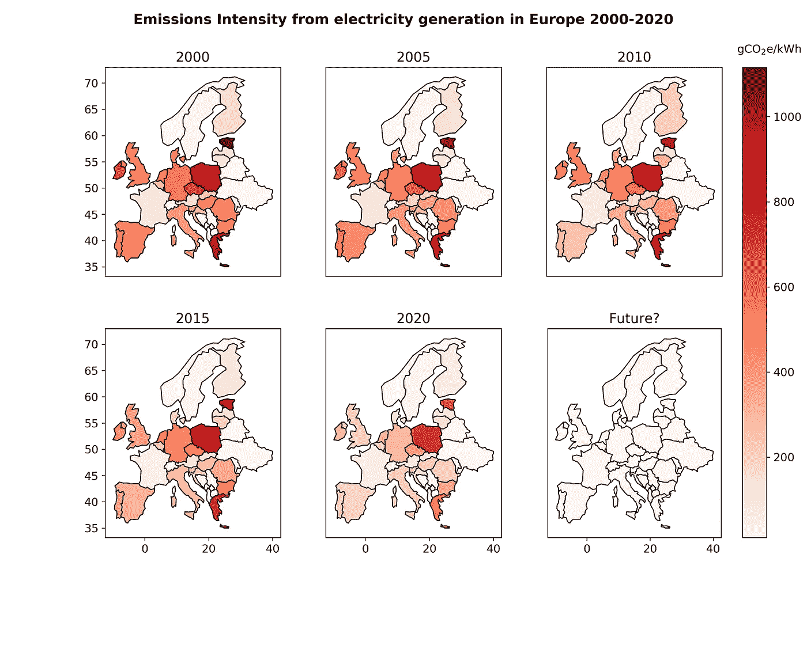

过去二十年欧洲发电排放强度的地理绘图

**评估排放强度趋势和 2020 年现状**

如果仔细观察上面的剧情，可以注意到每五年支线剧情对比的细微变化。例如，如果观察每个支线剧情中的西班牙地图，颜色对比在每隔一个支线剧情中变浅。这意味着在五年的时间间隔内，西班牙发电的排放强度逐渐降低。同样，相对于 2000 年的支线剧情，2020 年的支线剧情要轻很多。这意味着在过去的二十年里，欧洲的排放强度值总体上已经显著下降。

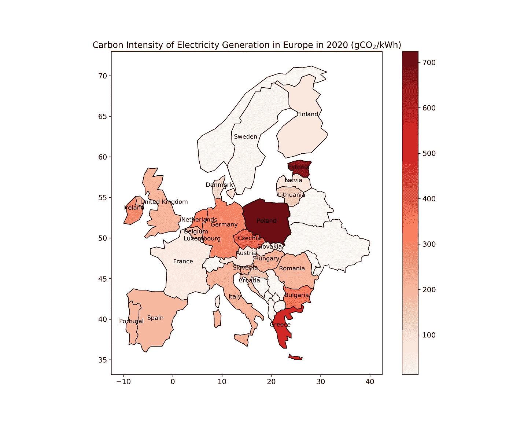

2020 年欧洲发电的排放强度

欧洲各国的排放强度值差异很大。例如，在 2020 年，排放强度值的范围在 10 到 725 gCO₂/kWh 之间，如上图中颜色条的范围所示。根据对 2020 年烈度值的观察，这些国家可分为三类:

1.  更高的排放强度:波兰、爱沙尼亚和希腊等国家的排放强度值更高(**大于 500 gCO₂/kWh** )
2.  中等排放强度:英国、德国和荷兰等国家的中等排放强度值在大约 **100 到 500 gCO₂/kWh** 的范围内
3.  较低的排放强度:瑞典、法国和澳大利亚等国家的排放强度值要低得多(**小于 100** **gCO₂/kWh).**

强度值差异的原因可以用这些国家的发电组合来解释。根据国际能源署(IEA)的数据，排放强度较高的国家(波兰、爱沙尼亚和希腊)的发电组合以化石燃料为主，主要是煤，燃烧时会释放更多的 co₂[2]。

可再生能源技术的成本，如太阳能光伏、陆上风能和海上风能，在过去的十年里已经大幅下降[3]。随着支持政策的到位，在英国和德国，可再生能源的份额已经增加到一半左右，取代了煤炭在燃料组合中的地位[2]。[从煤炭转向天然气](https://insideclimatenews.org/news/01102019/uk-coal-addiction-phase-out-natural-gas-renewable-energy-electricity/)也有助于降低英国的排放量，因为天然气的排放强度低于煤炭。

核能也是一种低碳技术，历史上一直是法国电力的主要来源。目前，法国约四分之三的电力来自核能，其次是水力、风力和天然气[2，4]。这解释了为什么法国的排放强度值较低，大约相当于 2020 年的 55 gCO₂/kWh。最后，水电和核能在瑞典的电力组合中各占近 40%的份额，其次是风能、生物质能和废物[2]。因此，在选定的欧洲国家中，瑞典的发电排放密度最低，约为 10 gCO₂/kWh.

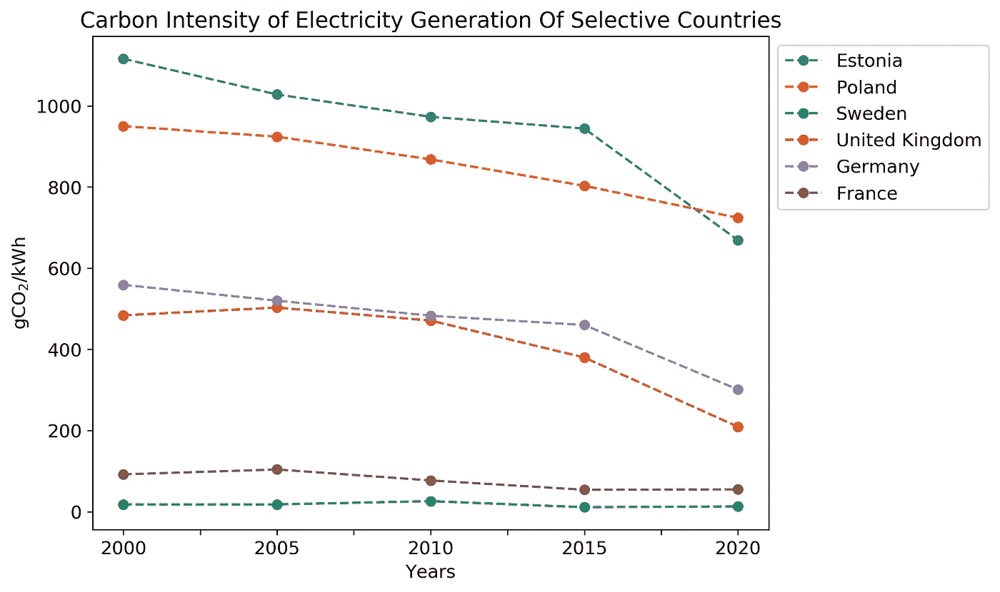

欧洲选定的六个国家排放强度的变化

**结论**

欧洲电力部门的去碳化是欧洲经济的前沿。过去 20 年来，发电的排放强度有所下降，甚至在新冠肺炎引发经济危机之前，这一下降速度就已经明显加快。可再生能源支持机制的引入和成员国逐步淘汰化石燃料发电的决定是排放和排放强度趋势的主要驱动因素[5]。

通过结合 Python 中不同包的优势来分析数据，可以产生各种有用的见解。在本文中，geopandas 和 matplotlib 软件包被用来可视化欧洲发电排放强度的趋势。然而，该方法也可用于在不同国家和地区的地图上显示不同的指标。

正如我在本文开头提到的，数据提供证据。利用适当的工具和技术，以正确的方式评估数据，对于从数据中获得洞察力至关重要，这可以成为循证决策的基石。

**参考文献**

[1]联合国环境规划署，排放差距报告(2020 年)。【2020 年排放差距报告| UNEP —联合国环境规划署

[2]国际能源机构，《数据和统计》(2021 年)。[数据&统计— IEA](https://www.iea.org/data-and-statistics?country=WORLD&fuel=Energy%20supply&indicator=ElecGenByFuel)

[3]国际可再生能源机构，2019 年可再生能源发电成本(2020)。【irena.org 2019 年可再生能源发电成本

[4]世界核协会，《法国的核电》(2021 年)。【法国 法国核能|法国核能—世界核协会(world-nuclear.org)

[5]气候分析，欧盟电力部门的脱碳途径:政策框架、主要驱动因素、案例研究和情景分析:与巴黎协定(2020 年)保持一致的经验教训。[sgccc _ ca _ report _ eu _ power _ sector-2020–11–30 . pdf(climateanalytics.org)](https://climateanalytics.org/media/sgccc_ca_report_eu_power_sector-2020-11-30.pdf)