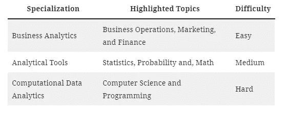
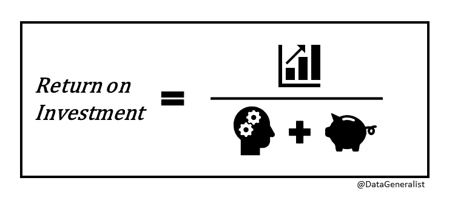

# 佐治亚理工学院的 MS 分析程序:我的评论第二部分

> 原文：<https://towardsdatascience.com/georgia-techs-ms-analytics-program-my-review-part-ii-50095db818b9?source=collection_archive---------17----------------------->

来源: [Unsplash](https://unsplash.com/photos/laORtJZaieU)

在写完我对 OMSA 项目的第一篇[评论](/georgia-tech-ms-analytics-review-c0f1378da83)后，许多未来的和现在的学生联系了我。因为这个项目吸引了来自各种背景的学生，所以提供适用于每个人的建议可能具有挑战性。以下是我收到的一些最常见的问题，以及我试图回答的问题。

# OMSA 适合我吗？

如果你阅读他们学位概述[页面](https://pe.gatech.edu/degrees/analytics)上的项目描述，他们会用“跨学科”这个词。我认为这是这个项目最完美的词汇选择。本课程涵盖的主题范围来自各种各样的学科。*必修*课程涵盖金融、会计、面向对象编程、数据分析、机器学习、统计学、web 开发、云计算、数据清理、脚本语言和数据可视化。这个高技术项目的重点是广度而不是深度。如果这听起来有吸引力，那么这可能是你的计划。然而，如果你想成为专家，专攻其中任何一门学科，有比这个项目更好的选择。

虽然这个项目强调广度，但不要低估材料的难度。精通商业、计算机科学和统计学绝非易事。通常情况下，个人会在本课程所涵盖的至少一门学科上苦苦挣扎。如果你担心这个学位的技术难度，我建议你在入学前提高自己的技能，或者考虑其他项目。其他在线定量硕士学位包括数据科学、应用经济学、统计学、计算机科学、商业分析和 MBA:分析集中。大学商学院的分析课程在数学和计算机科学方面可能不太严谨。

# 我应该选择哪个 OMSA 专业？

完成必修课程后，有 3 个专业可供选择。专业化这个词有点误导，因为这个项目的大部分对每个学生都是一样的。只有 6/36 学分是为该专业定制的；否则，其余的是必需的或由您决定。您可以用以下内容快速总结这三个专业化:

作者图片

虽然难度有点主观，但我想大多数学生都会同意我的评估。计算机科学课程往往需要每周最多的工作时间。

# 你会推荐特定的课程顺序吗？

这个项目涵盖了这么多不同的学科，要决定合适的上课顺序是很棘手的。在做决定时，有许多可变因素需要考虑。在你制定理想的 2-4 年研究生计划之前，这里有几个问题需要回答。

你一学期可以上多少课？
平均工作量从每周 8-20 小时每 3 学分不等，视课程而定。您需要根据班级期望考虑哪些班级可以配对。你个人的时间投入将不同于平均水平，这取决于你在该领域的技能水平。例如，如果你在统计学方面有很强的背景，那么你可能会承担低于平均水平的统计学课程时间。

**每学期开设哪些课程？** 夏季学期比秋季和春季学期短。因此，他们只提供进度较快的课程，这是全部课程的一个子集。因为他们跑得更快，每周的平均工作量比平均水平高 20%。

哪些班级最适合在附近上课？
把两个相关的学科拿得很近要容易得多。就我个人而言，在完成《数据分析计算入门》之后，我处于编程技能的巅峰。我希望在这门课结束后，我马上去上最难的计算机科学课程，数据和视觉分析。你应该考虑哪些课程可以很好地作为互补主题。

# OMSA 项目值得吗？

为了确定价值，你需要估计项目的成本和完成项目的预期回报。该计划的货币成本为 13，000 美元*，但完成该计划的人工成本为 2，160 小时**。就可比的研究生学位而言，这个项目的学费是最低的。然而，如果你认为证书主义在社会中的价值正在减弱，有更便宜的选择来学习这种材料(例如 [Coursera](https://www.coursera.org/) 、[免费在线资源](https://thedatageneralist.com/resources/)等)。).如果学费不是你关心的问题，时间投入应该是。如前所述，该计划是关于分析空间的广度，而不是深度。如果你希望成为分析子集的专家，比如实验、人工智能或数据工程，那么你的时间最好花在其他地方。

图片作者:ROI =利润/(人工+学费)

从回报的角度来看，该项目主要提供两样东西:一个结构化的学习环境，以及至少一个入门级的数据分析职位。该计划提供了一个深思熟虑的教学大纲，由各自领域的专家教授大多数课程。作业是有组织的，通常会有自动评分系统，以便及时反馈。该环境包括多种沟通模式，以寻求任务方面的帮助，包括 [Piazza](https://piazza.com/blackboard) 、Slack 和办公时间会议。通读 Piazza 上的几十个帖子来寻找解决某个特定问题的提示可能有点混乱。这是关于他们在多大程度上促进了你的学习。你会注意到我没有在上面任何地方提到讲座。它们可能被击中，也可能未击中，这取决于课程。许多讲座的水平如此之高，你最好完全跳过它们。一些讲座或作业会包含有用的链接；然而，你的大部分学习是在 GT 环境之外通过你自己的研究(又名谷歌搜索)进行的。从回报的角度来看，你从这个项目中获得的知识很大程度上取决于你对学习材料的投入，而不仅仅是获得一个学位。

转到大多数人参加研究生项目的主要原因，工作机会。我不需要重申数据分析技能非常受欢迎。随着每个行业对技术的依赖越来越大，我看不到计算机科学和统计技能没有市场的未来。人工智能只会增加我们对这些技能的依赖，因为每个自动化过程都需要安装和持续维护。因为有这么多类型的人报名参加这个项目，所以很难说这个学位能在多大程度上帮助你找到你想要的工作。在我看来，一个拥有 OMSA 学位和零年工作经验的毕业生，符合你典型的寻找 3-5 年工作经验的分析职位的要求。示例包括数据分析师、高级数据分析师、商业智能工程师、初级数据科学家和数据科学助理。然而，如果你想在一家顶级公司获得这些职位中的一个或更高级的分析职位，你需要用额外的工作经验或个人项目来增加学位。

增加相当于额外 3-5 年的数据分析经验是否值得这个项目的成本，取决于您自己。我认为这个项目对那些至少符合以下标准之一的人来说是最有价值的:

*   一位有一定定量/编程背景的经验丰富的专业人士，希望将职业生涯转向数据分析
*   一位经验丰富的*分析*专业人士，希望将自己的职业发展提升 3-5 年
*   需要结构来促进学习的学生
*   不怕需要坚持的复杂问题的学生
*   不想专攻特定数据分析或数据科学学科(如人工智能、机器学习工程、数据工程、数据可视化等)的有经验的专业人士。)

*(每学分 275 小时* 36 学分)+((每学期 194 + 107 费用)* 9 学期)
**(每 3 学分每周 12 小时*每学期 15 周)* (36/3 三学分块)

# 我该如何准备这个节目？

如果你决定申请并参加这个项目，你需要确认你已经准备好了材料。入学要求在为学生准备这个项目方面是次优的。为了在这个项目中取得成功，我建议在数据分析、数学和计算机科学方面拥有一定的经验。

你应该*熟悉*的数据分析主题和工具:

*   结构化查询语言
*   擅长
*   数据可视化
*   数据清理
*   数据分析

在数学方面，你应该*熟悉*以下内容:

*   微积分-积分，导数，函数，极限
*   统计学—假设检验、p 值、置信区间、抽样
*   概率分布，误差
*   线性代数-矩阵，矩阵运算，向量，方程组

至于计算机科学，你应该在这个项目之前完成相当于两门严格的本科计算机科学课程。严格意味着他们要求每 3 学分每周 10 小时以上。你需要成为至少一门面向对象编程语言的中级程序员。这包括调试和诊断代码中的问题的经验。熟悉 web 开发也会有所帮助。最重要的是，你需要一个永不满足的胃口来解决困难的问题，这些问题很少在第一次尝试中就能解决。

如果您有任何其他问题或意见，请随时联系 [out](https://twitter.com/datageneralist) 。我总是在考虑数据分析或金融。

~ [数据通才](https://thedatageneralist.com/)