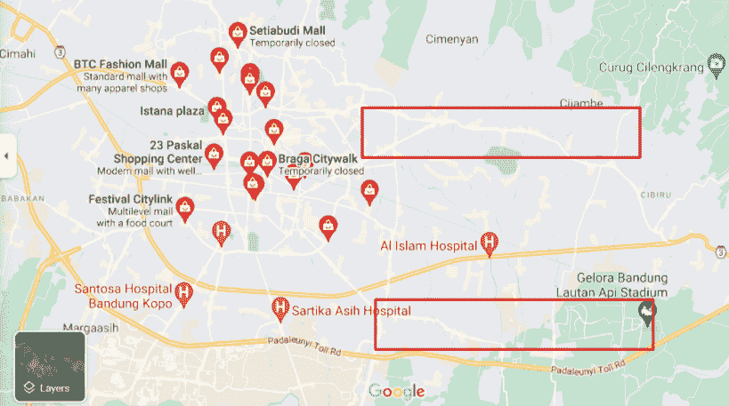
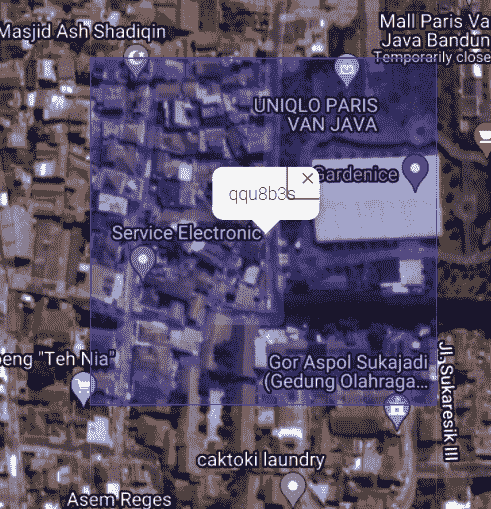
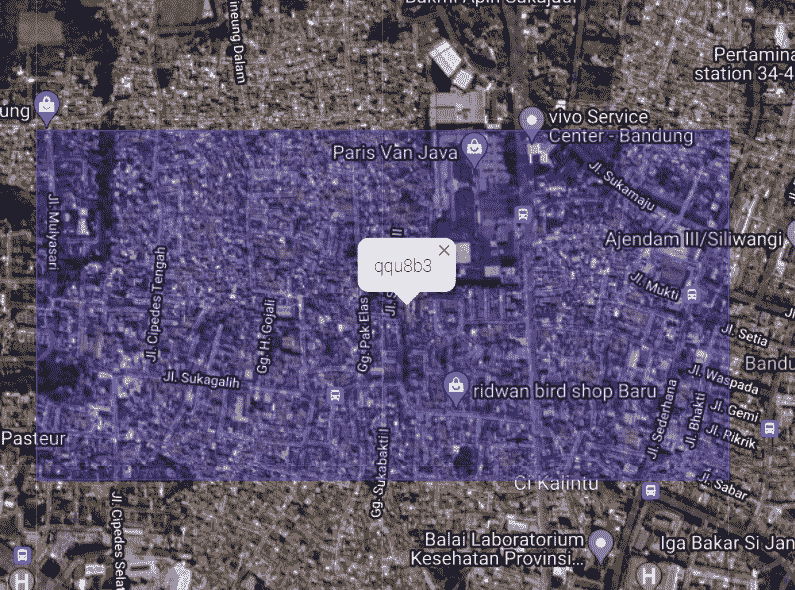

# 重新评估城市结构的地理空间分析

> 原文：<https://towardsdatascience.com/geospatial-analytics-for-reassessing-urban-structures-3bf02c647931?source=collection_archive---------25----------------------->

## 利用 Geohash 和数据科学模型解决当前城市结构导致的交通拥堵和空间不平等问题

图片来自[Unsplash.com](https://unsplash.com/photos/CyX3ZAti5DA)

# 背景

在当今的科技时代，位置数据对一些科技公司的业务运营至关重要。通过使用户能够将他们的设备位置与公司的平台联系起来，数据团队可以使用可用数据构建模型和洞察报告。这种情况可以是基于位置需求的价格设置或按城市的可视化销售覆盖。在处理这些数据时，我不禁想象出商业之外的潜在用例。作为一名城市爱好者，想到的第一个用例是为解决城市地区的交通拥堵和空间不平等提供见解。

交通拥堵会产生如此高的社会经济和环境成本，从降低劳动生产率到增加碳排放。对于雅加达这样的城市，每年交通拥堵的成本高达 45 亿美元(Roberts，2019)。这也值得全球关注，因为它加剧了气候变化。空间不平等可以定义为优质公共产品和服务的不平等分配，如交通、医疗和教育。在城市地区，它导致生活质量的差异，犯罪率上升，城市人口的总体幸福指数较低(Glaeser 等人，2009 年)。

仔细观察，交通拥堵和空间不平等都是城市结构、土地使用安排和连接程度的结果。缺乏交通便利性、主干道、靠近工作地点和便利设施将迫使居民使用私人车辆进行长途通勤。与此同时，那些没有私人车辆的人将很难进入这些地方，从而减少了他们创收的机会。一些家庭可能会因为距离近而搬到经济活跃地区的非正规住区。这是不平等的一个例子。

根据上一段陈述的问题，我定义了两个基本解决方案:******改善服务水平低下的社区的可及性****增加城市便利设施的分布**。当前的技术可以用来为当地决策者提供见解，以确定每个地区的正确解决方案。这些见解不仅可以显示这些地区的迫切需求，还可以用来制定资助计划。****

****在这篇文章中，我将讨论地理空间分析的使用，特别是 geohash，以获得改善城市结构的见解和建议。在进入技术细节之前，我们首先需要在经济活动方面接受跨地区的相互依赖。****

# ****城市经济中的结构性相互依赖****

****为了确定地理空间分析模型，我们需要了解城市经济是如何运作的。根据 Hewings (2021)，城市经济的特点通常是对一组地区或区域的粗略了解。然而，更深入地看，各区域之间有很强的相互依赖性。对芝加哥大都市的详细分析显示了商品和服务、人员流动(通勤者)和家庭支出流动(购物)方面的强大贸易关系。这揭示了地区之间在收入分配和消费支出方面的互惠经济效应。****

****潘等人(2018)的早期研究重新评估了城市结构和土地利用模式，以芝加哥为例，分别使用胡佛数据目录、美国人口普查、和道路密度地图的数据，基于就业、人口、指示名胜(poi)的评论和可达性吸引力。一个关键的发现是，居民被吸引到具有高可达性和“生活质量”便利设施或名胜古迹的地方。这显示了到中央商务区(CBD)模型的距离的偏差，这是吸引力的主要衡量标准。其他发现表明，新企业更喜欢在 CBD 内远离现有竞争对手的位置，创造新的就业中心。我从这篇文章中得到的主要结论是:便利设施的可达性和空间分布是住宅区的重要元素。前者使居民能够获得创收和/或就业机会，而后者表明生活质量。Hewings 的方法可以用作地理空间分析项目的框架，这将在下一节中讨论。****

# ****地理空间分析的应用****

****Hewings 的研究启发我看一眼印度尼西亚万隆的建筑，我大半生都在这个城市度过。像东南亚大多数主要城市一样，万隆有着浓厚的购物中心文化。购物中心可以被视为主要的休闲设施或兴趣点，其位置反映了该地区的发展水平。其商业活动的密度产生了大量的就业机会。因此，商场的分布可以被认为是空间公平的一个指标。为了得到一个大概的了解，我简单地在谷歌地图上搜索了“万隆的购物中心”。从下图中，我们可以看到所有的商场都位于城市的西侧。此外，我们可以看到，只有两条主要道路将这些地区连接到东侧(用红框标出)，其中大部分是住宅区。这是一个明确的指标，表明城市目前的结构已经产生了拥挤和空间不平等的问题。从个人经验来看，这些道路以及通往商场的道路在上下班高峰期和周末都非常拥堵。通过观察也可以看出东西方整体繁荣程度的反差。万隆政府确实在寻求将其单核结构转变为双核结构，因此地理空间分析可能会大有用处。****

********

****印度尼西亚万隆的商场分布(图片由作者提供，由[谷歌地图](https://www.google.com/maps/search/malls+in+bandung/@-6.9274528,107.5718663,12z/data=!3m1!4b1)生成)****

****为了构建更强大的分析，可以使用 GIS 工具来显示高峰时段的道路拥堵情况。相关数据可以从众包平台、谷歌地球图像或其他可用的政府数据中提取。为了捕捉不平等指标，从卫星图像生成的夜灯数据集目前正被用于经济发展分析。夜灯的密度表明更高的经济活动，因为它是实时的，用户也可以分析运动来表明增长。后者将有助于衡量政策干预的成功。****

****从理论上讲，这是城市规划者面临的一个普遍问题，因为东区通常被用作制造区，以减轻气流引起的烟雾运动。由于发展和结构转型之间缺乏同步性，再加上人口增加，像东万隆这样的地区没有足够的基础设施来为居民提供无障碍环境和吸引企业。为了确定克服这一问题的正确行动，地方政府和发展实践者可以利用地理空间分析工具在社区层面产生洞察力。****

# ****使用 Geohash 作为分析的主要维度****

****我发现一个非常有用的工具是 geohash，它将一个位置坐标(经度和纬度)定位到一个矩形单元中，该单元用一个简短的字母数字字符串表示。geohash 的大小可以很容易地从 1 到 12 的精度级别进行调整，换句话说，更多的字符会生成更低的地理级别。当在地图上可视化时，geohashes 形成一个网格，便于用户获得洞察力(明尼阿波利斯的例子可以在这个[链接](https://gis.stackexchange.com/questions/118611/generating-heat-maps-with-geohash)中找到)。我最常用的级别是 7 和 6，可以分别定义为街区和子区。这些地理哈希的样本可以在下面的图片中找到。这些是通过将特定的位置坐标(我指的是万隆的一个受欢迎的购物中心)输入到[活字字体](https://www.movable-type.co.uk/scripts/geohash.html)网站生成的。这个网站有助于检查 geohash 覆盖率，它还提供了 JavaScript 源代码，也可以在 [Github](https://www.movable-type.co.uk/scripts/geohash.html) 上找到。SQL servers 上还有用于转换经度和纬度数据的内置函数，这使我们能够在数据转换后编写简单的聚合查询。****

********

****Geohash 7 网格示例(图片由作者提供，由[可移动字体脚本](https://www.movable-type.co.uk/scripts/geohash.html)生成)****

********

****Geohash 6 网格的示例(图片由作者提供，由[可移动字体脚本](https://www.movable-type.co.uk/scripts/geohash.html)生成)****

****由于 geohash 是一种显示位置的便捷方式，因此可用作分析城市结构中可达性和空间分布的主要维度。Geohash7 可用于可访问性是所有邻域的重要要求。对于空间分布，geohash 6 将更适合，因为便利设施/兴趣点和其他就业中心可以服务于更广泛的居民。****

****geohash 的局限性在于，由于其格网形式，它不能根据行政区域的大小进行定制。根据人口密度的不同，区、县或自治市的大小也不同。对于某些行政办公室所需的更精确的分析，GeoPandas 将是一个更可行的工具。这个数据科学库使用从点和多边形派生的几何列。位置坐标，经度-纬度，可以转换成这种几何数据格式。在此[链接](https://geopandas.org/gallery/choropleths.html)中可以找到显示俄亥俄州哥伦布市犯罪率热图的用例示例。****

# ****易接近****

****无障碍的主要促成因素是道路和公共交通基础设施。作为城市网络的主干，社区与主要道路和公共交通节点的良好连接至关重要。要分析公共交通覆盖的充分性，我们只需向包含每个公交车站和火车站的经度和纬度的数据集中添加一个 geohash 列。这通常可以在当地交通部门的数据库或档案中找到。从这里，我们可以生成一个地图，显示每个 geohash 网格中的公交车站的可用性。为了确定为没有公交车站的格网提供服务的紧迫性，我们可以像 Hewings 等人所做的那样，将 geohash 列与人口普查数据中的人口数据集连接起来。Python 库(如 polygon-geohasher)可用于创建可视化。这种方法可应用于道路基础设施，即获取格网到主干道坐标的距离。****

****对于许多城市，尤其是发展中城市，基础设施不足对利益相关者来说可能已经很明显了。主要挑战是缺乏提供所需基础设施的资金，因为大多数地方政府的财政能力有限。基础设施项目不仅需要高额的建设、运营和维护成本，而且还要承受征地成本。为了提供一种替代解决方案，一种越来越广泛用于这种情况的机制是土地价值捕获(LVC)。这基本上是一种为交通基础设施融资的方法，通过获取因可达性提高而产生的土地附加值(Medda，2012)。只有受益人(居民或私人开发商)以改善税或开发费的形式预付款项，才能享受基础设施项目创造的无障碍环境。****

****机器学习算法可以用来计算潜在的提升。第一步是通过导入土地价值数据库在 Python 笔记本中创建数据框，该数据库通常用于税收计算。在这里，我们可以使用线性回归建立一个预测模型，根据基础设施类别，将到主要道路和/或公共交通节点的距离作为主要属性。为了预测计划项目的价值提升，我们可以创建一个模拟列，假设它当前存在。结果将揭示项目周围地质散列中的预期平均土地价值。另一种方法是使用包含最近基础设施项目前后的值的历史数据。将周边地区作为处理组，其他地区作为对照组，我们可以进行因果影响分析，以计算项目实施后的土地价值提升。****

****算法的结果将成为创建基于税收的价值获取方案的有用参考。这通常被称为改善税，已在波哥大实施。土地所有者根据出售或开发时的土地收益支付税款。所得资金将用于基础设施投资。另一个机制是土地整合，这在日本很受欢迎，土地所有者愿意牺牲部分土地来改善道路，以获得更好的可达性。这些计划的主要挑战是让土地所有者相信经济增长，因为它还不具体，而且往往仅限于那些有兴趣出售其财产的人。另一种方案是基于开发的，与下一节讨论的兴趣点的空间分布相关。****

# ****便利设施的空间分布****

****随着通过移动设备进行的社交媒体签到、评论和 GPS 导航数量的增加，有大量的数据与这个问题相关。我们可以看到，Hewings 等人可以利用 yelp.com 评论数据来衡量吸引力，我可以简单地搜索谷歌地图来获得商场分布的大致概况。便利设施不仅限于商场和餐厅，还包括公共场所、生鲜市场和诊所/医疗保健中心(这是当今的重中之重)。上述平台可以对一个地区的吸引力产生高质量的见解，例如过去两周 Instagram 上整体入住率最高的地区。另一个有趣的数据集将包含谷歌地图上的热门目的地，其中包括用户的起点。这些信息将有助于城市规划者确定吸引商业和通勤活动的区域。后者还可以揭示由不均匀的空间分布造成的拥挤。然而，这里的主要障碍是这些数据集大部分都不公开。一种可以使用的技术是抓取，从可访问的网站中提取数据。谷歌地图将是这种情况下的一个很好的平台，因为它有各种类别的评级数据。****

****为了开始探索性的数据分析，我们可以提取谷歌地图上每个类别前 500–1000 个地方的经度和纬度。将数据点转换为 geohash 6 后，我们可以使用一个过滤列生成一个热图，按类别显示每个网格的吸引力。该市的人口分布图也有必要作为分析的补充。理想的结果是在城市的不同部分(不包括农业和绿色空间)显示暖色。另一方面，令人担忧的结果将显示大多数暖色网格完全集中在特定区域，与人口分布相矛盾。这将导致在哪里和如何重新开发的问题。****

****对于第一个问题，可以应用 k-means 聚类模型来了解有吸引力的区域的特征和当前欠发达区域的倾向。换句话说，识别不太吸引人的区域与吸引人的区域具有最高水平的相似性。假设是一个地区的吸引力与主要道路、空气质量、绿色空间和人行道有关。重新开发的潜在地点(当然是以可持续的方式)将具有这些属性，但目前设施/兴趣点的数量较少。为了促进经济活动和增长，政策制定者可以给予企业税收优惠，鼓励他们在这些地方迁移或建立业务。这将吸引私营部门投资于服务不足的地区，并在长期内建立公平。****

****一个具有挑战性的情况是，如果这些潜在的位置也是有限的或者甚至不存在。另一种选择是简单地选择居住区附近的棕色地带，并使用 k 均值模型的关键属性作为规划框架。这将意味着这些属性，像主要道路和绿地，必须建设。这让我们回到了融资挑战和 LVC。****

****如前所述，除了讨论的基于税收的计划之外，还有基于发展的低消费量计划。地方政府不用向土地所有者收费，而是可以与私人开发商合作，以开发权作为激励，帮助为再开发项目(包括必要的基础设施)提供资金。简而言之，开发商不能享受来自新地点的收入，除非他们帮助投资基础设施，带来租户和消费者。这种机制已经在伦敦被用来重新开发巴特西地区，这需要地下铁路延伸。可以应用类似于可访问性的机器学习算法，更关注经济活动。结果将有助于吸引与开发商的合作。****

# ****结束语****

****地理空间数据可以通过多种方式进行分析，包括重新评估城市结构。有几个可用的工具可以帮助政策制定者获得关于潜在问题的见解，如缺乏无障碍环境和空间分布不均。还可以使用数据科学模型进一步分析这些见解，以论证解决这些问题的解决方案。****

****然而，地理空间分析实际上只是一个支持决策者的工具。根本方面在于政策、制度和市场。首先要问的问题是，决策者和市场利益相关者是否有兴趣寻求信息并采取必要的行动。主要的挑战实际上是建立变革的动力和执行行动计划。地理空间分析确实是一个强大的工具，但决定因素是消费数据洞察力的人。****

****进一步讨论地理空间分析的一个有趣话题是疫情。随着大量的人在家工作和网上购物需求的增加，我一直在想这些模式会在多大程度上改变后疫情时代的城市结构。这只是一个极端事件，事情很快就会恢复正常，还是技术已经证明通勤的需求减少了？地理空间分析可以帮助提供关于社交距离限制前后行为变化的见解，因为它在一些城市已经开始和停止。然而，研究结果也可能偏向于不那么脆弱/谨慎/外向的人群。然而，这样的研究应该持续到疫情之后的几年。****

# ****参考****

****Glaeser，e .，Resseger，m .，Tobio，k .，2009 年。城市不平等。哈佛大学肯尼学院:州和地方政府陶班中心。****

****赫因斯，G. 2021。可持续性与城市经济。大型网络研讨会！系列#11，印度尼西亚大学****

****梅达，女，2012 年。交通可达性的土地价值获取融资:综述。*运输地理杂志*，25 期，第 154–161 页。****

****潘，h，迪勒，b，陈，y，海文斯，G. 2018。对城市结构和土地利用模式的重新评估:到 CBD 的距离还是基于网络的？—来自芝加哥的证据。区域科学和城市经济学，70，215–228****

****罗伯茨，男，吉尔·桑德，女，蒂瓦里，S. 2019。行动起来:实现印度尼西亚的城市潜力。华盛顿 DC:世界银行****