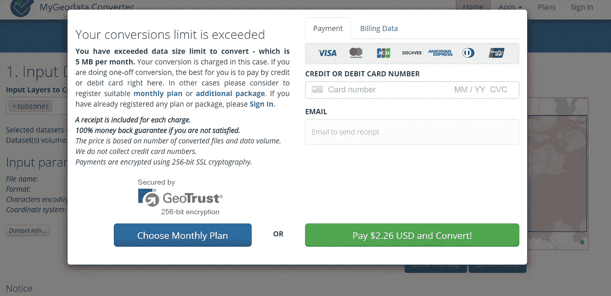
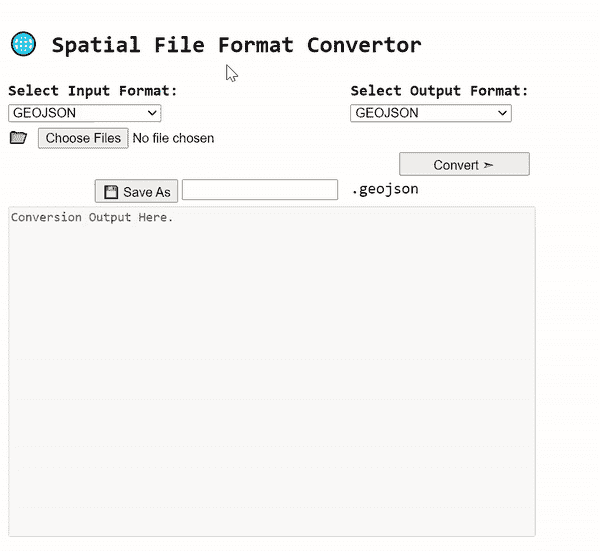

# 地理空间数据文件格式转换(KML、SHP、GeoJSON)

> 原文：<https://towardsdatascience.com/geospatial-file-format-conversions-kml-shp-geojson-25261beb2153?source=collection_archive---------27----------------------->

## 使用这些 JavaScript 实用程序。没有成本。没有安装。没有配额。(包括 HTML 实用程序文件)

在我最初的几个地理空间项目中，我不得不面对的最令人沮丧的障碍之一是缺乏将空间数据集转换为 GeoJSON 格式文件的工具。虽然有诸如[在线 GIS/CAD 数据转换器| SHP、KML、KMZ、TAB、CSV、……(mygeodata . cloud)](https://mygeodata.cloud/converter/)等 GIS 网站，但它们往往会对一天的上传数量加以限制:

作者截图|当我尝试使用在线工具转换空间数据文件时，我会看到一个典型的弹出窗口

另一方面，由于安装诸如 [QGIS](https://qgis.org/en/site/index.html) 之类的桌面应用程序只是为了文件转换*(更不用说它会占用大量磁盘空间)*是一件麻烦的事情，我决定求助于替代方案，并最终决定创建一个离线 JavaScript 实用工具，将常见的空间文件格式，如 **SHP、& GEOJSON** 转换为 **KML & GEOJSON** 可互换。

幸运的是，由于 [npm 站点](https://www.npmjs.com/)上的几个节点模块已经有了我所寻求的功能，我所要做的就是用 browserify 将这些 npm 包转换成普通的 VanillaJS。**本质上，browersify 将节点模块的所有 JavaScript 依赖项捆绑到一个基于浏览器的 JavaScript 客户端库中，从而可以轻松导入到任何 HTML 文档中。**

## 注意:对于任何想了解 browserify 的人，请参考下面的文章🙃

 [## 在浏览器中轻松导入和使用 NPM 模块

### 逐步使用 Browserify —完整代码+使用案例演示

medium.com](https://medium.com/weekly-webtips/import-use-npm-modules-in-the-browser-easily-e70d6c84fc31) 

然后在不到一个小时的时间里，我终于创建了我自己的离线空间文件转换工具，没有使用限制🤩

作者演示| SHP 文件格式到 GEOSJON 格式的转换。请注意，对于较大的文件，在选择**【转换】**之前，需要等待加载信号停止

## 对于希望获得上述内容副本的读者，请随意在我的 GitHub 下载该文件(单个 HTML 文件):[链接](https://gist.githubusercontent.com/incubated-geek-cc/9f906f1cf83e88f810879b5af1bb5bb0/raw/4a9906c8f70401a522a290ae70e0a1c646ec90ed/index.html)或在这里试用！

# 关于地图工具为何应保持离线的总体评论

除了**能够在有或没有互联网连接**的情况下使用这些工具的显著优势之外，另一个要考虑的方面是所用数据集的**保密性。无论数据集在本质上是不是空间数据集，数据分析师都有责任在处理信息(如个人居住地址的地理分布，其中可能包含也可能不包含居民的个人详细信息)时保持极度谨慎。因此，这样做的直接后果将是需要限制基于 web 的实用程序用于其数据处理的任何部分。**

> 考虑到**通过在线平台处理的任何个人数据都将面临被泄露的风险**，这一部分实际上是不言而喻的，但我通过不同的场合认识的许多数据分析师经常忽略这一点。

## 总而言之，我个人对数据处理的立场是:

> 虽然 web 上部署了多种多样的数据实用程序，但最好还是小心谨慎地处理数据集。更好的是，离线处理它，以更好地保护您可能忽略的任何机密信息。

## 非常感谢您阅读这篇文章，希望您发现它对您的使用案例有用。如果您想了解更多地理空间相关内容，请随时关注我的 [Medium](https://geek-cc.medium.com/) 。会非常感激😀

 [## 通过我的推荐链接加入灵媒——李思欣·崔

### 获得李思欣·崔和其他作家在媒体上的所有帖子！😃您的会员费直接…

geek-cc.medium.com](https://geek-cc.medium.com/membership)