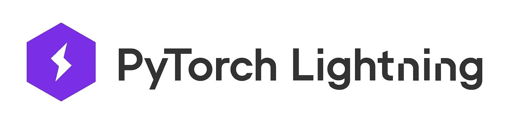

# 使用闪电和光线调整更好地构建 Pytorch 模型

> 原文：<https://towardsdatascience.com/get-better-at-building-pytorch-models-with-lightning-and-ray-tune-9fc39b84e602?source=collection_archive---------23----------------------->


伊利亚·巴甫洛夫在 [Unsplash](https://unsplash.com?utm_source=medium&utm_medium=referral) 上的照片

**Pytorch** 是领先的深度学习框架之一，因其易用性、丰富的功能和可靠性而在研究和行业中得到广泛应用。

然而，尽管现代深度学习框架在允许快速建立模型方面做得非常好，但仍然需要大量的样板代码。

为了解决这个问题，新的库和框架正在开发中，它们旨在改善开发复杂深度学习模型的整体体验。

我们将讨论其中的两个框架，它们都可以单独与 Pytorch 一起使用，或者组合在一起快速原型化和开发新模型:

*   Pytorch-lightning :通过在常规 Pytorch 代码上添加一个抽象层，提供了许多方便的特性，并允许用更少的代码获得相同的结果。
*   **Ray-tune** :超参数调谐库，适用于任何比例的高级调谐策略。

# 模型开发:Pytorch 闪电



[https://www.pytorchlightning.ai/](https://www.pytorchlightning.ai/)

**Pytorch Lightning** 是一个旨在通过加快模型开发来增强 Pytorch 的框架。*“多花点时间在研究上，少花点时间在工程上”*

主要思想是深度学习模型共享大量样板代码，这些代码可能需要大量时间来正确编码和实现。日志记录、检查点、GPU/TPU 支持或分布式训练等功能是与模型无关的，通常会一遍又一遍地重复开发。

该框架提供了大量的功能，但这些好处是有代价的:为了使用该框架，您需要根据给定的结构开发您的模型:

```
class MyModel(pl.LightningModule):
def__init__(self)
def forward(self, x)
def configure_optimizers(self)
def training_step(self, train_batch, batch_idx)
def training_epoch_end(self, outs)
def validation_step(self, val_batch, batch_idx)
def validation_epoch_end(self, outs)
```

*   前进:与香草 Pytorch 相同
*   培训/验证步骤:从数据加载器接收输入，执行损失计算，计算指标并记录下来
*   训练/验证时期(可选):接收时期期间所有步骤的输出，以便计算整个时期的度量
*   Configure _ optimizers:应该为您的模型返回一个优化器和一个调度器对象

一旦将模型重构到这个新结构中，并将数据打包到 Pytorch 数据加载器中，就可以开始了。

有许多不同的特性旨在使您的生活更轻松，因为框架是有据可查的，我将只列出我一直使用的那些:

*   **在 Tensorboard 上自动登录**:通过一个简单的函数调用，您可以在 Tensorboard 上记录任何指标并获得可视化效果。
*   **分布式训练，GPU/TPU 支持**:训练可以通过一个简单的命令行参数在不同的节点上分割，支持 TPU 和 GPU。
*   **对多个数据加载器的评估**:您可以将您的验证或测试数据分割成多个数据加载器(例如在 NLP 中，每种语言一个数据加载器)并单独评估性能。
*   **简单的检查点和早期停止:**检查点是通过监控任何记录的指标来创建的。
*   **渐变裁剪**:为了避免“爆炸式渐变”干扰训练，您可以在训练器上用一个简单的参数裁剪渐变。
*   **验证集区间评估**:一个简单但强大的技巧，特别是对于较大的数据集，通过在每个时期对验证集进行多次评估，您可以更好地了解模型的性能，并且可以更快地迭代。如果将它与检查点结合使用，它还可以为您提供一个更好的模型。

尽管采用了强制结构，但该框架可以处理复杂的嵌套模型，并且对于多任务和多损失非常适用。已经采取了特别的措施来确保框架对训练几乎没有性能影响，它也非常健壮，到目前为止我还没有遇到任何稳定版本的错误。

一个警告是，根据我的经验，这个框架并没有真正被设计来处理复杂的训练过程，比如在同一个脚本中一个接一个地训练不同的模型。因此，如果您的用例非常奇特，那么检查您的培训过程是否得到支持可能是值得的。

请记住，该框架还很年轻，仍在积极开发中，新功能会定期添加进来。

如果你想自己尝试一下，你可以按照官方文档上的这个[教程](https://pytorch-lightning.readthedocs.io/en/latest/starter/new-project.html)，它会经过安装和使用框架的第一步。

# 超参数调整:光线调整


[https://docs.ray.io/en/latest/tune/](https://docs.ray.io/en/latest/tune/)

**超参数调整**是建立机器学习模型时必不可少的一步。虽然自己做**网格搜索**或**随机搜索**很快，但你可能想尝试更复杂的搜索算法(比如**贝叶斯优化**)，这些算法更难编码。

**Tune** 是一个超参数调整库，它是更大的 **Ray** 框架的一部分，有助于构建和服务分布式应用。

具体来说， **Tune** 允许您选择一个 [**搜索算法**](https://docs.ray.io/en/latest/tune/api_docs/suggestion.html) ，该算法将用于选择一组特定的超参数，以在每次迭代中进行测试。可用的算法主要包括:

*   [随机搜索/网格搜索](https://docs.ray.io/en/latest/tune/api_docs/suggestion.html#tune-basicvariant)
*   贝叶斯/Bandit 优化
*   树 Parzen 估计量(超点)
*   无梯度优化

除了搜索算法，您还可以使用**试用调度程序。**调度程序从头到尾管理超参数搜索。根据调度程序，它们可以与搜索算法一起使用，也可以完全替代搜索算法。

与只关注于选择一组足够的超参数进行测试的搜索算法不同，调度器将具有元学习策略，并具有及早停止不成功的尝试、暂停、克隆或改变它们的能力。这可以通过提前终止一些试验来加速搜索，并将时间分配给更有希望的试验。

Tune 提供了一些不同的调度程序，但它们基本上是两种技术的变体:

*   **这篇[论文](https://arxiv.org/pdf/1603.06560.pdf)中描述的超带**，主要思想是将贝叶斯优化与提前停止相结合。
*   **基于人群的训练**来自 **OpenAI。**在这篇[博文](https://deepmind.com/blog/article/population-based-training-neural-networks)中，他们描述了这项技术如何极大地增强了他们的深度强化学习模型的性能。

**Tune** 与各种框架配合良好，为 [Pytorch](https://docs.ray.io/en/latest/tune/tutorials/tune-tutorial.html) 和 [Pytorch-lightning](https://docs.ray.io/en/latest/tune/tutorials/tune-pytorch-lightning.html) 提供了教程，你可以在他们的图库中找到其他框架的代码示例，如 [Keras](https://docs.ray.io/en/latest/tune/examples/tune_mnist_keras.html) 。

# 结论

这两个框架都旨在通过向所有用户提供先进技术，使机器学习模型的开发更快、更方便和更强大。

作为一名软件开发人员，重新发明轮子总是很诱人的，但是如果你追求生产率，你可能更喜欢让一些库做繁重的工作，而把你的精力集中在提供更多价值的部分。