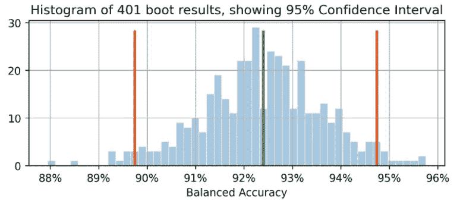
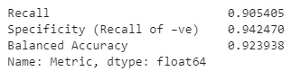
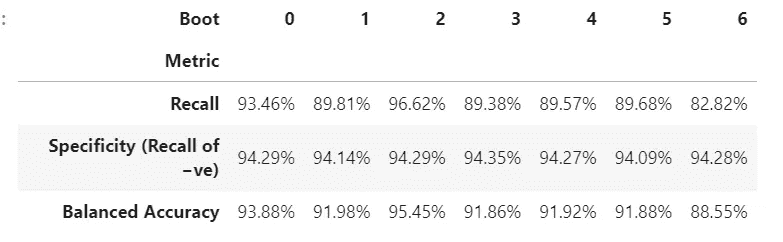
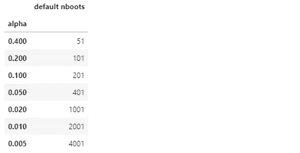
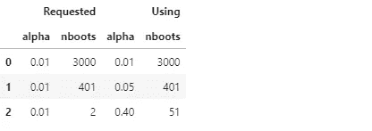
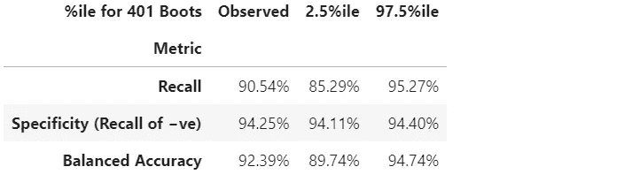
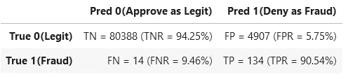

# 如何使用自动引导方法计算机器学习中性能指标的置信区间

> 原文：<https://towardsdatascience.com/get-confidence-intervals-for-any-model-performance-metrics-in-machine-learning-f9e72a3becb2?source=collection_archive---------6----------------------->

## [实践教程](https://towardsdatascience.com/tagged/hands-on-tutorials)

## 您的模型性能度量是因为“大”测试集而非常精确，还是因为“小”或不平衡的测试集而非常不确定？



橙色线显示 89.7%为平衡准确度置信区间的下限，绿色线表示原始观察到的平衡准确度=92.4%(点估计)，红色线表示上限为 94.7%。(此图及所有图片均由作者所有，除非另有说明。)

# 介绍

如果您报告您的分类器在测试集上的性能为准确率=94.8%，F1=92.3%，在不了解测试集的大小和组成的情况下，这没有多大意义。这些性能测量的误差幅度将根据测试集的大小而变化很大，或者，对于不平衡的数据集，主要取决于它包含多少个 *minority* 类的独立实例(来自过采样的相同实例的更多副本对此没有帮助)。

如果您能够收集另一个类似来源的独立测试集，您的模型在该数据集上的准确性和 F1 不太可能相同，但它们可能有多大的差异呢？与此类似的问题在统计学中被回答为测量的**置信区间**。

如果我们要从基础人群中抽取许多独立的样本数据集，那么对于这些数据集的 95%，该指标的真实基础人群值将在我们为该特定样本数据集计算的 95%置信区间内。

在本文中，我们将向您展示如何一次计算任意数量的机器学习性能指标的置信区间，使用 bootstrap 方法，*自动*确定默认情况下要生成多少引导样本数据集。

如果您只想了解如何调用此代码来计算置信区间，请跳到“**计算结果一节！**“下面下来。

# 自助方法

如果我们能够从数据的真实分布中提取额外的测试数据集，我们将能够看到跨这些数据集的感兴趣的性能指标的分布。(在绘制这些数据集时，我们不会做任何事情来防止多次绘制相同或相似的实例，尽管这种情况可能很少发生。)

既然我们不能这样做，那么下一个最好的办法就是从这个测试数据集的*经验分布*中提取额外的数据集，这意味着从它的实例中取样，替换，以生成新的引导样本数据集。替换采样意味着一旦我们绘制了一个特定的实例，我们就把它放回去，这样我们就可以为同一个样本数据集再次绘制它。因此，每个这样的数据集通常具有一些实例的多个副本，并且不包括基本测试集中的所有实例。

如果我们在没有替换的情况下对*进行采样，那么我们每次都会简单地得到原始数据集的相同副本，以不同的随机顺序进行洗牌，这将没有任何用处。*

用于估计置信区间的*百分点* bootstrap 方法如下:

1.  生成`*nboots*` “引导样本”数据集，每个数据集的大小与原始测试集相同。每个样本数据集都是通过从测试集中随机抽取实例并替换而获得的。
2.  在每个样本数据集上，计算指标并保存。
3.  95%的置信区间由指标的`*nboots*` 计算值中的第 2.5 个*至第 97.5 个*百分位给出。如果`*nboots*` =1001，并且您对长度为 1001 的序列/数组/列表 *X* 中的值进行排序，则第 0 *个*百分位是 *X* [0】，第 100 个*个*百分位是 *X* [1000】，因此置信区间将由 *X* [25】到*X*[970]给出**

当然，您可以在步骤 2 中为每个样本数据集计算尽可能多的指标，但是在步骤 3 中，您将分别找到每个指标的百分位数。

# 数据集和置信区间结果示例

我们将使用上一篇文章中的结果作为例子: [**如何处理不平衡的分类，而不重新平衡数据** : *在考虑对倾斜的数据进行过采样之前，尝试调整分类决策阈值*](https://www.kdnuggets.com/2021/09/imbalanced-classification-without-re-balancing-data.html) *。*

在那篇文章中，我们使用了*高度*-不平衡两类 Kaggle [信用卡欺诈识别数据集](https://www.kaggle.com/mlg-ulb/creditcardfraud)。我们选择使用一个与默认的 0.5 阈值完全不同的分类阈值，默认的 0.5 阈值隐含在使用 predict()方法中，使得没有必要平衡数据。这种方法有时被称为*阈值移动*，其中我们的分类器通过将选择的阈值应用于由 predict **_proba** ()方法提供的预测类概率来分配类。

我们将把本文(和代码)的范围限制在二进制分类:类 0 和 1，按照惯例，类 1 是“正”类，特别是不平衡数据的少数类，尽管代码也应该适用于回归(单个连续目标)。

# 生成一个引导样本数据集

虽然我们的置信区间代码可以处理传递给度量函数的各种数量的数据参数，但我们将专注于 sklearn 风格的度量，它总是接受两个数据参数 y_true 和 y_pred，其中 y_pred 将是二进制类预测(0 或 1)，或者是连续的类概率或决策函数预测，如果 y_true 也是连续的，甚至是连续的回归预测。以下函数生成单个引导示例数据集。它接受任何 data_args，但是在我们的例子中，这些参数将是`ytest`(我们在之前的文章中的[实际/真实测试集目标值)和`hardpredtst_tuned_thresh`(预测类)。两者都包含 0 和 1，以指示每个实例的真实或预测类。](https://www.kdnuggets.com/2021/09/imbalanced-classification-without-re-balancing-data.html)

# 自定义指标 specificity_score()和效用函数

我们将为特异性定义一个定制的度量函数，这只是召回*负*类(类 0)的另一个名称。还有一个 calc_metrics 函数，它将一系列感兴趣的指标应用于我们的数据，还有几个实用函数:

在这里，我们列出了度量标准，并将它们应用于数据。我们不认为准确性是一个相关指标，因为假阴性(将真实的欺诈错误分类为合法)比假阳性(将真实的合法错误分类为欺诈)对业务的成本高得多，而准确性认为两种类型的错误分类都是不好的，因此有利于正确分类那些真实类别为多数类别的人，因为这些发生得更频繁，因此对整体准确性的贡献更大。

```
met=[ metrics.recall_score, specificity_score, 
      metrics.balanced_accuracy_score
    ]
calc_metrics(met, ytest, hardpredtst_tuned_thresh)
```



# 制作每个启动样本数据集并计算其指标

在 raw_metric_samples()中，我们实际上将逐个生成多个样本数据集，并保存每个数据集的指标:

您给 raw_metric_samples()一个感兴趣的指标(或仅一个指标)列表以及真实和预测的类数据，它获取 nboots 样本数据集并返回一个 dataframe，其中仅包含从每个数据集计算的指标值。通过 _boot_generator()，它在生成器表达式中一次调用一个 _boot()，而不是一次将所有数据集存储为一个潜在的巨大的列表。

# 查看 7 个启动示例数据集的指标

我们列出度量函数并调用 raw_metric_samples()来获得 7 个样本数据集的结果。为了便于理解，我们在这里调用 raw_metric_samples()，这对于使用下面的 ci_auto()获得置信区间是不必要的，尽管为 ci_auto() *指定一个度量列表(或仅仅一个度量)是必要的*。

```
np.random.seed(13)
raw_metric_samples(met, ytest, hardpredtst_tuned_thresh, 
          nboots=7).style.format('{:.2%}')  #optional #style
```



上面的每一列都包含从一个引导样本数据集(编号为 0 到 6)计算的指标，因此计算出的指标值会因随机采样而有所不同。

# 启动数据集的数量，带有计算的默认值

在我们的实现中，默认情况下，引导数据集的数量`nboots`将从期望的置信水平(例如 95%)自动计算，以便满足由 [North、Curtis 和 Sham](http://www.google.com/search?q=Am+J+Hum+Genet.+2002+Aug%3B+71%282%29%3A+439%E2%80%93441.+doi%3A+10.1086%2F341527+A+Note+on+the+Calculation+of+Empirical+P+Values+from+Monte+Carlo+Procedures+B.+V.+North+D.+Curtis+P.+C.+Sham&btnI) 提出的在分布的每个尾部具有最小数量的引导结果的建议。(实际上，该建议适用于*p*-值，因此假设检验*接受区域*，但是*置信区间*与那些将此作为经验法则的区间足够相似。)虽然那些作者推荐尾部最少 10 个引导结果，[*Davidson&MacKinnon*](http://hdl.handle.net/10419/67820)推荐 95%置信度下最少 399 个引导，这需要尾部 11 个引导，所以我们用这个更保守的推荐。

我们指定α为 1**置信水平。例如 95%的置信度变成 0.95，α= 0.05。如果您指定了一个明确的启动次数(也许是一个较小的`nboots`,因为您想要更快的结果),但这对于您所请求的 alpha 来说是不够的，那么将会自动选择一个更高的 alpha，以便获得该启动次数的准确置信区间。将使用最少 51 个 boots，因为任何更少的 boots 都只能精确地计算非常小的置信水平(例如 40%的置信度，给出了从第 30 个*百分点到第 70 个*百分点的区间，其中 40%在区间内，60%在区间外)，并且不清楚最小 boots 建议是否考虑了这种情况。****

**函数 get_alpha_nboots()设置缺省的 nboots，或者根据上述内容修改所请求的 alpha 和 nboots:**

**让我们展示不同 alpha 值的默认 nboots:**

```
g = get_alpha_nboots 
pd.DataFrame( [ g(0.40), g(0.20, None), g(0.10), g(), g(alpha=0.02), 
                g(alpha=0.01, nboots=None), g(0.005, nboots=None)
              ], columns=['alpha', 'default nboots']
            ).set_index('alpha')
```

****

**如果我们请求显式 nboots，会发生以下情况:**

```
req=[(0.01,3000), (0.01,401), (0.01,2)]
out=[get_alpha_nboots(*args) for args in req]
mydf = lambda x: pd.DataFrame(x, columns=['alpha', 'nboots'])
pd.concat([mydf(req),mydf(out)],axis=1, keys=('Requested','Using'))
```

****

**较小的 nboots 值将 alpha 增加到 0.05 和 0.40，nboots=2 被更改为最小值 51。**

# **bootstrap 样本数据集的直方图显示了平衡精度的置信区间**

**同样，我们不需要通过调用 ci_auto()来获得下面的置信区间。**

```
np.random.seed(13)
metric_boot_histogram\
  (metrics.balanced_accuracy_score, ytest, hardpredtst_tuned_thresh)
```

****

**橙色线显示 89.7%为平衡准确度置信区间的下限，绿色线表示原始观察到的平衡准确度=92.4%(点估计)，红色线表示上限为 94.7%。(同样的图片出现在本文的顶部。)**

# **如何计算度量列表的所有置信区间**

**下面是调用上述内容的主函数，它根据度量结果的百分位数计算置信区间，并将点估计值作为结果输出数据帧的第一列插入。**

# **计算结果！**

**这就是我们真正需要做的:调用 ci_auto()，如下所示，使用一个度量列表(`met`在上面赋值)来获得它们的置信区间。百分比格式是可选的:**

```
np.random.seed(13)
ci_auto( met, ytest, hardpredtst_tuned_thresh
       ).style.format('{:.2%}')
```

****

# **对结果置信区间的讨论**

**下面是来自[原文](https://www.kdnuggets.com/2021/09/imbalanced-classification-without-re-balancing-data.html)的混淆矩阵。类别 0 是阴性(多数类别),类别 1 是阳性(极少数类别)**

****

**134/(134+14)的召回率(真阳性率)具有最宽的置信区间，因为这是涉及少量计数的二项式比例。**

**特异性(真阴性率)为 80，388/(80，388+4，907)，涉及*多*大的计数，因此其置信区间极窄，仅为【94.11%至 94.40%】。**

**由于平衡的准确性是简单地计算召回率和特异性的平均值，其置信区间的宽度介于两者之间。**

# **由于测试数据的变化和训练数据的变化导致的度量测量不精确**

**这里，我们没有考虑基于我们的*训练*数据的随机性的*模型*中的可变性(尽管这对于某些目的也是有意义的，例如，如果你已经自动重复重新训练，并且想要知道未来模型的性能可能变化多少)，而是仅仅考虑由于我们的*测试*数据的随机性而导致的这个*特定*模型(从一些特定训练数据创建)的性能测量中的可变性。**

**如果我们有足够的独立测试数据，我们可以非常精确地测量这个特定模型在底层人群中的性能，并且我们将知道如果部署这个模型，它将如何执行，而不管我们如何构建该模型，以及我们是否可以通过不同的训练样本数据集获得更好或更差的模型。**

# **单个实例的独立性**

**bootstrap 方法假设您的每个实例(案例、观察结果)都是从基础总体中独立抽取的。如果您的测试集包含多组彼此不独立的行，例如，对同一实体的重复观察可能彼此相关，或者从测试集中的其他实例中过度采样/复制/生成实例，则结果可能无效。您可能需要使用*分组*采样，在这种情况下，您随机地将整个组集合在一起，而不是单独的行，同时避免分解任何组或只使用其中的一部分。**

**此外，您还希望确保没有跨训练集和测试集拆分的组，因为这样测试集不一定是独立的，您可能会发现未被发现的过度拟合。例如，如果您使用过采样，您通常应该只在从测试集中分离出来之后进行**，而不是之前。通常情况下，您会对训练集而不是测试集进行过采样，因为测试集必须能够代表模型在未来部署时将看到的实例。对于交叉验证，您可能希望使用 scikit-learn 的`model_selection.GroupKFold()`。****

# **结论**

**您总是可以为您的评估度量计算置信区间，以查看您的测试数据使您能够多精确地测量您的模型的性能。我计划撰写另一篇文章来展示评估概率预测(或置信度得分——与统计置信度无关)的指标的置信区间，即软分类，如 Log Loss 或 ROC AUC，而不是我们在此使用的评估模型对类别的离散选择的指标(硬分类)。同样的代码适用于这两种情况，也适用于回归(预测一个连续的目标变量)——您只需要传递给它一个不同类型的预测(在回归的情况下，传递给它不同类型的真实目标)。**

***这款 jupyter 笔记本在 github 有:*[*bootconfintautov 1 o _ standalone . ipynb*](https://github.com/DavidRosen/conf-intervals-auto/blob/main/bootConfIntAutoV1o_standalone.ipynb)**

**这篇文章信息丰富和/或有用吗？请张贴回复(语音气泡图标在左下方，黑/白旁边👏如果您对本文或置信区间、引导、引导数、实施、数据集、模型、阈值移动或结果有任何意见或问题。**

**除了前面提到的[前一篇文章](/how-to-deal-with-imbalanced-classification-without-re-balancing-the-data-8a3c02353fe3)之外，您可能还对我的 [**感兴趣，如何在 Pandas**](/auto-detect-and-set-the-date-datetime-datatypes-when-reading-csv-into-pandas-261746095361) 中读取 CSV 文件时自动检测日期/日期时间列并设置它们的数据类型，尽管它与本文没有直接关系。**