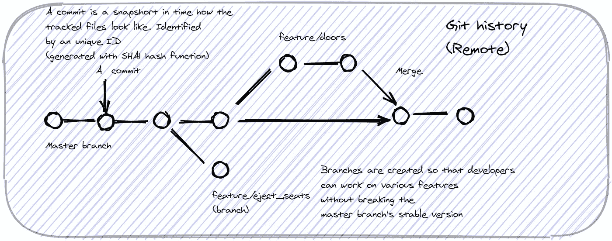
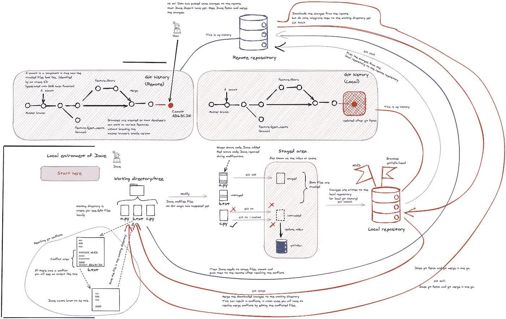

# get-Git:Git 入门

> 原文：<https://towardsdatascience.com/get-git-a-primer-on-git-aa2cd1d9436f?source=collection_archive---------25----------------------->

## 说得足够快，听起来就像明白了…

图片来自 [Pixabay](https://pixabay.com/?utm_source=link-attribution&utm_medium=referral&utm_campaign=image&utm_content=1209834) 的[免费照片](https://pixabay.com/photos/?utm_source=link-attribution&utm_medium=referral&utm_campaign=image&utm_content=1209834)

多年来，它一直津津乐道于自己作为合作典范的地位。作为一名开发人员，我每天都与 Git 打交道；当事情出错时，犯错误、推遥控器和偶尔扯头发(解释了我的脱发)。最近在思考“Git 实际上是如何工作的？”，我意识到我对这种根深蒂固的软件开发方式知之甚少。不言而喻，如果我知道支配 Git 的结构/功能，那么让我猜测几个小时的许多错误有时是可以避免的。

Git 是软件开发项目的重要组成部分。它提供了，

*   **跟踪** — Git 维护一个历史记录，它本质上是你的代码库随时间变化的快照
*   **特性隔离**——当你开发特性时，你创建了你自己的分支——你没有破坏工作/稳定版本
*   **协作**——现在，任何数量的开发人员都可以开发不同的功能，开发他们的本地副本，准备好了就推送到一个中央远程存储库
*   同行评审 — Git 有助于同行评审，当开发人员 A 完成特性 X 后，在将它合并到主分支之前，他可以要求开发人员 B 评审它(以拉请求的形式)

在本文中，您将了解到，

*   几个方便的 Git 命令，比如，`git add`，`git commit`，`git push`，`git fetch`，`git merge`，`git pull`，`git checkout`，`git reset`。
*   运行这些命令时，您的代码会经历不同的阶段，如工作目录、索引、本地存储库和远程存储库。

最近我在 [LinkedIN](https://www.linkedin.com/in/thushanganegedara/) 上分享了这个工作流程

我不觉得浏览 Git 文档的数百页并被来自四面八方的术语轰炸有什么意思。因此，我创建了一个可视化 Git 备忘单，并在 LinkedIN 上分享。我看到这个 [LinkedIn 帖子](https://www.linkedin.com/feed/update/urn:li:activity:6769589456040275968/)引起了很多人的兴趣。所以让这成为我在那篇文章中想要传达的更详细的论述。

# 在您当地的街区游览…

> 这一切都是从一串位开始的…

是的，但我们不会从那里开始。我们将从您在本地创建的代码存储库开始。现在，这可以使用`git init`在我们的本地环境中创建，或者使用`git clone <url to git repo>` 从远程存储库中克隆。

要了解这些概念，请见见戴夫！Dave 和其他开发人员一样，和你我一样讨厌上午 9 点的会议。他创建了一个代码目录(我们姑且称之为`code`)，其中有三个文件`a.py`、`b.txt`和`c.py`。

> 本地代码库称为工作树或 ***工作目录***

Dave 理解 Git 的价值，然后运行`git init`。这将为代码库创建一个本地 Git 存储库。您可以在`code`文件夹中创建的`.git`文件夹中看到这个存储库的组成。通过跟踪 Git 存储库中的代码，他知道何时何地引入了各种变更。

首先，Dave 希望将三个文件`a.py`、`b.txt`和`c.py`添加到他的本地存储库中。这是一个双重过程。他首先呼叫`git add a.py b.txt c.py`。这会将这些文件添加到索引(或索引树/缓存/暂存区)中。这是当前代码和本地存储库中的代码之间的过渡空间。换句话说，您的代码还没有被存储库跟踪。把这里想象成剧院的后台。你可以随心所欲地修改(演员、道具、剧本等)。)后台，上台前。

> 索引是一个空间，您可以在这里准备/存放您需要提交到本地存储库的内容。

一旦您对阶段化的更改感到满意，您就可以通过调用`git commit -m <message>`将文件提交到您的存储库中。这将在存储库中记录您当前工作目录的*快照*(更确切地说是*跟踪的*文件的快照)。

> 提交后，代码的当前版本将作为带有时间戳和 ID 的快照记录在本地存储库中

git 添加和 git 提交的效果

在提交期间，您可以使用`git status`来查看文件的状态。它将显示已转移、已跟踪但未转移和未跟踪的文件。

太好了，我们完成了第一次提交。但我们才刚刚开始开心起来。假设戴夫对`a.py`和`b.txt`做了一些改动。然后戴夫决定他只想将`a.py`添加到索引中，而不是`b.txt`(即执行`git add a.py`)。这意味着工作目录中的新版本`b.txt`将不会成为索引的一部分。换句话说，在这一轮中，`a.py`被跟踪/索引并登台用于提交，`b.txt`被跟踪但不登台用于提交。

此外，Dave 认为，`c.py`不是很有用，并决定从索引中删除该文件。他可以通过调用`git rm c.py`或`git rm --cached c.py`来做到这一点。两者的区别在于`git rm --cached c.py`从索引中只移除了文件**和**(并保留了物理副本)。

指数如何变化取决于你做了什么

# Git 什么都看得到…

Dave 完成了两次提交，它们被记录在本地存储库中。正如我前面提到的，git 的优势之一是能够跟踪随时间的变化。这意味着本地存储库维护一个历史。历史如下所示。

我们所做的每一次提交都被记录为历史中的单个节点。每个提交都由一个哈希函数生成的唯一 ID 来区分(这是一个字母数字 ID，看起来像`47970bc91aa7daec9def3...`)。你从一个单独的分支(`master`)开始，随着你开发新的特性，你分叉并创建分支。例如，如果你正在制造一辆汽车，你会有一个名为`feature/eject_seats`的分支。但是，一旦你意识到弹射座椅是一个坏主意，你可能会放弃那个分支，回到主分支。然后你开发`feature/doors`，一旦特性完成并被测试，你将特性合并到主分支。

# 从本地到远程…

Dave 非常了解如何维护自己的本地存储库。但是 Git 是关于协作的。Dave 需要与团队的其他成员共享代码库，以及它随时间的变化。为此，您通常需要维护一个中央远程存储库。您可以让 Git 知道远程存储库，

`git remote add origin https://github.com/smart-vroom/*car*.git`

然后，Dave 将本地存储库中的更改推送到远程存储库中。假设戴夫正在处理默认分支(`master`)，然后戴夫打电话给`git push origin master`。这将把本地存储库中的更改推送到远程存储库中。现在任何开发人员都可以看到 Dave 引入的变化。

图:Git push 将提交给本地存储库的更改推送到远程存储库。本地回购和远程回购有各自的历史

> 远程存储库是一个中央在线存储库，可供多个合作者查看。远程存储库和本地存储库一样有一个历史记录

# 约翰是个糟糕的开发人员…

戴夫是团队的一员。换句话说，戴夫对代码有贡献，约翰、安娜和蒂姆也是。开发人员越多，维护远程代码库的问题就越多。例如，约翰没有告诉戴夫，约翰也在为`master`分公司工作，并承诺为`master`工作，就在戴夫告诉他之前。现在戴夫无法推进远程回购。因为他没有最新版本。Dave 必须回去更新他的本地存储库和工作目录，并解决由于 John 的更新而发生的任何冲突。别担心，Git 也有答案。

现在戴夫将经历三件事

*   戴夫试图`push`，但是出错了，因为他的本地回购没有约翰提交的更新
*   Dave 需要更新本地存储库以与远程 repo 同步(`git fetch`)(如下图中橙色所示)
*   Dave 需要将本地 repo 中的更新更改集成到工作目录中。如果 John 编辑了 Dave 编辑过的文件，这可能会导致合并冲突(`git merge`)
*   Dave 需要通过手动编辑冲突的文件(下图中以蓝色显示)来解决冲突，这将在下面进一步讨论。
*   Dave 转移文件、提交文件并将它们推送到远程位置(下图中以蓝色显示)

解决 Git 冲突

还可以看到一个名为 git pull 的命令。它只是一气呵成地执行`git fetch`和`git merge`。这意味着`git pull`是入侵性的，会修改你的工作目录

> git pull = git fetch + git 合并

第三步中发生的事情在图的左边用灰色圈了出来。当您键入`git merge`时，如果 John 编辑了一个 Dave 也编辑过的文件，很可能会导致*合并冲突*。假设约翰和戴夫都编辑过`b.txt`。现在`b.txt`有一场冲突需要解决。合并冲突后，冲突的文件看起来像来自另一个世界。

冲突后文件的外观

好吧，人们放下你们的喷火器，这很正常。它只是说`<<<<<<<HEAD`和`======`之间的部分是你在本地回购中拥有的。但是远程回购具有`=======`和`>>>>>>> AB123CDE` 之间的部分(在文件的那些行中)。这里的`AB123CDE`是最新的提交 ID。现在戴夫有三个选择:

*   挑选约翰的更新(只保留`yyyy`)
*   保留您的更新(仅保留`xxxx`)
*   将两者结合起来

取决于戴夫需要什么。但是最后，它必须产生一个有效的文件，没有合并冲突带来的语法上的麻烦。解决冲突后，您可以转移文件，提交它们并将它们推送到远程存储库。唷！好险。希望约翰将来能更多地谈论他的作品！

# 汽车越来越智能

戴夫的老板想让他开发一个重要的功能(`feature/self_drive`)，并解释了一切。几个不眠之夜的想法对戴夫来说变得很明显，因为这是一件大事。戴夫也需要一个单独的分支来处理这个功能。因为汽车没有`self_drive`依然可以放行。

为此，Dave 用`git checkout -b feature/self_drive`创建了一个新分支(`-b`告诉 Git 这是一个新分支)。如果分支已经存在，可以做`git checkout feature/self_drive`。分支是 git 历史中采用自己路径的提交流。它从一个现有的分支(比如主分支)中分支出来，您可以向它添加一系列提交，而不会影响父分支。然后，一旦您实现了该特性并对其进行了测试，您就可以将它合并回父特性(可以选择解决冲突)。

在 Git 中，分支在回购中维护。你可以通过进入`.git/refs/head`目录来查看你去的所有分支。每个分支都有一个文件，只记录该分支的最新提交。

一旦您的本地开发在`feature/self_drive`分支上准备就绪，您就可以使用`git push origin feature/self_drive`提交远程回购。这将在远程回购中创建一个新分支(如果尚不存在)。

# 戴夫犯了一个错误…

戴夫回到了`master`分部，他一直在研究`a.py`上的几个 bug。但是，他掉进了兔子洞，再也出不来了。“让[沉没成本谬误](https://www.behavioraleconomics.com/resources/mini-encyclopedia-of-be/sunk-cost-fallacy/)见鬼去吧”，他想，“我要用我在回购中最后一次提交的文件来重置我的工作目录”。

戴夫需要做的就是，跑`git checkout master -- a.py`。它将使用本地 repo 中的快照`a.py`恢复工作目录中的`a.py`。如果你认为还有更高版本的`a.py`，你可以先做一个`git fetch`，然后再做`checkout`。

# 用这些动作打动你的同事

也可以使用`git checkout`在分支之间移动。简单说`git checkout feature/eject_seats`或者`git checkout feature/self_drive`。您也可以使用`git checkout <commit ID>`(例如`git checkout 47970bc91a`)来检查特定的提交。

> 如果你用`git checkout`指定一个提交，这意味着你的头和分支引用是不一样的，指向两个东西。这就是所谓的分离头。

另一个有用的命令是`git reset`。git 复位有三种模式；

*   `--soft` —影响本地回购(如果您的头处于分离模式，这很有用)
*   `--mixed` —影响本地回购和指数
*   `--hard` —影响所有本地回购、指数和工作树

比方说，Dave 需要重置索引/暂存区域，以删除他已经暂存的一些更改，但不更改工作目录。他可以用`git reset --mixed HEAD`做到这一点。这里的`HEAD`指的是你对回购的最新承诺。

这里有一些其他的命令会派上用场

*   `git stash` —如果你想在工作树中暂时保存你的更新
*   `git diff` —给出两个文件的区别(如工作树与索引)
*   `git rebase` —如果您想要将您的分支的开始更新为您分支后发生的稍后提交，这是要使用的命令
*   `git reflog` —显示存储库的历史记录

# 结论

让我们回顾一下我们所学的内容。我们了解到，

*   为什么 Git 很重要
*   工作目录、索引、本地存储库和远程存储库之间的区别
*   基本命令如`git add`、`git commit`、`git push`
*   解决合并冲突`git fetch`，`git merge`
*   Git 分支及其用途
*   `git checkout`和`git reset`改正错误

我希望，如果你阅读了这篇文章，你会发现阅读关于 Git 如何工作的 Git 文档(例如 [Git-scm](https://git-scm.com/doc) )更加容易。

如果你喜欢我分享的关于数据科学和机器学习的故事，考虑成为会员吧！

<https://thushv89.medium.com/membership> 