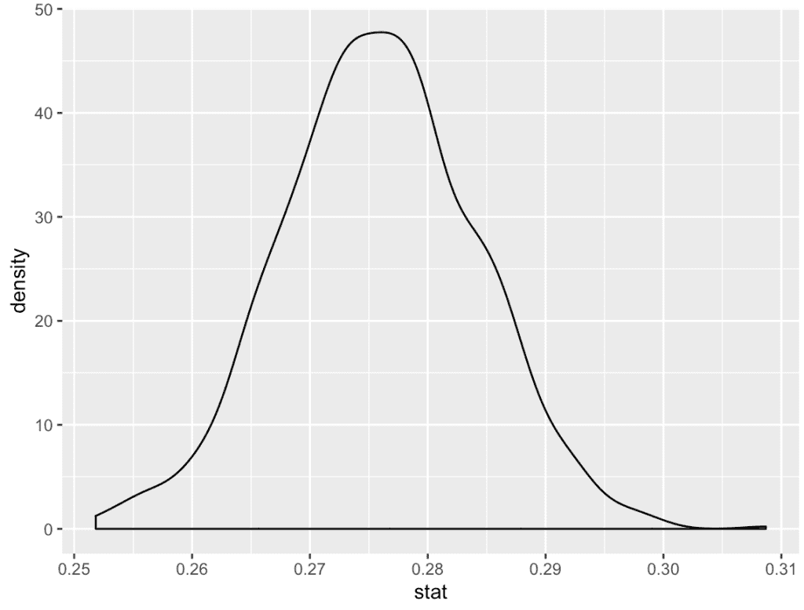

# 在您的置信区间中获得更大的信心

> 原文：<https://towardsdatascience.com/get-greater-confidence-in-your-confidence-intervals-86b408b2f13f?source=collection_archive---------48----------------------->

## 什么是引导复制以及如何使用它？


彼得·H 论 Pixabay.com

# 什么是引导复制？

对于这里的读者来说，bootstrap 采样指的是对给定数据集进行“替换”采样的过程……这是大多数人容易迷失的地方。你取许多样本，建立一个分布来标记你的置信区间。

让我们举一个简单的例子。

# 大学时代的密码

比方说，你想了解大学里的普通人对加密货币的看法；嗯，你可能无法收集到学校里每个人的回应；可能会发生的是，你会分发一些调查，然后你会得到一些回复，你希望这些回复能代表大众的意见，好的或坏的。

虽然您对回答者的分布有一个清晰的概念，但您希望生成一个更能代表整个学校的实际置信区间。这就是 boostrap 复制的用武之地！

# 补替抽样法

到目前为止，我们知道自举复制是一种抽样方法。这里的主要思想是，当一个样本被选择时，它可以被反复选择。这用于重新创建可能实际上是由于随机机会的应答类型的随机重现。

每个引导样本被称为一个复制。在这种情况下，我们假设复制 1000 次。

一旦我们有了 1000 个重复或样本，我们现在就有了 1000 个样本平均值。

从这个分布中，我们可以得到实际的置信区间。

假设我们想要 95%的置信区间；我们将通过查看我们的 bootstrap 分布，并将 2.5 的值和 97.5 的值作为我们的区间来得到这个结果。

# 我们来看一些代码！

```
library(infer) 
replicates <- crypto_opinions %>% 
    specify(response = opinion, success = "positive") %>% 
    generate(reps = 1, type = "bootstrap")replicates %>% 
    summarize(prop_high = mean(response == 'positive')) %>% 
    pull()
```

我们使用`specify`来隔离我们关心的响应变量以及变量值决定‘成功’的因素。从那里，我们使用`generate`来创建我们的第一个引导复制。您还会注意到我们将`type`指定为`bootstrap`。然后，我们使用汇总和拉取来生成指定级别“正”的比例。

```
replicates <- crypto_opinions %>% 
    specify(response = opinion, success = "positive") %>%        generate(reps = 1000, type = "bootstrap")%>% calculate(stat = "prop")
```

类似于前面的代码块，我们已经将重复次数扩展到了 1000 次，现在正在链接`calculate`函数。`calculate`函数为对应于该复制的每个复制“stat”创建一个带有一个记录的数据帧。

```
ggplot(replicates, aes(stat)) +
   geom_density()
```



上图显示了每次重复的平均结果的密度图或分布。

从这里开始，它只是一个简单的计算问题，标准偏差，并使用它来确定你的范围的顶部和底部！

```
Lower_bound <- mean(replicates$stat) - sd(replicates$stat) * 2 upper_bound <- mean(replicates$stat) + sd(replicates$stat) * 2
```

# 结论

我希望你喜欢这篇文章，它能为你节省一些时间！请分享什么有用，什么没用！

请随意查看我在 datasciencelessons.com 的其他帖子

祝数据科学快乐！