# 直接和熊猫获取互动剧情。

> 原文：<https://towardsdatascience.com/get-interactive-plots-directly-with-pandas-13a311ebf426?source=collection_archive---------1----------------------->

## [实践教程](https://towardsdatascience.com/tagged/hands-on-tutorials)

## 使用 Pandas 绘图语法直接创建 Plotly 和 Bokeh 绘图的教程

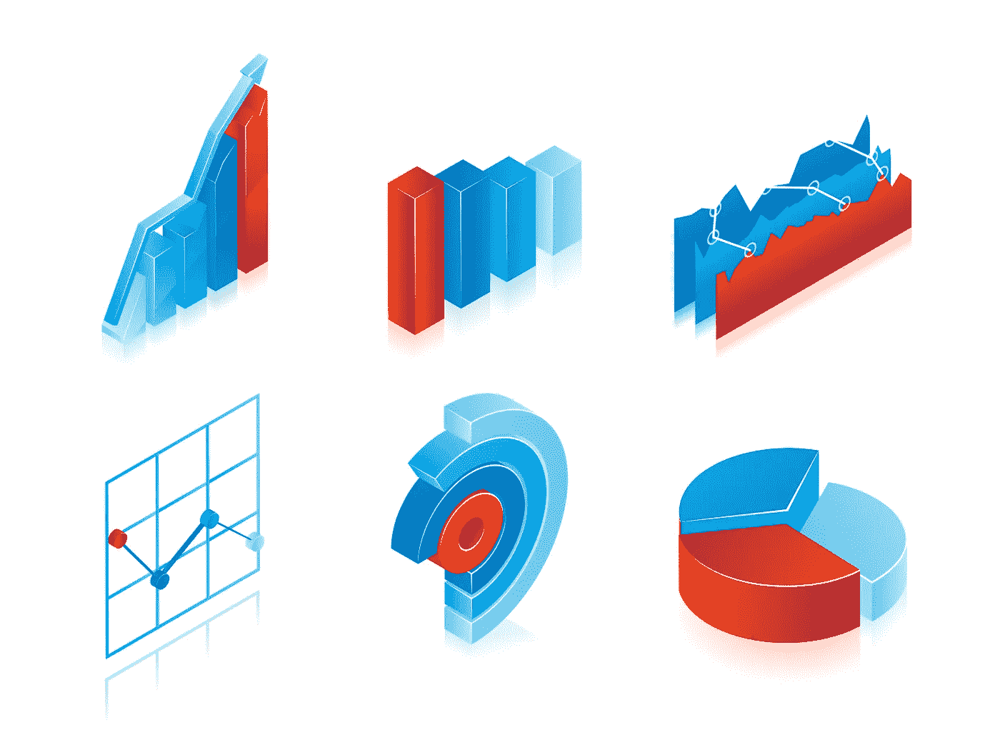

【www.freepik.com 宏矢量制作的 T2 信息图矢量

到目前为止，数据探索是任何数据分析任务中最重要的方面之一。我们使用大量可视化工具执行的初始探测和初步检查，为我们提供了对数据本质的可操作的见解。然而，可视化工具的选择有时比任务本身更复杂。一方面，我们有更容易使用的库，但在显示数据中的复杂关系时却不是很有帮助。此外，还有一些提供交互性，但需要相当长的学习曲线。幸运的是，已经创建了一些开源库，试图有效地解决这一难题。

在本文中，我们将研究两个这样的库，即 pandas_bokeh 和 cufflinks。我们将学习如何用基本的熊猫绘图语法创建 plotly 和 bokeh 图表，我们都很熟悉。由于本文的重点是语法而不是图表类型，我们将把自己限制在五种基本图表上，即折线图、条形图、直方图、散点图和饼图。我们将首先用 pandas 绘图库创建这些图表，然后用 plotly 和 bokeh 重新创建它们，尽管有些扭曲。

# 目录

*   导入数据集
*   直接和熊猫密谋
*   熊猫的后端——和**一起策划。**
*   为熊猫绘制后端——用**袖扣绘制**
*   结论

# 资料组

我们将使用 **NIFTY-50 数据集**。NIFTY 50 指数是印度股票市场的基准。数据集在 [Kaggle](https://www.kaggle.com/sudalairajkumar/nifty-indices-dataset) 上公开提供，但我们将使用仅包含四个行业股票价值的数据子集，即银行、制药、IT 和快速消费品。

> 你可以从[这里](https://github.com/parulnith/Data-Science-Articles/tree/main/Get%20Interactive%20plots%20directly%20with%C2%A0pandas.)下载样本数据集。

让我们导入可视化所需的必要库和数据集:

```
# Importing required modules
import pandas as pd
import numpy as np
import matplotlib.pyplot as plt
%matplotlib inline# Reading in the data
nifty_data = pd.read_csv('NIFTY_data_2020.csv',parse_dates=["Date"],index_col='Date')
nifty_data.head()
```

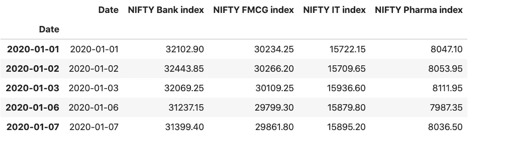

由银行、制药、IT 和快速消费品行业的漂亮指数组成的组合数据框架

我们还可以在月底之前对数据进行重新取样/汇总。熊猫图书馆有一个`[resample()](https://pandas.pydata.org/docs/reference/api/pandas.Series.resample.html)`功能，可以对时间序列数据进行重新采样。

```
nifty_data_resample = nifty_data.resample(rule = 'M').mean()
nifty_data_resample
```


现在我们已经准备好了数据框架，是时候通过不同的图来可视化它们了。

# 直接和熊猫密谋

让我们从最简单的绘图技术开始——熊猫的[绘图功能](https://pandas.pydata.org/pandas-docs/stable/user_guide/visualization.html#plotting-tools)。为了使用 pandas 绘制一个图形，我们将在 dataframe 上调用`.plot()`方法。

**语法** : `dataframe.plot()`

`plot`方法只是 matplotlib 的`[**plt.plot()**](https://matplotlib.org/api/_as_gen/matplotlib.axes.Axes.plot.html#matplotlib.axes.Axes.plot)**.**` 的简单包装，我们还可以指定一些附加参数，如下所述:

```
Some of the important Parameters
--------------------------------

**x** : label or position, default None
    Only used if data is a DataFrame.
**y** : label, position or list of label, positions, default None**title**: title to be used for the plot**X and y label:** Name to use for the label on the x-axis and y-axis.**figsize** : specifies the size of the figure object.    
**kind** : str
    The kind of plot to produce:

    - 'line' : line plot (default)
    - 'bar' : vertical bar plot
    - 'barh' : horizontal bar plot
    - 'hist' : histogram
    - 'box' : boxplot
    - 'kde' : Kernel Density Estimation plot
    - 'density' : same as 'kde'
    - 'area' : area plot
    - 'pie' : pie plot
    - 'scatter' : scatter plot
    - 'hexbin' : hexbin plot.
```

有关参数及其用法的完整列表，请参考[文档](https://pandas.pydata.org/pandas-docs/stable/user_guide/visualization.html#basic-plotting-plot)。现在让我们看看创造不同情节的方法。在本文中，我们不会详细解释每个情节。我们将只关注语法，如果你有一些熊猫的经验，这是不言自明的。要详细了解熊猫的故事情节，下面的文章将会很有帮助:

[](https://neptune.ai/blog/pandas-plot-deep-dive-into-plotting-directly-with-pandas) [## 熊猫情节:深入到直接与熊猫密谋

在本文中，我们将了解如何使用 pandas 来探索和可视化您的数据，然后我们将更深入地研究 pandas 的一些高级可视化功能。](https://neptune.ai/blog/pandas-plot-deep-dive-into-plotting-directly-with-pandas) 

## 1.线形图

```
nifty_data.plot(title='Nifty Index values in 2020', 
                xlabel = 'Values',
                figsize=(10,6);
```

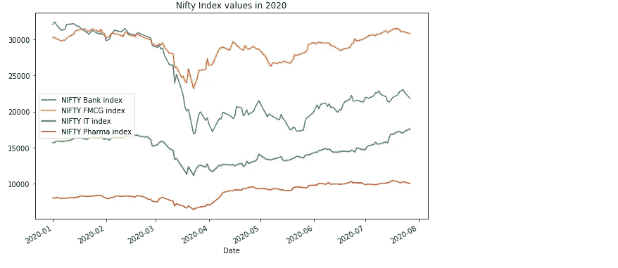

熊猫绘图的线图

## 2.散点图

```
nifty_data.plot(kind='scatter',
        x='NIFTY FMCG index', 
        y='NIFTY Bank index',
        title = 'Scatter Plot for NIFTY Index values in 2020',
        figsize=(10,6));
```

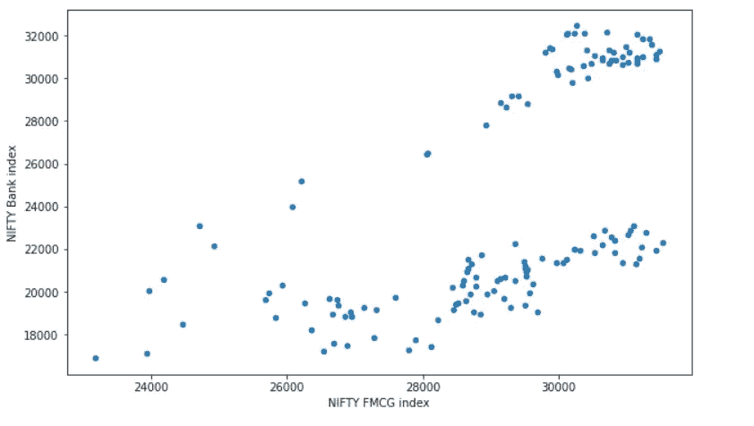

熊猫散点图

## 3.直方图

```
nifty_data[['NIFTY FMCG index','NIFTY Bank index']].plot(kind='hist',figsize=(9,6), bins=30);
```

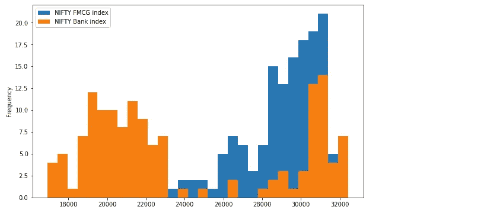

熊猫柱状图

## 4.条形图

```
nifty_data_resample.plot(kind='bar',figsize=(10,6)); 
```

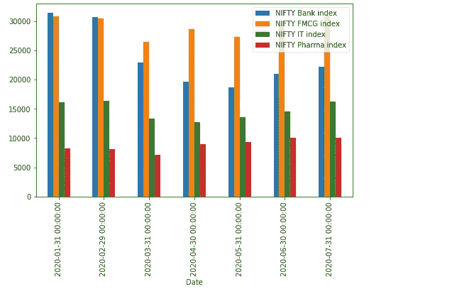

带熊猫图案的条形图

*   **4.1 堆积条形图**

```
nifty_data_resample.plot(kind='barh',figsize=(10,6));
```

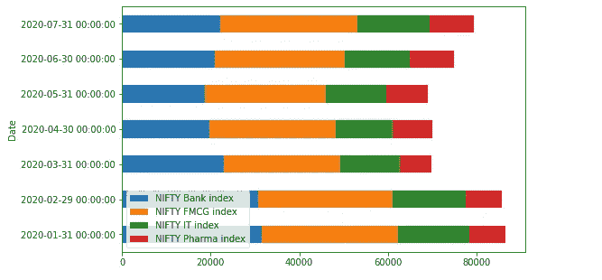

带熊猫图的堆积条形图

## 5.饼图

```
nifty_data_resample.index=['Jan','Feb','March','Apr','May','June','July']
nifty_data_resample['NIFTY Bank index'].plot.pie(legend=False, figsize=(10,6),autopct='%.1f');
```

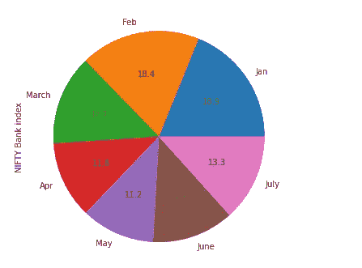

带有熊猫图案的饼图

这些是一些可以用熊猫的数据框直接创建的图表。然而，这些图表缺乏交互性和缩放、平移等功能。现在，让我们将这些现有图表的语法更改为完全交互式的图表，只需在语法上稍作修改。

# 熊猫后端-用熊猫绘图。

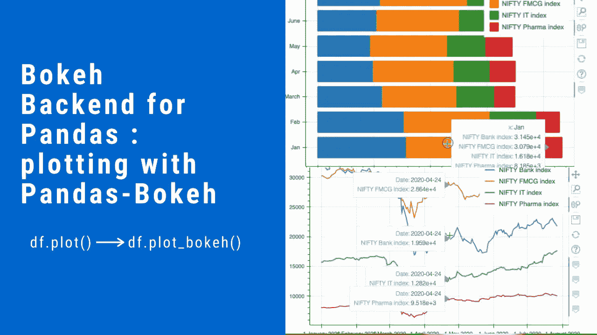

作者图片

在数据可视化方面，[散景](https://docs.bokeh.org/en/latest/)库显然脱颖而出*。**[Pandas-Bokeh](https://github.com/PatrikHlobil/Pandas-Bokeh)为 [Pandas](https://pandas.pydata.org/) 、 [GeoPandas](http://geopandas.org/) 和 [Pyspark](https://spark.apache.org/docs/latest/api/python/index.html) DataFrames 提供了一个 Bokeh 绘图后端。这个后端向数据帧和系列添加了一个`plot_bokeh()`方法。*

## *装置*

*Pandas-Bokeh 可以通过 *pip 或 conda* 从 [PyPI](https://pypi.org/project/pandas-bokeh/) 安装*

```
*pip install pandas-bokehorconda install -c patrikhlobil pandas-bokeh*
```

## *使用*

*Pandas-Bokeh 库应该在 Pandas、GeoPandas 和/或 Pyspark 之后导入。*

```
*import pandas as pd
import pandas_bokeh*
```

*然后需要定义绘图输出，它可以是以下两者之一:*

```
***pandas_bokeh.output_notebook()**: for embedding plots in Jupyter Notebooks.**pandas_bokeh.output_file(filename):** for exporting plots as HTML.*
```

***语法***

*现在，熊猫数据框架可以通过`dataframe.plot_bokeh()`访问绘图 API。*

*有关绘图输出的更多详细信息，请参见此处的参考或散景文档。现在让我们画出上一节中画出的所有五种图。我们将使用与上面相同的数据集。*

```
*import pandas as pd
import pandas_bokeh
**pandas_bokeh.output_notebook()***
```

**

## *1.线形图*

```
*nifty_data.plot_bokeh(kind='line') #equivalent to nifty_data.plot_bokeh.line()*
```

*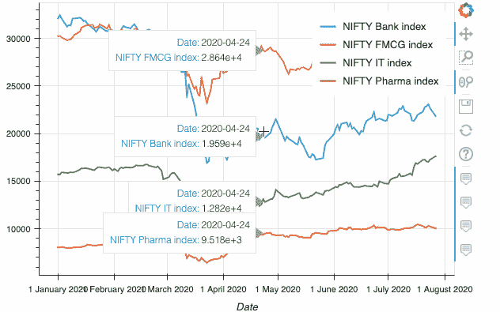*

*熊猫线条图 _ 散景*

## *2.散点图*

```
*nifty_data.plot_bokeh.scatter(x='NIFTY FMCG index', y='NIFTY Bank index');*
```

*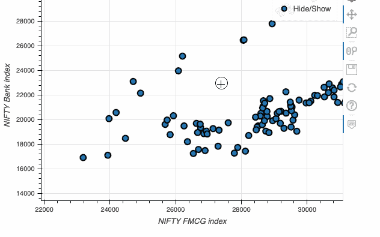*

*熊猫散点图 _ 散景*

## *3.直方图*

```
*nifty_data[['NIFTY FMCG index','NIFTY Bank index']].plot_bokeh(kind='hist', bins=30);*
```

**

*熊猫直方图 _ 散景*

## *4.条形图*

```
*nifty_data_resample.plot_bokeh(kind='bar',figsize=(10,6));*
```

*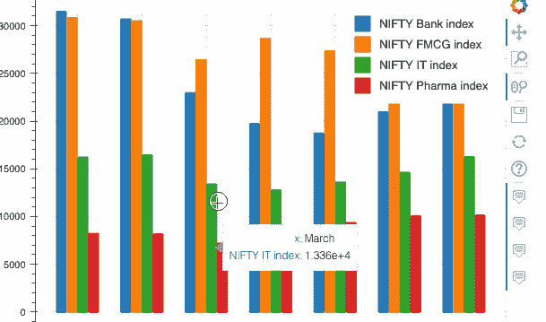*

*有熊猫的条形图 _ 散景*

*   ***4.1 堆积条形图***

```
*nifty_data_resample.plot_bokeh(kind='barh',stacked=True);*
```

*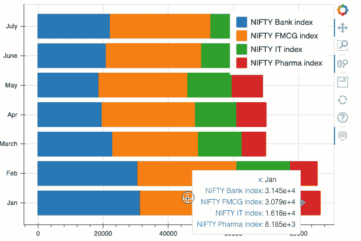*

*带熊猫的堆积条形图 _ 散景*

## *5.饼图*

```
*nifty_data_resample.index=['Jan','Feb','March','Apr','May','June','July']
nifty_data_resample.plot_bokeh.pie(y ='NIFTY Bank index')*
```

*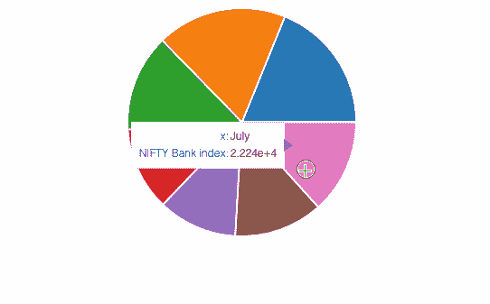*

*熊猫饼图 _ 散景*

*此外，您还可以在同一个图中创建多个嵌套饼图:*

```
*nifty_data_resample.plot_bokeh.pie()*
```

*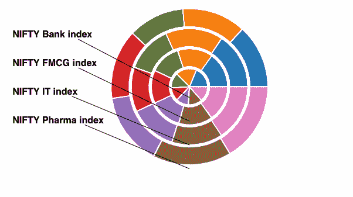*

*带有熊猫 _ 散景的嵌套饼图*

*本节讲述了我们如何无缝地创建散景图，而无需对 pandas 绘图语法进行任何重大更改。现在我们可以两全其美，而不必学习任何新的格式。*

# *熊猫的神秘后台——用袖扣来描绘。*

*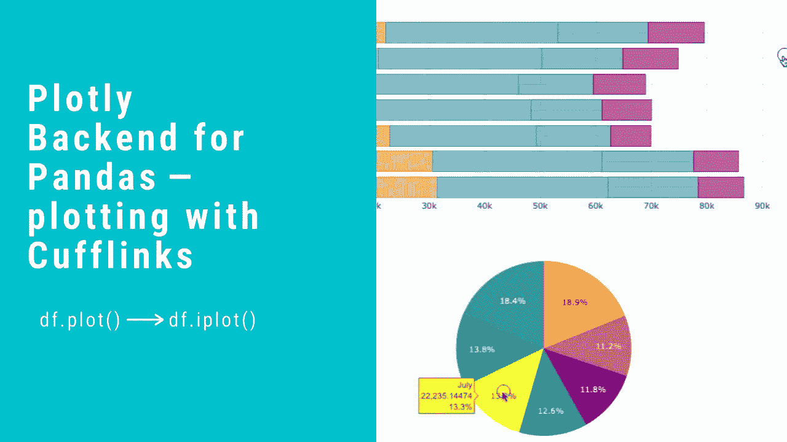*

*作者图片*

*另一个常用的数据可视化库是 [Plotly](https://plotly.com/graphing-libraries/) 。使用 plotly，您可以用 Python、R 和 JavaScript 制作交互式图表。从 4.8 版本开始，plotly 为熊猫绘图提供了一个 [Plotly Express 驱动的](https://plotly.com/python/plotly-express/)后端，这意味着人们甚至不需要导入 Plotly 来创建 Plotly 般的可视化。*

*不过这里我要提到的库并不是 plotly express，而是围绕 plotly 的一个独立的第三方包装库，叫做 [**袖扣**](https://github.com/santosjorge/cufflinks) **。**袖扣的妙处在于更百搭，功能更多，有类似熊猫绘图的 API。这意味着你只需要添加一个`.iplot()`方法到 Pandas 数据帧来绘制图表。*

## *装置*

*在安装袖扣之前，请确保您已经安装了 plotly。阅读[本](https://plotly.com/python/getting-started/)指南获取说明。*

```
*pip install cufflinks*
```

## *使用*

*[库](https://nbviewer.jupyter.org/gist/santosjorge/aba934a0d20023a136c2)有很多有用的例子和笔记本可以开始使用。*

```
*import pandas as pd
import cufflinks as cf
from IPython.display import display,HTML#making all charts public and setting a global theme
cf.set_config_file(sharing='public',theme='white',offline=True)*
```

*仅此而已。我们现在可以用 plotly 的能力和熊猫的轻松来创建可视化。语法上唯一的变化是`dataframe.iplot()`。*

## *1.线形图*

```
*nifty_data.iplot(kind='line')*
```

*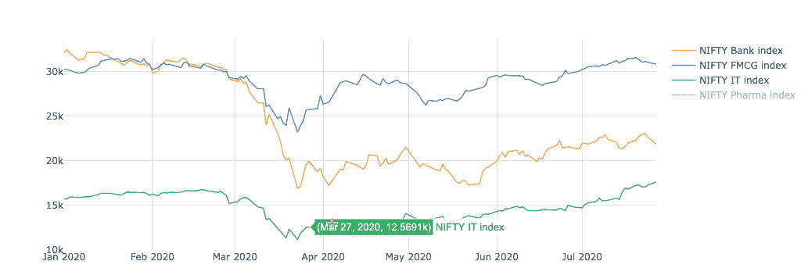*

*带袖扣的线图*

## *2.散点图*

*创建散点图时，需要提到散点图的**模式**。模式可以是线条、标记、文本或它们的组合。*

```
*nifty_data.iplot(kind='scatter',x='NIFTY FMCG index', y='NIFTY Bank index',**mode='markers'**);*
```

*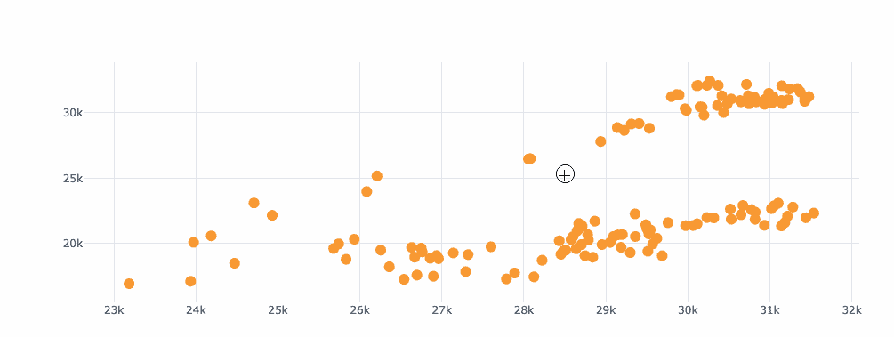*

*带袖扣的散点图*

## *3.直方图*

```
*nifty_data[['NIFTY FMCG index','NIFTY Bank index']].iplot(kind='hist', bins=30);*
```

*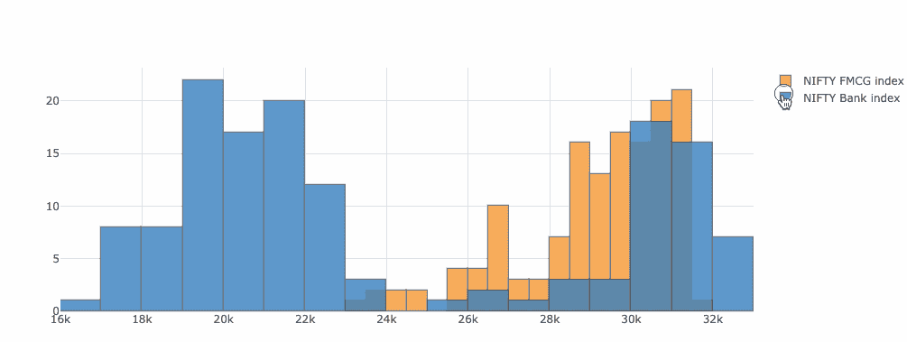*

*带袖扣的直方图*

## *4.条形图*

```
*nifty_data_resample.iplot(kind='bar');*
```

*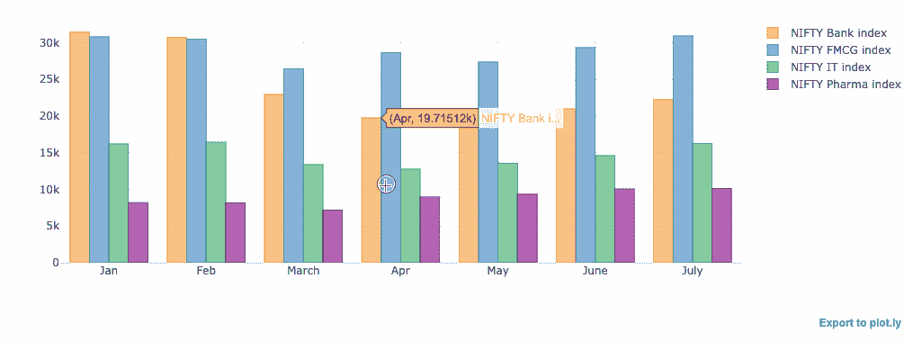*

*带袖扣的条形图*

*   ***4.1 堆积条形图***

```
*nifty_data_resample.iplot(kind='barh',barmode = 'stack');*
```

*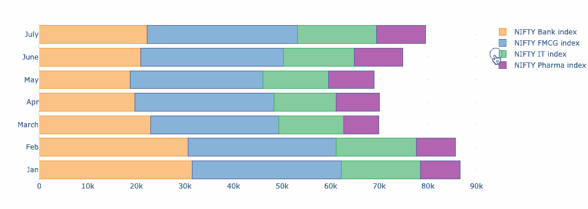*

*带袖扣的堆积条形图*

## *5.饼图*

```
*nifty_data_resample.index=['Jan','Feb','March','Apr','May','June','July']
nifty_data_resample.reset_index().iplot(kind='pie',labels='index',values='NIFTY Bank index')*
```

*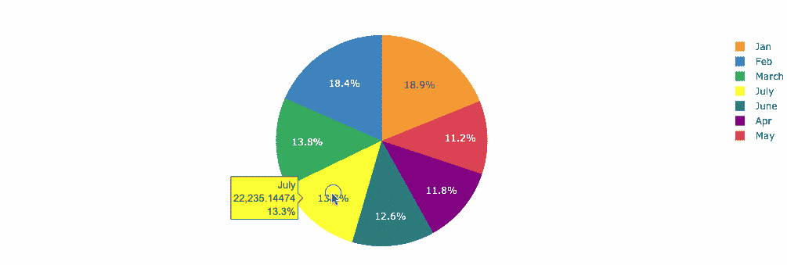*

*带袖扣的饼图*

*袖扣库提供了一种在 plotly 中获得 plotly 力量的简单方法。语法上的相似是另一个优势。*

# *结论*

*散景或情节在传达整个信息方面是自给自足的。基于你的选择和偏好，你可以两者都选，也可以两者都选；主要目的是使可视化更直观，同时更具交互性。阅读完本文后，您应该能够将静态的可视化转换成它们的交互式副本，并使您的分析更上一层楼。*

**👉有兴趣自己看其他文章。这个* [*回购*](https://github.com/parulnith/Data-Science-Articles/blob/main/README.md) *包含了我分类写的所有文章。**