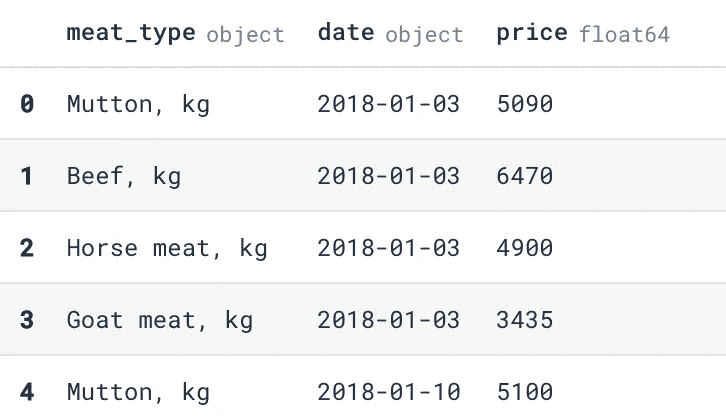
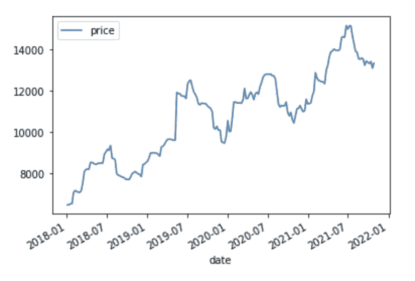
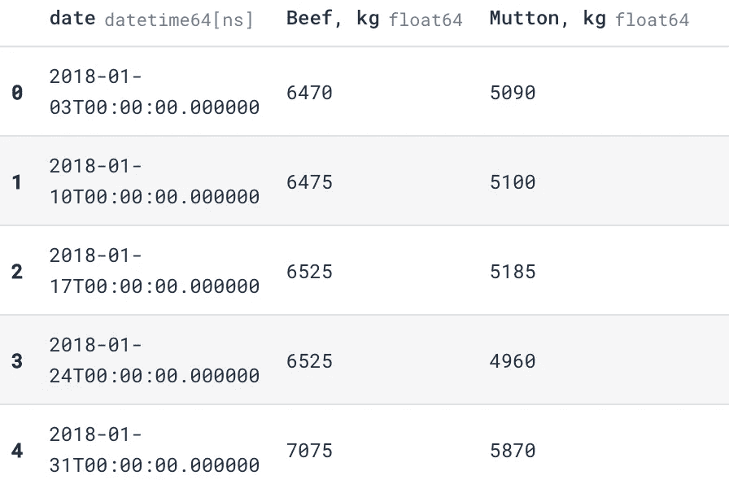
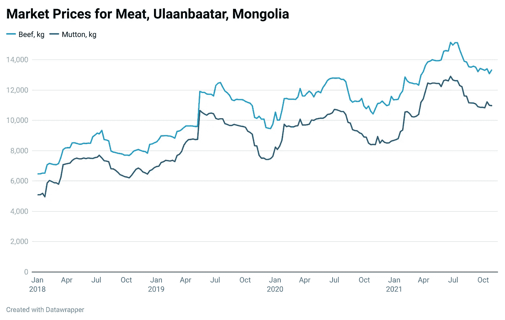

# 使用 Datawrapper 和 Python 获得可发布的可视化效果

> 原文：<https://towardsdatascience.com/get-publishable-visualizations-with-datawrapper-and-python-f091676cc350?source=collection_archive---------19----------------------->


有时候 Matplotlib 感觉你在用马克笔画画。杰森·库德里特在 [Unsplash](https://unsplash.com/s/photos/chart?utm_source=unsplash&utm_medium=referral&utm_content=creditCopyText) 上拍摄的照片

## Datawrapper Python 库使它变得前所未有的简单

> 本文中的所有代码和数据都可以在 Deepnote 上的[中找到，如果你愿意，你也可以在那里复制并运行代码。](https://deepnote.com/project/Datawrapper-Python-Tutorial-xBfpVVkVSrW38GABe9z-Vw/%2FDatawrapper%20Python.ipynb)

如果您是使用 Python 的数据专家，那么您肯定熟悉 Matplotlib、Seaborn 和 Plotly 等库。它们是数据可视化工具箱的主力。它们提供了极大的灵活性来创建您想要的可视化效果。不幸的是，这种灵活性是以现成的可用性和美观为代价的。

当做演示、写报告或写博客时，你的视觉效果必须看起来很棒。任何使用过这些库的人也知道从这些库中获得漂亮的和可出版的情节是多么困难。Datawrapper 旨在给你一个快速简单的方法来制作漂亮的可视化效果。

他们的博客[最近的图表显示了利用上下文创建丰富的可视化是多么容易。](https://blog.datawrapper.de/span-chart-range-value-overlays-in-column-charts/)

# 从 GUI 到 API

工作时，我大部分时间都在 JupyterLab，我发现很难从编码转移到网站制作可视化，然后再回到编码。所以当我听说 [Sergio Sánchez](https://blog.datawrapper.de/datawrapper-python-package/) 写了 Datawrapper Python 库。它利用 Datawrapper 的 API 允许以编程方式创建 20 多种类型的可视化。

让我们探索如何使用 Datawrapper Python 包快速构建一些可视化。我们将使用来自蒙古的[每周肉价数据](https://www.kaggle.com/robertritz/ub-meat-prices)。你不需要了解蒙古或肉类价格，这只是一个很好的数据集。所有这些代码都是在 Jupyter 笔记本中执行的。

首先，我们可以导入我们的库，并从 Kaggle 获取数据。我们的[环境变量](https://github.com/Kaggle/kaggle-api#api-credentials)已经用我们的 Kaggle 用户名和 API 键设置好了。

```
import pandas as pd
from datawrapper import Datawrapper
import kaggle
import os
```

`kaggle`包允许我们搜索数据集并下载它。一旦我们找到它，我们就可以把它从我们的 Jupyter 笔记本里提取出来。

```
# Shows results matching our search term.
!kaggle datasets list -s “mongolia meat price”# Download and unzip the dataset.
!kaggle datasets download -d robertritz/ub-meat-prices
!unzip -o ub-meat-prices.zip
```

让我们加载数据集并看一看。我们数据集中的每一行都是一种特定肉类一周的平均市场价格。所有价格均以蒙古货币为单位。

```
df = pd.read_csv(“meat_prices_20180103_20211027.csv”)
df.head()
```



如您所见，我们的数据是标准的长格式。如果你想在类似于`matplotlib`的地方绘图，你可以过滤数据框，只过滤你想要的，这很好。作为一个例子，我们可以看到如何只绘制数据集中的牛肉数据。

```
df['date'] = pd.to_datetime(df['date'])
df[df['meat_type'] == 'Beef, kg'].plot.line('date','price')
```



作者图片

我们需要做的是透视我们的数据，使每种肉类都在自己的列中，值是那一周的价格。此外，我们将只选择牛肉和羊肉，因为它们是我们感兴趣的主要肉类。

```
df = df.pivot(index='date', columns='meat_type', values='price').reset_index()
df = df.drop(columns=['Goat meat, kg','Horse meat, kg'])
```



作者图片

熊猫使用`matplotlib`作为它的绘图库。虽然这些情节非常适合在笔记本上探索，但要为演示或博客帖子做好准备，还需要做大量的工作。

让我们看看 Datawrapper 可以做些什么来提升这个漂亮的级别。首先，我们可以用访问令牌实例化 Datawrapper 类。Datawrapper 有一个非常慷慨的免费层，这包括 API 访问您的帐户。你可以在你的[账户页面](https://app.datawrapper.de/account/api-tokens)获得一个 API 访问令牌。

```
dw = Datawrapper(access_token = os.environ[“DATAWRAPPER_TOKEN”])
```

如果您想确保您的帐户正常运行，您可以使用`account_info`便捷方法查看您的帐户信息。

```
# Input
dw.account_info()# Output
{'id': 175781,
 'email': 'robert@mongol.ai',
 'name': None,
 'role': 'editor',
 'language': 'en_US',
 'teams': [],
 'chartCount': 18,
 'url': '/v3/users/175781'}
```

接下来，我们可以用我们的数据创建一个图表。Datawrapper Python 包的工作方式类似于 Plotly Express 的工作方式。在一行代码中，您可以创建一个图表，声明其标题，并指定要绘制的数据。

有一件事不是很明显，那就是`chart_type`。Datawrapper 目前有 22 种图表类型，您可以在它们的 [API 文档页面](https://developer.datawrapper.de/docs/chart-types)上找到每种图表类型的名称。为了简单起见，我们将制作一个简单的时间序列图，因此我们将使用`d3-lines`图表类型。

```
meat_prices = dw.create_chart(
  title = "Market Prices for Meat, Ulaanbaatar, Mongolia",
  chart_type = 'd3-lines',
  data = df
)
```

`create_chart`方法有以下参数:

*   `title` —字符串形式的图表标题。
*   `chart_type` —支持的 22 种图表类型之一。图表类型列表是[这里是](https://developer.datawrapper.de/docs/chart-types)。
*   `data` —接受熊猫数据帧。
*   `folder_id` —允许您在 Datawrapper 中指定文件夹 ID，以帮助组织图表。

需要注意的一点是，Datawrapper 包没有返回图表。相反，它将图表元数据作为字典返回。实际的图表现在存储在 Datawrapper 服务上。最重要的是，我们可以通过引用字典来访问图表的 ID。在我们的例子中，我们将使用`meat_prices[‘id’]`。

```
# Input
meat_prices# Output
{'publicId': 'jFWEN',
 'language': 'en-US',
 'theme': 'datawrapper-data',
 'title': 'Market Prices for Meat, Ulaanbaatar, Mongolia',
 'type': 'd3-lines',
 'metadata': {'data': {},
  'describe': {'source-name': '',
   'source-url': '',
   'intro': '',
   'byline': '',
   'aria-description': ''},
  'visualize': {},
  'publish': {'blocks': {'logo': {'enabled': False},
    'embed': False,
    'download-pdf': False,
    'download-svg': False,
    'get-the-data': True,
    'download-image': False}}},
 'authorId': 175781,
 'id': 'jFWEN',
 'lastModifiedAt': '2021-11-03T13:51:52.233Z',
 'createdAt': '2021-11-03T13:51:52.200Z',
 'url': '/v3/charts/jFWEN'}
```

要访问图表，我们首先需要发布图表。这使得图表在我们的 Datwrapper 配置文件上公开，并将为图表生成一个嵌入代码。然后我们可以在笔记本上交互显示。

```
dw.publish_chart(meat_prices['id'], display=False)
dw.display_chart(meat_prices['id'])
```



作者图片

在 Jupyter 笔记本中，现在的输出是相当时髦的。这是因为 Jupyter 在输出中为 IFrame 留出了相对较小的空间。为了检查以确保我们的图在更大的尺寸下看起来更好，我们可以用特定的宽度导出它并检查它。

或者，您可以去 Datawrapper 站点看一看。网址格式为`https://app.datawrapper.de/chart/{chart_id}/visualize`，在这里可以替换`{chart_id}`。您也可以在[https://app . data wrapper . de .](https://app.datawrapper.de.)的仪表板上找到它

```
dw.export_chart(meat_prices['id'], width=800)
```

# 互动还是静态？

导出图表后，您将看到一个名为`image.png`的文件，该文件与您的笔记本位于同一目录下。你可以把它作为图片展示或者放在任何你想放的地方。

如果您想在 Twitter 或 LinkedIn 帖子上将其用作静态图像，导出图表是很好的选择。然而，大多数时候你会希望保持剧情的互动性。为此，您可以使用`get_iframe_code`方法获取图表的 IFrame 嵌入代码。

Datawrapper 支持 Embedly，它被 Medium 和许多其他站点用于嵌入内容。要在介质上嵌入 Datawrapper 图表，只需将图表链接粘贴到介质编辑器中，然后点击 enter。

```
# Input
dw.get_iframe_code(meat_prices['id'])# Output
<iframe title="Market Prices for Meat, Ulaanbaatar, Mongolia" aria-label="Interactive line chart" id="datawrapper-chart-jFWEN" src="https://datawrapper.dwcdn.net/jFWEN/1/" scrolling="no" frameborder="0" style="border: none;" width="undefined" height="undefined"></iframe>
```

# 自定义您的图表

在 Datawrapper 站点上，您有许多选项来定制图表，包括注释、颜色等等。如果您喜欢使用 Jupyter 界面，也可以通过 Datawrapper Python 包自定义图表。

通过 Datawrapper 包，您可以使用一些内置的关键字参数来更新您的图表。

```
dw.update_description(
  meat_prices['id'],
  source_name = 'NSO Mongolia',
  source_url = '1212.mn',
  byline = 'Robert Ritz',
)
```

除了`update_description`方法之外，您还可以使用`update_metadata`方法来改变颜色、线条的粗细等等。可编辑元数据的例子可以在 Datawrapper API 文档[这里](https://developer.datawrapper.de/docs/creating-a-chart-new#edit-the-chart-properties)找到。

现在，我们将线条设置为粗线，并改变颜色。

```
properties = {
  'visualize' : {
    'thick': True,
    'custom-colors': {
      "Beef, kg": '#15607a',
      "Mutton, kg": '#1d81a2',
    },
  }
}dw.update_metadata(meat_prices['id'], properties)# Output
Chart's metadata updated!
```

用 Datawrapper Python 库处理的一个领域仍然有些困难，那就是注释。可以用属性字典声明注释，但是找到正确的位置可能需要大量的反复试验，这在 Jupyter 笔记本中很难完成。

在这种情况下，我建议转到 Datawrapper 站点上的可视化来完成可视化。这是添加了注释的最终可视化效果。

如果您是一名关心可视化效果的数据专家，您可能想尝试一下 Datawrapper。通过将其包含在 Python 工作流中，您可以在很短的时间内获得生产质量的可视化效果。

> 感谢阅读。你可以在这里找到更多关于我[的信息](https://robertritz.com/thanks-for-stopping-by-about-me-5d5d515edf72)。考虑订阅以便在我发布时收到通知。如果你想直接支持我的文章，你可以使用我的[推荐链接](https://robertritz.com/membership)注册成为媒体会员。