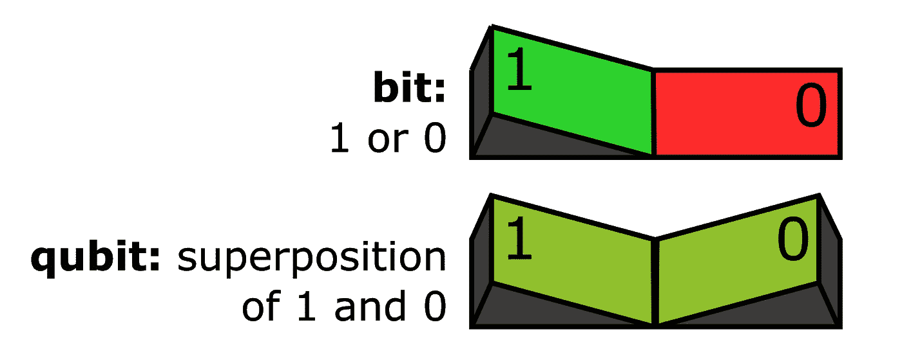
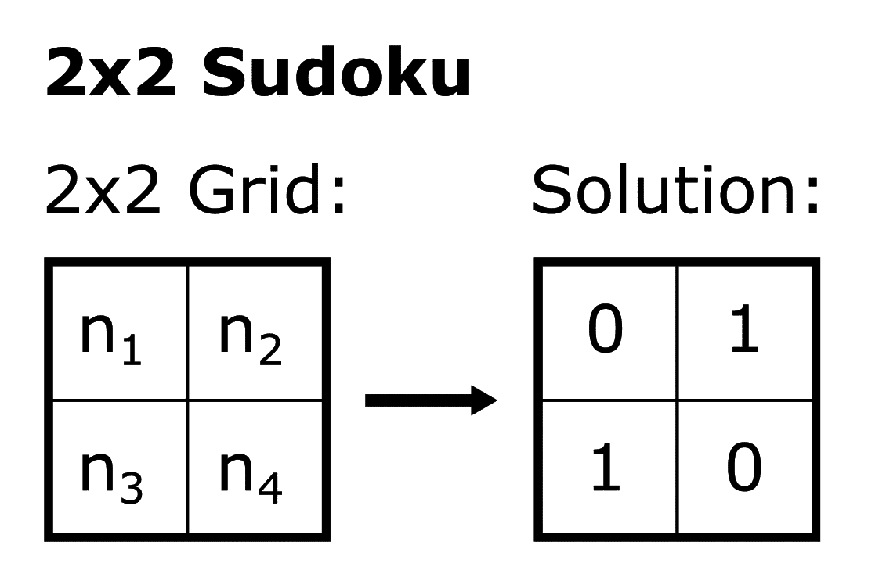
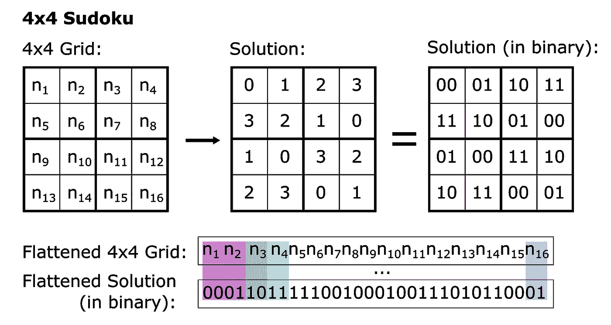
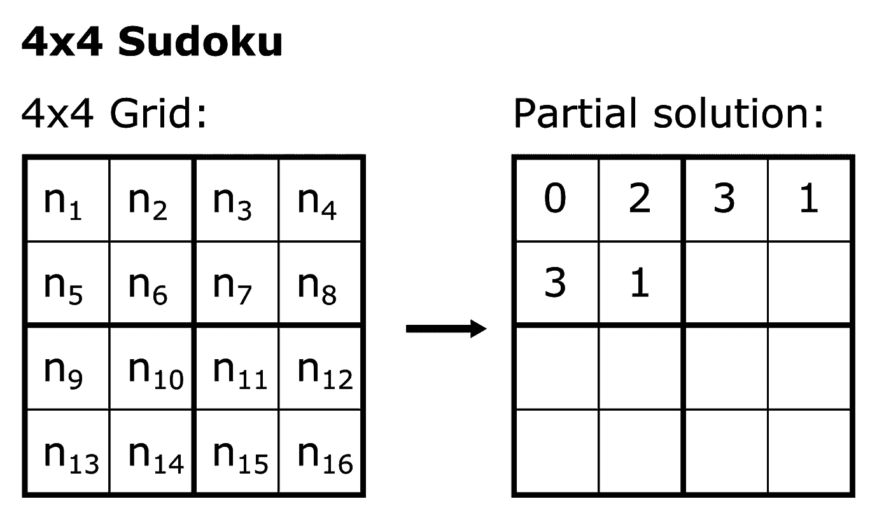

# 量子计算入门

> 原文：<https://towardsdatascience.com/get-started-in-quantum-computing-628e72332682?source=collection_archive---------42----------------------->

## 并使用 Q#和 Qiskit 解决数独游戏


📸洛伦佐·埃雷拉

T2:阅读量子力学会让你想知道我们生活在一个什么样的世界里。更糟糕的是，诺贝尔奖获得者理查德·费曼说过一句名言:“如果你认为你理解量子力学，你就不理解量子力学。”那么，没有计算机科学或量子力学的学位，我们究竟如何学习量子计算呢？幸运的是，这个问题有一个答案:你*不需要了解太多关于量子现象的知识，也不需要了解你的‘经典’计算机如何一点一点地工作来开始使用量子计算机。相信我，我正在这么做！*



位开关处于 0 或 1 位置。量子位开关在 1 和 0 两个位置。

量子计算机不会取代经典计算机，但会让我们解决一些问题(破解密码是一个流行的问题)，即使是我们最先进的超级计算机也无法在我们太阳系的寿命内解决这些问题。**量子位**使之成为可能。量子位是量子计算机中的*位*，但它的状态(量子位没有*的值*)不是像常规位那样具有 1 或 0 的值，而是 1 和 0 的叠加**(想象一种可以同时代表 1 和 0 的混合状态)。**

> 用一台经典计算机和 3 个比特，你可以同时拥有 8 个经典状态中的一个(000，001，010，…，111)，但是 3 个量子比特可以同时处于 8 个经典状态的叠加态。

考虑下面这个过于简单的例子:我的经典笔记本电脑使用 64 位 2.3 GHz 处理器，因此每秒可以执行 2300000000 次操作，同时可以保持任何 2⁶⁴状态。尽管我要等 200 多年才能让我的笔记本电脑遍历所有的 2⁶⁴态，但由于叠加，一台有足够量子位的量子计算机可以同时访问所有的态*！*

*在过去的几个月里，我一直在用 [IBM 的 Qiskit](https://qiskit.org/) 和[微软的 Q#](https://azure.microsoft.com/en-gb/resources/development-kit/quantum-computing/) 检查量子计算。Qiskit 使用 Python，而 Q#更接近 C#。无论你使用哪种来源，量子*怪异*纠缠、叠加以及相关概念很早就出现了。我认为这些是推动量子算法的超级食物成分；你知道这些包装具有不可思议的特性，尽管你不太明白它们是如何做到的…*

*在我的光量子之旅中，我偶然发现了 [Grover 的算法](https://qiskit.org/textbook/ch-algorithms/grover.html)，它在*搜索问题*中提供了潜在的二次加速(这些问题可以表述为‘这个解决方案是有效的吗？’比如‘这个数据库包含这个记录吗？’).二次加速意味着我们需要 **√n** ，而不是在数据库中查找 **n** 次来找到有效的解决方案。*

> *想象一下，你需要检查 4 家不同的商店，找出哪家有你要找的礼物的库存。有了量子计算机助手，你可以花一半的时间。*

**

*一个 2x2 的数独游戏不需要太多的思考就能解决。*

*[Qiskit 的 Grover 算法章节](https://qiskit.org/textbook/ch-algorithms/grover.html)以一个 2x2 数独解算器的实现结束。想出一个有效的解决方案不需要太多的思考(它只要求同一行或同一列中的数字不相同)，我们根本不需要为量子计算费心。但这是一个很好的起点，而且令人印象深刻的是，它使用量子计算解决了 2x2 数独，这促使我将这个解决方案扩展到更大的数独。*

*使用 Qiskit 的教科书措辞:可能很难找到常规 9x9 数独的解决方案，但是给定一个解决方案，很容易验证它是否有效。图着色问题(找出由顶点连接的对不能具有相同颜色的 **n** 节点的着色)也可以用这些术语来表述，并且在 [Q#](https://docs.microsoft.com/en-us/learn/modules/solve-graph-coloring-problems-grovers-search/) 和 [Katas 教程](https://github.com/microsoft/QuantumKatas)中可以找到这样的例子。*

*我的 Q#数独解算器使用 Grover 的搜索紧紧跟随关于图着色的 Q#教程，并带来了来自 Katas 挑战的叠加思想*

> *考虑到我们可以模拟的量子位数量和可用计算资源的限制，只能获得部分数独解。30 个量子位需要大约 16GB 的内存，而完整的 4x4 数独至少需要 89 个量子位💥*

*解决数独的第一步是对数字进行二进制编码，这样一系列的 0 和 1 就可以表征数独的*扁平*解。*

**

*4x4 数独二进制编码的扁平解决方案。*

*4x4 数独有 4 个不同的数字，例如 0 到 3，每个数字最多需要两位(0 = 00，1 = 01，2 = 10，3 = 11)。这样，一个 32 位的字符串可以分成对，对 4x4 数独网格的 16 个数字进行编码，其中每对的位置决定了它在数独网格中的位置，从左上到右下。*

*同样，一个 9x9 数独游戏使用 9 个数字，例如 0 到 8，每个数字需要 4 位(0 = 0000，1 = 0001，…，7 = 0111，8 = 1000)。因此，一个 324 位的字符串可以分成 4 组，对 9x9 数独网格的 81 个数字进行编码。*

*记住这个介绍，我实现量子数独解算器的关键区别在于 Grover 算法的初始化:不是准备所有基态的**的相等叠加，而是准备由位串**定义的基态**的相等叠加。***

> *一个[寄存器](https://en.wikipedia.org/wiki/Quantum_register)有 3 个量子位，位串= [[0，0，1]，[1，0，0]]准备叠加态 1/√(2) * (|001⟩ + |100⟩)，而*忽略*的另外 6 个基态|000⟩、|010⟩、|011⟩、|101⟩、|110⟩和|111⟩.*

*这种方法背后的原因是为了获得潜在解决方案的集合，其中具有不在数独范围内的数的基础状态不在准备好的叠加态中(例如，在 9x9 数独中，具有等于|1011⟩的前 4 个量子位的基础状态不在准备好的叠加态中，因为二进制数 1011 表示在 9x9 数独中不存在的十进制数 11)。*

*数独解算器可以总结为以下步骤:*

*1.定义数独属性。*

*2.准备数独数字排列的数组。*

*3.用上一步的排列来准备叠加态。*

*4.运行格罗弗的算法。*

*5.使用量子预言机检查解决方案是否正确。*

*这个数独解算器简单地从所有存在于叠加状态的有效解中输出一个有效(部分)解。任何解决方案都可能被选中，因为唯一存在的约束是数独规则(即同一数字在每一行中不能出现一次以上，等等。).*

> *考虑到内存限制，返回 4x4 数独的 7 个单元将使用 30 个量子位进行模拟，并且需要相当长的时间。*

*对 4x4 数独的 6 个单元格运行求解程序后返回的部分解可能是:*

**

*求解程序返回的部分解。(在未来的某一天，这个解算器将会毫不费力地完成 9x9 的数独游戏！)*

```
*The resulting Sudoku solution:
 Index 1 - Number 0
 Index 2 - Number 2
 Index 3 - Number 3
 Index 4 - Number 1
 Index 5 - Number 3
 Index 6 - Number 1*
```

*其中*索引*是 4x4 数独图形中所示的位置。*

*如果你已经做到这一步:*干得好*！本文的目标是通过编码和解决问题来吸引人们对学习量子计算的惊人资源的注意。*

*该代码可在 [GitHub](https://github.com/scapape/QuantumSudoku) 上获得。*

*[1]约翰·格里宾，《用量子猫计算:从巨像到量子位》(2013)，矮脚鸡出版社。*